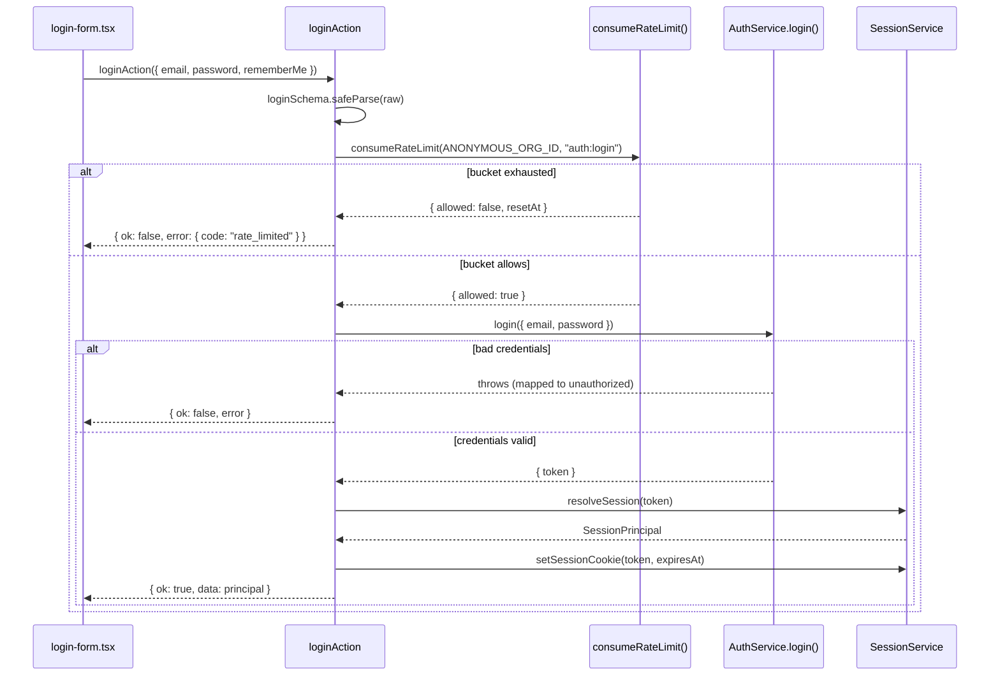

# Authentication actions

Four files, five exported actions, none of them behind `withAction()`. Every action
documented here runs at a point where the wrapper's core job — resolving an `Actor` inside
an organization — cannot apply, because either no session exists yet (`loginAction`,
`requestPasswordResetAction`, `confirmPasswordResetAction`) or the session is about to be
created by the call itself (`registerAction`). See `actions-overview.md`, "Actions with no
`Actor` yet", for why this whole group looks different from the rest of the corpus. What
they share instead is the anonymous rate-limit bucket, the `AuthService` and
`SessionService` split, and — for three of the five — a deliberate refusal to distinguish
"invalid credentials" from "unknown account" in either the response or the timing budget.

## `loginAction`

- **File:** `src/actions/auth/login.ts`
- **Input schema:** `loginSchema` (`src/schemas/auth.ts`) — `LoginInput`
- **Returns:** `ActionResult<SessionPrincipal>`
- **Permission:** none (unauthenticated by definition)
- **Feature flag:** none
- **Rate limit bucket:** `auth:login` (default capacity 30, refill 10/min — no dedicated
  bucket is declared for it in `src/lib/rate-limit.ts`, so it falls through to the default)
- **Plan limit:** none
- **Events emitted:** none — see "Why login emits nothing" below
- **Cache tags revalidated:** none
- **Errors:** `validation_failed`, `rate_limited`, `unauthorized`, `internal_error`
- **Satisfies:** REQ-200, REQ-202
- **Design:** DES-164, DES-165, DES-252

### Input fields

| field | type | required | notes |
|---|---|---|---|
| `email` | string, lowercased, max 254 | yes | `emailSchema` |
| `password` | string, min 1 | yes | not validated for complexity here — that only applies at registration |
| `rememberMe` | boolean | no, default `false` | accepted by the schema; the session TTL is fixed at `SESSION_TTL_DAYS = 30` regardless (`src/server/services/session-service.ts`) — `rememberMe` does not currently change cookie lifetime |

### Behaviour

`loginAction` parses the raw payload, then — deliberately before calling `login()` —
charges the `auth:login` bucket against `ANONYMOUS_ORG_ID`. DES-165 is the reason for that
ordering: the rate limit is checked before the password is, so a request that fails because
of throttling and a request that fails because of a wrong password are indistinguishable in
both their error code and their timing profile, which is what stops the rate limiter itself
from being usable as an oracle for whether an account exists. A refused verdict throws
`RateLimitedError`, mapped to `rate_limited`.

If the bucket allows the attempt, `login()` in `src/server/services/auth-service.ts` runs
and returns a session `token`. The action then calls `resolveSession(token)` from
`session-service.ts` to obtain a `SessionPrincipal`; a `null` result here — which should not
happen given `login()` just minted the token, but is checked rather than assumed — throws
`UnauthorizedActionError("That sign-in could not be completed.")`. On success,
`setSessionCookie(token, principal.expiresAt)` writes the httpOnly, `sameSite: "lax"` cookie
(`secure` in production) named by `SESSION_COOKIE_NAME` in `src/schemas/session.ts`, and the
action returns the `SessionPrincipal` — never the raw token — to the client.

**Why login emits nothing.** `AuthService` states in its own doc comment that it must call
`emit()` but cannot: `TaskflowEventMap` (`src/types/event.ts`) has no keys for a login, a
logout, or a failed attempt. This is DES-164 / DES-259, and it means the audit trail (which
is driven entirely off the event bus per DES-024) currently has no record of sign-ins at
all — a gap worth knowing about before you go looking for one in `docs/design/event-bus.md`
and conclude the listener was just never wired up.

## `logoutAction`

- **File:** `src/actions/auth/logout.ts`
- **Input schema:** none — takes no arguments
- **Returns:** `ActionResult<null>`
- **Permission:** none
- **Feature flag:** none
- **Rate limit bucket:** none
- **Plan limit:** none
- **Events emitted:** none
- **Cache tags revalidated:** none
- **Errors:** `internal_error`
- **Satisfies:** REQ-207
- **Design:** DES-254

### Behaviour

`logoutAction` reads the session token via `getSessionToken()`; if one exists it calls
`destroySession(token)` in `session-service.ts`, which deletes the server-side session row
so a stolen cookie stops working the moment logout completes, not just when the cookie
itself expires. It then unconditionally calls `clearSessionCookie()`. DES-254: **logout
treats "already signed out" as success, not as an error condition** — calling this action
with no session present, or twice in a row, still returns `{ ok: true, data: null }`. The
postcondition ("no session cookie present") holds either way, and a logout button that could
itself fail with `unauthorized` would be a confusing thing to put in a UI whose entire
purpose is to sign the user *out*.

## `registerAction`

- **File:** `src/actions/auth/register.ts`
- **Input schema:** `registerSchema` (`src/schemas/auth.ts`) — `RegisterInput`
- **Returns:** `ActionResult<SessionPrincipal>`
- **Permission:** none (unauthenticated by definition)
- **Feature flag:** none
- **Rate limit bucket:** none — registration itself is not throttled; only login and
  password reset are
- **Plan limit:** none — the created organization starts on the `free` plan by default
  (`createOrganizationSchema`'s default), so there is nothing to check a quota against yet
- **Events emitted:** `member.joined` (indirectly, via `register()` — see below)
- **Cache tags revalidated:** none (`registerAction` does not call `revalidateTagged` or
  `revalidatePath`; the client redirects into the new org after receiving the session)
- **Errors:** `validation_failed`, `internal_error`
- **Satisfies:** REQ-003, REQ-014, REQ-209
- **Design:** DES-166, DES-253

### Input fields

| field | type | required | notes |
|---|---|---|---|
| `name` | string, 1-80 | yes | display name of the new user |
| `email` | string, lowercased, max 254 | yes | `emailSchema` |
| `password` | string, 12-128, mixed case + digit | yes | `passwordSchema` — the only place in the corpus this complexity rule is enforced |
| `confirmPassword` | string | yes | must equal `password`, checked by a `.refine()` attached to `["confirmPassword"]` |
| `acceptTerms` | literal `true` | yes | Zod `.literal(true, ...)` — omitting or setting `false` fails validation with a custom message |

### Behaviour

DES-253: `register()` in `auth-service.ts` performs three writes — the user, their first
organization, and the owner membership joining them — as one service call, so the action
itself only has to turn the result into a session. This mirrors DES-166 at the service
layer: registration is one call with no intermediate state, meaning there is no window in
which a user row exists without an organization, or an organization exists without an
owner. After `register()` returns `{ user, org }`, the action calls
`createSessionToken(user.id)`, then `setSessionCookie()`, and constructs the
`SessionPrincipal` returned to the client by hand (`userId`, `email`, `activeOrgId: org.id`,
`expiresAt`) rather than calling `resolveSession()` a second time — the values are already
in scope from the two prior calls, and a second round trip would be redundant.

Because the created organization is seeded with a first project (REQ-014, satisfied at the
service layer, not documented further here — see `design/service-organization.md`), and
because the owner membership triggers the same `member.joined` event `acceptInvitationAction`
relies on for its own notification fan-out (DES-150), a fresh registration produces exactly
the same downstream side effects — a project the new owner can immediately open, and an
activity-log row via the audit listener — as accepting an invitation into an org that
already exists.

## `requestPasswordResetAction` / `confirmPasswordResetAction`

- **File:** `src/actions/auth/reset-password.ts`
- **Input schemas:** `passwordResetRequestSchema` / `passwordResetConfirmSchema`
  (`src/schemas/auth.ts`)
- **Returns:** `ActionResult<null>` for both
- **Permission:** none (unauthenticated by definition)
- **Feature flag:** none
- **Rate limit bucket:** `auth:password-reset` (capacity 5, refill 1/min — the tightest
  bucket in the corpus by a wide margin)
- **Plan limit:** none
- **Events emitted:** none (same gap as `loginAction` — no auth events in `TaskflowEventMap`)
- **Cache tags revalidated:** none
- **Errors:** `validation_failed`, `rate_limited`, `internal_error`
- **Satisfies:** REQ-208
- **Design:** DES-167

### Input fields

`requestPasswordResetAction`:

| field | type | required | notes |
|---|---|---|---|
| `email` | string, lowercased, max 254 | yes | `emailSchema` |

`confirmPasswordResetAction`:

| field | type | required | notes |
|---|---|---|---|
| `token` | string, min 16 | yes | opaque reset token from the emailed link |
| `password` | string, 12-128, mixed case + digit | yes | same `passwordSchema` as registration |
| `confirmPassword` | string | yes | must equal `password` |

### Behaviour

Both halves charge the same `auth:password-reset` bucket against `ANONYMOUS_ORG_ID` before
doing anything else, for the same reason `loginAction` charges its bucket first: the
timing and error shape of "you are being throttled" must not leak whether the address on
the request even has an account. This is the concrete behavior DES-167 describes as
"password reset resolves identically whether or not the email is known" — the service call
underneath, `requestPasswordReset()`, does not distinguish the two cases either, and the
action returns `{ ok: true, data: null }` in both. `confirmPasswordResetAction` similarly
returns success or a generic validation failure; DES-167's other half — "stores only the
token's hash" — is a service/repository-layer property (the token itself is never persisted
in a form that could be replayed from a database dump) that this action relies on but does
not implement.

Because the tightest rate-limit bucket in the whole rate-limiter configuration
(`src/lib/rate-limit.ts`) belongs to this pair — 5 capacity, 1 refill per minute, versus
`member:invite`'s 20/2 or `issue:create`'s 60/20 — a legitimate user who mistypes their
email address and resubmits four times in under a minute will see `rate_limited` on the
fifth attempt regardless of whether any of the four went to a real account. This is
intentional: the bucket's purpose is to stop it being used as a mail cannon against
arbitrary addresses (REQ-208), not to smooth out ordinary user retries, and the UI is
expected to show the reset flow's own confirmation screen after the *first* successful
submission so a user has no reason to resubmit at all.

## Login sequence

## Why these five actions do not share a helper

It would be reasonable to ask why `login.ts`, `register.ts`, and `reset-password.ts` do not
factor their common "parse, rate-limit, try/catch, stamp" shape into a second wrapper
alongside `withAction()`. The team's answer, recorded in review discussion rather than in
code, is that the shape only looks common at the surface: `loginAction` and the two
password-reset actions charge the rate limiter unconditionally before calling into
`AuthService`, `registerAction` does not rate-limit at all, and `acceptInvitationAction`
(covered in `actions-members.md`) needs a *third* shape again — no rate limit, but a
post-write quota check that can only run once a membership row, and therefore an `Actor`,
exists. A second wrapper covering three genuinely different control-flow shapes would save
a handful of lines per file at the cost of a layer of indirection every reader of this
directory would have to learn, for five files total. The `_lib` directory stays reserved for
machinery that is actually identical across many callers — `withAction()` itself,
`action-errors.ts`, `permission-resources.ts` — and the unauthenticated actions accept the
small amount of duplication instead.

## Session cookie ownership

Every one of these five actions that ends in a successful session change — `loginAction`,
`registerAction` on success; `logoutAction` unconditionally — calls into `src/lib/session.ts`
rather than touching `cookies()` directly. REQ-206 states this as a requirement (only one
module reads or writes the session cookie) precisely because the cookie's attributes —
`httpOnly`, `sameSite: "lax"`, `secure` gated on `NODE_ENV === "production"`, and the name
itself, `SESSION_COOKIE_NAME` from `src/schemas/session.ts` — must not drift between the
place that sets it and the place that reads it back in `src/proxy.ts` (ADR-007). None of the
four action files in this group import `next/headers`'s `cookies()` themselves; if you ever
see one that does, that is a layering violation this brief's authors did not intend and
should be flagged in review rather than copied.

Related: REQ-201, REQ-203, REQ-204, REQ-205, REQ-206, DES-032, DES-168, DES-169, ADR-011,
ADR-020.
