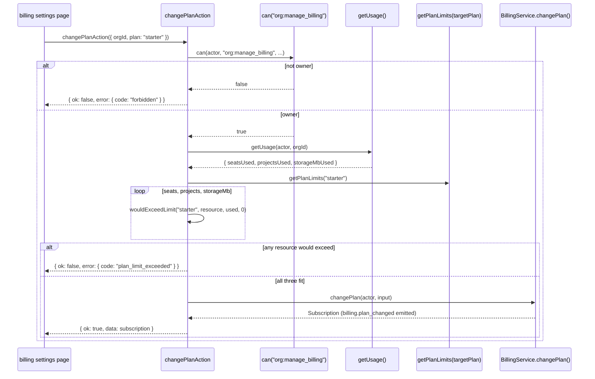

# Billing actions

Three files under src/actions/billing/: cancel a subscription, change plan, update seats.
All three gate on the single `org:manage_billing` permission, which sits at owner rank in
`ROLE_MATRIX` — the highest floor any action in the corpus requires, shared only with
`org:delete`. The interesting behavior in this group is not the permission check, which is
identical and trivial across all three; it is how each one decides whether a requested
change is safe against the organization's *current* usage before letting it through.

## `changePlanAction`

- **File:** `src/actions/billing/change-plan.ts`
- **Input schema:** `changePlanSchema` (`src/schemas/billing.ts`) — `ChangePlanInput`
- **Returns:** `ActionResult<Subscription>`
- **Permission:** `org:manage_billing` (minimum role owner; see DES-043)
- **Feature flag:** none
- **Rate limit bucket:** none
- **Plan limit:** `seats`, `projects`, `storageMb` — checked against the *target* plan
- **Events emitted:** `billing.plan_changed` (via `changePlan()`)
- **Cache tags revalidated:** `orgTag(input.orgId)`, `CACHE_PROFILES.hours`
- **Errors:** `validation_failed`, `forbidden`, `plan_limit_exceeded`, `internal_error`
- **Satisfies:** REQ-131, REQ-140, REQ-141
- **Design:** DES-136, DES-248

### Input fields

| field | type | required | notes |
|---|---|---|---|
| `orgId` | branded `OrgId` | yes | |
| `plan` | `"free" \| "starter" \| "growth" \| "enterprise"` | yes | `planIdSchema` |
| `interval` | `"monthly" \| "annual"` | no, default `"monthly"` | |

### Behaviour

After the `org:manage_billing` check, `assertPlanFitsCurrentUsage()` — a private helper in
this file — reads live usage via `getUsage()` and compares three dimensions (`seats`,
`projects`, `storageMb`) against the *target* plan's limits using
`wouldExceedLimit(input.plan, resource, used, 0)`, with a requested delta of **zero**. The
comment in the source explains the zero deliberately: "we are not consuming anything, only
asking whether what is already in use still fits." This is DES-136 and DES-248: a plan
change is checked against every relevant usage dimension before the plan row changes, using
the target plan's limits, not the current plan's — so an org on `growth` with 40 seats that
tries to move to `starter` (10 seats) is refused with `PlanLimitError("seats", 10, 40)`
before the subscription row is touched at all. This is REQ-141: downgrades are refused while
usage exceeds the target plan. The check loops all three resources and throws on the first
one that would not fit, using that resource's own `used`/`limit` pair in the error, so an org
failing on `projects` rather than `seats` gets an error that names `projects` specifically
rather than a generic "this plan doesn't fit" message.

Notice what is *not* checked: `issuesPerProject`, `apiRequestsPerHour`, and `webhooks` are
plan-limited resources (per `PlanLimits` in `src/config/plan-limits.ts`) that this action
does not verify against the target plan. A downgrade from `growth` to `starter` that would
leave an org with more webhook endpoints than `starter`'s ceiling of 2 allows is not blocked
by this action — the endpoints simply become over-limit going forward, silently, unless a
separate cron job or read-time check catches it. This is a gap in the downgrade guard's
coverage worth knowing rather than assuming is comprehensive.

## `updateSeatsAction`

- **File:** `src/actions/billing/update-seats.ts`
- **Input schema:** `updateSeatsSchema` (`src/schemas/billing.ts`) — `UpdateSeatsInput`
- **Returns:** `ActionResult<Subscription>`
- **Permission:** `org:manage_billing` (minimum role owner; see DES-043)
- **Feature flag:** none
- **Rate limit bucket:** none
- **Plan limit:** `seats`, bounded on both sides
- **Events emitted:** none directly documented at the action layer beyond what
  `updateSeats()` itself emits
- **Cache tags revalidated:** `orgTag(input.orgId)`, `CACHE_PROFILES.hours`
- **Errors:** `validation_failed`, `forbidden`, `plan_limit_exceeded`, `internal_error`
- **Satisfies:** REQ-133
- **Design:** DES-249

### Input fields

| field | type | required | notes |
|---|---|---|---|
| `orgId` | branded `OrgId` | yes | |
| `seats` | integer, 1-10000 | yes | `updateSeatsSchema` |

### Behaviour

DES-249: **`update-seats` is bounded in both directions**, unlike a quota check that only
guards against exceeding a ceiling. After reading `getOrganizationSummary()` for
`summary.usage.seatsUsed` and `getPlanLimits(summary.organization.plan)` for the current
plan's `seats` ceiling, the action checks two separate conditions: `input.seats >
limits.seats` throws `PlanLimitError("seats", limits.seats, input.seats)` (you cannot raise
seats above the plan's own maximum — an org on `starter`, ceiling 10, cannot set 15 seats
without first changing plan), and `input.seats < summary.usage.seatsUsed` throws
`PlanLimitError("seats", input.seats, summary.usage.seatsUsed)` (you cannot lower seats below
the count of members actually occupying them). The two checks use the `PlanLimitError`
constructor's `limit`/`used` positions differently in each direction — the first reports the
plan ceiling as the limit, the second reports the *requested* seat count as the limit and
current usage as what's used — which is worth noticing if you are writing a client-side
error renderer that assumes `limit` always means "the plan's number": here it sometimes means
"the number you just tried to set."

## `cancelSubscriptionAction`

- **File:** `src/actions/billing/cancel-subscription.ts`
- **Input schema:** `cancelSubscriptionSchema` (`src/schemas/billing.ts`) —
  `CancelSubscriptionInput`
- **Returns:** `ActionResult<Subscription>`
- **Permission:** `org:manage_billing` (minimum role owner; see DES-043)
- **Feature flag:** none
- **Rate limit bucket:** none
- **Plan limit:** none — cancellation is never blocked by a quota check
- **Events emitted:** none documented in the action file beyond what
  `cancelSubscription()` itself emits
- **Cache tags revalidated:** `orgTag(input.orgId)`, `CACHE_PROFILES.hours`
- **Errors:** `validation_failed`, `forbidden`, `internal_error`
- **Satisfies:** REQ-130
- **Design:** none of the DES-1xx catalogue documents this action's own file in detail
  beyond what is captured here — see `design/service-billing-and-usage.md` for the
  service-layer cancellation semantics

### Input fields

| field | type | required | notes |
|---|---|---|---|
| `orgId` | branded `OrgId` | yes | |
| `reason` | string, max 500 | no | free-text, stored for support/analytics purposes |
| `cancelImmediately` | boolean | no, default `false` | `false` cancels at period end |

### Behaviour

The source comment for this file is unusually short compared to the rest of the corpus:
"only an owner may cancel — `org:manage_billing` sits at owner level in `ROLE_MATRIX`, so
the `can()` call below is the whole guard." That is accurate — unlike `change-plan.ts` and
`update-seats.ts`, this action performs no usage comparison before calling
`cancelSubscription()`; there is nothing to check a cancellation against, since canceling
never raises any resource's effective ceiling for the org, only lowers or ends it eventually.
The `cancelImmediately` flag is passed straight through to the service, which is responsible
for the difference between "stop billing now" and "keep access through the current period,
stop at renewal" — the action layer does not distinguish the two beyond forwarding the
boolean.

## Downgrade guard sequence

## The plan ladder these actions enforce against

`PLAN_ORDER` (`src/config/plan-limits.ts`) declares four plans, and the seat/project/storage
ceilings `changePlanAction` and `updateSeatsAction` compare usage against are:

| plan | seats | projects | storageMb | webhooks |
|---|---|---|---|---|
| `free` | 3 | 2 | 100 | 0 |
| `starter` | 10 | 10 | 2000 | 2 |
| `growth` | 50 | 100 | 20000 | 10 |
| `enterprise` | UNLIMITED | UNLIMITED | 500000 | UNLIMITED |

`UNLIMITED` is `Number.POSITIVE_INFINITY` (REQ-137), which is why `wouldExceedLimit` never
needs a special case for the enterprise plan — comparing any finite usage number against
`Infinity` is always `false`, so the downgrade guard and the seat-bounds check both fall out
of the same arithmetic without a conditional branch for "this plan has no ceiling." An owner
moving an organization *up* the ladder (say, `starter` to `growth`) never triggers
`PlanLimitError` from either action, since every ceiling on the target plan is at least as
generous as the current one — the guard logic in this file only ever has teeth on a
downgrade.

## Why three actions share one permission and no others do

`org:manage_billing`'s owner-only floor is shared with exactly one other action in the
entire `ROLE_MATRIX`: `org:delete`. The team's reasoning, recorded in
`design/permission-model.md`, is that both categories of action can change what the
organization *is able to afford* — deleting it outright, or changing what it pays and how
many seats it can fill — in ways that an admin, who can already manage members, projects,
and flags, should not be able to trigger unilaterally. Every other action documented in this
directory sits at admin rank or below; this file is the one place in the whole `actions-*`
documentation set where every single action shares the single highest permission floor in
the matrix.

## What `Subscription` carries back

All three actions return `ActionResult<Subscription>`, and the `Subscription` type (not
detailed further here — see `design/repository-billing-and-usage.md`) is what the billing
settings page renders after each mutation: plan, interval, status
(`trialing`/`active`/`past_due`/`canceled`), and the period boundaries. Because
`cancelSubscriptionAction` with `cancelImmediately: false` still returns a `Subscription`
whose `status` may remain `"active"` until the period actually ends, a client that
naively treats "the action succeeded" as "access has already changed" will render an
incorrect state — the correct read is the returned subscription's own `status` and period
fields, not the mere fact that the action resolved with `ok: true`.

## `cancelSubscriptionSchema`'s `reason` field

`reason` on `cancelSubscriptionAction`'s input is the only free-text field anywhere in this
action group, and it is optional — nothing in the action or the service layer requires a
reason to be given, and nothing validates its content beyond the 500-character cap. It exists
purely to be stored alongside the cancellation for whoever later reviews churn (support,
finance), and this action's own behavior does not branch on its value at all; two
cancellations that differ only in `reason` produce identical `Subscription` results and
identical cache invalidation. Treat it as an audit annotation, not a parameter the mutation's
logic reads.

## Relationship to the settings billing page

The three actions in this file back the three primary controls on
`src/app/(dashboard)/[orgSlug]/settings/billing/page.tsx` — the plan picker, the seat
stepper, and the cancel-subscription control — which itself reads `getPlanLimits` directly
(per `design/module-map.md`'s manifest) to render the same ceiling numbers these actions
enforce, so the UI's own "seats used: 8 of 10" meter and the error a caller gets back from
`updateSeatsAction` are computed from the same source table rather than two independently
maintained copies of the plan ladder.

## Trials are handled elsewhere

None of these three actions mentions trials, and that is deliberate: REQ-142 (trials expire
on a schedule and fall back to free) is enforced by `trial-expiry-job` (see
`route-handlers.md`'s cron trigger table and `design/background-jobs.md`, DES-068), not by
any user-invoked action. `changePlanAction` is available to an org still on `trialing`
status just as it is to one on `active`, and choosing a plan while trialing is an ordinary
plan change from this action's point of view — DES-207 (an unconditional exit from
`trialing`, never a re-entry) is a repository-layer invariant this action relies on without
implementing itself.

Related: REQ-132, REQ-134, REQ-135, REQ-136, REQ-137, REQ-139, REQ-142, REQ-143, REQ-144,
DES-137, DES-138, DES-139, DES-140, DES-141, ADR-010.
