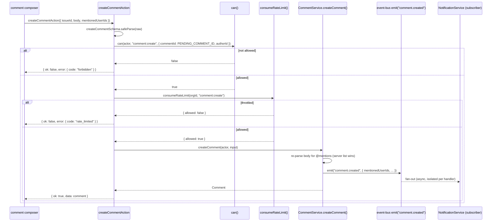

# Comment actions

Three files under src/actions/comments/: create, update, delete. All three go through
`withAction()` and all three ask `can()` about a `PermissionResource` shaped like
`{ kind: "comment", orgId, commentId, authorId }`, which is how comment permissions apply
the same ownership-escalation pattern issues use — `authorId` compared against
`actor.userId` is what lets a member edit or delete their own comment even though
`comment:update`/`comment:delete` sit at member/admin rank respectively in `ROLE_MATRIX`.

## `createCommentAction`

- **File:** `src/actions/comments/create-comment.ts`
- **Input schema:** `createCommentSchema` (`src/schemas/comment.ts`) — `CreateCommentInput`
- **Returns:** `ActionResult<Comment>`
- **Permission:** `comment:create` (minimum role member; see DES-043)
- **Feature flag:** none
- **Rate limit bucket:** `comment:create` (capacity 60, refill 10/min)
- **Plan limit:** none
- **Events emitted:** `comment.created` with mentioned user ids (via `createComment()`)
- **Cache tags revalidated:** `issueTag(input.issueId)`, `CACHE_PROFILES.seconds`
- **Errors:** `validation_failed`, `forbidden`, `rate_limited`, `internal_error`
- **Satisfies:** REQ-090, REQ-091, REQ-095, REQ-096
- **Design:** DES-115, DES-116, DES-238

### Input fields

| field | type | required | notes |
|---|---|---|---|
| `orgId` | branded `OrgId` | yes | |
| `issueId` | branded `IssueId` | yes | |
| `body` | string, 1-10000 | yes | Markdown, a restricted subset per REQ-091 |
| `parentId` | branded `CommentId` or `null` | no, default `null` | reply-to relation |
| `mentionedUserIds` | array of branded `UserId`, max 50 | no, default `[]` | client-side parse of `@mentions`; the server re-parses and its own list wins on disagreement (DES-116) |

### Behaviour

`can(actor, "comment:create", { commentId: PENDING_COMMENT_ID, authorId: actor.userId, ...
})` runs first — DES-238 states explicitly that the rate-limit bucket is charged **only
after** this permission check succeeds, not before. This is the opposite ordering from
`loginAction`'s rate-limit-first pattern in `actions-auth.md`, and the reason is different
too: there is no enumeration concern here (the caller is already an authenticated member of
the org), so there is no reason to burn a token-bucket charge on a request that was going to
be rejected on permission grounds regardless. Only once `comment:create` passes does
`consumeRateLimit(input.orgId, "comment:create")` run, throwing `RateLimitedError` on a
refused verdict.

DES-115 documents the deeper reason this ordering matters at the service layer, one level
below this action: comment creation is rate limited **before** mentions are resolved, so a
burst of comment submissions never reaches the member-scanning code path that resolves
`@mentions` into real user ids — a caller hammering the endpoint gets throttled cheaply,
before the more expensive mention-resolution work runs at all. DES-116 is the other half:
mentions are resolved server-side, and the server's own list wins on disagreement with the
client — the `mentionedUserIds` field in the payload is treated as a hint, not a source of
truth; `CommentService` re-parses the `body` for `@mentions` itself and the notification
fan-out (REQ-095, `comment.created` carrying mentioned user ids) uses the server's
recomputed list. This exists because a client-side mention parser can be tricked (or can
simply be stale relative to a body edited after the mention picker ran) in a way that would
let a comment notify — or fail to notify — the wrong set of people if the server trusted it.

## `updateCommentAction`

- **File:** `src/actions/comments/update-comment.ts`
- **Input schema:** `updateCommentSchema` (`src/schemas/comment.ts`) — `UpdateCommentInput`
- **Returns:** `ActionResult<Comment>`
- **Permission:** `comment:update` (minimum role member, with author escalation; see DES-041)
- **Feature flag:** none
- **Rate limit bucket:** none
- **Plan limit:** none
- **Events emitted:** none — see DES-120 below
- **Cache tags revalidated:** `["comments"]` (static tag only; no `issueTag` call here — see
  "A cache-invalidation asymmetry" below)
- **Errors:** `validation_failed`, `forbidden`, `internal_error`
- **Satisfies:** REQ-097, REQ-102
- **Design:** DES-117, DES-239

### Input fields

| field | type | required | notes |
|---|---|---|---|
| `orgId` | branded `OrgId` | yes | |
| `commentId` | branded `CommentId` | yes | |
| `body` | string, 1-10000 | yes | full replacement, not a partial patch |

### Behaviour

The `can()` check here passes `authorId: actor.userId` — the caller's own id, standing in
for "assume I am the author" — which the file's own comment names as deliberately
**optimistic**: it is a pre-check made with the caller as the presumed author, so a viewer
(who has no `comment:update` grant at all under the role matrix, and whose id will not
match the real `authorId` even if it did) is rejected before the round trip to the service.
The check that actually enforces "only your own comments" is a second one, inside
`CommentService.updateComment`, which repeats the permission check against the row's
*persisted* `authorId` after it has been fetched — DES-239. This two-layer check exists
because the action layer has no cheap way to know the real author without a database read it
would rather not do just to fail fast for the common, correctly-rejected case (a viewer with
no update grant at all, who is rejected by role rank alone, no author check needed).

DES-117: the self-edit window only applies to the author, and closes fifteen minutes after
posting — a detail enforced at the service layer, not visible in this action file at all,
but worth knowing when a user reports "I can't edit my own comment anymore" only a few
minutes after seeing the edit control. DES-120: editing a comment does **not** re-run mention
resolution or re-emit an event — unlike creation, an edited comment's body is not re-scanned
for new `@mentions`, and no `comment.updated` (there is no such key in `TaskflowEventMap`
either) or other event fires, which is why the "Events emitted" line above is `none`.

**A cache-invalidation asymmetry.** `createCommentAction` and `deleteCommentAction` both
revalidate `issueTag(...)` for the specific issue the comment belongs to, in addition to the
static `["comments"]` tag `withAction()` invalidates. `updateCommentAction` revalidates only
the static tag — it does not call `revalidateTagged([issueTag(...)], ...)` itself, even
though an edited comment's body is exactly the kind of change a reader on the issue detail
page would want to see promptly. This is not documented as intentional in the source; it
reads as an inconsistency worth flagging in review rather than a deliberate design decision,
and a reader debugging "my comment edit doesn't show up until the page is reloaded" should
look here first.

## `deleteCommentAction`

- **File:** `src/actions/comments/delete-comment.ts`
- **Input schema:** `deleteCommentSchema` (`src/schemas/comment.ts`) — `DeleteCommentInput`
- **Returns:** `ActionResult<Comment>`
- **Permission:** `comment:delete` (minimum role admin, with author escalation; see DES-041)
- **Feature flag:** none
- **Rate limit bucket:** none
- **Plan limit:** none
- **Events emitted:** `comment.deleted` (via `deleteComment()`)
- **Cache tags revalidated:** `issueTag(comment.issueId)`, `CACHE_PROFILES.seconds`
- **Errors:** `validation_failed`, `forbidden`, `internal_error`
- **Satisfies:** REQ-098, REQ-099, REQ-100, REQ-101
- **Design:** DES-118, DES-240

### Input fields

| field | type | required | notes |
|---|---|---|---|
| `orgId` | branded `OrgId` | yes | |
| `commentId` | branded `CommentId` | yes | |

### Behaviour

`comment:delete` sits at admin rank in `ROLE_MATRIX`, but the `authorId: actor.userId` field
in the `can()` call gives the same ownership escalation the update action has — an author
below admin rank may still delete their own comment. DES-240: deletion is a soft delete, so
reply chains keep their parent — `CommentService` stamps `archived_at` through
`archivePatch()` rather than removing the row, which matters because a deleted comment might
have replies hanging off it, and a hard delete would either orphan those replies (dangling
`parentId`) or require cascading the delete into them, which the corpus does not do for
comments the way `deleteLabelAction` cascades into the label join table. Comment threads keep
archived replies for the same reason (DES-186, at the repository layer) — the thread render
filters archived comments out of the visible list (REQ-101) but the row, and the parent
pointer it needs to keep a still-visible reply correctly nested, survives.

DES-118 adds a timing detail: the `comment.deleted` event's timestamp is taken from the
archive patch, not from a fresh clock read at emission time — `archivePatch()` computes
`archived_at` once, and both the persisted column and the event payload's `occurredAt` derive
from that same value, so there is no window in which the row's stored timestamp and the
event's reported timestamp could disagree even by a few milliseconds of scheduling jitter
between the write and the `emit()` call.

## Comment creation sequence

## Why comments have no soft-delete restore action

Unlike issues and projects, src/actions/comments/ has no `restore-comment.ts`. This is
consistent with `updateCommentSchema` and `deleteCommentSchema` being the entire comment
mutation surface beyond creation: a deleted comment is, per DES-240, filtered out of thread
reads but its row survives, which is enough to satisfy REQ-098 (deletion is a soft delete)
without requiring a UI path back. If a deleted comment needs to reappear, that is currently
an operator-level database fix rather than a self-service action — a gap worth knowing about
rather than assuming a hidden restore path exists somewhere in the settings surface.

## Rank asymmetry between update and delete

`comment:update` sits at member rank and `comment:delete` at admin rank in `ROLE_MATRIX`,
even though both carry the same author-ownership escalation. In practice this means an
ordinary member can always edit their own comment (member rank already grants
`comment:update` regardless of authorship) but can delete only their own — a member who is
not the author of a given comment has no path to deleting it, while an admin can delete any
comment in the organization regardless of who wrote it. The asymmetry mirrors the general
shape of `ROLE_MATRIX`: editing content is treated as an ordinary collaborative action,
removing it as a moderation action that defaults to admin oversight unless the remover is
also the author.

## Reading a thread versus mutating it

None of the three actions documented here is a "read" action — listing a thread is a
Server Component concern reading through `getThread()` at the service layer, not a Server
Action, and DES-119 notes that `getThread` re-checks `comment:read` even though the caller
already proved they can read the parent issue, a small extra permission call that costs
little and closes a theoretical gap where issue-read and comment-read diverge in some future
change to `ROLE_MATRIX`. It is worth stating plainly for anyone hunting for a
`listCommentsAction`: it does not exist. `listCommentsSchema` in `src/schemas/comment.ts`
backs a Server Component data fetch, not a client-invoked mutation, which is why it has no
entry in this file — this document only covers the three Server Actions the comment domain
actually exposes.

Related: REQ-092, REQ-093, REQ-094, DES-119, DES-121, DES-126, ADR-009, ADR-014.
