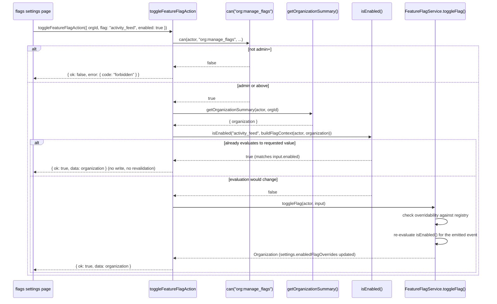

# Feature flag action

One file, one action: `toggleFeatureFlagAction`. It is the smallest action group in the
corpus by file count, but the feature-flag machinery it sits in front of — four evaluation
strategies, a registry, a snapshot mechanism the client actually receives — is large enough
that most of this document is about that machinery rather than the action's own dozen lines
of logic, which are short.

## `toggleFeatureFlagAction`

- **File:** `src/actions/flags/toggle-flag.ts`
- **Input schema:** `toggleFeatureFlagSchema` (`src/schemas/feature-flag.ts`) —
  `ToggleFeatureFlagInput`
- **Returns:** `ActionResult<Organization>`
- **Permission:** `org:manage_flags` (minimum role admin; see DES-043)
- **Feature flag:** none — this action toggles flags, it is not itself gated by one
- **Rate limit bucket:** none
- **Plan limit:** none
- **Events emitted:** `flag.toggled` (via `toggleFlag()`, re-evaluated rather than trusted —
  see below)
- **Cache tags revalidated:** `orgTag(input.orgId)`, `CACHE_PROFILES.minutes`
- **Errors:** `validation_failed`, `forbidden`, `internal_error`
- **Satisfies:** REQ-190, REQ-192
- **Design:** DES-177, DES-250

### Input fields

| field | type | required | notes |
|---|---|---|---|
| `orgId` | branded `OrgId` | yes | |
| `flag` | closed enum, 10 values | yes | `featureFlagKeySchema` — the full `FeatureFlagKey` union |
| `enabled` | boolean | yes | the requested override state |

### Behaviour

After the `org:manage_flags` permission check, the action reads the current organization via
`getOrganizationSummary()` and builds a `FlagContext` with `buildFlagContext(actor,
organization)`. It then evaluates `isEnabled(input.flag, context)` **before** calling
`toggleFlag()`, and DES-250 is the resulting short-circuit: `toggle-flag` is a no-op whenever
the override would not change the evaluated result. If `isEnabled(input.flag, context) ===
input.enabled` already, the action returns the unmodified `organization` immediately,
skipping both the write and the cache revalidation entirely. Concretely: toggling
`command_palette` to `true` (it is always on and not overridable) never reaches
`toggleFlag()` no matter how many times an admin clicks the control, because the flag was
already evaluating `true` before the click. This matters because writing a no-op override
into `enabledFlagOverrides` would still be a database write and a cache invalidation for a
change with no observable effect — the guard exists to avoid that, not merely to save a
service call.

When the override *would* change the outcome, `toggleFlag()` writes to
`organizationSettings.enabledFlagOverrides` and emits `flag.toggled`. DES-177's second half
matters as much as its first: `toggleFlag` checks overridability against the registry, not
against role rank, and the **emitted event re-evaluates rather than trusting the input** —
the event payload is not simply "flag X was set to `enabled`," it is the result of running
`isEnabled()` again after the write, so a subscriber reacting to `flag.toggled` sees the
actual evaluated state, which could in principle differ from the raw `enabled` boolean the
caller requested if some other evaluation input (plan, rollout percentage) also happened to
change concurrently.

## Flags versus permissions: two separate gates

DES-048 states this generally, and it is worth restating here since the flag action sits
exactly at the seam: permissions and feature flags are separate gates, deliberately. An
actor's role decides *whether they may act at all* — an admin's `org:manage_flags` grant is
a permission question, resolved entirely by `ROLE_MATRIX`. A flag's evaluated state decides
*whether a capability exists for the organization at all*, independent of who is asking.
This action itself straddles both: the permission check gates who may call it, while the
value it writes governs a separate axis entirely — what the organization's members, of any
role, can subsequently do. Conflating the two would make it impossible to express "any admin
may manage flags" separately from "this particular flag is available to this particular
plan," which is exactly the separation `issue_templates` (role >= admin) tests most
directly, since it is the one flag whose *evaluation strategy itself* is keyed on role
rather than plan or rollout — even there, the flag evaluation and the permission check
remain two independently computed answers that happen to consult the same `actor.role`
field for unrelated reasons.

## The flags this action can and cannot move

`toggleFeatureFlagSchema.flag` accepts any of the ten keys in `FeatureFlagKey`, but not
every flag is overridable, and the action's own no-op guard is the only enforcement visible
at this layer — the deeper "is this flag allowed to be overridden at all" check lives inside
`isEnabled()`/the registry, described fully in `design/service-feature-flag-and-support.md`.
The ten flags and their strategies:

| flag | strategy | overridable |
|---|---|---|
| `kanban_board` | plan >= starter | yes |
| `ai_issue_summary` | percentage rollout (25%) | yes |
| `command_palette` | always on | **no** |
| `activity_feed` | plan >= growth | yes |
| `public_projects` | plan >= enterprise | yes |
| `webhooks` | plan >= growth | **no** |
| `csv_export` | plan >= starter | yes |
| `digest_email` | plan >= growth | yes |
| `issue_templates` | role >= admin | yes |
| `advanced_search` | plan >= enterprise | yes |

`command_palette` and `webhooks` are the two non-overridable flags — an admin submitting
`toggleFeatureFlagAction` for either of these will either hit the no-op short-circuit (if the
requested value matches the already-evaluated one, which for `command_palette`'s always-on
strategy it always will unless requesting `false`) or, for a genuine attempted override, the
registry-level check inside `toggleFlag()` is what refuses it — this action file itself
contains no explicit list of which flags are overridable; that knowledge lives entirely in
the registry `isEnabled()` and `toggleFlag()` both consult, keeping this action's own logic
free of any flag-specific branching.

## Why toggling an org flag requires re-reading the organization first

Unlike most permission checks in this corpus, which pass identifiers straight out of the
parsed input into `can()`, this action needs the *organization row itself* — not just its
id — before it can even evaluate whether the requested toggle is a no-op, because
`buildFlagContext()` needs the org's `plan` and its existing `enabledFlagOverrides` to
compute the current evaluation. This is the one action in the corpus whose "check whether
this write is meaningful" step and "check whether the write is permitted" step both require
a full read of the target row rather than only its id — `org:manage_flags`'s `can()` call
needs only `orgId`, but the no-op guard that runs immediately after needs the whole
`Organization`, so the read happens regardless of which check runs first.

## What the client actually sees

REQ-194 — the client receives a flag snapshot, not the registry — is enforced by a
completely separate code path from this action: `getSnapshot()` (DES-176) is what
`org-provider.tsx` calls to seed the client-side flag context, and it is a read, not a
mutation. This action's return value, `ActionResult<Organization>`, does carry the updated
`enabledFlagOverrides` array as part of the returned `Organization.settings`, which is
enough for the settings page itself to re-render the toggle's new state, but any *other*
part of the UI that consults flag state — the sidebar deciding whether to show a "Board"
link, for instance — depends on the client re-fetching a fresh snapshot after this action's
cache tags invalidate, not on reading anything out of this action's own return value
directly.

## Toggle sequence, including the no-op short-circuit

## Why one action file is enough for ten flags

A reasonable design alternative would have been one action per flag, or a family of
flag-specific actions the way issues have six separate mutation files. The team chose a
single generic action instead, and the reason is visible in the input schema itself:
`toggleFeatureFlagSchema`'s `flag` field is the full `featureFlagKeySchema` enum, and every
flag shares exactly the same shape of request — an org id, a flag key, a desired boolean —
regardless of which evaluation strategy governs that particular flag. Unlike the issue
mutations, where `create`, `archive`, `assign`, and `move` genuinely differ in their input
shape and side effects, there is no flag-specific behavior this action would need to branch
on beyond what `isEnabled()` and `toggleFlag()` already encapsulate at the service layer.
Splitting this into ten files would multiply the boilerplate (each importing the same
`withAction`, the same permission check, the same no-op guard) without adding any
flag-specific logic to actually differentiate them — the opposite trade-off from the one that
justified six separate issue-action files.

## What "overridable" means in practice, restated

It is worth being explicit about a subtlety in the table above: a flag being "overridable"
does not mean an org can force it on regardless of plan for every strategy. `kanban_board`
(plan >= starter, overridable) can be force-enabled for an org still nominally on `free` —
the override supersedes the plan check entirely, which is a genuine promotional or support
lever product can pull. Contrast this with `ai_issue_summary`, a **percentage rollout**
(25%) that is also overridable: here, an override does not usually mean "give this org early
access regardless of the coin flip" in the way a plan-gated flag's override means "ignore the
plan requirement" — it means the stored override value in `enabledFlagOverrides` is
consulted *before* the percentage computation runs at all, short-circuiting it, so an
override on a rollout flag has exactly the same mechanical effect as an override on a
plan-gated one: it wins outright. The distinction between strategies only matters when no
override is present; once one exists, `isEnabled()` treats every overridable flag's override
identically regardless of which strategy would otherwise apply.

## Reading this action's permission floor against membership actions

`org:manage_flags` sits at admin rank, one step below the owner-only floor
`actions-billing.md` documents for `org:manage_billing` and `org:delete`. This places flag
management alongside member invitation and role changes rather than alongside billing and
deletion — the team's judgment, recorded in the permission model, is that toggling a feature
on or off for an organization is an operational decision an admin should be trusted with day
to day, not a decision with the same blast radius as changing what the organization pays or
whether it continues to exist. An admin flipping `activity_feed` on for a team that just
upgraded to `growth` is treated the same as an admin inviting a new member — routine,
reversible, and not requiring the founder-level trust `org:manage_billing` demands.

## What happens to a flag-gated action after a toggle

Toggling a flag off does not itself unwind whatever state was created while it was on — this
action's cache invalidation ensures the *evaluation* changes promptly, but individual rows
created under a now-disabled capability persist. Turning `webhooks` off for an organization
(by downgrading below `growth`, since it is non-overridable) does not delete existing
webhook endpoints; `deleteWebhookAction` (documented in `actions-webhooks-and-search.md`,
DES-258) is deliberately not itself flag-gated for exactly this reason — an org that loses a
capability must still be able to clean up what it created while it had that capability, and
this action's toggle is the read-time gate, not a data-lifecycle trigger.

Related: REQ-186, REQ-187, REQ-188, REQ-189, REQ-191, REQ-193, REQ-195, DES-048, DES-175,
DES-176, DES-178, ADR-012.
