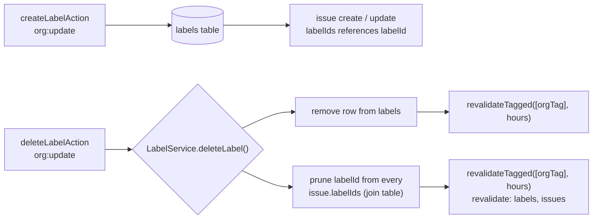

# Label and profile actions

Three files, from two unrelated action groups that this document covers together because
each is too small to earn its own file on its own: `src/actions/labels/create-label.ts`,
`src/actions/labels/delete-label.ts`, and `src/actions/profile/update-profile.ts`. Labels
are organization-wide, not per-project (REQ-013), and are governed by `org:update` rather
than a label-specific permission action — there is no `label:create` or `label:delete` entry
in `ROLE_MATRIX` at all. `update-profile.ts` is unrelated to labels except by being another
small, single-purpose action file; it is documented here because it is one of the corpus's
five deliberate layering exceptions and belongs somewhere concrete rather than getting a
one-action file of its own.

## `createLabelAction`

- **File:** `src/actions/labels/create-label.ts`
- **Input schema:** `createLabelSchema` (`src/schemas/label.ts`) — `CreateLabelInput`
- **Returns:** `ActionResult<IssueLabel>`
- **Permission:** `org:update` (minimum role admin; see DES-043)
- **Feature flag:** none
- **Rate limit bucket:** none
- **Plan limit:** none
- **Events emitted:** none — `TaskflowEventMap` has no label-creation key
- **Cache tags revalidated:** `orgTag(input.orgId)`, `CACHE_PROFILES.hours`
- **Errors:** `validation_failed`, `forbidden`, `internal_error`
- **Satisfies:** REQ-013, REQ-074
- **Design:** DES-236

### Input fields

| field | type | required | notes |
|---|---|---|---|
| `orgId` | branded `OrgId` | yes | |
| `name` | string, 1-40 | yes | |
| `color` | `#rrggbb` | no, default `"#94a3b8"` | `hexColorSchema` |
| `description` | string, max 200, or `null` | no, default `null` | |

### Behaviour

DES-236: labels are checked against `org:update`, not a label-specific permission action —
this is a deliberate simplification rather than an oversight. Because labels are
organization-scoped (REQ-013: shared across all a project's issues, and in fact across every
project in the org, not just one), the natural permission to gate "may this actor change
what the organization's label set looks like" is the same one that gates any other
organization-level metadata change, and adding a dedicated `label:create`/`label:delete`
pair to `ROLE_MATRIX` for two actions with identical admin-minimum semantics to `org:update`
would only add surface area with no behavioral difference. `createLabel()` writes the row and
returns it; there is no plan quota on the number of labels an org may have, and no event
fires because `TaskflowEventMap` was never given a label-lifecycle key — a label's creation
is invisible to the audit log for the same structural reason organization renames are
(DES-151): the activity trail is entirely event-driven (DES-024), and a mutation with no
matching event key leaves no automatic trace.

## `deleteLabelAction`

- **File:** `src/actions/labels/delete-label.ts`
- **Input schema:** `deleteLabelSchema` (`src/schemas/label.ts`)
- **Returns:** `ActionResult<null>`
- **Permission:** `org:update` (minimum role admin; see DES-043)
- **Feature flag:** none
- **Rate limit bucket:** none
- **Plan limit:** none
- **Events emitted:** none
- **Cache tags revalidated:** `orgTag(input.orgId)`, `CACHE_PROFILES.hours`
- **Errors:** `validation_failed`, `forbidden`, `internal_error`
- **Satisfies:** REQ-013
- **Design:** DES-237

### Input fields

| field | type | required | notes |
|---|---|---|---|
| `orgId` | branded `OrgId` | yes | |
| `labelId` | branded `LabelId` | yes | |

### Behaviour

DES-237: `delete-label` is a **hard delete** that must prune the join table, unlike every
issue-adjacent soft delete elsewhere in the corpus. Labels carry no `archived_at` column at
all — `LabelService.deleteLabel()` is responsible for removing the label id out of every
issue's `labelIds` in the same transaction the label row itself is removed in, which is why
this action's `revalidate` list includes `"issues"` in addition to `"labels"`: any issue
that had this label attached needs its cached list views invalidated too, since the label
just vanished from underneath them. This is the one deletion pattern in the whole corpus that
does not follow ADR-004's soft-delete convention, and the reason is structural rather than a
carve-out for labels specifically — a label has no independent lifecycle worth preserving
(nothing references "the label that used to exist," the way an archived issue's author still
needs to resolve), so there is no retention or undo value a soft delete would buy, only the
extra bookkeeping of a column nothing reads.

## `updateProfileAction`

- **File:** `src/actions/profile/update-profile.ts`
- **Input schema:** `updateProfileSchema` (`src/schemas/member.ts`) — `UpdateProfileInput`
- **Returns:** `ActionResult<User>`
- **Permission:** none as a `can()`/`ROLE_MATRIX` check — self-ownership is asserted
  directly (see below)
- **Feature flag:** none
- **Rate limit bucket:** none
- **Plan limit:** none
- **Events emitted:** none — `updateUser()` is a bare repository call
- **Cache tags revalidated:** none via `revalidateTagged`; calls
  `revalidatePath("/", "layout")` so the sidebar and any rendered avatar/name pick up the
  change everywhere at once
- **Errors:** `validation_failed`, `forbidden`, `internal_error`
- **Satisfies:** none of the numbered REQ ids directly govern the profile action; it exists
  to support the account-level fields (`name`, `avatarUrl`, `timezone`) referenced by
  REQ-012's timezone requirement, which is about the *organization's* timezone, not the
  user's — the personal timezone here is a separate, unrequirement-numbered convenience
  field
- **Design:** DES-017, DES-255

### Input fields

| field | type | required | notes |
|---|---|---|---|
| `userId` | branded `UserId` | yes | must equal the caller's own id (enforced in the handler, not the schema) |
| `name` | string, 1-80 | no | |
| `avatarUrl` | URL or `null` | no | |
| `timezone` | string, 1-64 | no | |

### Behaviour

This is one of the five deliberate layering exceptions catalogued in
`design/architecture-overview.md` (DES-008) and `design/module-map.md` (DES-017), and the
only one that lives inside src/actions/. `withAction()` runs with `requireOrg: false`
because the payload carries no `orgId`/`orgSlug` — a profile is a `User` row, not a tenant
row — so the wrapper falls back to resolving the actor against the session's active
organization purely to have *an* `Actor` in hand (the org context is otherwise unused by
this handler). The one check the handler performs itself is `input.userId !==
actor.userId`, throwing `ForbiddenActionError("member:update_role")` — note the borrowed
action name, which is a minor inconsistency worth knowing about rather than a documentation
error: there is no dedicated `profile:update` entry in `PermissionAction`, so the error
carries the closest existing action name rather than inventing a new one purely for this
error's `meta.action` field.

DES-255: this is the action layer's one documented bypass of the service layer entirely —
the handler calls `updateUser()` in `src/server/repositories/user-repository.ts` directly,
with no `ProfileService` in between. The source comment is explicit about why a pass-through
service was not added: "there is no tenant rule, no event and no quota to apply," so a
service whose only job would be to immediately forward the call to the repository adds a
layer with nothing to contribute. This mirrors DES-199 at the repository layer — the user
repository is the one deliberately non-tenant-scoped repository in the corpus, since a user
can belong to multiple organizations and their profile is not owned by any single one of
them.

## Label lifecycle, end to end

There is no `updateLabelAction` documented here because, while `updateLabelSchema` exists in
`src/schemas/label.ts`, there is no corresponding `"use server"` export under
src/actions/labels/ — the same pattern noted for invitation resend/revoke in
`actions-members.md`. A label's name, color, and description can currently only be set at
creation time through the wired Server Actions; renaming an existing label is not reachable
from the client through this action layer even though the schema and, presumably, the
service function to support it already exist. Confirm against src/actions/labels/ before
assuming a rename path is available.

## Why labels have no per-project scope

REQ-013 states organization labels are shared across all its projects, and this shows up
concretely in the `createLabelSchema`/`deleteLabelSchema` shapes: neither carries a
`projectId` field, only `orgId`. This is a deliberate product decision, not a limitation of
the schema layer — a label like "bug" or "needs-design" is expected to mean the same thing
whether it is attached to an issue in the engineering project or the marketing project, and
splitting labels per project would fragment a filter like "show me everything tagged
`urgent`" into one query per project instead of one query across the whole organization.
`listLabelsForIssues` (DES-192) is the batched read every list view relies on to attach
labels to a page of issues without an N+1 query per row, and it is org-scoped for the same
reason the mutation actions are.

## The profile action's borrowed error name

`updateProfileAction`'s use of `"member:update_role"` as the action name inside its
`ForbiddenActionError` deserves one more sentence of context: `PermissionAction` (the
discriminated union `can()` accepts) does not include a `profile:update` variant at all,
because the profile action never calls `can()` in the first place — its one guard is the
plain identity comparison `input.userId !== actor.userId`. The borrowed name only ever
surfaces in the error's `meta.action` field if a caller tries to submit someone else's
`userId`, which client code should never do since the form always populates `userId` from
the signed-in session; in practice this branch is defense against a tampered request body,
not a path real users hit through the UI.

## Two unrelated files, one document, one reason

It is worth being explicit about why this file pairs labels with profile updates rather than
giving each its own page: neither domain has enough Server Action surface to justify a
dedicated file under the word-budget conventions this documentation set uses elsewhere.
Labels contribute two actions, profile contributes one, and none of the three shares
meaningful machinery with the other two beyond "both are `withAction()` mutations gated by a
simple permission check" — there is no shared sequence diagram that would illuminate both at
once the way, say, archive-then-restore does for projects. Treat this file as two short,
independent references rather than a narrative that connects labels to profiles; the only
thing they have in common is being small enough, individually, to not warrant separate
pages.

## Reading label state without a Server Action

Same caveat as the comment thread read in `actions-comments.md`: there is no
`listLabelsAction`. A project or issue's available labels are read through a Server
Component that calls into the label service or repository directly, not through a
client-invoked mutation — this file documents the two label mutations that exist, not the
read path a settings page or issue form uses to populate a label picker.

## Cache profile choices

Both label actions use `CACHE_PROFILES.hours`, the least aggressive staleness budget the
corpus defines, matching how infrequently an organization's label palette actually changes
compared to, say, an issue's status. `updateProfileAction` sidesteps the tag-based
revalidation system entirely in favor of `revalidatePath("/", "layout")`, which is a heavier
hammer than a scoped `orgTag`/`issueTag` call but appropriate here — a changed display name
or avatar can appear anywhere in the authenticated shell (the sidebar, the top bar, an
activity feed entry attributed to the user), and there is no single cache tag that covers
all of those surfaces the way there is for an org- or project-scoped mutation.

Related: REQ-020, REQ-213, DES-008, DES-191, DES-192, ADR-004, ADR-013.
