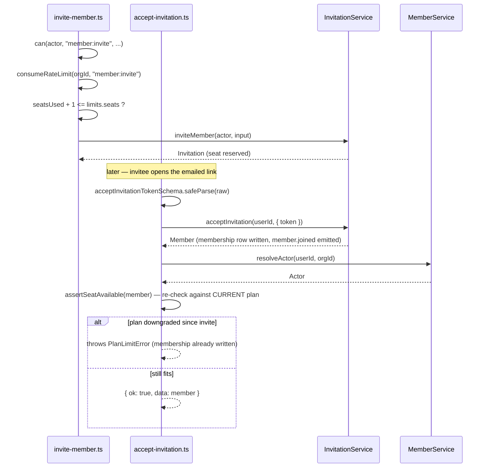

# Member and invitation actions

Four files: inviting a member, accepting an invitation, removing a member, and changing a
member's role. `invite-member.ts`, `remove-member.ts` and `update-member-role.ts` are
ordinary `withAction()` mutations; `accept-invitation.ts` is the odd one out, alongside the
auth actions covered in `actions-auth.md`, because the caller is signed in but is by
definition not yet a member of the target organization.

## `inviteMemberAction`

- **File:** `src/actions/members/invite-member.ts`
- **Input schema:** `inviteMemberSchema` (`src/schemas/member.ts`) — `InviteMemberInput`
- **Returns:** `ActionResult<Invitation>`
- **Permission:** `member:invite` (minimum role admin; see DES-043)
- **Feature flag:** none
- **Rate limit bucket:** `member:invite` (capacity 20, refill 2/min)
- **Plan limit:** `seats`
- **Events emitted:** none directly from the action — invitation issuance emits through the
  service layer (see `design/service-member-and-invitation.md`)
- **Cache tags revalidated:** `orgTag(input.orgId)`, `CACHE_PROFILES.minutes`
- **Errors:** `validation_failed`, `forbidden`, `rate_limited`, `plan_limit_exceeded`,
  `internal_error`
- **Satisfies:** REQ-028, REQ-032
- **Design:** DES-146

### Input fields

| field | type | required | notes |
|---|---|---|---|
| `orgId` | branded `OrgId` | yes | |
| `email` | string, lowercased, max 254 | yes | `emailSchema` |
| `role` | `"admin" \| "member" \| "viewer"` | no, default `"member"` | `invitableRoleSchema` — an owner is transferred, never invited |
| `message` | string, max 500 | no | optional note included in the invitation email |

### Behaviour

`invite-member.ts` checks `member:invite` with the target `PENDING_MEMBER_ID`, the target
role, and `targetUserId: actor.userId` (a placeholder — the invitee has no user id yet).
It then charges the `member:invite` bucket, and only after both of those pass does it read
`getOrganizationSummary()` to compare `summary.usage.seatsUsed + 1` against
`limits.seats`. This order — permission, then rate limit, then quota — is deliberate:
neither of the first two checks requires a database read of usage, so a caller who is going
to be refused on permission or on rate never triggers the more expensive summary query.

DES-146 is the detail worth remembering here: the seat check counts **pending invitations
as provisional seats**, and it runs once for the whole invite, checked against
`seatsUsed + 1` for a single invite (the bulk-invite schema, `inviteMembersSchema`, exists in
`src/schemas/member.ts` but has no corresponding action file in this corpus — only the
single-invite path is wired up). Without counting pending invitations, an org on the free
plan's 3-seat ceiling could issue ten invitations while only 2 seats were actually occupied,
and then have 8 of those acceptances fail with `plan_limit_exceeded` at the worst possible
moment — after the invitee had already clicked the link. Charging the quota at invite time
instead means the seat is reserved the moment the invitation goes out, and
`acceptInvitationAction` re-checks it (see below) only to catch the case where the
organization's plan changed downward in the interim.

## `acceptInvitationAction`

- **File:** `src/actions/members/accept-invitation.ts`
- **Input schema:** `acceptInvitationTokenSchema` (`src/schemas/invitation.ts`) —
  `AcceptInvitationTokenInput`
- **Returns:** `ActionResult<Member>`
- **Permission:** none as a `can()` check — there is no `Actor` yet when the token is
  redeemed
- **Feature flag:** none
- **Rate limit bucket:** none
- **Plan limit:** `seats`, re-checked after the membership write
- **Events emitted:** `member.joined` (via `acceptInvitation()`)
- **Cache tags revalidated:** none
- **Errors:** `validation_failed`, `unauthorized`, `plan_limit_exceeded`, `internal_error`
- **Satisfies:** REQ-029, REQ-030
- **Design:** DES-147, DES-244

### Input fields

| field | type | required | notes |
|---|---|---|---|
| `token` | string, 32-128, `[A-Za-z0-9_-]+` | yes | `invitationTokenSchema` from `src/schemas/invitation.ts`; the token is the credential — there is no `orgId` in the payload at all |

### Behaviour

DES-147 makes this the one function in the corpus with no `Actor` at all, not even a
partially-resolved one: `acceptInvitationAction` resolves the `SessionPrincipal` (the caller
must be signed in as *some* user, just not necessarily one who belongs to the target org
yet), then calls `acceptInvitation(principal.userId, parsed.data)`, which validates the
token, creates the membership row, and emits `member.joined`. Only after that write succeeds
does the action call `resolveActor(member.userId, member.orgId)` from `member-service.ts` to
obtain an `Actor` for the org the membership just granted access to — and DES-244 is explicit
that the seat quota is re-checked only at this point, after the write, not before it. The
reasoning: `inviteMemberAction` already reserved a seat for this invitation at issue time
(DES-146), so under ordinary operation the seat is already accounted for and this second
check should never fail. It exists to catch the case where the organization downgraded plans
between the invitation being sent and being accepted — `assertSeatAvailable()` compares
`summary.usage.seatsUsed` (now including the just-created membership) against the *current*
plan's `limits.seats`, and if the just-created member pushes the count over a now-lower
ceiling, `PlanLimitError` is thrown — after the membership row is already live. The action
does not roll the membership back; it surfaces the error and leaves the operator to resolve
the over-limit state manually (typically by raising seats or removing another member), which
is a conscious trade-off in favor of never leaving an accepted invitation in limbo.

## `removeMemberAction`

- **File:** `src/actions/members/remove-member.ts`
- **Input schema:** `removeMemberSchema` (`src/schemas/member.ts`) — `RemoveMemberInput`
- **Returns:** `ActionResult<Member>`
- **Permission:** `member:remove` (minimum role admin; see DES-043)
- **Feature flag:** none
- **Rate limit bucket:** none
- **Plan limit:** none — removal only ever frees a seat, never consumes one
- **Events emitted:** `member.removed` (via `removeMember()`)
- **Cache tags revalidated:** `orgTag(input.orgId)`, `CACHE_PROFILES.minutes`
- **Errors:** `validation_failed`, `forbidden`, `internal_error`
- **Satisfies:** REQ-031, REQ-033
- **Design:** DES-143, DES-144

### Input fields

| field | type | required | notes |
|---|---|---|---|
| `orgId` | branded `OrgId` | yes | |
| `memberId` | branded `MemberId` | yes | |

### Behaviour

The `can()` check for `member:remove` passes `targetUserId: actor.userId` and
`targetRole: actor.role` — the *actor's own* identity and role, not the target member's,
because the ownership escalation this resource shape supports is about who is doing the
removing, not who is being removed (there is no self-removal escalation for
`member:remove` in `ROLE_MATRIX`; it is a flat admin-minimum action). `removeMember()` then
performs a soft delete of the membership row, and — before it does — calls
`assertLastOwnerRetained()`, which DES-144 describes as scanning up to one hundred owners
and treating a demotion and a removal identically: removing the org's only owner is refused
the same way demoting them would be (see `updateMemberRoleAction` below), because both
actions produce the same forbidden end state, an organization with zero owners. REQ-033 is
the reason removal is soft: the membership row is archived rather than deleted so that
issues and comments the removed person authored keep resolving their author, rather than
turning into orphaned rows with a dangling foreign key or a null author.

## `updateMemberRoleAction`

- **File:** `src/actions/members/update-member-role.ts`
- **Input schema:** `updateMemberRoleSchema` (`src/schemas/member.ts`) —
  `UpdateMemberRoleInput`
- **Returns:** `ActionResult<Member>`
- **Permission:** `member:update_role` (minimum role admin; see DES-043)
- **Feature flag:** none
- **Rate limit bucket:** none
- **Plan limit:** none
- **Events emitted:** `member.role_changed` (via `updateMemberRole()`)
- **Cache tags revalidated:** `orgTag(input.orgId)`, `CACHE_PROFILES.minutes`
- **Errors:** `validation_failed`, `forbidden`, `internal_error`
- **Satisfies:** REQ-020, REQ-034
- **Design:** DES-142, DES-144

### Input fields

| field | type | required | notes |
|---|---|---|---|
| `orgId` | branded `OrgId` | yes | |
| `memberId` | branded `MemberId` | yes | |
| `role` | `"owner" \| "admin" \| "member" \| "viewer"` | yes | `roleSchema` — the full four-role enum, unlike an invite, which can grant only three |

### Behaviour

DES-142: role changes are checked twice, by two mechanisms that cannot be collapsed into
one. First, `can(actor, "member:update_role", ...)` against `ROLE_MATRIX` establishes that
the caller's rank is at least admin. Second, and separately, the action calls
`hasRoleAtLeast(actor.role, input.role)` — a plain rank comparison, not a `can()` call — and
throws `ForbiddenActionError` if it fails. The comment in the source names this precisely: a
**privilege escalation guard**, stopping an admin from minting an owner. `ROLE_MATRIX` alone
cannot express "you may only grant a role at or below your own rank" because a matrix entry
is keyed by *action*, not by the *target value* of that action's payload — `member:update_role`
has one minimum-role entry (admin) regardless of what role is being granted, so the second,
independent rank comparison is the only place in the codebase this particular rule can live.

After both permission checks pass, `assertLastOwnerRetained(input.orgId, input.memberId,
input.role)` runs — the same function `removeMemberAction` calls, per DES-144, treating a
demotion away from owner exactly like a removal for the purpose of the "at least one owner"
invariant (REQ-031). An admin attempting to demote the organization's sole owner to member
is refused here, before `updateMemberRole()` ever runs, regardless of whether the admin
technically outranks the *target role* being assigned (member is below admin, so
`hasRoleAtLeast` would allow it) — the last-owner check is independent of, and runs after,
the escalation guard.

## Invitation-to-membership sequence

## Why membership actions never touch `invitation-service.ts`'s resend or revoke paths

`src/schemas/invitation.ts` and `src/schemas/member.ts` both declare more shapes than this
directory has action files for: `resendInvitationSchema`, `revokeInvitationSchema`, and
`inviteMembersSchema` (bulk invite) exist as schemas with no corresponding
`"use server"` export under src/actions/members/. `design/service-member-and-invitation.md`
(DES-148) documents `resendInvitation()` at the service layer — it revokes and reissues
rather than mutating the existing row, and silently downgrades an owner-role resend — but
that service function currently has no action wired in front of it. Do not infer from the
schema's existence that a resend or bulk-invite Server Action exists; grep
src/actions/members/ before writing documentation or a client form that assumes one does.
This corpus intentionally documents what is wired, not what the schema layer merely makes
possible.

## The role-rank interaction, spelled out

Because `updateMemberRoleAction`'s two checks are independent, four combinations are worth
having straight:

| caller role | target role | `can()` (admin-minimum) | `hasRoleAtLeast` (escalation guard) | outcome |
|---|---|---|---|---|
| admin | viewer | passes | passes (viewer below admin) | allowed |
| admin | admin | passes | passes (equal rank) | allowed |
| admin | owner | passes | **fails** (owner above admin) | forbidden |
| owner | owner | passes | passes | allowed, but still subject to `assertLastOwnerRetained` if it demotes the sole existing owner elsewhere in the same call |

The third row is the one this guard exists for: without it, any admin could grant
ownership to an arbitrary member, which would make "admin" functionally equal to "owner"
for the one privilege that is supposed to be strictly owner-only (REQ-025).

Related: REQ-020, REQ-021, REQ-022, REQ-023, REQ-024, REQ-025, REQ-026, REQ-027, DES-043,
DES-145, DES-148, ADR-003.
