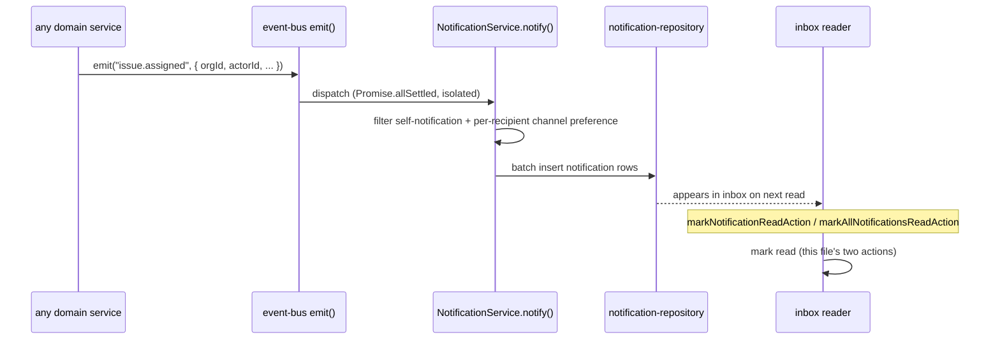

# Notification actions

Three files under src/actions/notifications/: mark one read, mark all read, and update a
notification preference. None of them creates a notification — `notify()` at the service
layer (DES-121) is called from event handlers, never from a Server Action directly, so there
is no `createNotificationAction` in this corpus at all; notifications only ever come into
existence as a side effect of some other domain event's fan-out.

Every recipient-facing check in this trio is enforced through an ownership-escalation
comparison rather than a role-rank floor, which is worth restating up front: `viewer` — the
lowest rank in `ROLE_RANK` — already carries the base grant for all three permission
actions used here (`notification:read`, `notification:manage`, and the identity check inside
`updatePreference`), so the entire access-control story for this group is "does the resource
belong to you," never "are you senior enough."

## `markNotificationReadAction`

- **File:** `src/actions/notifications/mark-read.ts`
- **Input schema:** `markNotificationReadSchema` (`src/schemas/notification.ts`) —
  `MarkNotificationReadInput`
- **Returns:** `ActionResult<Notification>`
- **Permission:** `notification:read` (minimum role viewer, with recipient escalation; see
  DES-041)
- **Feature flag:** none
- **Rate limit bucket:** none
- **Plan limit:** none
- **Events emitted:** none
- **Cache tags revalidated:** `["notifications"]`, `CACHE_PROFILES.seconds`
- **Errors:** `validation_failed`, `forbidden`, `internal_error`
- **Satisfies:** REQ-116, REQ-118
- **Design:** DES-241

### Input fields

| field | type | required | notes |
|---|---|---|---|
| `orgId` | branded `OrgId` | yes | |
| `notificationId` | branded `NotificationId` | yes | |

### Behaviour

`notification:read` is granted to every role — viewer is its minimum rank in `ROLE_MATRIX`,
the lowest of any action in the whole matrix — but the `can()` call passes `recipientId:
actor.userId`, and DES-241 states plainly what actually does the work here: the ownership
escalation inside `can()`, comparing `recipientId` against `actor.userId`, is what stops one
member marking another member's inbox as read, **not** an explicit ownership check written
into this action file. Because every role already has base-level `notification:read`
access, the escalation is the only thing standing between "any member of the org can mark
any notification read" and REQ-118's requirement that recipients may manage only their own
notifications — remove the `recipientId` field from the resource shape passed to `can()`
and this action would silently let any member clear anyone else's inbox, since the base role
grant alone would already pass.

## `markAllNotificationsReadAction`

- **File:** `src/actions/notifications/mark-all-read.ts`
- **Input schema:** `markAllNotificationsReadSchema` (`src/schemas/notification.ts`)
- **Returns:** `ActionResult<number>`
- **Permission:** `notification:manage` (minimum role viewer, with recipient escalation)
- **Feature flag:** none
- **Rate limit bucket:** none
- **Plan limit:** none
- **Events emitted:** none
- **Cache tags revalidated:** `["notifications"]`, `CACHE_PROFILES.seconds`
- **Errors:** `validation_failed`, `forbidden`, `internal_error`
- **Satisfies:** REQ-116, REQ-117
- **Design:** DES-242

### Input fields

| field | type | required | notes |
|---|---|---|---|
| `orgId` | branded `OrgId` | yes | the only field — there is no per-notification targeting, this clears the whole inbox for the org |

### Behaviour

This action returns `ActionResult<number>`, not `ActionResult<Notification>` or `<null>` —
the only action in this group, and one of only a handful across the whole corpus (alongside
nothing else in this document), whose success payload is a bare count. DES-242: `mark-all-read`
returns a count so the bell badge updates without a second round trip — the client already
has the unread count it is about to clear cached locally for the badge UI, and rather than
have the client re-derive "how many did we just mark read" from a follow-up query, the
action hands back exactly the number `markAllRead()` touched, which the client subtracts
from its displayed badge total directly. The permission resource here uses
`notification:manage`, not `notification:read` — a slightly higher-privilege action name
than the single-notification version uses, even though both are gated to viewer-minimum
rank with the same `recipientId` escalation; `notification:manage` is the action name shared
with `update-preferences` below, framing "mark everything read" as a management operation on
the inbox as a whole rather than a read of one row.

## `updateNotificationPreferenceAction`

- **File:** `src/actions/notifications/update-preferences.ts`
- **Input schema:** `updateNotificationPreferenceSchema` (`src/schemas/notification.ts`) —
  `UpdateNotificationPreferenceInput`
- **Returns:** `ActionResult<NotificationPreference>`
- **Permission:** none as a `can()` check — see "No permission check" below
- **Feature flag:** `digest_email` (plan >= growth, overridable) — conditionally, only when
  `digestOnly` is requested `true`
- **Rate limit bucket:** none
- **Plan limit:** none
- **Events emitted:** none
- **Cache tags revalidated:** `["notification-preferences"]`, `CACHE_PROFILES.hours`
- **Errors:** `validation_failed`, `forbidden` (via `FeatureUnavailableError`),
  `internal_error`
- **Satisfies:** REQ-115
- **Design:** DES-127, DES-243

### Input fields

| field | type | required | notes |
|---|---|---|---|
| `orgId` | branded `OrgId` | yes | |
| `userId` | branded `UserId` | yes | must be the caller's own — see below |
| `kind` | closed enum, 11 values | yes | `notificationKindSchema` — e.g. `issue_assigned`, `comment_mention`, `digest_ready` |
| `inApp` | boolean | yes | |
| `email` | boolean | yes | |
| `digestOnly` | boolean | yes | |

### Behaviour

**No permission check.** This action calls no `can()` at all — `updatePreference()` at the
service layer is what authorizes the write, and DES-127 documents the rule it enforces:
`updatePreference` and `markAllRead` both authorize against the caller's own `userId`,
never an arbitrary target, meaning a preference row can only ever be written by and for the
same user, checked inside the service rather than via the role matrix, because a
notification preference is not really an organization-scoped permission concept — there is
no role rank at which "manage someone else's notification preferences" should ever be
grantable, so it is enforced as identity equality rather than expressed as a `ROLE_MATRIX`
entry the way `notification:manage` is for the other two actions in this group.

The one gate this action file *does* implement itself is the `digestOnly` feature check.
DES-243: `update-preferences` gates `digestOnly` on the `digest_email` flag so a preference
can never point at a channel that never fires — before calling `updatePreference()`, the
action reads `getOrganizationSummary()`, builds a `FlagContext`, and if `input.digestOnly` is
`true` and `isEnabled("digest_email", context)` is `false`, throws
`FeatureUnavailableError("digest_email")`. Setting `digestOnly: false` never triggers this
check regardless of the flag state — only the request to *route through the digest* is
gated, and REQ-120 (digest is available only on plans that include it) is exactly what this
guard exists to enforce at the point a user tries to opt a notification kind into
digest-only delivery on a plan that would never actually send one.

## Where notifications actually come from

None of the three actions in this file writes a new notification row. The full path —
event fires, `notify()` fans it out, a row lands in a recipient's inbox — is a subscriber
chain wired at module import time (DES-125), not a request/response cycle a Server Action
drives:

This is why "Events emitted" reads `none` for all three actions documented above: they are
all on the *consuming* side of the notification lifecycle, never the producing side. DES-121
states this directly — `notify()` takes no `Actor` and is never called by a Server Action
directly, because the writer is always an event handler reacting to something else, and
handlers do not have (and do not need) a request-scoped `Actor` the way a Server Action
does. DES-122 fills in the filtering logic this file's actions never touch: `notify()`
filters self-notification (REQ-114 — actors are not notified about their own actions) and
per-recipient channel preference in the same loop, before any row is written, which is the
mechanism `updateNotificationPreferenceAction` exists to configure — a preference row this
file's third action writes is read back by exactly this filtering loop the next time an
event fires for that user.

## Unread counts and the badge

REQ-117 requires unread counts to be computed per organization, and DES-201 (at the
repository layer, documented in `design/repository-notification-and-activity.md`) is what
makes `markAllNotificationsReadAction`'s count-returning shape efficient: `countUnread` is a
single indexed count, not the length of a fetched list, so the badge total the client
displays before this action runs, and the delta this action reports afterward, are both
cheap to compute even for an inbox with thousands of historical rows. Contrast this with
`markNotificationReadAction`, which returns the full `Notification` row rather than a count
— marking one notification read is a targeted UI interaction (clicking a specific inbox
item) where the caller already knows which row changed and mainly needs the updated `readAt`
timestamp back to update that one list item's rendering, not a running total.

## The preference matrix's three independent booleans

`updateNotificationPreferenceSchema`'s three boolean fields — `inApp`, `email`, `digestOnly`
— are independent, not a mutually exclusive radio choice, and this action does not enforce
any combination rule between them beyond the `digestOnly`-requires-`digest_email` flag gate.
A user can have all three `true` for one notification kind (an in-app badge, an immediate
email, *and* inclusion in the digest), all three `false` (fully muted for that kind), or any
combination in between. `resolveChannels`, a pure function documented at the service layer
(DES-124), is what turns this preference row plus the org's flag state into the actual set
of channels a given notification fires on, and it requires two independent conditions to
hold before email fires at all: the preference's own `email` boolean, and the delivery path
being reachable in the first place (a channel that is off at the org level cannot be turned
on by an individual user's preference row). This action only ever writes the preference row
itself — `resolveChannels`'s combination logic runs later, at fan-out time, not here.

## Cache profiles: seconds versus hours

`markNotificationReadAction` and `markAllNotificationsReadAction` both revalidate on
`CACHE_PROFILES.seconds` — the same tight budget `changeIssueStatusAction` and
`assignIssueAction` use — because an unread badge that lags behind a click by more than a
moment reads as broken to a user watching their own inbox update. `updateNotificationPreferenceAction`
instead uses `CACHE_PROFILES.hours`, matching the label actions' choice: a preference change
is a settings-page edit a user makes rarely and does not expect to see reflected anywhere
faster than an ordinary page navigation would already refresh it. The three actions in this
one small group span two of the three named staleness budgets in `CACHE_PROFILES`
(`design/caching-and-revalidation.md`, DES-072), which is a useful illustration that the
profile choice tracks how time-sensitive the *specific* mutation is, not which domain it
belongs to — two notification actions land at opposite ends of the staleness scale.

Related: REQ-111, REQ-112, REQ-113, REQ-114, REQ-119, REQ-121, REQ-122, REQ-123, REQ-124,
DES-122, DES-123, DES-124, DES-125, DES-126, ADR-005, ADR-012.
