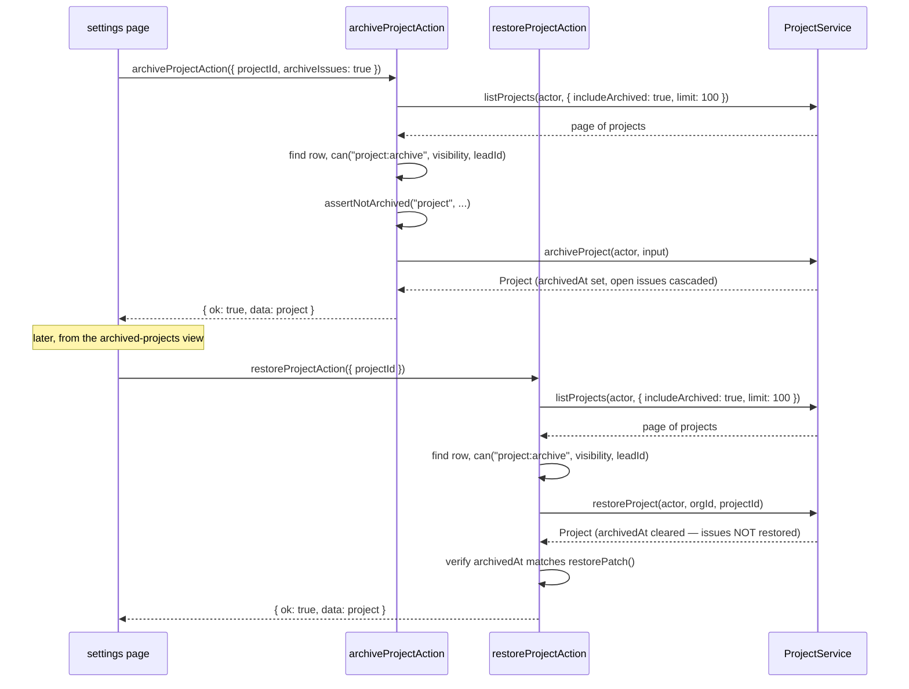

# Project actions

Four files under src/actions/projects/: create, archive, restore and update. All four go
through `withAction()`. The pair worth reading together is `archive-project.ts` and
`restore-project.ts` — they share a hand-fetched "find the current row first" pattern that
none of the other three action groups needs, because `project:archive` is checked against
the project's *current* `visibility` and `leadId`, which the schema payload does not carry.

## `createProjectAction`

- **File:** `src/actions/projects/create-project.ts`
- **Input schema:** `createProjectSchema` (`src/schemas/project.ts`) — `CreateProjectInput`
- **Returns:** `ActionResult<Project>`
- **Permission:** `project:create` (minimum role member; see DES-043)
- **Feature flag:** none
- **Rate limit bucket:** none
- **Plan limit:** `projects`
- **Events emitted:** `project.created` (via `createProject()`)
- **Cache tags revalidated:** `orgTag(input.orgId)`, `projectTag(project.id)`,
  `CACHE_PROFILES.minutes`
- **Errors:** `validation_failed`, `forbidden`, `plan_limit_exceeded`, `rate_limited`,
  `internal_error`
- **Satisfies:** REQ-040, REQ-041, REQ-042, REQ-043, REQ-053
- **Design:** DES-108, DES-233

### Input fields

| field | type | required | notes |
|---|---|---|---|
| `orgId` | branded `OrgId` | yes | |
| `name` | string, 2-80 | yes | |
| `slug` | string | yes | `slugSchema`; unique within the org, not globally (unlike an org slug) |
| `key` | string, 2-4 uppercase | yes | `projectKeySchema` — prefixes every issue number in this project (e.g. `ENG-142`) and is immutable once set (REQ-042) |
| `description` | string, max 2000, or `null` | no, default `null` | |
| `visibility` | `"private" \| "org" \| "public"` | no, default `"org"` | `projectVisibilitySchema` |
| `leadId` | branded `UserId` or `null` | no, default `null` | |
| `color` | `#rrggbb` | no, default `"#6366f1"` | |
| `targetDate` | ISO timestamp or `null` | no, default `null` | |

### Behaviour

The `can()` check for `project:create` uses `PENDING_PROJECT_ID` since no project row exists
yet, and passes the *incoming* `visibility` and `leadId` — a project being created as
`public` is judged against `public_projects` visibility rules at creation time, the same way
`updateProjectAction` judges a project *becoming* public (see below). The quota check reads
`getOrganizationSummary()` and compares `summary.usage.projectsUsed` against
`limits.projects` before calling `createProject()`. DES-233: this count deliberately includes
archived projects, mirroring the equivalent choice in `createIssueAction` — the reasoning is
symmetric to REQ-044 (archived projects still consume the project quota): if archived
projects did not count, an org at its project ceiling could restore an old project, exceed
the ceiling the moment it did, and have no path back to a valid state without deleting
something else first. Counting archived projects against the quota from the start means a
restore is never the operation that pushes an org over its own limit.

## `archiveProjectAction`

- **File:** `src/actions/projects/archive-project.ts`
- **Input schema:** `archiveProjectSchema` (`src/schemas/project.ts`) — `ArchiveProjectInput`
- **Returns:** `ActionResult<Project>`
- **Permission:** `project:archive` (minimum role admin; see DES-043)
- **Feature flag:** none
- **Rate limit bucket:** none
- **Plan limit:** none
- **Events emitted:** `project.archived` (via `archiveProject()`)
- **Cache tags revalidated:** `orgTag(input.orgId)`, `projectTag(project.id)`,
  `CACHE_PROFILES.minutes`
- **Errors:** `validation_failed`, `forbidden`, `not_found`, `conflict`, `internal_error`
- **Satisfies:** REQ-045, REQ-046
- **Design:** DES-111, DES-232

### Input fields

| field | type | required | notes |
|---|---|---|---|
| `orgId` | branded `OrgId` | yes | |
| `projectId` | branded `ProjectId` | yes | |
| `archiveIssues` | boolean | no, default `true` | see DES-232 below |

### Behaviour

Before any permission check, the action calls `listProjects(actor, { orgId, limit: 100,
includeArchived: true })` and searches the returned page for the one row matching
`input.projectId`, throwing `ActionNotFoundError` if it is absent. This is not the pattern
used elsewhere in the corpus (most actions that need "the current row" call a dedicated
`getProject`-style read); it exists here because `project:archive`'s `can()` check needs the
project's live `visibility` and `leadId` to evaluate ownership escalation, and at the time
this action was written the simplest available read was the existing list function with a
generous limit. Once the row is found, `can(actor, "project:archive", { visibility:
current.project.visibility, leadId: current.project.leadId, ... })` runs, then
`assertNotArchived("project", input.projectId, current.project)` — which throws
`AlreadyArchivedError` (mapped to `conflict`) rather than silently re-stamping
`archived_at`, the same fail-loud pattern `archiveIssueAction` uses and for the same reason:
re-archiving would reset whatever retention clock reads that timestamp.

DES-232 is the field worth internalizing: `archiveIssues` **defaults to `true`**, not
`false`. The doc comment states the reasoning plainly — "leaving live issues under an
archived project is the state that corrupts every count," meaning any dashboard or report
that filters "open issues" without also filtering "in a non-archived project" would show
issues that are effectively unreachable through the UI as if they were still active work.
Opting out (passing `archiveIssues: false`) has to be a deliberate choice by whoever submits
the form, not the accidental default.

## `restoreProjectAction`

- **File:** `src/actions/projects/restore-project.ts`
- **Input schema:** inline `z.object({ orgId: orgIdSchema, projectId: projectIdSchema })` —
  no named export in `src/schemas/project.ts`
- **Returns:** `ActionResult<Project>`
- **Permission:** `project:archive` (same action name as archiving; see below)
- **Feature flag:** none
- **Rate limit bucket:** none
- **Plan limit:** none — restoring does not re-check the project quota (see "A gap worth
  knowing" below)
- **Events emitted:** `project.restored` (via `restoreProject()`)
- **Cache tags revalidated:** `orgTag(input.orgId)`, `projectTag(project.id)`,
  `CACHE_PROFILES.minutes`
- **Errors:** `validation_failed`, `forbidden`, `not_found`, `internal_error`
- **Satisfies:** REQ-047
- **Design:** DES-110, DES-234

### Input fields

| field | type | required | notes |
|---|---|---|---|
| `orgId` | branded `OrgId` | yes | composed from `orgIdSchema` / `projectIdSchema` directly in the action file |
| `projectId` | branded `ProjectId` | yes | |

### Behaviour

DES-234 explains the missing named schema: "the payload is nothing but the two ids, so the
shape is composed here from the shared branded-id primitives rather than added to the frozen
schema layer" — the schema files under src/schemas/ are treated as a stable contract, and a
two-field, single-use shape did not earn a place in it. The action follows the same
find-the-current-row pattern as `archiveProjectAction`, checks `project:archive` (there is no
separate `project:restore` action in `ROLE_MATRIX` — restoring and archiving are governed by
the same permission), and calls `restoreProject()`. It then does something no other action in
this group does: it compares the returned project's `archivedAt` against
`restorePatch()`'s own definition of what "restored" looks like (`archivedAt: null`), throwing
`ActionNotFoundError` if they disagree. DES-234's second half: this verifies its own
postcondition against `restorePatch()` rather than trusting the service call succeeded
silently — a defensive check that would only ever fire if `restoreProject()` had a bug, but
one cheap enough to leave in permanently.

DES-110 is the fact this action deliberately does *not* try to undo: **restoring a project
does not restore its issues.** If `archiveProjectAction` cascaded into the project's issues
(the default, per DES-232), restoring the project leaves those issues archived — there is no
automatic un-cascade, and a user who wants the issues back has to restore them individually.

**A gap worth knowing:** unlike `createProjectAction`, `restoreProjectAction` does not
re-check the project quota against the plan's `limits.projects` before restoring. Because
archived projects already count toward the quota (DES-233), a restore should never itself
push a count over a ceiling it was already included in — but if the organization's plan
changed downward between archiving and restoring, this action will still allow the restore
even if the org is now over its (lower) project ceiling for reasons unrelated to this one
restore. This mirrors the plan-limit gap `acceptInvitationAction` handles explicitly for
seats (DES-244) but which this action does not replicate for projects.

## `updateProjectAction`

- **File:** `src/actions/projects/update-project.ts`
- **Input schema:** `updateProjectSchema` (`src/schemas/project.ts`) — `UpdateProjectInput`
- **Returns:** `ActionResult<Project>`
- **Permission:** `project:update` (minimum role member; see DES-043)
- **Feature flag:** none
- **Rate limit bucket:** none
- **Plan limit:** none
- **Events emitted:** none (see DES-109 below)
- **Cache tags revalidated:** `projectTag(project.id)`, `CACHE_PROFILES.minutes`
- **Errors:** `validation_failed`, `forbidden`, `internal_error`
- **Satisfies:** REQ-049, REQ-050, REQ-054
- **Design:** DES-109, DES-235

### Input fields

| field | type | required | notes |
|---|---|---|---|
| `orgId` | branded `OrgId` | yes | |
| `projectId` | branded `ProjectId` | yes | |
| `name` | string, 2-80 | no | |
| `description` | string, max 2000, or `null` | no | |
| `visibility` | `"private" \| "org" \| "public"` | no | |
| `status` | `"active" \| "paused" \| "completed"` | no | |
| `leadId` | branded `UserId` or `null` | no | |
| `color` | `#rrggbb` | no | |
| `targetDate` | ISO timestamp or `null` | no | |

### Behaviour

DES-235 is the header-worthy detail: the `can()` check passes `visibility: input.visibility
?? "org"` and `leadId: input.leadId ?? actor.userId` — the *values the request is asking the
project to become*, falling back to a permissive default only when the field is entirely
absent from the patch, not the project's stored values. This means raising a project's
visibility to `public` is judged against whatever permission rules gate `public` visibility
(tied to the `public_projects` feature flag at the plan level) as of the value being
requested, not as of the value that happened to be there before the call. `updateProject()`
itself performs no diffing and emits no event (DES-109) — unlike `updateIssueAction`, whose
service reports exactly the changed fields via `issue.updated`, a project update simply
writes whatever fields were present in the parsed input and returns the row; there is no
`project.updated` key in `TaskflowEventMap` for a listener to subscribe to.

## Archive-then-restore sequence

## Why `project:archive` governs both directions

Reusing one permission action for both archiving and restoring — rather than declaring a
separate `project:restore` in `ROLE_MATRIX` — keeps the matrix symmetric with how the rest of
the corpus treats reversible state changes: an admin who is trusted to take a project out of
active use is trusted to put it back, and there is no scenario in the requirements where
those two privileges should be split (an admin who cannot restore what they themselves
archived would be a strange support burden with no compensating security benefit). The two
actions still differ in what they check beyond permission — `archiveProjectAction` asserts
the project is *not already* archived, `restoreProjectAction` implicitly expects it *to be*,
though it does not assert that explicitly before calling `restoreProject()`, relying instead
on the postcondition check against `restorePatch()` after the fact to catch a caller that
tried to restore an already-live project.

## Slug and key stability

`createProjectAction`'s `slug` and `key` fields are both write-once from the client's
perspective: `updateProjectSchema` carries no `slug` or `key` field at all, so there is no
Server Action path that can change either after creation. REQ-042 states the key's
immutability as a requirement because issue numbers are formatted with it
(`ENG-142`, `ENG-143`, ...) — changing a project's key after issues exist under it would
either require renumbering every issue or leave a project with issues carrying two
different key prefixes, and the corpus avoids the whole problem by never exposing a path to
change it.

Related: REQ-048, REQ-051, REQ-052, DES-112, DES-113, DES-114, DES-188, DES-189, DES-190,
ADR-008.
