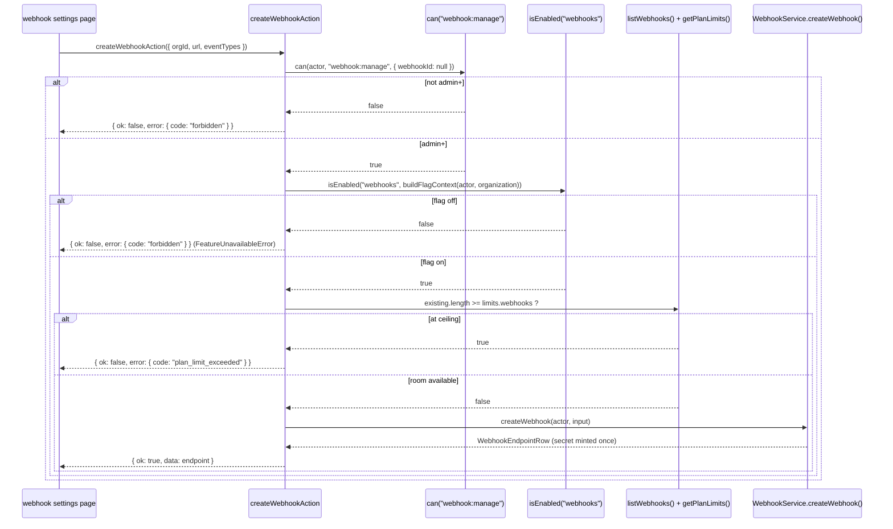

# Webhook and search actions

Three files, from two domains this document covers together because both are owned by the
same engineer and both are gated by feature flags in ways worth comparing side by side:
`src/actions/webhooks/create-webhook.ts`, `src/actions/webhooks/delete-webhook.ts`, and
`src/actions/search/search.ts`. Search and webhooks share almost nothing in their data model
— one indexes content, the other delivers events — but both actions independently ask
`isEnabled()` about a plan-gated flag, and comparing the two shows two different answers to
the same question: what should happen when a caller's request touches a capability the flag
says they don't have.

## `createWebhookAction`

- **File:** `src/actions/webhooks/create-webhook.ts`
- **Input schema:** `createWebhookSchema` (`src/schemas/webhook.ts`) — `CreateWebhookInput`
- **Returns:** `ActionResult<WebhookEndpointRow>`
- **Permission:** `webhook:manage` (minimum role admin; see DES-043)
- **Feature flag:** `webhooks` (plan >= growth, not overridable)
- **Rate limit bucket:** none
- **Plan limit:** `webhooks`
- **Events emitted:** none from this action directly — endpoint creation is not itself a
  `TaskflowEventMap` key
- **Cache tags revalidated:** `orgTag(input.orgId)`, `CACHE_PROFILES.hours`
- **Errors:** `validation_failed`, `forbidden`, `plan_limit_exceeded`, `internal_error`
- **Satisfies:** REQ-150, REQ-151, REQ-152, REQ-153
- **Design:** DES-159, DES-257

### Input fields

| field | type | required | notes |
|---|---|---|---|
| `orgId` | branded `OrgId` | yes | |
| `url` | URL, max 2000 chars | yes | |
| `eventTypes` | array of closed enum, 1-20 | yes | `webhookEventTypeSchema` — 9 values: `issue.created`, `issue.updated`, `issue.status_changed`, `issue.assigned`, `comment.created`, `member.joined`, `project.created`, `project.archived`, `billing.plan_changed` |

### Behaviour

DES-257: **two independent gates**, checked in this order — `webhook:manage` permission
first, then the `webhooks` feature flag via `isEnabled()`, then the numeric `webhooks` quota
via `getPlanLimits().webhooks` compared against `listWebhooks(actor, orgId).length`. The
doc comment states why both the flag and the quota are checked rather than just one: "an
override can force one without the other" — because `webhooks` is declared **not
overridable** in the flag registry (unlike `kanban_board` or `csv_export`), this particular
scenario cannot actually arise for this flag today, but the check exists because the pattern
generalizes to flags that *are* overridable, where a plan-derived flag being force-enabled
by an org-level override says nothing about whether the corresponding numeric quota was also
raised. The three checks run in sequence and each can independently produce a different
error: `forbidden` if the caller lacks `webhook:manage`, `forbidden` again (via
`FeatureUnavailableError`) if the flag evaluates off, or `plan_limit_exceeded` if the org
already has `limits.webhooks` endpoints registered.

DES-159 covers what happens after all three checks pass: **the secret is minted once and
never regenerated** — `createWebhook()` generates the HMAC signing secret at creation time,
and there is no rotation action anywhere in this corpus (no `rotateWebhookSecretAction`
exists under src/actions/webhooks/). If a secret is compromised, the only remediation
available through the action layer is deleting the endpoint and creating a new one, which
mints a fresh secret as a side effect of being a new row.

## `deleteWebhookAction`

- **File:** `src/actions/webhooks/delete-webhook.ts`
- **Input schema:** `deleteWebhookSchema` (`src/schemas/webhook.ts`) — `DeleteWebhookInput`
- **Returns:** `ActionResult<null>`
- **Permission:** `webhook:manage` (minimum role admin; see DES-043)
- **Feature flag:** none — deliberately not gated; see below
- **Rate limit bucket:** none
- **Plan limit:** none
- **Events emitted:** none from this action; `deleteWebhook()` also cascades the endpoint's
  delivery history in the same repository call (DES-214)
- **Cache tags revalidated:** `orgTag(input.orgId)`, `CACHE_PROFILES.hours`
- **Errors:** `validation_failed`, `forbidden`, `internal_error`
- **Satisfies:** REQ-150, REQ-151
- **Design:** DES-258

### Input fields

| field | type | required | notes |
|---|---|---|---|
| `orgId` | branded `OrgId` | yes | |
| `webhookId` | branded `WebhookId` | yes | |

### Behaviour

DES-258: **deliberately not flag-gated**, in direct contrast to `createWebhookAction`. The
source comment is explicit: "an org that loses the `webhooks` capability on a downgrade must
still be able to clean up the endpoints it already has." Because `webhooks` is plan-gated at
`growth` and above, an org that downgrades to `starter` retroactively loses the flag but not
its existing endpoints (webhook rows are not cascaded on a plan change — see
`actions-billing.md`'s note on the downgrade guard's incomplete resource coverage); if
deletion were also flag-gated, that org would have no self-service way to remove endpoints
it can no longer create new ones of, permanently orphaning them. This is one of two examples
in the corpus — the other is `updateNotificationPreferenceAction`'s asymmetric gating of
only the `digestOnly` field — of a mutation's create and cleanup paths being deliberately
gated differently rather than sharing one flag check.

## `searchAction`

- **File:** `src/actions/search/search.ts`
- **Input schema:** `searchQuerySchema` (`src/schemas/search.ts`) — `SearchQueryInput`
- **Returns:** `ActionResult<SearchHit[]>`
- **Permission:** `org:read` (minimum role viewer; see DES-043)
- **Feature flag:** `advanced_search` (plan >= enterprise, overridable) — narrows rather than
  blocks; see below
- **Rate limit bucket:** `search:query` (capacity 120, refill 60/min)
- **Plan limit:** none
- **Events emitted:** none
- **Cache tags revalidated:** none — search results are not cached through the tag system
- **Errors:** `validation_failed`, `forbidden`, `internal_error`
- **Satisfies:** REQ-170, REQ-175, REQ-181
- **Design:** DES-154, DES-256

### Input fields

| field | type | required | notes |
|---|---|---|---|
| `orgId` | branded `OrgId` | yes | |
| `q` | string, 1-200 | yes | |
| `kinds` | array of `"issue" \| "comment" \| "project"` | no, default `["issue"]` | narrowed server-side when `advanced_search` is off |
| `projectId` | branded `ProjectId` | no | scope to one project |
| `limit` / `cursor` | pagination | no | `pageRequestSchema` shape |

### Behaviour

`org:read` is the permission check — the lowest floor in the whole matrix, viewer rank —
which reflects DES-154: `search()` authorizes at `issue:read` regardless of what subject
kind matched (the *service* layer's check; the action's own pre-check is the coarser
`org:read`), because a viewer can always read issues in an org they belong to and search is
fundamentally a read operation, not a mutation with resource-specific escalations to worry
about. DES-256 is the flag interaction worth contrasting with `createWebhookAction`'s "block
outright" behavior: **`search` narrows requested kinds rather than rejecting the whole
query when `advanced_search` is off.** The action reads the org's flag context, and if
`advanced_search` evaluates `false`, it filters `input.kinds` down to only `["issue"]`
(silently dropping `"comment"` and `"project"` from whatever the caller requested) rather
than throwing `FeatureUnavailableError`. The comment in the source calls this "degrading
instead of erroring" — the command palette on a `free`-plan org still works for issue search,
it just quietly does not offer comment or project results, rather than the whole palette
breaking with a permission error the moment a user's query happens to be broad enough to
have requested all three kinds by default.

This is the same rate-limit-first-or-permission-first question `actions-comments.md` raises
for `createCommentAction`, resolved the opposite way here: `searchAction` does not charge
`search:query` inside the action file at all — the bucket in `src/lib/rate-limit.ts` is
declared and named, but `search.ts`'s own handler calls no `consumeRateLimit()` directly; the
throttling for search happens inside `search()` at the service layer instead (DES-155: rate
limiting runs before the flag check there, so a throttled caller never learns whether their
plan includes advanced search) — this action documents the bucket in its metadata because it
is the bucket this call path ultimately charges, even though the charging code itself lives
one layer down from the action file.

## Webhook creation sequence

## Search's silent degradation, compared directly

The table below makes the "block versus narrow" contrast between this file's three actions
concrete, since it is the single most instructive pattern this document covers:

| action | when the flag is off | caller-visible result |
|---|---|---|
| `createWebhookAction` | `webhooks` flag off | `forbidden` error, no endpoint created |
| `deleteWebhookAction` | n/a — not flag-gated at all | always succeeds if `webhook:manage` holds |
| `searchAction` | `advanced_search` flag off | succeeds, `kinds` silently narrowed to `["issue"]` |

Three different answers to "what should this endpoint do when a capability isn't
available," each justified by the specific consequence of getting it wrong: blocking
webhook creation outright is correct because a half-configured webhook endpoint serves no
purpose; never blocking webhook deletion is correct because cleanup must always be possible;
and silently narrowing search is correct because a hard failure on every search query would
make an entire product surface (the command palette) appear broken to any user on a
sub-enterprise plan, when in fact the vast majority of what they search for — issues — was
never gated in the first place.

## The `webhookId: null` resource shape

`createWebhookAction`'s `can()` call passes `webhookId: null`, not a placeholder branded id
the way issue and project creation use `PENDING_PROJECT_ID`. This is a small but deliberate
difference in how "no target row yet" is expressed across the corpus: the webhook
`PermissionResource` variant types `webhookId` as nullable rather than a required branded
string, so `null` is a valid, typed way to say "this check is about creating a new endpoint,
not managing an existing one," whereas the issue/project/comment/member resource shapes
require *some* string value even for a not-yet-existing row, which is why those call sites
reach for the empty-string placeholders instead. Both approaches produce the same practical
outcome — the ownership escalation, if any, cannot match a nonexistent row — but the webhook
shape is the more explicit of the two, since `null` reads unambiguously as "does not exist"
where an empty string cast to a branded id requires knowing the convention to interpret
correctly.

## Search result caching, or the lack of it

Unlike every other action documented in this directory, `searchAction` invalidates no cache
tags on completion, because it writes nothing — search is a pure read wrapped in
`withAction()` for its actor-resolution and error-translation machinery only, with `revalidate`
left empty in its `ActionOptions`. This means the "Cache tags revalidated: none" line for
this action is not an oversight to compare against other actions' more elaborate tag lists;
it reflects that search results themselves are also never cached at the Next.js data-cache
layer the way a Server Component's `fetch` might be — DES-158 (every write-time listener
re-reads the row rather than trusting the event payload) is the property that keeps the
search index itself fresh, and this action simply queries that already-fresh index on each
call rather than participating in the tag-based revalidation scheme the rest of this
directory relies on.

Related: REQ-154, REQ-155, REQ-156, REQ-157, REQ-158, REQ-160, REQ-161, REQ-171, REQ-172,
REQ-176, REQ-177, REQ-178, REQ-179, DES-155, DES-156, DES-157, DES-160, DES-161, DES-162,
DES-163, ADR-011, ADR-017, ADR-018.
