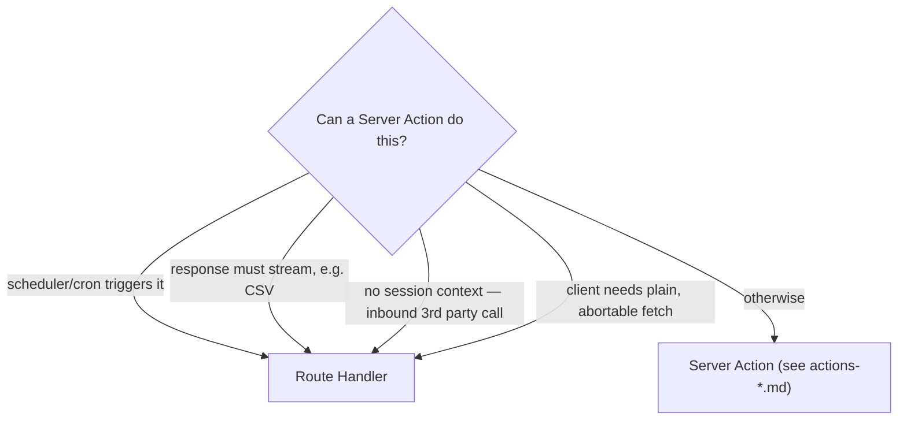

# Route Handlers

Twelve files under src/app/api/ (excluding the shared helper module,
`src/app/api/_lib/responses.ts`), across five subtrees: `auth/session`, `cron/*` (four
triggers), `export/*` (two CSV/JSON streams), `health`, `issues/[issueId]`,
`orgs/[orgId]/usage`, `search`, and `webhooks/*` (two routes). DES-007 states the rule these
routes all satisfy simply by existing: **Route Handlers exist only where a Server Action
structurally cannot reach** — a `"use server"` function cannot be a cron target, cannot
stream a CSV response, cannot receive a request with no session at all (an inbound webhook
callback from a third party), and cannot be fetched with a plain cancellable `fetch()` call
the way the command palette wants for its search-as-you-type behavior. Every route in this
directory exists for one of those four structural reasons, not as a stylistic alternative to
a Server Action.

## Shared machinery: `src/app/api/_lib/responses.ts`

Every route handler in this directory imports from this one file rather than reimplementing
error handling per route:

- **`errorResponse(error: unknown): Response`** — the route-handler equivalent of
  `toActionResult()`. It calls `toAppError()` (the exact same function `withAction()` uses)
  and wraps the result in `Response.json({ error: shape }, { status:
  HTTP_STATUS_BY_CODE[shape.code] })`. This is why an action and a route handler that fail
  for the same underlying reason — a `PermissionDeniedError`, a `ZodError` — produce
  byte-identical error bodies and status codes; see `actions-overview.md`'s error-mapping
  table for the full class-to-code-to-status list, which applies here without modification.
- **`failure(code, message): Response`** — for a failure the handler detects itself (a
  missing query parameter, a malformed id) rather than one caught from a thrown error. Every
  route in this directory uses at least one of `errorResponse` or `failure`, and most use
  both — `failure` for handler-local validation before the interesting work starts,
  `errorResponse` in the `catch` block around everything else.
- **`assertCronSecret(request)`** — throws `CronAuthError` (mapped to `unauthorized`) unless
  the request carries an `x-taskflow-cron` header matching `process.env.TASKFLOW_CRON_SECRET`.
  If the secret is not configured at all, the function throws rather than allowing the
  request through — the comment in the source states the reasoning plainly: "no secret
  configured means cron is disabled rather than wide open." This is the one authentication
  mechanism in the whole corpus that is not the session cookie; the four `cron/*` routes are
  the only routes that use it, since they are called by the platform scheduler, which has no
  cookie jar.

## Auth: `GET /api/auth/session`

- **File:** `src/app/api/auth/session/route.ts`
- **Method:** `GET`
- **Auth:** session cookie; returns 401 via `failure("unauthorized", ...)` if absent
- **Response (200):** `{ userId, email, activeOrgId, expiresAt }` — the `SessionPrincipal`
  fields, flattened; never the raw token
- **Response (401):** `{ error: { code: "unauthorized", message: "No active session." } }`
- **`dynamic = "force-dynamic"`**

Used by the client to re-check the session after a tab has been asleep — a plain `fetch`
this route serves that a Server Component's own session read cannot, since the client-side
check needs to run without a full page navigation. `getSessionPrincipal` is the same
function every Server Action's actor resolution ultimately calls into, so this route's
answer is always consistent with what an action attempted at the same moment would see.

## Cron triggers: `POST /api/cron/{digest,overdue,usage-rollup,webhook-delivery}`

| route | job | job function |
|---|---|---|
| `src/app/api/cron/digest/route.ts` | digest email | `runDigestEmailJob` |
| `src/app/api/cron/overdue/route.ts` | overdue issue sweep | `runOverdueIssueJob` |
| `src/app/api/cron/usage-rollup/route.ts` | usage rollup | `runUsageRollupJob` |
| `src/app/api/cron/webhook-delivery/route.ts` | webhook delivery drain | `runWebhookDeliveryJob` |

All four share one shape: `assertCronSecret(request)`, then `await run<X>Job(new Date())`,
then `Response.json(result)` — a `JobResult` (see `design/background-jobs.md`, DES-069).
None of the four does any work itself beyond the secret check and the call; the routes are
triggers, not the jobs. The digest route's own doc comment makes the idempotence property
explicit: "`runDigestEmailJob` decides which organizations are due based on their
`digestHourUtc`, so calling this every hour is correct and calling it twice in one hour is
harmless" — the same property applies to all four, at each job's own cadence from
`CADENCE_MINUTES` (digest-email 60, overdue-issues 60, webhook-delivery 1, usage-rollup 15).
All four routes set `dynamic = "force-dynamic"`, since a cached response to a cron trigger
would defeat the entire point of triggering it repeatedly.

## Export: `GET /api/export/activity`, `GET /api/export/issues`

Both export routes follow the same shape: read `orgSlug` from the query string (returning
`validation_failed` if absent), resolve the actor with `getActor(orgSlug)`, check a
permission, check a feature flag, parse the remaining query parameters with a Zod schema,
call the corresponding service's list function with a fixed `EXPORT_PAGE_LIMIT` of 100, and
either return JSON (`?format=json`) or a streamed CSV built with `toCsv()` from
`src/lib/csv.ts` and `csvResponseHeaders()`.

| route | permission | flag | schema | columns |
|---|---|---|---|---|
| `src/app/api/export/activity/route.ts` | `activity:export` (admin) | `csv_export` | `exportActivitySchema` | `occurredAt`, `action`, `actorId`, `subjectKind`, `subjectId`, `projectId`, `summary` |
| `src/app/api/export/issues/route.ts` | `issue:read` (viewer, with placeholder resource) | `csv_export` | `exportIssuesSchema` | `number`, `title`, `status`, `priority`, `assigneeId`, `authorId`, `dueAt`, `createdAt`, `updatedAt` |

The activity route's own comment explains why its permission floor is higher than reading
the feed in the UI would require: "`activity:export` sits above `activity:read` in
`ROLE_MATRIX` — reading the feed in the UI and walking off with the whole audit trail are
different privileges." The issues export route reuses `PENDING_ISSUE_ID` and
`PENDING_PROJECT_ID` from `src/actions/_lib/permission-resources.ts` for its `can()` call
— the one place outside src/actions/ that these action-layer placeholders are imported,
worth knowing if you ever consider moving that module and assume its only consumers are
Server Actions.

## Health: `GET /api/health`

- **File:** `src/app/api/health/route.ts`
- **Auth:** none — the only unauthenticated JSON route in the corpus
- **Response (200):** `{ status: "ok", service: "taskflow", checkedAt }`

The doc comment is a small design essay worth quoting directly: "deliberately touches
nothing — no database, no session, no service. A health check that queries the database
reports the database, not the app, and turns one slow query into a restart loop." No other
route handler in this corpus makes this trade-off — every other route does at least a
session or cron-secret check, and most touch the database. This route's entire purpose is to
answer "is the Node process alive and serving requests" and nothing more specific than that.

## Issue detail: `GET` / `PATCH /api/issues/[issueId]`

- **File:** `src/app/api/issues/[issueId]/route.ts`
- **Auth:** session, via `getActor(orgSlug)` from a required `orgSlug` query parameter
- **`GET` response (200):** the full `getIssue()` composed read model
- **`PATCH` response (200):** the updated `Issue`
- **`dynamic = "force-dynamic"`**

The file's own comment states the specific reason `assertOrgScope()` appears here explicitly
rather than being implicit in the actor resolution: "the route takes an `issueId` straight
off the URL, so `assertOrgScope()` against the fetched row is what stops one organization
reading another's issue by id." Both handlers await `context.params` (a Promise in Next.js
16, per ADR-001) to get `issueId`, then fetch the row, then assert scope, then check
permission (`issue:read` for `GET`, `issue:update` for `PATCH`) using the row's *real*
`authorId`/`assigneeId`/`projectId` — unlike several of the equivalent Server Actions, which
use `PENDING_PROJECT_ID` because they have not yet fetched the row at the point of the
check, this route always has the row in hand first. `PATCH` re-uses `updateIssueSchema`
directly, merging the request body with `orgId`/`issueId` taken from the resolved actor and
URL rather than trusting those two fields if the client happened to include them in the
body.

## Organization usage: `GET /api/orgs/[orgId]/usage`

- **File:** `src/app/api/orgs/[orgId]/usage/route.ts`
- **Auth:** session, via `requireActorFor(orgId)` from the URL path segment directly (no
  `orgSlug` query parameter — this route takes the id, not the slug)
- **Response (200):** `{ plan, limits, usage, checks }` — `checks` is one `checkLimit()`
  result per resource in `REPORTED` (`seats`, `projects`, `storageMb`, `webhooks`), each
  computed with a zero-cost dry-run (`checkLimit(orgId, resource, 0)`)
- **`dynamic = "force-dynamic"`**

The doc comment: "returns the raw counters *and* the plan ceilings side by side, so a
dashboard can render a meter without knowing the plan table itself" — this is the read path
`(marketing)/pricing/page.tsx` does not use (that page reads `PLAN_LIMITS` directly, per the
app manifest) but the authenticated billing dashboard does, letting the client render "8 of
10 seats used" without independently importing `@/config/plan-limits`.

## Search: `GET /api/search`

- **File:** `src/app/api/search/route.ts`
- **Auth:** session, via `getActor(orgSlug)` from a required `orgSlug` query parameter
- **Response (200):** `{ items, total }`
- **`dynamic = "force-dynamic"`**

The doc comment is explicit about why this route exists alongside `searchAction`: "the
palette hits this route rather than the Server Action because it fires on every keystroke
and wants a plain cancellable fetch" — a `fetch()` call can be aborted with an
`AbortController` mid-flight the way a Server Action invocation cannot easily be from client
code, which matters for a search-as-you-type UI that wants to cancel a stale request the
instant a newer keystroke supersedes it. The gating is "identical to `searchAction`,
deliberately duplicated so neither entry point can be the lenient one" — this route
independently checks `org:read`, reads `command_palette` (throwing `forbidden` if it is
off, unlike `searchAction`, which has no equivalent check at all since it is not the
palette's own entry point), and narrows `kinds` based on `advanced_search` the same way
`searchAction` does.

## Webhooks: `POST /api/webhooks/[endpointId]/test`, `POST /api/webhooks/inbound`

- **`src/app/api/webhooks/[endpointId]/test/route.ts`** — signs a synthetic test payload
  with the endpoint's real secret and returns `{ delivered, url, signature, payload }`
  without ever actually delivering it over the network; the point, per the doc comment, is
  to "prove the *signature* round-trips" so a customer can verify their own receiving code
  against a known-good pair. Gated on `webhook:manage`; the endpoint id is looked up through
  `listWebhooks(actor, actor.orgId)`, so an id belonging to another organization simply is
  not found (reported as `not_found`) rather than surfacing a tenant-scope error, since the
  list call itself is already org-scoped.
- **`src/app/api/webhooks/inbound/route.ts`** — the receiver for third-party callbacks,
  unauthenticated (no session exists for an external sender), rate-limited against
  `ANONYMOUS_ORG_ID` with the `webhook:inbound` bucket, validated with
  `inboundWebhookSchema`, and — this is the route's entire job — re-emitted onto the event
  bus as `webhook.delivery_requested` with `orgId: ANONYMOUS_ORG_ID`. The doc comment: "the
  receiver is deliberately dumb... anything that needs to happen as a result is a
  subscriber's job, so a slow handler cannot make the sender time out and retry." It returns
  HTTP 202, not 200 — accepted, not yet acted on — which is the one non-200 success status
  anywhere in this route-handler directory.

## Route Handlers versus Server Actions: which one wins

Every one of the twelve routes in this directory falls into exactly one of the four
left-hand branches above, and DES-027 documents the general shape of "Route Handler flows
that never touch a Server Action" this diagram summarizes. `src/app/api/issues/[issueId]/route.ts`
and `src/app/api/orgs/[orgId]/usage/route.ts` are the two routes that read data a Server
Component could just as easily read directly — they exist because an external or
non-dashboard client (a future mobile app, a partner integration) needs a stable JSON
contract independent of React rendering, not because a Server Action structurally could not
serve the same data.

Related: DES-020, DES-024, DES-025, DES-031, DES-070, ADR-003, ADR-014, ADR-019.
