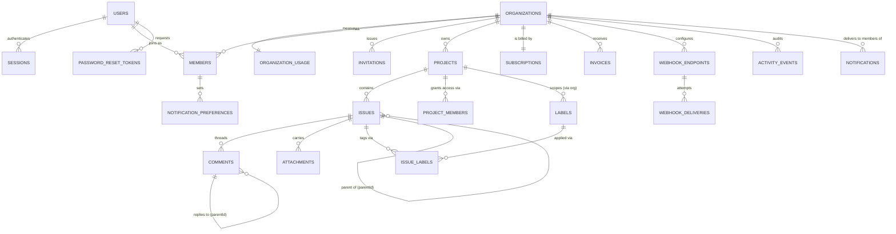

## Scope

This is the entry point to Taskflow's table-by-table data dictionary. It is a reference
document, not a tutorial: it describes exactly what the twenty-three Drizzle tables under
`src/server/db/schema/` say, not what an idealized schema might say. Each table's full
column list, indexes, invariants and consuming code live in one of nine domain files listed
below; `conventions.md` covers the cross-cutting rules — `org_id`, `archived_at`, branded
ids, timestamp representation, naming, and how migrations are generated and applied — that
would otherwise be repeated in every one of those files.

The database itself is a single SQLite file, opened through `better-sqlite3` and wrapped by
Drizzle ORM (`drizzle-orm/better-sqlite3`), per **ADR-002**. There is exactly one process,
one writer, one file — `src/server/db/client.ts`'s own comment is explicit that a second
`Database` instance should never be constructed, because the in-process event bus assumes a
single writer. That single-file, single-process shape is the frame every decision in this
corpus should be read against: there is no connection pool to tune, no replica lag to reason
about, and no cross-database transaction boundary anywhere in the product.

## Table inventory

Twenty-three tables, organized by the domain file that documents them. **Tenant** marks
whether the table carries `org_id` (per **ADR-006**); **soft-delete** marks whether it
carries `archived_at` (per **ADR-004**) as opposed to being hard-deleted or append-only.
"Row-count expectation" is a qualitative order-of-magnitude judgment derived from the table's
role and, where a table's growth is capped by a product quota, from `PLAN_LIMITS` in
`src/config/plan-limits.ts` — it is not a measured production number, since this is a
single-tenant-per-install demo corpus with no production deployment.

| Table | Domain file | Tenant-scoped | Soft-deleted | Row-count expectation |
|---|---|---|---|---|
| `users` | tables-organizations-and-users.md | no (global) | no | one row per registered person; grows slowly, never shrinks by product action |
| `sessions` | tables-organizations-and-users.md | no (global) | no | several rows per active user; churns constantly via `purgeExpiredSessions` |
| `password_reset_tokens` | tables-organizations-and-users.md | no (global) | no | small, short-lived; most rows are consumed or expired within hours |
| `organizations` | tables-organizations-and-users.md | is the tenant | yes | one row per tenant; the smallest table by row count, the most central by reference count |
| `organization_usage` | tables-organizations-and-users.md | yes (PK is `org_id`) | no | exactly one row per organization, recomputed in place |
| `members` | tables-members-and-invitations.md | yes | yes | bounded by `PLAN_LIMITS[plan].seats` (3 to unlimited) per org |
| `invitations` | tables-members-and-invitations.md | yes | no (revoked/accepted in place) | small per org; a pending-invitation working set, not a growing log |
| `projects` | tables-projects.md | yes | yes | bounded by `PLAN_LIMITS[plan].projects` (2 to unlimited) per org |
| `project_members` | tables-projects.md | yes | no | a join table, roughly `projects × members` in the worst case, sparse in practice |
| `issues` | tables-issues.md | yes | yes | bounded by `PLAN_LIMITS[plan].issuesPerProject` (100 to unlimited) per project |
| `labels` | tables-issues.md | yes | no | small, curated per org — tens, not thousands |
| `issue_labels` | tables-issues.md | yes | no | a join table; grows with `issues × average labels per issue` |
| `comments` | tables-comments-and-attachments.md | yes | yes | the highest-cardinality table in the schema in a well-used org — many comments per issue |
| `attachments` | tables-comments-and-attachments.md | yes | no (hard-deleted) | bounded indirectly by `PLAN_LIMITS[plan].storageMb` via `sumStorageBytes` |
| `notifications` | tables-notifications-and-activity.md | yes | no (read/unread, never archived) | fan-out multiplies issue/comment events by recipient count; pruned by retention, not by archiving |
| `notification_preferences` | tables-notifications-and-activity.md | yes | no | `members × notification kinds`, a fixed small multiple per org |
| `activity_events` | tables-notifications-and-activity.md | yes | no (append-only, pruned by `purgeActivityBefore`) | the single fastest-growing table under normal use; one row per mutating action |
| `subscriptions` | tables-billing.md | yes | no | exactly one live row per org in steady state |
| `invoices` | tables-billing.md | yes | no | one row per billing period per org; append-only |
| `webhook_endpoints` | tables-webhooks-search-and-infra.md | yes | no | bounded by `PLAN_LIMITS[plan].webhooks` (0 to unlimited) per org |
| `webhook_deliveries` | tables-webhooks-search-and-infra.md | yes | no | one row per endpoint per event, retried in place up to `WEBHOOK_MAX_ATTEMPTS` |
| `rate_limit_buckets` | tables-webhooks-search-and-infra.md | yes | no | one row per org+bucket-key pair; small, steady state |
| `search_index` | tables-webhooks-search-and-infra.md | yes | no | denormalized 1:1 (or close to it) with indexable issues, comments and projects |

`conventions.md` is not in this table because it documents rules, not a table.

## Entity relationships

The diagram deliberately omits `sessions`, `password_reset_tokens`, `rate_limit_buckets` and
`search_index` as edges into the core domain graph — they are infrastructure tables that
reference `users`/`organizations` by id but are not part of the product's conceptual entity
model, and drawing every foreign-key-shaped reference in this schema (there are no actual SQL
`REFERENCES` constraints — see `conventions.md`) would obscure the entities a reader of this
diagram actually needs.

Two relationships are worth calling out explicitly because they cross the tenant boundary
described in **DES-TENANT** in a way the diagram's arrows can't show. First, `users` is the
only table in the schema that is *not* tenant-scoped: a user account is global, and it is the
`members` row — not the `users` row — that ties a specific person to a specific organization
with a specific role. A user can be a member of several organizations simultaneously, each
with an independent `members` row, an independent role, and an independent `status`. Second,
every table below `organizations` in the diagram carries its own `org_id` column directly,
even where a hierarchy already implies it — an `issues` row has both `project_id` and `org_id`,
and a `comments` row has both `issue_id` and `org_id`. That redundancy is not an oversight; it
is **ADR-006**'s central decision, and `conventions.md` explains why.

Three self-referencing relationships deserve a note. `issues.parentId` supports one level of
subtask nesting (an issue can have a parent issue) but the schema does not enforce non-cyclic
structure — that invariant, where it is enforced at all, lives in `IssueService`, not in the
database. `comments.parentId` builds reply threads within a single issue's comment list,
walked by `listThread` in `comment-repository.ts`. Neither self-reference is declared as a
SQL foreign key; see `conventions.md` for why this schema has no `REFERENCES` clauses at all.

## How to use the rest of this dictionary

Each domain file (`tables-*.md`) follows the same shape for every table it documents: the
Drizzle export and its source file, whether it is tenant-scoped and soft-deletable, a full
column table with real SQL types read off the schema, the table's actual indexes (never an
invented one), a list of invariants tied to the requirement and design documents that specify
them, the repository functions that read and write the table, and closing prose about the
modelling trade-offs. Read `conventions.md` first — it establishes vocabulary (what
"tenant-scoped" and "soft-deleted" mean precisely, how branded ids map to the `TEXT` columns
every table actually uses) that the domain files assume rather than re-explain.

## Repository layer as the only way in

No code outside `src/server/repositories/` issues a Drizzle query against any table in this
dictionary — every one of the twenty-three tables is read and written exclusively through a
named repository function, listed in each table's "Read and write paths" section. This is not
merely a convention worth mentioning in passing; it is the seam **ADR-013**'s service-layer
boundary depends on. A service (`IssueService`, `MemberService`, `BillingService`, and so on)
calls a repository function with an already-authorized `Actor` in hand; the repository itself
never calls `can()` or `assertCan()`, and — per **ADR-006** — it is the repository, not the
service, that is expected to apply the `org_id` filter on every query. Reading this dictionary
alongside `src/server/repositories/` therefore answers two different questions at once: what
shape does a table have (this dictionary), and what operations does the rest of the codebase
actually perform against it (the "Read and write paths" section, cross-referenced against the
repository file itself for the exact query each function runs).

Two small repository-layer files recur across nearly every domain file without being tables
themselves: `_mappers.ts`, which is expected to convert a raw Drizzle row (snake_case columns,
plain `TEXT`/`INTEGER` values) into the camelCase, branded-id-typed domain object a service
consumes, and `_paging.ts`, the shared keyset-cursor plumbing every `list*` function built on
top of `sliceToPage()` (`src/lib/pagination.ts`) and a table-specific `keysetPredicate`
delegates to. Neither file owns a table of its own, so neither appears as a "Read and write
paths" entry anywhere in this dictionary, but both are worth knowing about when tracing how a
repository function turns a database row into what a service actually receives.

## What this dictionary deliberately does not cover

This is a schema reference, not a query-performance guide or a requirements corpus. It states
what indexes exist and, in each table's "why it exists" column, what query pattern that index
serves — it does not benchmark those queries, propose new indexes, or evaluate whether the
existing set is sufficient at scale beyond the qualitative row-count expectations in the table
above. Requirements (`REQ-###`) and design decisions (`DES-###`, `ADR-###`) are referenced by
id throughout, because every fact in this dictionary that isn't visible in the schema file
itself — a plan quota's exact numbers, a rate-limit window, an authorization rule — is
governed by one of those documents rather than by the database, and this dictionary points at
them instead of re-deriving or restating their content. A reader who wants the reasoning
behind a decision (why `org_id` is denormalized, why soft delete over hard delete, why keyset
pagination) should follow the cited ADR; a reader who wants the product behavior a table's
data supports (what a role may do, what a quota's number actually is this quarter) should
follow the cited REQ. This dictionary's job is narrower and more mechanical than either: given
a table name, say exactly what columns, types, indexes, and consuming code exist for it today.
