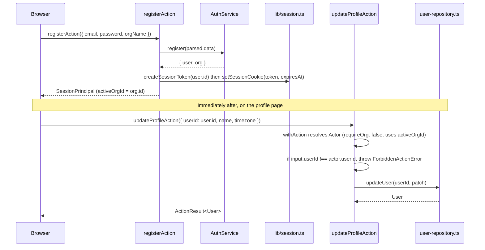

## Purpose

This document covers eight action files across four directories: src/actions/auth/
(`login.ts`, `logout.ts`, `register.ts`, `reset-password.ts`), `src/actions/profile/update-profile.ts`,
`src/actions/search/search.ts`, and src/actions/webhooks/ (`create-webhook.ts`,
`delete-webhook.ts`). These are grouped together as the actions that sit at, or just past,
the edges of the ordinary `withAction()` pattern: four of the auth actions run before any
session exists at all; `update-profile.ts` is the corpus's clearest documented layering
exception; `search.ts` degrades rather than rejects when a flag is off; and the two
webhook actions illustrate two independently-checked gates covering the same feature.

## Public surface

| function | signature | withAction? | notes |
|---|---|---|---|
| `loginAction` | `(raw) => Promise<ActionResult<SessionPrincipal>>` | no | rate limited against `ANONYMOUS_ORG_ID` |
| `logoutAction` | `() => Promise<ActionResult<null>>` | no | idempotent |
| `registerAction` | `(raw) => Promise<ActionResult<SessionPrincipal>>` | no | user + org + owner membership in one service call |
| `requestPasswordResetAction` / `confirmPasswordResetAction` | `(raw) => Promise<ActionResult<null>>` | no | rate limited, enumeration-safe |
| `updateProfileAction` | `(raw) => Promise<ActionResult<User>>` | yes (`requireOrg: false`) | calls the repository directly |
| `searchAction` | `(raw) => Promise<ActionResult<SearchHit[]>>` | yes | narrows `kinds` rather than rejecting |
| `createWebhookAction` | `(raw) => Promise<ActionResult<WebhookEndpointRow>>` | yes | flag gate + quota gate, independently |
| `deleteWebhookAction` | `(raw) => Promise<ActionResult<null>>` | yes | not flag-gated, deliberately |

### DES-252 — Login and password reset run before any tenant is known, and both charge the anonymous bucket

- **Satisfies:** REQ-200, REQ-202, REQ-208
- **Decided in:** ADR-001, ADR-011, ADR-020
- **Code:** `src/actions/auth/login.ts`, `reset-password.ts`

`loginAction`'s own comment states the structural reason it cannot use `withAction()`:
"runs before any tenant is known, so it cannot go through `withAction()` — there is no
`Actor` to resolve yet. The rate limit is charged against the anonymous bucket to blunt
credential stuffing." Both `loginAction` and the two password-reset actions call
`consumeRateLimit(ANONYMOUS_ORG_ID, bucketKey)` (DES-225,
`action-wrapper-and-errors.md`) — `"auth:login"` for login (not one of the six named
buckets in `RATE_LIMIT_BUCKETS`, so it falls through to the `DEFAULT_BUCKET` shape of
30 capacity / 10 refill-per-minute) and `"auth:password-reset"` (the named bucket, 5
capacity / 1 refill-per-minute — deliberately the tightest bucket in the whole table) for
the reset flows. Because `ANONYMOUS_ORG_ID` is the same empty-string value for every
unauthenticated caller, these buckets are effectively shared across the entire
deployment rather than per-organization, which is precisely the point: credential
stuffing and reset-spam attempts do not carry a known `orgId` to scope a bucket by, so the
anonymous bucket has to absorb load from every attacker and every legitimate
not-yet-authenticated user alike. `reset-password.ts`'s own comment adds a second,
independent design decision: "the request half deliberately reports success even for an
unknown address so the form cannot be used to enumerate accounts; the rate limit is what
stops it being abused as a mail cannon." `requestPasswordResetAction` returns `{ ok: true,
data: null }` regardless of whether `parsed.data.email` matches a real user — the only
signal available to an attacker is timing and the rate-limit response itself, not the
success/failure shape of the result.

### DES-253 — `register` performs three writes as one service call; the action only turns the result into a session

- **Satisfies:** REQ-003, REQ-014, REQ-209
- **Decided in:** ADR-001
- **Code:** `src/actions/auth/register.ts`

The file's own comment states the division of labor plainly: "`AuthService.register`
performs all three writes in one transaction; this action only turns the result into a
session." `registerAction` calls `register(parsed.data)`, receiving back `{ user, org }`,
then calls `createSessionToken(user.id)` and `setSessionCookie(token, expiresAt)` before
hand-assembling a `SessionPrincipal` object directly in the action (rather than calling
`resolveSession(token)` the way `loginAction` does) — `activeOrgId: org.id` is set
immediately to the organization `register` just created, since a freshly registered user
has exactly one organization and there is no ambiguity about which one should be active.
This is the one auth action that constructs a `SessionPrincipal` by hand rather than
reading one back from a repository call, which is a small but real asymmetry with
`loginAction`'s flow: `loginAction` trusts `resolveSession(token)` to re-derive the
principal from the session it just created, while `registerAction` trusts its own local
knowledge of what was just returned. Both converge on setting the same cookie via
`setSessionCookie`, the one function `src/lib/session.ts` exposes for writing the session
cookie at all — REQ-206's "only one module reads or writes the session cookie" holds
across this entire document because every action here that touches the cookie does so
through that same function, never by importing `cookies()` from `next/headers` directly.

### DES-254 — `logout` treats "already signed out" as success, not as an error condition

- **Satisfies:** REQ-207
- **Decided in:** ADR-020
- **Code:** `src/actions/auth/logout.ts`

The file's own comment frames the whole function around one property: "idempotent: signing
out twice, or without a session at all, is a success — the postcondition ('no session
cookie') holds either way." `logoutAction`'s body is four lines: read the token via
`getSessionToken()`; if one exists, call `destroySession(token)` (which revokes the
underlying `sessions` row via `revokeSession`, a hard delete per DES-216/DES-217); then
unconditionally call `clearSessionCookie()` regardless of whether a token was found at all;
return success. There is no branch anywhere in this function that returns a failure
`ActionResult` for the "no session" case — calling `logoutAction` with no cookie present at
all produces exactly the same successful result as calling it with a valid session, which
is the correct behavior for an action whose entire contract is a postcondition rather than
an operation that can meaningfully fail.

### DES-255 — `update-profile` is the action layer's one documented bypass of the service layer entirely

- **Satisfies:** REQ-200
- **Decided in:** ADR-013
- **Code:** `src/actions/profile/update-profile.ts`

This is the exception the common brief specifically calls out by file path, and it is
worth stating precisely what the bypass does and does not include. `updateProfileAction`
still runs through `withAction()` — it still validates with `updateProfileSchema`, still
resolves an `Actor` (with `requireOrg: false`, so the session's `activeOrgId` is used since
the profile payload carries no `orgId` field of its own), still returns errors through the
same `toActionResult` machinery every other action uses. What it skips is the service
layer specifically: its handler calls `updateUser(input.userId, input)` from
`src/server/repositories/user-repository.ts` directly, with no `ProfileService` or
`UserService` in between. The file's own comment gives the justification in full: "the
profile is a *user* record rather than a tenant row, so the payload carries no `orgId` and
the wrapper falls back to the session's active organization... There is no permission to
check — the only rule is that the payload's `userId` is the caller's own... The profile is
the one write with no service in front of it: there is no tenant rule, no event and no
quota to apply, so the action talks to `UserRepository` directly rather than inventing a
pass-through service." The one authorization-shaped check this action does perform is a
hand-written equality comparison, not a `can()` call at all: `if (input.userId !==
actor.userId) throw new ForbiddenActionError("member:update_role")` — reusing
`"member:update_role"` as the `PermissionAction` label on the thrown error even though this
check has nothing to do with member roles, which is a minor labeling inconsistency worth
noting for anyone building client-side error messaging keyed off that field.

### DES-256 — `search` narrows requested kinds rather than rejecting the whole query when `advanced_search` is off

- **Satisfies:** REQ-170, REQ-175, REQ-181
- **Decided in:** ADR-012, ADR-017
- **Code:** `src/actions/search/search.ts`

The file's own comment states the product decision behind this behavior: "searching across
comments as well as issues is an `advanced_search` capability; when the flag is off the
requested kinds are narrowed rather than rejected, so the palette degrades instead of
erroring." After confirming `org:read` permission — the lowest-rank check in the whole
`ROLE_MATRIX` (`viewer`), satisfying REQ-181's "search requires read permission on issues"
— the handler computes `kinds = isEnabled("advanced_search", context) ? input.kinds :
input.kinds.filter(kind => kind === "issue")`. A command-palette query that requested
`["issue", "comment", "project"]` on a plan below `enterprise` (the `advanced_search`
gate) silently becomes `["issue"]` before ever reaching `search()`. This is deliberately
different from every flag check documented elsewhere in this design set — `move-issue.ts`
(DES-230) and `create-webhook.ts` (DES-257 below) both throw `FeatureUnavailableError` when
their gated flag is off, while this action instead produces a smaller, still-successful
result. The rationale is UX-shaped rather than security-shaped: a command palette that
threw an error every time a user typed a query on a non-enterprise plan would be
unusable, whereas quietly returning issue-only results degrades gracefully.

### DES-257 — `create-webhook` checks a plan-derived flag and a numeric quota independently, because an override can force one without the other

- **Satisfies:** REQ-150, REQ-152, REQ-161
- **Decided in:** ADR-012, ADR-018
- **Code:** `src/actions/webhooks/create-webhook.ts`

The file's own comment names the reason two separate checks exist rather than one: "two
independent gates: the `webhooks` feature flag (which is itself plan-derived) and the
numeric `webhooks` quota. Both are checked because a flag can be force-enabled through an
org override while the quota still applies." `webhooks` as a flag is defined as `plan >=
growth`, `NOT overridable` — so in the corpus's current flag registry this particular flag
cannot actually be force-enabled by an org override at all, which makes the comment's
stated concern slightly broader than what the current registry permits; it reads as
defensive design intended to hold even if `webhooks`' `overridable` setting were changed in
the future, not as a response to a scenario reachable with today's registry. Regardless of
that nuance, the handler's actual sequence is: `can(actor, "webhook:manage", {...})`, then
`isEnabled("webhooks", context)` throwing `FeatureUnavailableError` if false, then a
separate `getPlanLimits(organization.plan)` and `listWebhooks(actor, input.orgId)` call
whose length is compared against `limits.webhooks`, throwing `PlanLimitError` if already at
capacity — three independent gates in total (permission, flag, quota), each with its own
distinct thrown error type, checked in that fixed order.

### DES-258 — `delete-webhook` is deliberately not flag-gated, so a downgraded org can still clean up

- **Satisfies:** REQ-150
- **Decided in:** ADR-018
- **Code:** `src/actions/webhooks/delete-webhook.ts`

The file's own comment draws the contrast with `create-webhook.ts` directly: "unlike
creation this is not flag-gated — an org that loses the `webhooks` capability on a
downgrade must still be able to clean up the endpoints it already has." An organization
that drops from `growth` to `starter` loses the `webhooks` flag (`plan >= growth`), which
means `createWebhookAction` would refuse any new endpoint — but `deleteWebhookAction` only
checks `webhook:manage` permission, never `isEnabled("webhooks", ...)`, so the same
downgraded organization can still remove endpoints it created while on a higher plan. This
is a small but deliberate asymmetry between the two webhook actions worth stating
explicitly: the flag gates *creation* of new capability usage, not *possession* of
capability a plan change has since revoked, which is the general shape every quota and
flag check in the billing-adjacent parts of this corpus follows — a downgrade constrains
what can be added going forward, it does not strand an organization unable to manage what
it already has.

### DES-259 — `AuthService` cannot emit domain events, because `TaskflowEventMap` defines none for auth

- **Satisfies:** REQ-200, REQ-210
- **Decided in:** ADR-005
- **Code:** `src/server/services/auth-service.ts`; `src/types/event.ts`

This is the second of the two named layering exceptions the common brief calls out
explicitly, and it belongs in this document because every action in this file's scope —
`login.ts`, `logout.ts`, `register.ts`, `reset-password.ts` — ultimately calls into
`AuthService`. `TaskflowEventMap`'s twenty-one keys span project, issue, comment, member,
billing, flag, digest, search and webhook events — there is no `auth.login`,
`auth.registered`, or equivalent key in the map at all. The brief's own note on this states
that `AuthService` "declares it must call `emit` but cannot," which — read against the
event bus's design (ADR-005's typed, closed `TaskflowEventMap`) — means this is not a bug
so much as a currently-unfilled seam: the event bus's type signature would need a new key
added to `TaskflowEventMap` before `AuthService` could participate in it at all, and until
that happens, nothing in the notification, activity, or search-index subsystems can react
to a login, logout or registration as a first-class domain event. Concretely, this means
REQ-220's "every domain event is recorded as an activity row" has a structural blind spot
for authentication events specifically — a login is never written to
`activity_events` through the normal event-driven path this design set otherwise documents
comprehensively for every other action, because there is no event to subscribe to in the
first place.

## Invariants

- Every action in this document that touches the session cookie does so exclusively
  through `src/lib/session.ts`'s `setSessionCookie`/`clearSessionCookie`/`getSessionToken`,
  never through `next/headers`'s `cookies()` directly.
- `requestPasswordResetAction` returns a successful `ActionResult` regardless of whether
  the submitted email matches a real account.
- `updateProfileAction` is the only action in the entire src/actions/ tree that imports
  from src/server/repositories/ rather than src/server/services/.
- `searchAction` never throws `FeatureUnavailableError`; a disabled `advanced_search` flag
  always narrows results rather than rejecting the request.
- `createWebhookAction` checks permission, flag and quota, in that order, each with its
  own distinct error type; `deleteWebhookAction` checks only permission.

## Test coverage

`tests/services/comment-service.test.ts` and other service tests do not cover
`AuthService`; there is no tests/services/auth-service.test.ts in the corpus, so the
login/register/reset flows are exercised only indirectly — `tests/lib/hash.test.ts` covers
the password-hashing and token-hashing primitives `AuthService` depends on, and
`tests/schemas/auth.schema.test.ts` covers `loginSchema`, `registerSchema` and the two
password-reset schemas at the validation layer. `tests/services/search-service.test.ts`
covers `search()`'s kind-narrowing behavior and the flag-context construction
`searchAction` depends on. `tests/lib/rate-limit.test.ts` covers the `auth:password-reset`
bucket and the default-bucket fallback `"auth:login"` resolves to. `tests/server/permissions.test.ts`
covers the `org:read` and `webhook:manage` checks these actions perform.
`tests/config/plan-limits.test.ts` and `tests/lib/feature-flags.test.ts` cover the
`webhooks` flag's plan gate and non-overridable setting that `create-webhook.ts` and
`delete-webhook.ts` both reason about.

## Sequence: registering, then immediately hitting the profile-update layering exception

The diagram shows both documented exceptions from the two directories this file covers in
one flow: `registerAction` never emits a domain event (DES-259) at any point in the
sequence, and `updateProfileAction` reaches `user-repository.ts` without any
`ProfileService` in between (DES-255).
