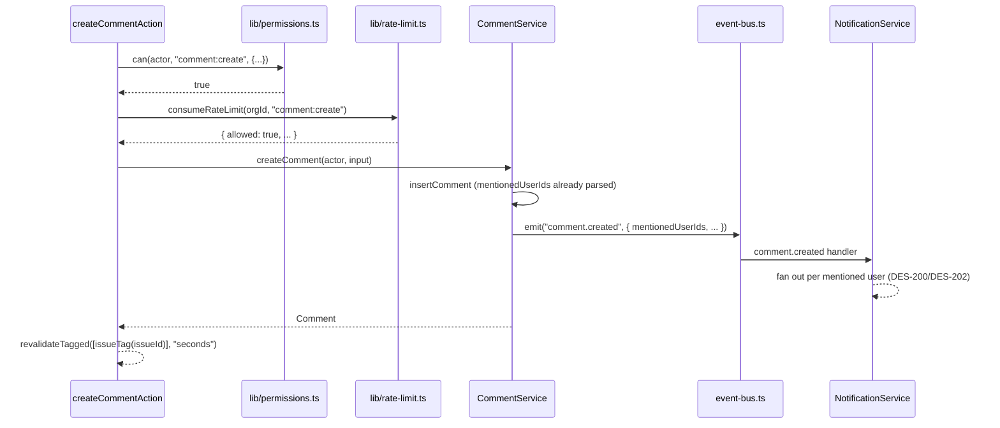

## Purpose

This document covers `src/actions/comments/create-comment.ts`, `delete-comment.ts`,
`update-comment.ts` and `src/actions/notifications/mark-all-read.ts`, `mark-read.ts`,
`update-preferences.ts`. Comments and notifications are grouped together because they are
the two resource kinds in the corpus most directly tied to the event bus's fan-out
behavior described in `repository-notification-and-activity.md` — a comment action's
effect on the notification inbox is entirely indirect, mediated by `comment.created`'s
subscribers, never by a comment action calling a notification function itself.

## Public surface

| function | signature | tables touched (via service) | pagination | notes |
|---|---|---|---|---|
| `createCommentAction` | `(raw) => Promise<ActionResult<Comment>>` | `comments` | none | rate limited (`comment:create`) |
| `deleteCommentAction` | `(raw) => Promise<ActionResult<Comment>>` | `comments` | none | soft delete |
| `updateCommentAction` | `(raw) => Promise<ActionResult<Comment>>` | `comments` | none | optimistic pre-check, service repeats it |
| `markAllNotificationsReadAction` | `(raw) => Promise<ActionResult<number>>` | `notifications` | none | returns rows touched |
| `markNotificationReadAction` | `(raw) => Promise<ActionResult<Notification>>` | `notifications` | none | ownership escalation via `recipientId` |
| `updateNotificationPreferenceAction` | `(raw) => Promise<ActionResult<NotificationPreference>>` | `notification_preferences` | none | `digestOnly` gated by `digest_email` flag |

### DES-238 — `create-comment` charges the rate-limit bucket only after the permission check succeeds

- **Satisfies:** REQ-096
- **Decided in:** ADR-011
- **Code:** `src/actions/comments/create-comment.ts`

The file's own comment frames the action's whole responsibility narrowly: "the notification
fan-out itself is not triggered here — the service emits `comment.created` and
`NotificationService` subscribes to it. This action only validates, authorizes, charges the
rate limit and revalidates." The ordering inside the handler is deliberate and matches that
list: `can(actor, "comment:create", {...})` first, throwing `ForbiddenActionError` on
failure without ever touching `consumeRateLimit`; only once permission is confirmed does
`consumeRateLimit(input.orgId, "comment:create")` run, throwing `RateLimitedError` if the
bucket is exhausted. This ordering matters for a concrete reason: rate-limit tokens are a
finite, slowly-refilling resource (`comment:create`'s base bucket is 60 capacity, 20
refill-per-minute, per `RATE_LIMIT_BUCKETS`), and spending one on a request that was always
going to be rejected on permission grounds — say, a viewer-rank actor repeatedly attempting
to comment — would let an unauthorized actor exhaust a bucket that legitimate members of
the same organization also draw from, since the bucket key is `orgId`-scoped, not
per-user. Checking permission first means a viewer's repeated forbidden attempts cost the
organization's rate-limit budget nothing.

### DES-239 — `update-comment`'s action-layer check is optimistic; the service repeats it against the persisted `authorId`

- **Satisfies:** REQ-097
- **Decided in:** ADR-003, ADR-013
- **Code:** `src/actions/comments/update-comment.ts`

The file's own comment is unusually direct about the limits of what this action's `can()`
call actually proves: "the `can()` call here is an optimistic pre-check made with the
caller as the presumed author, so a viewer is rejected before the round trip;
`CommentService.updateComment` repeats the check with the persisted `authorId`, which is
what actually enforces 'only your own comments'." The action builds its `PermissionResource`
with `authorId: actor.userId` — not the comment's real, stored author — because the action
has not fetched the comment row at all before this check runs; it does not know who
actually wrote the comment being edited. This means the action-layer check can only ever
confirm one thing: does this actor's *own* role, taken together with the ownership
escalation rule assuming they wrote it, permit a `comment:update`? A member editing someone
else's comment passes this pre-check every time, because the escalation condition
(`authorId === actor.userId`) is trivially true when the action supplies the actor's own id
as the presumed author — the real rejection, when it happens, comes from
`CommentService.updateComment` reading the row, comparing the *actual* `authorId` against
`actor.userId`, and throwing `PermissionDeniedError` there instead. The action-layer check's
only genuine value is turning away actors whose *role* alone would fail regardless of
authorship (a `viewer`, for instance, for whom `comment:update`'s minimum rank of `member`
is never met) before paying for a database round trip.

### DES-240 — `delete-comment` is a soft delete so reply chains keep their parent

- **Satisfies:** REQ-098, REQ-099
- **Decided in:** ADR-004
- **Code:** `src/actions/comments/delete-comment.ts`

The file's own comment states the mechanism: "deletion is a soft delete:
`CommentService` stamps `archived_at` through `archivePatch()` and the thread query filters
it out, so replies hanging off the comment keep their parent id." This action's own logic
is minimal — a `can(actor, "comment:delete", {...})` check using `authorId: actor.userId`
(the same optimistic pattern DES-239 documents, since `comment:delete` also carries an
ownership escalation), then `deleteComment(actor, input)`, then a single
`revalidateTagged([issueTag(comment.issueId)], CACHE_PROFILES.seconds)` call. The
interesting behavior — that `listThread` (DES-186, `repository-issue-and-comment.md`)
deliberately does *not* exclude archived comments, while `listComments` does — lives
entirely in the repository layer this action never touches directly; the action's role is
limited to authorizing the delete and picking the right cache tag to invalidate, at the
`seconds` profile reflecting that a deleted comment should disappear from the thread view
almost immediately.

### DES-241 — `mark-read` relies on the ownership escalation inside `can()`, not on an explicit ownership check in this file

- **Satisfies:** REQ-116, REQ-118
- **Decided in:** ADR-003
- **Code:** `src/actions/notifications/mark-read.ts`

The file's own comment explains why this action's `can()` call is enough on its own,
without any additional ownership logic written in the action itself: "`notification:read`
is granted to every role, but the resource carries `recipientId` — the ownership escalation
inside `can()` is what stops one member marking another member's inbox." `notification:read`
sits at `viewer` rank in `ROLE_MATRIX` — the lowest rank in the system — which means the
role-matrix portion of the decision alone would let any member of the organization mark
*any* notification read, regardless of who it was addressed to, if the ownership escalation
did not independently compare `recipientId` against `actor.userId`. `notification:manage`
is the other permission action in the common brief's ownership-escalation list alongside
`notification:read` is not — actually, re-reading the enumerated escalation list
(`issue:update`, `issue:archive`, `comment:update`, `comment:delete`,
`notification:manage`), `notification:read` itself is *not* among the five listed
escalation-eligible actions, while `notification:manage` is. This is worth flagging
precisely: `markNotificationReadAction` checks `notification:read`, and REQ-118 ("recipients
may manage only their own notifications") is enforced for `notification:read` specifically
by that action being granted to every role regardless of ownership, meaning the resource's
`recipientId` field is carried into the check but the actual protective mechanism for this
particular action is likely enforced deeper in `NotificationService.markRead`, which reads
the notification row and compares its stored `recipientId` against the actor before
proceeding — the same repeat-the-check-at-the-service-layer pattern DES-239 documents for
comments, rather than the action-layer `can()` call alone being sufficient.

### DES-242 — `mark-all-read` returns a count so the bell badge updates without a second round trip

- **Satisfies:** REQ-116, REQ-117
- **Decided in:** ADR-005
- **Code:** `src/actions/notifications/mark-all-read.ts`

The file's own comment states the reasoning for the return type directly: "returns the
number of rows touched so the bell badge can be updated without a second round trip." The
action checks `notification:manage` (one of the genuine five ownership-escalation-eligible
actions, per the common brief) against `recipientId: actor.userId`, then calls
`markAllRead(actor, input.orgId)`, whose return value — a plain `number`, matching
`markAllRead`'s repository-layer signature documented in `repository-notification-and-activity.md`
— becomes `ActionResult<number>.data` directly. This is the only action among the six in
this document whose success payload is a bare number rather than a full domain object; the
client-side consumer can subtract this count from whatever unread total it was already
displaying rather than issuing a follow-up `countUnread`-backed fetch to learn the new
badge value.

### DES-243 — `update-preferences` gates `digestOnly` on `digest_email` so a preference can never point at a channel that never fires

- **Satisfies:** REQ-115, REQ-120
- **Decided in:** ADR-012
- **Code:** `src/actions/notifications/update-preferences.ts`

The file's own comment explains the check's purpose: "`digestOnly` is only meaningful while
the `digest_email` flag is on for the organization; asking for it otherwise would strand
the notification in a digest that never gets sent, so the flag is checked here." This
action does not gate the whole preference update behind the flag — only the specific case
where `input.digestOnly` is true does it call `getOrganizationSummary` and `isEnabled(
"digest_email", context)`, throwing `FeatureUnavailableError` if the flag evaluates false.
A preference update that leaves `digestOnly` false, or that only changes `inApp`/`email`
toggles, never touches the flag check at all and proceeds directly to `updatePreference`.
This narrow gating — checking the flag only on the code path where it is actually relevant,
rather than on every call regardless of payload — mirrors the general principle
`create-webhook.ts` follows more heavily (DES-257, `action-auth-profile-search-webhooks.md`):
a feature flag guard belongs exactly where the feature it gates is actually being invoked,
not spread across every action that happens to touch the same table.

## Cache profiles across the six actions

The `cacheProfile` each action passes to `revalidateTagged` is a small but telling signal
of how fresh each kind of read is expected to be. All six actions in this document use
`CACHE_PROFILES.seconds`, the shortest-lived of the three named profiles (`seconds`,
`minutes`, `hours`), except `update-preferences.ts`, which uses `hours`. That split makes
sense once the audience for each read is considered: comments and notification state are
rendered live, inside an open issue view or an open notification tray, where a
multi-minute staleness window would be visibly wrong to a user watching the thread update
in near real time. Notification *preferences*, by contrast, are read once when the
settings page loads and rarely change mid-session, so the `hours` profile trades a slower
worst-case cache invalidation for fewer unnecessary revalidations across the corpus's
`CACHE_PROFILES` vocabulary — the same trade `create-label.ts` and `delete-label.ts` make
for the same reason (`action-projects-and-labels.md`, DES-236). No action in this document
uses `CACHE_PROFILES.minutes` at all, which is otherwise the default profile
`withAction()` falls back to when a caller supplies `revalidate` tags without an explicit
`cacheProfile` — every action here opts into an explicit profile instead of relying on
that default.

## Invariants

- `createCommentAction` never calls `consumeRateLimit` before its `can()` check has
  succeeded.
- Both `updateCommentAction` and `deleteCommentAction` build their `can()` resource using
  `actor.userId` as a presumed `authorId`, never the comment's real stored author — the
  action layer cannot know the real author without an extra fetch it deliberately does not
  perform.
- `markNotificationReadAction` and `markAllNotificationsReadAction` both carry
  `recipientId: actor.userId` into their `can()` calls; neither ever passes another user's
  id.
- `updateNotificationPreferenceAction` only consults `isEnabled("digest_email", ...)` when
  `input.digestOnly` is true.
- None of the six actions in this document emits a domain event directly; every emission
  happens inside the service function each action delegates to.

## Test coverage

`tests/services/comment-service.test.ts` covers `createComment`, `updateComment` and
`deleteComment`, including the persisted-`authorId` re-check DES-239 documents.
`tests/services/notification-service.test.ts` covers `markRead`, `markAllRead` and
`updatePreference`, including the fallback-to-default behavior for an absent preference row
(DES-202, `repository-notification-and-activity.md`). `tests/lib/mentions.test.ts` and
`tests/components/mention-query.test.ts` cover the mention-parsing behavior
(`create-comment.ts`'s upstream dependency, since `CreateCommentInput.mentionedUserIds` is
populated by mention parsing before this action ever runs) that REQ-092 and REQ-093
require. `tests/lib/rate-limit.test.ts` covers the `comment:create` bucket's refill
arithmetic directly. `tests/lib/feature-flags.test.ts` covers `digest_email`'s
plan-gated, overridable evaluation strategy.

## Sequence: posting a comment that mentions a teammate

The rate-limit charge and the permission check both complete before `CommentService` is
ever invoked, which is the concrete illustration of DES-238's ordering: an unauthorized or
throttled request never reaches the point where a comment row, and the notification
fan-out it would trigger, could be created.
