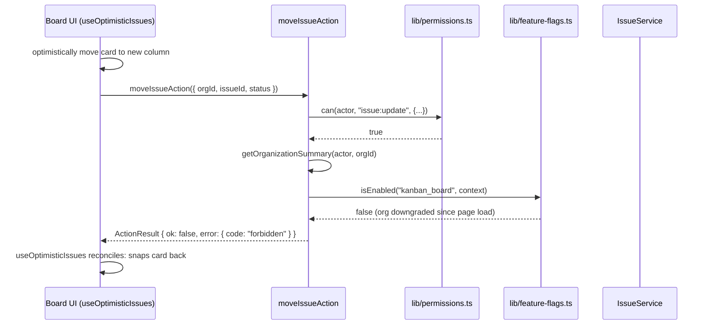

## Purpose

This document covers the six action files in src/actions/issues/: `archive-issue.ts`,
`assign-issue.ts`, `change-issue-status.ts`, `create-issue.ts`, `move-issue.ts` and
`update-issue.ts`. Every one is built on `withAction()` (see `action-wrapper-and-errors.md`
for the wrapper contract) and every one calls into `src/server/services/issue-service.ts`
for the actual mutation, never into `issue-repository.ts` directly. This file's own six
sections trace, action by action, how each one composes `can()`, feature flags, plan
limits and cache tag invalidation on top of that shared wrapper.

A pattern worth naming up front because it recurs in every file here: five of the six
actions build a `PermissionResource` of `{ kind: "issue", ... }` using
`PENDING_PROJECT_ID` (DES-224) rather than the issue's real `projectId` whenever the
project is not already known from the input. `assign-issue.ts`, `change-issue-status.ts`,
`move-issue.ts` and `update-issue.ts` all take this shortcut; only `archive-issue.ts` and
`create-issue.ts` supply a real `projectId` to the check, because both of those already
fetch or receive the full issue/project context before deciding.

## Public surface

| function | signature | tables touched (via service) | pagination | notes |
|---|---|---|---|---|
| `archiveIssueAction` | `(raw) => Promise<ActionResult<Issue>>` | `issues` | none | `assertNotArchived` guard, refetches current state |
| `assignIssueAction` | `(raw) => Promise<ActionResult<Issue>>` | `issues` | none | `assigneeId: null` is a deliberate unassign |
| `changeIssueStatusAction` | `(raw) => Promise<ActionResult<Issue>>` | `issues` | none | event emitted by the service, not here |
| `createIssueAction` | `(raw) => Promise<ActionResult<Issue>>` | `issues`, `issue_labels` | none | `issuesPerProject` quota check |
| `moveIssueAction` | `(raw) => Promise<ActionResult<Issue>>` | `issues` | none | server-side `kanban_board` re-check |
| `updateIssueAction` | `(raw) => Promise<ActionResult<Issue>>` | `issues`, `issue_labels` | none | partial patch, diffed by the service |

### DES-226 — `archive-issue` re-fetches the current row before deciding anything

- **Satisfies:** REQ-071, REQ-072
- **Decided in:** ADR-001, ADR-004
- **Code:** `src/actions/issues/archive-issue.ts`

`archiveIssueAction`'s handler calls `getIssue(actor, input.orgId, input.issueId)` first,
before either the `can()` check or `assertNotArchived()`. This ordering exists because the
permission check itself needs data only the row provides: `can(actor, "issue:archive",
{...})` is called with `projectId: current.issue.projectId`, `authorId:
current.issue.authorId` and `assigneeId: current.issue.assigneeId` — the ownership
escalation for `issue:archive` (one of the five actions REQ-026/the common brief lists as
escalation-eligible) can only grant access to the author or assignee if the check actually
carries their ids, which means the row has to be read before the check can run. Only after
`can()` passes does `assertNotArchived("issue", input.issueId, current.issue)` run, and the
file's own comment explains why that ordering — and the function's existence at all —
matters: "`assertNotArchived()` makes the operation fail loudly rather than silently
re-stamping `archived_at`, which would otherwise reset the retention clock the cleanup job
reads." Without this guard, double-archiving an already-archived issue would push its
`archivedAt` timestamp forward every time, which would make an issue that has genuinely
been archived for months look freshly archived to `purgeActivityBefore`-style retention
logic (DES-205) reading that timestamp.

### DES-227 — `assign-issue` checks permission with a pending project id, then delegates the real assignment logic to the service

- **Satisfies:** REQ-067
- **Decided in:** ADR-001, ADR-003
- **Code:** `src/actions/issues/assign-issue.ts`

Unlike `archive-issue.ts`, `assignIssueAction` does not fetch the issue before its `can()`
call — it passes `projectId: PENDING_PROJECT_ID` because the project is not needed to
decide the permission outcome for `issue:assign` (member rank plus the ownership escalation
against `authorId`/`assigneeId`, both of which the action *does* supply, using
`actor.userId` as a stand-in for `authorId` and `input.assigneeId` as the prospective
`assigneeId`). The file's own comment calls out the one subtlety in the schema itself:
"`assigneeId: null` is the unassign case and is deliberately allowed — the schema types it
as nullable rather than optional so 'clear it' and 'leave it alone' cannot be confused."
This distinction — nullable versus optional — is the same three-way pattern DES-180
documents for `IssueFilterInput.assigneeId` on the read side; here it governs a write
instead, and getting it wrong in either direction (treating `null` as `undefined`, or vice
versa) would make it impossible to represent "unassign this issue" as distinct from
"do not touch the assignee field." REQ-067 requires the emitted `issue.assigned` event to
carry the previous assignee, which `IssueService.assignIssue` reads from the row before
overwriting it — that bookkeeping happens entirely inside the service, not in this action.

### DES-228 — `change-issue-status` deliberately leaves event emission to the service

- **Satisfies:** REQ-066
- **Decided in:** ADR-005
- **Code:** `src/actions/issues/change-issue-status.ts`

The file's own comment is unusually explicit about a choice that could easily have gone the
other way: "the event is emitted by `IssueService`, not here — the notification fan-out,
the search reindex and the activity log all hang off that one event rather than off this
action." `changeIssueStatusAction`'s handler does nothing beyond the `can()` check, calling
`changeIssueStatus(actor, input)`, and revalidating `["issues", "board"]`. It has no
awareness that `issue.status_changed` exists as an event key in `TaskflowEventMap`, and it
never imports `emit` from `src/lib/event-bus.ts`. This is a deliberate architectural
boundary: were the action layer responsible for emitting events, every one of the
thirty-four `withAction`-based actions that touch a row a subscriber cares about would need
its own emit call, multiplying the places a forgotten emit could silently break
notification fan-out. Concentrating event emission inside the service functions instead
means the emission happens exactly once per logical mutation regardless of which action (or
future action, or background job) triggered it.

### DES-229 — `create-issue`'s quota check counts archived issues, matching the project quota's own convention

- **Satisfies:** REQ-064
- **Decided in:** ADR-010
- **Code:** `src/actions/issues/create-issue.ts` — `assertProjectHasRoom`

`assertProjectHasRoom` calls `listIssues(actor, { orgId, projectId, limit: 1,
includeArchived: true })` and reads `.total` off the returned page — it does not call
`countIssues` from the repository directly, even though that function exists and would be
a lighter-weight call. The file's own comment explains the counting choice, not the
`listIssues`-versus-`countIssues` choice specifically, but the underlying rule is the same
one DES-233 documents for projects: "the quota is read from `@/config/plan-limits` rather
than hard-coded here — the plan of the owning organization decides `issuesPerProject`," and
separately, "archived issues still occupy the quota, which is why the count deliberately
includes them" (worded on the project side; the issue side applies the identical logic via
`includeArchived: true`). This mirrors REQ-044's "archived projects still consume the
project quota" at the issue level: an organization cannot work around the
`issuesPerProject` ceiling by archiving old issues and creating new ones in their place,
since the archived ones still count. The `limit: 1` on the `listIssues` call is a minor
efficiency detail — the handler only needs `.total`, not the actual row, so it asks for the
smallest page that still returns an accurate count.

### DES-230 — `move-issue` re-validates the `kanban_board` flag server-side against a client that only has a snapshot

- **Satisfies:** REQ-062
- **Decided in:** ADR-012, ADR-021
- **Code:** `src/actions/issues/move-issue.ts`

The file's own comment frames both the purpose of this action and the reason for its flag
re-check together: "the client has already moved the card via `useOptimisticIssues`, so the
only thing that matters here is returning the authoritative row — the hook reconciles
against it and snaps the card back if the move was refused. Dragging is only reachable when
`kanban_board` is on, and the flag is re-checked server-side because the client copy is
only a snapshot." `moveIssueAction`'s handler fetches `getOrganizationSummary` to build a
`FeatureFlagContext` via `buildFlagContext(actor, organization)`, then calls `isEnabled(
"kanban_board", context)` and throws `FeatureUnavailableError` if it evaluates false. This
matters specifically because `kanban_board` is `plan >= starter, overridable` — an
organization's plan or per-org override could change between the moment the client rendered
the board (and decided dragging was available) and the moment this action runs, most
plausibly via a downgrade that happened in another tab. Revalidating only `["board"]`
(rather than `["issues", "board"]` the way `archive-issue.ts` does) reflects that a move is
purely a board-relevant change — the issue's other list views do not need to be
invalidated just because its status column changed.

### DES-231 — `update-issue` is a partial patch; only fields present in the parsed input reach the repository

- **Satisfies:** REQ-068
- **Decided in:** ADR-009
- **Code:** `src/actions/issues/update-issue.ts`

The file's own comment states the mechanism plainly: "only the fields present in the
payload are touched; the service diffs them and emits `issue.updated` with `changedFields`
so the activity log can describe the edit without re-reading the row." `updateIssueAction`
itself does no diffing — it passes `input` straight through to `updateIssue(actor, input)`
after the `can()` check — but the shape of `UpdateIssueInput` (every field optional except
the ids) is what makes REQ-068's "only the changed fields are reported on `issue.updated`"
possible at all: `updateIssue` (the repository function documented in
`repository-issue-and-comment.md`) only sets a column in its `UPDATE` statement when the
corresponding input field is not `undefined`, using the same `...(input.x === undefined ? {}
: { x: input.x })` idiom throughout. The service layer (not this action) is what actually
computes `changedFields` for the emitted event, by comparing the row it read before the
update against the row `updateIssue` returns — this action's contribution to the whole
picture is limited to authorizing the request and choosing which cache tags to revalidate
(`["issues"]`, at the `seconds` cache profile, reflecting that field edits should surface
almost immediately rather than waiting for the `minutes` profile other, lower-frequency
mutations use).

## Why `PENDING_PROJECT_ID` appears in four of the six actions but not the other two

The split between actions that already know the real `projectId` and actions that reach
for `PENDING_PROJECT_ID` (DES-224, `action-wrapper-and-errors.md`) tracks exactly which
input schema carries a `projectId` field at all. `createIssueSchema` and, by construction,
`archiveIssueAction`'s own fetched-row lookup both have a real project id in hand before
`can()` is ever called — creation because the client has to say which project the new
issue belongs to, archival because the action reads the row first (DES-226). The other
four schemas — `assignIssueSchema`, `changeIssueStatusSchema`, `moveIssueSchema`,
`updateIssueSchema` — identify their target issue by `issueId` alone, on the reasonable
assumption that an issue's project membership does not change as a side effect of any of
these four operations, so there was never a design need to make the client resend a
`projectId` it already rendered the issue from. This is a small but consistent economy in
the schema layer: a field is only required on the wire when at least one consumer — here,
either the permission check or the underlying mutation — actually needs it, and none of
these four mutations changes which project an issue belongs to, so none of their schemas
carry the field the permission check would otherwise have used.

## Invariants

- All six actions call exactly one `src/server/services/issue-service.ts` function each;
  none imports from `src/server/repositories/issue-repository.ts` directly.
- Every `can()` call in this file's six actions is made before the corresponding service
  function is invoked — no action calls the service first and checks permission after.
- `archiveIssueAction` is the only one of the six that calls `assertNotArchived` before
  mutating.
- `moveIssueAction` is the only one of the six gated by a feature flag.
- `createIssueAction` is the only one of the six gated by a plan quota.

## Test coverage

`tests/services/issue-service.test.ts` and `tests/services/issue-service.scope.test.ts`
exercise the service functions these six actions call, including the permission and
cross-tenant behavior the actions' own `can()` pre-checks mirror. `tests/lib/feature-flags.test.ts`
covers `isEnabled`'s evaluation strategies, including the plan-gated shape `move-issue.ts`
depends on. `tests/lib/permissions.matrix.test.ts` and `tests/lib/permissions.ownership.test.ts`
cover the `ROLE_MATRIX` minimum roles and the ownership-escalation behavior every `can()`
call in this file relies on for `issue:archive`, `issue:assign`, `issue:update` and
`issue:create`. `tests/config/plan-limits.test.ts` covers `getPlanLimits` and the
`issuesPerProject` ceiling `create-issue.ts` checks against. `tests/components/optimistic-issues.test.ts`
covers the client-side `useOptimisticIssues` hook `move-issue.ts`'s own comment references
as the reconciliation partner for this action's authoritative response.

## Sequence: dragging a card on a downgraded organization

This sequence is the concrete case DES-230 exists to prevent from silently succeeding: the
client's own copy of `kanban_board`'s evaluated value, baked into the page at render time,
has gone stale relative to the organization's current plan, and only the server-side
re-check inside this action catches it.
