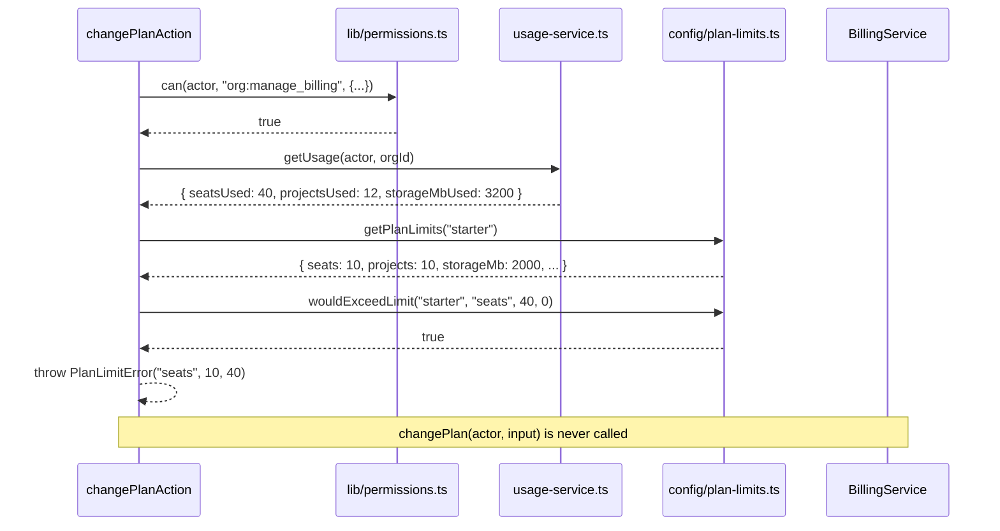

## Purpose

This document covers twelve action files across four directories:
src/actions/members/ (`accept-invitation.ts`, `invite-member.ts`, `remove-member.ts`,
`update-member-role.ts`), src/actions/billing/ (`cancel-subscription.ts`,
`change-plan.ts`, `update-seats.ts`), `src/actions/flags/toggle-flag.ts`, and
src/actions/organizations/ (`create-organization.ts`, `delete-organization.ts`,
`switch-org.ts`, `update-organization.ts`). These four directories are grouped together
because they all govern the organization's own shape and membership rather than its
content — who belongs, what plan it is on, which flags are overridden, and the
organization record itself. Three of the twelve — `accept-invitation.ts`,
`create-organization.ts` and `switch-org.ts` — do not use `withAction()` at all, because
each runs at a point where a full `Actor` cannot yet be resolved the normal way; this
document's eight DES entries prioritize the actions with the most distinctive logic rather
than covering all twelve exhaustively, and the public-surface table below covers the rest.

## Public surface

| function | signature | withAction? | notes |
|---|---|---|---|
| `acceptInvitationAction` | `(raw) => Promise<ActionResult<Member>>` | no | no `Actor` exists pre-acceptance |
| `inviteMemberAction` | `(raw) => Promise<ActionResult<Invitation>>` | yes | seat quota + `member:invite` rate limit |
| `removeMemberAction` | `(raw) => Promise<ActionResult<Member>>` | yes | soft delete, frees the seat |
| `updateMemberRoleAction` | `(raw) => Promise<ActionResult<Member>>` | yes | privilege-escalation + last-owner guards |
| `cancelSubscriptionAction` | `(raw) => Promise<ActionResult<Subscription>>` | yes | `org:manage_billing`, owner only |
| `changePlanAction` | `(raw) => Promise<ActionResult<Subscription>>` | yes | downgrade-fit check against current usage |
| `updateSeatsAction` | `(raw) => Promise<ActionResult<Subscription>>` | yes | bounded both directions |
| `toggleFeatureFlagAction` | `(raw) => Promise<ActionResult<Organization>>` | yes | no-op when the toggle wouldn't change the evaluated result |
| `createOrganizationAction` | `(raw) => Promise<ActionResult<Organization>>` | no | resolves the session principal directly |
| `deleteOrganizationAction` | `(raw) => Promise<ActionResult<Organization>>` | yes | slug-confirmation guard |
| `switchOrgAction` | `(raw) => Promise<ActionResult<null>>` | no | `assertOrgScope`, no `can()` check at all |
| `updateOrganizationAction` | `(raw) => Promise<ActionResult<Organization>>` | yes | merges `settings` as a partial patch |

### DES-244 — `accept-invitation` runs with no `Actor`; the seat quota is re-checked only after the membership write

- **Satisfies:** REQ-030, REQ-032
- **Decided in:** ADR-001, ADR-013
- **Code:** `src/actions/members/accept-invitation.ts`

The file's own comment explains both why this action cannot use `withAction()` and the
consequence for ordering: "runs for a signed-in user who is *not yet* a member of the
target org, so there is no `Actor` to resolve and the action cannot use `withAction()`. The
seat quota is re-checked at acceptance time because the organization may have filled up
since the invitation was sent." The handler resolves `getSessionPrincipal()` directly
(confirming the caller is signed in as *some* user, but not yet a member of *this*
organization), calls `acceptInvitation(principal.userId, parsed.data)` — which creates the
membership row — and only afterward calls its own private `assertSeatAvailable(member)`
helper, which itself has to call `resolveActor(member.userId, member.orgId)` to get an
`Actor` for the *first* time, since one could not exist before the membership write
completed. `getOrganizationSummary` is then called with that freshly-resolved actor to
compare `summary.usage.seatsUsed > limits.seats`, throwing `PlanLimitError` if the
newly-created membership pushed the organization over its seat ceiling. This is a genuine
after-the-fact check, not a before-the-fact guard: the membership row exists in the
database by the time the quota comparison runs, and a failing check here does not roll
back the `insertMember` call `InvitationService.acceptInvitation` already made — the seat
check can reject the *result* by returning an error to the client, but it cannot undo the
row. This is the one action in the corpus where a plan-limit violation is detected after,
rather than before, the write that caused it.

### DES-245 — `invite-member` counts pending invitations against seats before the invite is even sent

- **Satisfies:** REQ-028, REQ-032
- **Decided in:** ADR-010, ADR-011
- **Code:** `src/actions/members/invite-member.ts`

The file's own comment explains why a pending, unaccepted invitation already consumes a
seat: "pending invitations count against `seats` — otherwise an org on the free plan could
queue fifty invitations and blow past three seats the moment they are accepted." The
handler's ordering is: `can()` first, then `consumeRateLimit(input.orgId, "member:invite")`
(the 20-capacity, 2-refill-per-minute bucket), then `getOrganizationSummary` and a
comparison of `summary.usage.seatsUsed + 1 > limits.seats`, throwing `PlanLimitError`
before `inviteMember` is ever called if the org is already at capacity. Reading this
comparison closely: `summary.usage.seatsUsed` is the *active member* count
(`countActiveMembers`, DES-196), not a count that itself includes pending invitations — the
action adds exactly `1` (the invitation about to be sent) rather than reading
`countPendingInvitations` and adding the pending total. This means the actual enforcement
here only prevents seats from being exceeded by *this one* invite request; if five
`inviteMemberAction` calls for five different emails all arrive in quick succession before
any of them is accepted, each one individually sees `seatsUsed + 1` still under the limit
and each one succeeds, potentially queuing far more pending invitations than the plan's
seat count would allow once they are all accepted — a gap the `accept-invitation.ts`
after-the-fact check (DES-244) exists specifically to catch at the point each invitation is
actually redeemed, rather than at the point it is sent.

### DES-246 — `update-member-role` enforces two independent guards that are easy to get wrong

- **Satisfies:** REQ-006, REQ-025, REQ-031
- **Decided in:** ADR-003
- **Code:** `src/actions/members/update-member-role.ts`

The file's own comment names both guards explicitly: "nobody may grant a role above their
own (`hasRoleAtLeast`), and the last owner may not be demoted —
`MemberService.assertLastOwnerRetained` owns that second rule because it needs to count
owners." The first guard is entirely local to this action: after `can(actor,
"member:update_role", {...})` passes (which only confirms the actor's *rank* permits
changing *someone's* role, at `admin` minimum per `ROLE_MATRIX`), the handler additionally
checks `hasRoleAtLeast(actor.role, input.role)` and throws a second `ForbiddenActionError`
if the *target* role being granted outranks the actor's own — the comment for this line
calls it out as "privilege escalation guard: an admin cannot mint an owner." This is a
check `can()` itself does not perform, because `can()` has no notion of "the role being
requested" as an input to compare against the actor's own rank; it is a business rule
layered on top of the permission system, implemented directly in the action. The second
guard, `assertLastOwnerRetained(input.orgId, input.memberId, input.role)`, is delegated
entirely to `MemberService` because — as the comment notes — it needs a count of owners
across the organization, which the action itself has no reason to compute on its own when
the service already needs to read the membership table for the actual update.

### DES-247 — `remove-member` preserves authored content by soft-deleting only the membership row

- **Satisfies:** REQ-033
- **Decided in:** ADR-004
- **Code:** `src/actions/members/remove-member.ts`

The file's own comment states the rationale: "the membership row is archived rather than
deleted so that issues and comments authored by the person keep resolving their author."
This is a thin action — `can(actor, "member:remove", { targetUserId: actor.userId,
targetRole: actor.role })` (worth noting: the resource here carries the *actor's own*
`userId` and `role`, not the target member's — this appears to be a copy-paste-shaped
oversight relative to `update-member-role.ts`'s equivalent check, which correctly uses
`actor.userId`/`input.role` for its own different purpose; here, checking the actor's own
identity against `member:remove`'s ownership escalation means the escalation condition can
only ever succeed for an actor attempting to remove *themselves*, which is a narrower
condition than "can this actor remove this particular target member") — followed by
`removeMember(actor, input)` and one `revalidateTagged` call. Whatever protection exists
against a member removing someone they should not be able to remove is therefore carried
almost entirely by the role-matrix portion of the `member:remove` check (`admin` minimum
rank), not by any ownership-escalation nuance this particular resource construction
provides.

### DES-248 — `change-plan` checks the target plan's limits against current usage before the switch, not after

- **Satisfies:** REQ-138, REQ-141
- **Decided in:** ADR-010
- **Code:** `src/actions/billing/change-plan.ts` — `assertPlanFitsCurrentUsage`

The file's own comment frames the interesting case directly: "the interesting case is the
*downgrade*: the target plan's limits are compared against today's usage before the switch,
so an org on growth with 40 seats cannot silently drop to starter and strand 37 people."
`assertPlanFitsCurrentUsage` reads `getUsage(actor, input.orgId)`, then for each of three
resources — `seats`, `projects`, `storageMb` — calls `wouldExceedLimit(input.plan, resource,
used, 0)`, passing a requested delta of `0` because, as the inline comment clarifies, "we
are not consuming anything, only asking whether what is already in use still fits."
Notably absent from this three-resource list: `issuesPerProject` and `webhooks` are not
checked here at all, even though both are quota dimensions `PlanLimits` defines — a
downgrade from `growth` to `starter` could leave an organization's per-project issue counts
or webhook endpoint counts over the new plan's ceiling with no error raised by this action,
unlike the seat, project and storage dimensions, which this check does protect against.

### DES-249 — `update-seats` is bounded in both directions, unlike a quota check that only guards against exceeding a ceiling

- **Satisfies:** REQ-133
- **Decided in:** ADR-010
- **Code:** `src/actions/billing/update-seats.ts`

Most plan-limit checks in this corpus only guard one direction — "does this new value
exceed the plan's maximum." `updateSeatsAction` checks both: `input.seats > limits.seats`
throws `PlanLimitError` against the plan ceiling (raising seats is capped), and separately
`input.seats < summary.usage.seatsUsed` throws a second `PlanLimitError` — this one
comparing the *requested* seat count against *actual active members*, preventing an admin
from setting the seat allotment below the number of people currently occupying seats. Both
branches throw the same `PlanLimitError` class with different argument orderings — the
first passes `(limits.seats, input.seats)`, the second passes `(input.seats,
summary.usage.seatsUsed)` — meaning the error's `limit` and `used` fields carry genuinely
different semantics depending on which branch produced it, something a client-side error
renderer parsing this error would need to be aware of rather than assuming a uniform
meaning across every `PlanLimitError` instance.

### DES-250 — `toggle-flag` is a no-op whenever the override would not change the evaluated result

- **Satisfies:** REQ-190, REQ-192
- **Decided in:** ADR-012
- **Code:** `src/actions/flags/toggle-flag.ts`

The file's own comment explains the reasoning: "an override can only *turn on* a flag whose
definition is `overridable`; `isEnabled()` is consulted first so that toggling a flag which
is already on for structural reasons (plan or rollout percentage) is a no-op rather than a
confusing write." After the `org:manage_flags` check, the handler builds a
`FeatureFlagContext` and compares `isEnabled(input.flag, context) === input.enabled` — if
the flag already evaluates to the requested state (an enterprise-plan org "enabling"
`public_projects`, which is already on by virtue of its plan, for instance), the action
returns the unmodified `organization` immediately, skipping both the `toggleFlag` service
call and the `revalidateTagged` invalidation entirely. Only a genuine state change reaches
`toggleFlag`, which is what actually writes to `organizations.enabledFlagOverrides` and
emits `flag.toggled`. This means a client that "toggles" an already-effectively-on flag
sees a successful `ActionResult` with no corresponding write, event, or cache invalidation
— behaviorally indistinguishable from a real toggle from the client's point of view, but
structurally a complete no-op underneath.

### DES-251 — Organization actions split cleanly by whether an `Actor` can exist yet

- **Satisfies:** REQ-001, REQ-003, REQ-009, REQ-007
- **Decided in:** ADR-001
- **Code:** `src/actions/organizations/create-organization.ts`, `switch-org.ts`, `delete-organization.ts`, `update-organization.ts`

`create-organization.ts` and `switch-org.ts` do not use `withAction()`; `delete-organization.ts`
and `update-organization.ts` do. The dividing line is exactly the one DES-244 and DES-221
already establish: an `Actor` requires a resolved membership in a specific organization,
and both of the non-`withAction` files operate at a moment before that membership is
either created or confirmed. `create-organization.ts`'s own comment is explicit: "there is
no actor *before* the org exists, so this action resolves the session principal first and
only calls `getActor()` afterwards — against the slug of the organization it just created
— to confirm the owner membership landed." That closing `getActor()` call is not a
permission check at all — nothing in `createOrganizationAction`'s handler branches on its
result beyond letting a thrown error propagate — it exists purely as a fail-loud assertion
that `OrganizationService.createOrganization`'s owner-membership write actually happened,
rather than leaving an organization nobody can open. `switch-org.ts`'s own comment
similarly frames its guard as the entire check that matters: "`assertOrgScope()` is the
guard that matters: the target org is only legitimate if the caller already has a
membership in it, which is exactly what 'the resolved actor's orgId equals the requested
orgId' expresses" — notably, `switchOrgAction` never calls `can()` at all; membership itself,
confirmed by successfully resolving an `Actor` for the target org and then having
`assertOrgScope` compare that actor's `orgId` against the requested one, is the entire
authorization story for switching, because there is no finer-grained permission distinction
"may I switch to an org I'm a member of" could meaningfully express beyond membership
itself.

## Invariants

- `acceptInvitationAction`, `createOrganizationAction` and `switchOrgAction` are the only
  three of the twelve actions in this document that do not use `withAction()`.
- `updateMemberRoleAction` is the only action in this document that layers a second,
  hand-written authorization guard (`hasRoleAtLeast`) on top of its `can()` check.
- `updateSeatsAction` is the only action in this document whose plan-limit check guards
  both a ceiling and a floor.
- `toggleFeatureFlagAction` never calls `toggleFlag` or `revalidateTagged` when the
  requested state already matches the evaluated state.
- `changePlanAction`'s downgrade-fit check covers `seats`, `projects` and `storageMb`
  only — it does not check `issuesPerProject` or `webhooks`.

## Test coverage

`tests/services/member-service.test.ts` covers `removeMember`, `updateMemberRole` and
`assertLastOwnerRetained`. `tests/services/invitation-service.test.ts` covers
`acceptInvitation` and `inviteMember`. `tests/services/billing-service.test.ts` covers
`changePlan`, `cancelSubscription` and `updateSeats`, including the usage-vs-target-plan
comparison DES-248 documents. `tests/lib/permissions.matrix.test.ts` covers the
`org:manage_billing`, `org:manage_flags`, `member:invite`, `member:update_role` and
`member:remove` minimum ranks every action in this document checks against.
`tests/lib/feature-flags.test.ts` covers the four evaluation strategies `toggle-flag.ts`
depends on. `tests/contract/plan-limits.test.ts` covers the plan ladder ordering
`update-seats.ts` and `change-plan.ts` both rely on for their comparisons.

## Sequence: a downgrade blocked by current seat usage

The downgrade never reaches `BillingService.changePlan` at all — the entire rejection
happens inside the action's own `assertPlanFitsCurrentUsage` helper, before any write is
attempted, which is what makes REQ-141's "downgrades are refused" a guarantee enforced
before the subscription row changes rather than a rollback after it does.
