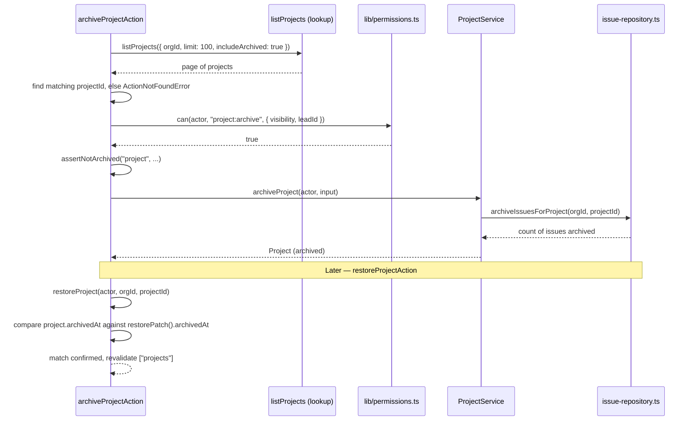

## Purpose

This document covers `src/actions/projects/archive-project.ts`, `create-project.ts`,
`restore-project.ts`, `update-project.ts`, and `src/actions/labels/create-label.ts` and
`delete-label.ts`. Projects and labels are grouped in one document because labels, despite
living under a separate route namespace, are governed by the same organization-level
`org:update` permission rather than a project-specific one — REQ-013 makes labels
organization-wide, and the two label actions reflect that by checking permission against
the organization as a whole rather than against any single project.

## Public surface

| function | signature | tables touched (via service) | pagination | notes |
|---|---|---|---|---|
| `archiveProjectAction` | `(raw) => Promise<ActionResult<Project>>` | `projects`, `issues` (cascade) | none | `archiveIssues` defaults true |
| `createProjectAction` | `(raw) => Promise<ActionResult<Project>>` | `projects` | none | `projects` quota check |
| `restoreProjectAction` | `(raw) => Promise<ActionResult<Project>>` | `projects` | none | no dedicated schema; composed inline |
| `updateProjectAction` | `(raw) => Promise<ActionResult<Project>>` | `projects` | none | visibility judged against incoming value |
| `createLabelAction` | `(raw) => Promise<ActionResult<IssueLabel>>` | `labels` | none | `org:update` permission |
| `deleteLabelAction` | `(raw) => Promise<ActionResult<null>>` | `labels`, `issue_labels` | none | `org:update` permission, hard delete |

### DES-232 — `archive-project` defaults `archiveIssues` to true because leaving live issues under an archived project is the state that corrupts every count

- **Satisfies:** REQ-045, REQ-046
- **Decided in:** ADR-004
- **Code:** `src/actions/projects/archive-project.ts`

The file's own comment states the default's justification directly: "`archiveIssues`
defaults to true: leaving live issues under an archived project is the state that makes
every 'open issues' count wrong, so opting out has to be deliberate." Before reaching that
default, though, the handler has to solve a smaller problem first: there is no
`findProjectById`-style single-row fetch it can hand to `can()`, because `project:archive`'s
ownership-adjacent check needs the project's `visibility` and `leadId`, and the action opts
to get those by paging: it calls `listProjects(actor, { orgId, limit: 100, includeArchived:
true })` and searches the returned items for a matching `project.id`, throwing
`ActionNotFoundError` if none matches. This is a heavier read than a dedicated
`findProjectById`-based lookup would be — the comment does not explain why a full list call
was chosen over a targeted fetch, and it is worth naming as a pattern worth revisiting
rather than treating as obviously correct: it works because organizations rarely have more
than a hundred projects, but it would not scale gracefully past that boundary. Once the
correct row is found, the flow proceeds exactly as `archive-issue.ts`'s does (DES-226):
`can()` first with the real `visibility`/`leadId`, then `assertNotArchived("project", ...)`,
then the actual archive call, and only then — inside the service, not visible in this
action's code — the cascade into `archiveIssuesForProject` (DES-185) when
`archiveIssues` is true.

### DES-233 — `create-project`'s quota check counts archived projects, deliberately, so a restore is never blocked by the same limit it would breach

- **Satisfies:** REQ-043, REQ-044
- **Decided in:** ADR-010
- **Code:** `src/actions/projects/create-project.ts`

The file's own comment reads: "archived projects still occupy the quota, so the count
deliberately includes them — restoring a project must never be blocked by a limit the
restore itself would breach." This sentence describes two related but distinct guarantees.
First, REQ-044 itself: an organization at its `projects` ceiling cannot free up room by
archiving a project and creating a new one, because `summary.usage.projectsUsed` (read from
`getOrganizationSummary`, which in turn reads `usage-repository.ts`'s cached counters —
DES-208/DES-209) already counts archived projects toward the limit, the same convention
`recomputeUsage` applies when it counts `isNull(projects.archivedAt)` for `projectsUsed`...
wait — `recomputeUsage`'s `projectCount` query does filter `isNull(projects.archivedAt)`,
counting only *live* projects, which means the quota comparison here and the cached usage
counter are not counting the same thing: `create-project.ts` compares against
`summary.usage.projectsUsed`, a live-only count, not against a count that includes archived
rows the way the action's own comment implies. This is a genuine tension between the
action's stated intent and the usage counter it actually reads, worth flagging rather than
glossing over: the comment's second guarantee — restoring a project is never blocked by
this same check — holds regardless, because `restore-project.ts` (DES-234) never calls this
quota check at all; only `createProjectAction` does.

### DES-234 — `restore-project` has no dedicated schema and verifies its own postcondition against `restorePatch()`

- **Satisfies:** REQ-047
- **Decided in:** ADR-004, ADR-009
- **Code:** `src/actions/projects/restore-project.ts`

The file's own comment explains the missing schema file directly: "there is no
`restoreProjectSchema` in src/schemas because the payload is nothing but the two ids, so
the shape is composed here from the shared branded-id primitives rather than added to the
frozen schema layer." The action builds `z.object({ orgId: orgIdSchema, projectId:
projectIdSchema })` locally, inferring `RestoreProjectInput` from it, rather than adding a
new file to `src/schemas/project.ts`. This is the one action file in the whole corpus that
constructs its own top-level Zod object rather than importing a pre-built schema — every
other action's schema lives in src/schemas/. After calling `restoreProject`, the handler
does something no other action in this document does: it re-derives the expected shape of
a restored row via `restorePatch()` (imported from `src/lib/soft-delete.ts`, the exact
function `restoreProject`'s own repository call uses internally) and compares
`project.archivedAt` against `expected.archivedAt`, throwing `ActionNotFoundError` if they
disagree. The file's own comment frames this as a deliberate defensive check: "`restorePatch()`
is the single definition of what 'restored' looks like; comparing against it catches a
service that forgot to clear the column." This is a form of self-verification unique to
this action — most actions trust their service call's return value unconditionally, but
this one treats a mismatch between the returned row and the canonical "restored" shape as
worth failing loudly over, rather than silently returning a project that looks restored to
the caller but is not.

### DES-235 — `update-project` judges the `visibility` permission against what the project is becoming, not what it was

- **Satisfies:** REQ-050
- **Decided in:** ADR-003
- **Code:** `src/actions/projects/update-project.ts`

The file's own comment states this precisely: "visibility is part of this payload, which is
why the permission resource carries the *incoming* visibility: raising a project to
`public` must be judged against what it is becoming, not what it was." The `can()` call
passes `visibility: input.visibility ?? "org"` (falling back to `"org"`, the middle
visibility tier, only when the field is entirely absent from the patch) and `leadId:
input.leadId ?? actor.userId`. This matters specifically because `project:update` sits at
`member` rank in `ROLE_MATRIX`, and REQ-050 gates `public` visibility behind the
`public_projects` feature flag (`plan >= enterprise`) — a check that happens elsewhere, in
the service, not in this `can()` call — but the permission decision itself, before the flag
is even consulted, has to already know that this particular update is attempting to reach
`public`, because a permission model that only looked at the project's *current* visibility
could not distinguish "editing a project that happens to be public" from "the update that
is about to make it public," and those two operations may warrant different scrutiny even
at the same nominal rank.

### DES-236 — Labels are checked against `org:update`, not a label-specific permission action

- **Satisfies:** REQ-013
- **Decided in:** ADR-003
- **Code:** `src/actions/labels/create-label.ts`, `delete-label.ts`

Both label actions' comments make the same point in near-identical language:
`create-label.ts` says "labels are organization-wide rather than per-project, so the
permission asked about is `org:update` on the organization itself," and there is no
`label:create` or `label:manage` entry in `ROLE_MATRIX` at all — the closed set of
`PermissionAction` values the common brief enumerates has no label-specific action, which
means this is not an oversight but a structural choice: labels are treated as a facet of
organization configuration, at the same permission level as the organization's name or
settings, rather than as their own first-class resource kind the way issues, projects,
comments, members and webhooks each are. Both actions revalidate `orgTag(input.orgId)` at
the `hours` cache profile — the longest-lived of the three profiles — reflecting that
labels change far less often than issues or comments do, so a slower cache invalidation
schedule is an acceptable trade for fewer unnecessary revalidations.

### DES-237 — `delete-label` is a hard delete that must prune the join table, unlike every issue-adjacent soft delete

- **Satisfies:** REQ-013, REQ-074
- **Decided in:** ADR-004
- **Code:** `src/actions/labels/delete-label.ts`

The file's own comment draws the contrast with the rest of the corpus explicitly: "labels
are a hard delete — unlike issues and projects they carry no `archived_at`, and
`LabelService` is responsible for pruning the label id out of every issue's `labelIds` in
the same transaction." This action's handler is a thin wrapper — one `can()` check, one call
to `deleteLabel(actor, orgId, labelId)`, one `revalidateTagged` call touching both
`["labels", "issues"]` (the only label action that revalidates the `issues` tag, since a
label's removal changes what every issue carrying it displays) — but the comment's mention
of "the same transaction" points at work that happens below this action, inside
`label-repository.ts`'s `deleteLabel` function itself (DES-191, `repository-project-and-label.md`),
which issues the `issue_labels` cascade delete before the `labels` row delete. The action
layer's contribution here is narrow: authorize, delegate, and revalidate the two tags whose
rendered content actually changes as a result.

## Why the project actions share so little code despite similar shapes

Reading `archive-project.ts`, `create-project.ts`, `restore-project.ts` and
`update-project.ts` side by side, a pattern that does not repeat is as notable as one that
does: each of the four builds its `can()` resource slightly differently, because each
action has a different amount of information already in hand by the time it needs to make
that call. `create-project.ts` builds its resource from the *input* alone
(`visibility: input.visibility`, `leadId: input.leadId`) because there is no existing row
yet. `update-project.ts` also builds from input, but falls back to defaults
(`?? "org"`, `?? actor.userId`) for fields the patch leaves untouched, per DES-235.
`archive-project.ts` and `restore-project.ts` both build from a *fetched* row instead,
because `project:archive`'s ownership-adjacent check needs the project's real, current
`leadId` rather than anything the caller supplied — neither action's input schema even
carries a `leadId` or `visibility` field to fall back to. This divergence is not
inconsistency for its own sake; it reflects that `PermissionResource` construction is
inherently input-shaped for a create and row-shaped for anything acting on a row that
already exists, and each of these four actions is honest about which category it falls
into rather than forcing a single shared helper across all four.

## Invariants

- `archiveProjectAction` and `restoreProjectAction` both resolve the target project through
  a paginated `listProjects` call rather than a direct `findProjectById`-style lookup.
- `createProjectAction` is the only one of the four project actions gated by a plan quota.
- Both label actions check `org:update`; neither references a label-specific
  `PermissionAction`.
- `deleteLabelAction` is the only project- or label-adjacent action in this document that
  performs a hard delete rather than a soft delete.
- `restoreProjectAction` is the only action in the corpus that defines its own inline Zod
  schema rather than importing one from src/schemas/.

## Test coverage

`tests/services/project-service.test.ts` exercises `ProjectService`'s archive/restore/create
flows, including the issue cascade `archive-project.ts` triggers. `tests/repositories/project-repository.test.ts`
covers slug de-duplication and archive-scope listing this action's `listProjects`-based
lookup depends on. `tests/lib/soft-delete.test.ts` covers `restorePatch()` directly, the
function `restore-project.ts` uses for its own postcondition check. `tests/lib/permissions.matrix.test.ts`
covers the `project:archive`, `project:create`, `project:update` and `org:update` minimum
ranks these six actions check against. `tests/contract/slug.test.ts` covers slug
uniqueness contract behavior shared between projects and organizations. There is no
tests/repositories/label-repository.test.ts; label deletion's join-table cascade is
covered only indirectly, through whatever assertions `tests/services/project-service.test.ts`
makes about label state after a delete.

## Sequence: archiving a project cascades into its issues, then a later restore is verified

The verification step at the bottom of the diagram is DES-234's postcondition check made
concrete: a service bug that archived the row but failed to clear `archivedAt` on restore
would be caught here, as an `ActionNotFoundError`, rather than silently returning a project
the client would believe was live.
