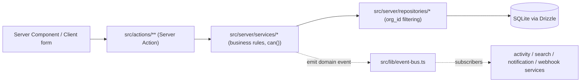
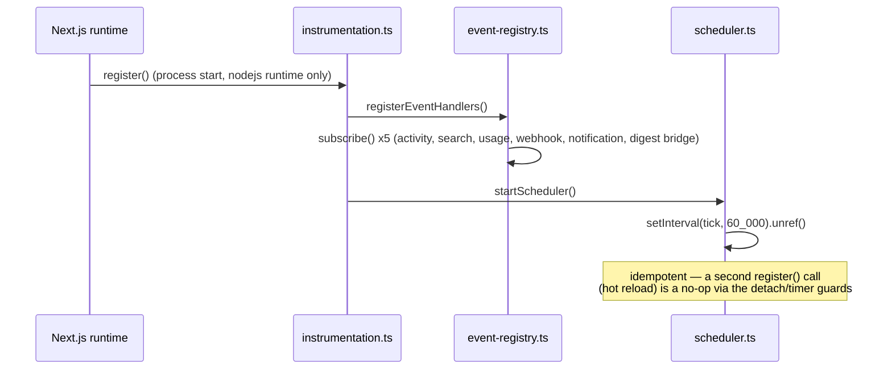

## Purpose

Taskflow is a single Next.js 16 application: one deployable process serving the
marketing site, the authenticated dashboard, the JSON Route Handlers webhook
receivers call, and the in-process job scheduler that used to be "the other service"
in an earlier sketch of this system. This document describes the runtime shape —
what process runs, what talks to what, and the constraints Next.js 16 imposes that
show up in almost every other design document in this section. `module-map.md` goes
one level deeper into the directory structure this shape produces; read this file
first for the "why one process" answer.

## Constraints

- Single Node.js process, single SQLite file via better-sqlite3 (ADR-002). There is
  no separate worker process, no message broker, no external cache. Anything that
  looks like "the queue" or "the cache" in this corpus is an in-process data
  structure, not a managed service.
- Next.js 16's App Router is the only routing mechanism (ADR-001). There is no
  Pages Router code and none should be added.
- `params` and `searchParams` are `Promise`s in every layout and page; `cookies()`
  and `headers()` from `next/headers` are async. Forgetting to `await` these is the
  single most common review comment in this codebase's history.
- `middleware.ts` does not exist in Next 16 — the request hook is `src/proxy.ts`,
  exporting a function named `proxy`, not `middleware` (ADR-007). The old name is
  silently ignored by the framework, which makes this an easy, dangerous mistake:
  every route becomes effectively public if the export is misnamed.
- `revalidateTag()` requires a second argument, a `cacheLife` profile name, as of
  Next 16. Every call site in this app goes through `revalidateTagged()`
  (`src/lib/cache.ts`) specifically so this requirement is satisfied in one place —
  see `caching-and-revalidation.md`.
- Parallel route slots (Taskflow has one, `@panel`) require a `default.tsx` or the
  build fails.

## DES-001 — Taskflow ships as one Next.js 16 process, not a service mesh

- **Satisfies:** REQ-001, REQ-010
- **Decided in:** ADR-002
- **Code:** `src/server/db/client.ts`, `src/instrumentation.ts`

Every capability in the product — serving pages, handling Server Action mutations,
answering webhook receiver requests, running the digest and retry jobs — executes
inside the same Node process against the same better-sqlite3 connection opened once
in `src/server/db/client.ts`. There is no separate API server, no separate worker,
and no separate cache tier. This is a deliberate simplification for a corpus meant to
be read end to end: a reader can trace a mutation from a form submission through to a
background job side effect without leaving one process boundary or reasoning about
network partitions between services that do not exist here.

The consequence engineers hit first is that "in-process" is not a metaphor anywhere
in this design section. The event bus (`event-bus.md`), the job queue
(`background-jobs.md`) and the rate limiter all hold their state in module-level
`Map`s and arrays. A process restart drops in-flight background work and resets rate
limiter buckets to full. That is an accepted trade-off, not an oversight — see
DES-069 in `background-jobs.md` for the specific consequences.

## DES-002 — Four architectural layers front-to-back

- **Satisfies:** REQ-010, REQ-020
- **Decided in:** ADR-013
- **Code:** src/actions/, src/server/services/, src/server/repositories/, src/server/db/

The write path — and, less rigidly, the read path — passes through four layers in a
fixed order: **actions** (`src/actions/**`, thin Server Action wrappers), **services**
(`src/server/services/*.ts`, business rules and authorization), **repositories**
(`src/server/repositories/*.ts`, persistence and tenancy filtering), and **db**
(`src/server/db/schema/*.ts`, the Drizzle table definitions over the single SQLite
file). `module-map.md` details what each layer is and is not allowed to import;
`data-flow.md` walks a concrete mutation through all four. The rule that makes this
worth documenting as architecture rather than convention: **services own
authorization, repositories own tenancy, and neither substitutes for the other**
(ADR-013). A repository that also called `can()` would make an authorization decision
reachable from two places, which is exactly the kind of drift `permissions.ts`'s own
docstring warns against.

The diagram compresses what `data-flow.md` walks step by step: a request enters
through the action layer, descends through services and repositories to the
database, and — for anything that changes state other layers care about — branches
sideways into the event bus rather than calling those other services directly. That
sideways branch is what keeps `IssueService` from needing to know that
`NotificationService`, `SearchService`, `ActivityService` and the webhook dispatcher
all exist.

## DES-003 — src/server/ holds everything that must never reach the client bundle

- **Satisfies:** REQ-001, REQ-201
- **Code:** src/server/db/, src/server/repositories/, src/server/services/, src/server/jobs/

The directory boundary src/server/ is not cosmetic. Repositories hold raw SQL
predicates and see unfiltered rows before tenancy is applied; services see
`hashPassword`/`verifyPassword` (`src/lib/hash.ts`) and session tokens; jobs run with
no request context at all and therefore no actor to check permissions against.
Nothing under src/server/ is imported by a Client Component — the App Router's
server/client boundary enforces this at build time for anything marked `"use
client"`, but the team additionally treats a service import appearing in a component
file as a review-blocking mistake, because the bundler boundary alone does not
prevent a Server *Component* from importing a repository directly and skipping
authorization (see the layering exceptions in DES-008).

## DES-004 — Build and deploy: one artifact, one file-backed database

- **Satisfies:** REQ-001
- **Decided in:** ADR-002
- **Code:** `src/server/db/migrate.ts`, `src/server/db/seed.ts`, `src/config/env.ts`

The deployable is a standard Next.js build; the database is a single SQLite file at
the path named by `AppEnv.databasePath` (`src/config/env.ts`, the only module
permitted to read `process.env`). `runMigrations()` applies the drizzle-kit
migrations under `./drizzle` before the process is considered ready; `seedDatabase()`
populates a deterministic development fixture — two organizations on different
plans, members in all four roles, projects, issues (including archived and overdue
ones) and comments — which is also what the requirements and test corpora assume
exists in a dev environment. There is no blue/green database migration story here:
schema changes are applied in place to the one file, which is acceptable for a
single-writer SQLite deployment and would need to be revisited before this shape
scaled past one process.

## DES-005 — Next.js 16 facts that ripple through the whole codebase

- **Satisfies:** REQ-211, REQ-212
- **Decided in:** ADR-001, ADR-007

Four Next 16 changes are load-bearing enough to call out at the architecture level
rather than leaving them as scattered comments:

1. **`params`/`searchParams` are Promises.** Every `page.tsx` and `layout.tsx` in
   src/app/ awaits them before use — see, for one concrete instance,
   `src/app/(dashboard)/[orgSlug]/profile/page.tsx`, which awaits both `props.params`
   and `props.searchParams` even though the page ignores the latter's contents.
2. **`cookies()`/`headers()` are async.** `src/lib/session.ts` is async top to bottom
   for exactly this reason — every exported function returns a `Promise`, including
   ones that would be synchronous in Next 15.
3. **There is no `middleware.ts`.** `src/proxy.ts` exports `proxy`, matched by the
   `config.matcher` at the bottom of that file, and is the only place in the app that
   inspects a raw `NextRequest` before a Server Component or Server Action runs.
4. **`revalidateTag` takes a `cacheLife` profile as its second argument.** See
   `caching-and-revalidation.md` for the full treatment; the short version is that no
   call site should import `revalidateTag` directly.

## DES-006 — `src/instrumentation.ts` is the one process-start hook

- **Satisfies:** REQ-070, REQ-111
- **Code:** `src/instrumentation.ts`

Next.js calls `register()` in `src/instrumentation.ts` once per server process,
before any request is handled. Taskflow uses that single hook for two pieces of
global wiring that must happen exactly once: `registerEventHandlers()`
(`src/server/services/event-registry.ts`), which attaches every event-bus
subscriber, and `startScheduler()` (`src/server/jobs/scheduler.ts`), which starts the
60-second job tick interval. Both calls are guarded by `process.env.NEXT_RUNTIME !==
"nodejs"` returning early — instrumentation also runs in the Edge runtime context for
certain build steps, and neither the event bus nor the scheduler should start there.
`onRequestError()` in the same file is the process-wide error log line every
unhandled Server Action or Route Handler failure eventually reaches.

The sequence is intentionally boring: nothing in this path talks to a request, an
actor, or a database row. It is pure wiring, and its two guarded idempotence checks
(`detach !== null` in the registry, `timer !== null` in the scheduler) exist
specifically because Next's dev-mode hot reload can call `register()` more than once
per process — without those guards, every domain event would be delivered to every
subscriber twice in local development.

## DES-007 — Route Handlers exist only where a Server Action structurally cannot reach

- **Satisfies:** REQ-160, REQ-079, REQ-208
- **Code:** src/app/api/webhooks/, src/app/api/health/, src/app/api/export/, src/app/api/cron/, src/app/api/auth/

The default mutation mechanism is a Server Action through `withAction()` (see
`data-flow.md`, DES-021). Route Handlers under src/app/api/ exist for the narrow
set of cases a Server Action cannot serve: an external system calling in (inbound
webhook signature verification), a health check a load balancer polls without a
browser session, a CSV export that needs to set `Content-Disposition` response
headers (`src/lib/csv.ts`'s `csvResponseHeaders()`), and a cron-triggered sync entry
point for environments where the in-process scheduler is not the trigger of record.
Every other mutation in the product is a Server Action, and a reviewer seeing a new
Route Handler proposed for an ordinary form submission should treat that as a design
smell worth pushing back on.

## DES-008 — The five deliberate layering exceptions

- **Satisfies:** REQ-010, REQ-072
- **Decided in:** ADR-013

Five call sites in the corpus knowingly bypass the service layer and call a
repository directly from a Server Component or Server Action. They are documented
here, in `module-map.md` (DES-017) and in `data-flow.md` (DES-026) rather than hidden,
because a corpus that pretends its architecture has no exceptions would be less
useful than one that is honest about them:

1. `src/actions/profile/update-profile.ts` — updates the signed-in user's own
   `User` row via `updateUser()` directly. There is no `PermissionAction` for editing
   your own profile; the only rule is `input.userId === actor.userId`, checked
   inline rather than through `can()`.
2. `src/app/(dashboard)/[orgSlug]/profile/page.tsx` — reads the profile with
   `findUserById()` directly, for the same reason: there is no tenant-scoped
   permission to check on your own user record.
3. `src/app/(dashboard)/[orgSlug]/settings/members/invitations/page.tsx` — reads
   pending invitations with `listPendingInvitations()` directly because
   `InvitationService` exposes lifecycle verbs (`inviteMember`, `revokeInvitation`,
   `resendInvitation`) but no listing function, and the repository query is already
   `orgId`-scoped.
4. `src/app/(dashboard)/[orgSlug]/settings/notifications/page.tsx` — reads
   preferences with `listPreferences()` directly, the same "no service listing
   exists yet" shape as the invitations page.
5. `src/app/(dashboard)/[orgSlug]/projects/[projectSlug]/issues/[issueNumber]/page.tsx`
   — reads the issue with `findIssueByNumber()` directly to resolve the human-facing
   issue number to a row before any service call is possible, since
   `IssueService.getIssue()` takes an `IssueId`, not a project-scoped number.

A sixth, different kind of exception belongs here too: `src/server/services/auth-service.ts`
documents in its own header comment that it *should* call `emit()` on login,
registration and logout, but cannot, because `TaskflowEventMap` has no auth events.
This is a gap in the event catalogue, not a bypass of one — see `event-bus.md`
DES-057 for the consequence (no activity-log row exists for authentication events).

## The marketing, auth and dashboard route groups

src/app/ splits into three route groups whose names are invisible in the URL but
meaningful in the codebase: `(marketing)` (the public site — pricing, changelog,
about), `(auth)` (login, register, password reset, the invite acceptance landing
page), and `(dashboard)` (everything behind a resolved `Actor`, nested under
`[orgSlug]`). Each group has its own `layout.tsx`: `(auth)/layout.tsx` renders a
centred card shell with no navigation, appropriate for a signed-out visitor;
`(dashboard)/layout.tsx` resolves the session and redirects to `/login` when absent
(REQ-211) before rendering `(dashboard)/orgs/page.tsx` (the org chooser, which
redirects straight through when the signed-in user belongs to exactly one
organization) or descending into `[orgSlug]/layout.tsx`, which is where the tenant
shell — sidebar, top bar, the `@panel` parallel slot — actually resolves an `Actor`
and builds the feature-flag snapshot handed to the client. The marketing group has no
`Actor` concept at all; its pages read `PLAN_LIMITS` directly from src/config/ for
the pricing grid, since that table is safe to expose to a signed-out visitor and the
marketing group intentionally never imports anything from src/server/.

## `@panel`: the one parallel route slot

The `[orgSlug]` layout renders one parallel route slot, `@panel`, alongside its main
children. `src/app/(dashboard)/[orgSlug]/@panel/default.tsx` exists purely to satisfy
Next 16's requirement that every parallel slot have a `default.tsx` fallback — its
absence fails the build outright, which is why DES-005 calls this out as one of the
four load-bearing Next 16 facts. `@panel/page.tsx` renders the slot's default content
when no more specific route matches, and `@panel/notifications/page.tsx` renders the
notification panel when the URL's shape calls for it. This is the one place in the
app where two independently-rendered subtrees (`children` and `@panel`) compose into
a single layout, and it exists specifically so the notification panel can be opened
as an overlay without losing the underlying page's own render state — a pattern that
would otherwise require client-side routing state layered on top of the App Router.

## Known rough edges

- The five layering exceptions above mean tenant and ownership checks for those five
  read paths live in the page component rather than a service, which is easy to miss
  when adding a sixth "just read the row directly" shortcut. `tenant-isolation.md`
  DES-037 covers what breaks if one of these five pages is copied as a template
  without noticing it skips `assertCan`.
- `src/proxy.ts` only checks for the *presence* of a session cookie, not its
  validity — a forged or expired cookie value passes the proxy and is only rejected
  once a Server Action or layout calls `getSessionPrincipal()`. This is intentional
  (a proxy running before any request context cannot reach the database to check the
  cookie's hash against `session-repository.ts`) but it means the proxy is a UX
  redirect, not a security boundary; the real boundary is `getActor()` /
  `requireActorFor()`, covered in `tenant-isolation.md`.
- There is no supervisor process restarting the Node process on crash documented in
  this corpus; a process death mid-job silently drops whatever `drain()` had claimed
  but not yet completed, since the queue in `src/server/jobs/queue.ts` is an
  in-memory array with no write-ahead log.
- `proxy.ts`'s `PUBLIC_PREFIXES` list is a flat array of string prefixes
  (`/`, `/pricing`, `/changelog`, `/about`, `/login`, `/register`,
  `/reset-password`, `/invite`, `/api/health`, `/api/webhooks`) matched with
  `pathname === prefix || pathname.startsWith(prefix + "/")`. Because the list is
  hand-maintained rather than derived from the route groups themselves, a new public
  page added under `(marketing)` without a corresponding prefix entry here would be
  redirected to `/login` by the proxy even though its layout requires no session —
  the two lists (route groups and proxy prefixes) can drift independently, and
  nothing in the build fails when they do.
