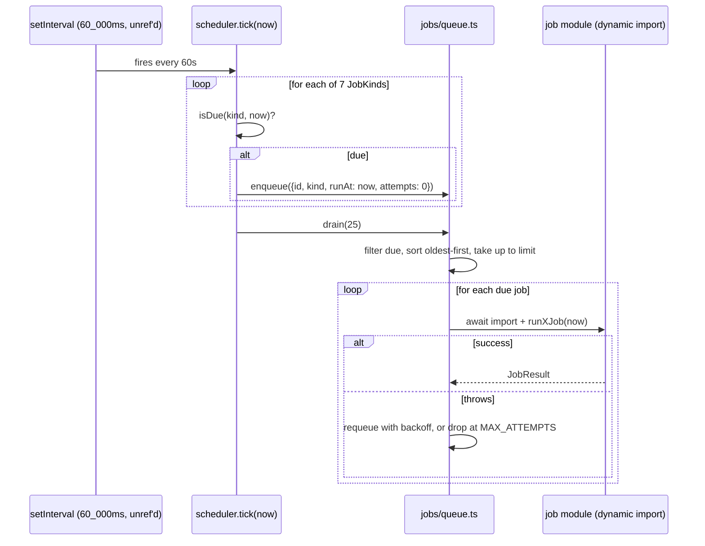

## Purpose

Seven job kinds run on an in-process interval scheduler: `digest-email`,
`overdue-issues`, `webhook-delivery`, `usage-rollup`, `search-reindex`,
`cleanup-archived`, `trial-expiry`. This document covers the scheduler's cadence
table, the queue's enqueue/drain/retry mechanics, and each job's specific behavior
and idempotence story. `event-bus.md` DES-056 covers the one non-cadence trigger
(`digest.due` enqueuing a `digest-email` job directly); this document assumes that
bridge and focuses on what happens once a job is in the queue.

## Constraints

- `startScheduler()` / `stopScheduler()` / `isSchedulerRunning()` / `tick()` are the
  complete scheduler API (`src/server/jobs/scheduler.ts`), started exactly once from
  `src/instrumentation.ts`.
- `TICK_INTERVAL_MS = 60_000` — the scheduler wakes once a minute; individual job
  cadence is expressed in minutes and checked against wall-clock elapsed time since
  the kind's last run, not against the tick count.
- The scheduler's `setInterval` handle is `.unref()`ed — a pending tick must never
  keep the Node process alive on its own.
- A job never runs inside a request — `runJob()` (`src/server/jobs/types.ts`) is only
  ever called from `queue.ts`'s `runHandler()`, itself only called from `drain()`,
  itself only called from `tick()` or from a Route Handler's cron entry point.
- Every job kind is idempotent enough that re-running it after a partial failure does
  not corrupt state, though the specific mechanism differs per kind — see DES-063.

## DES-060 — `scheduler.ts`: interval and the `CADENCE_MINUTES` table

- **Satisfies:** REQ-070, REQ-119, REQ-142, REQ-180
- **Decided in:** ADR-016
- **Code:** `src/server/jobs/scheduler.ts`

`tick(now)` runs once per minute and, for each of the seven `JobKind`s, checks
`isDue(kind, now)` — `true` if the kind has never run in this process's lifetime, or
if `now - lastRunAt[kind] >= CADENCE_MINUTES[kind] * 60_000`. The cadence table:
`digest-email` 60, `overdue-issues` 60, `webhook-delivery` 1, `usage-rollup` 15,
`search-reindex` 1_440 (once a day), `cleanup-archived` 1_440, `trial-expiry` 360 (six
hours). Every due kind is enqueued with an id of `${kind}:${Math.floor(now.getTime()
/ 60_000)}` — a minute-bucketed id — and then `drain()` is called once to process
whatever is due, including jobs left over from a previous tick's retries. ADR-016
narrows the cadence policy first sketched in ADR-005: the earlier decision to run
jobs in-process did not originally commit to per-kind cadence, and ADR-016 is the
record of settling on the specific minute values above, after which the numbers
became load-bearing enough to grep rather than guess.

The two-phase shape inside one `tick()` — enqueue everything cadence says is due,
*then* drain the whole queue in one pass — means a `webhook-delivery` job enqueued by
this tick's own cadence check runs in the same pass as a `digest-email` job that
arrived via the DES-056 event bridge a moment earlier; the queue does not
distinguish "how a job got here" once it's in the `pending` array.

## DES-061 — The seven job kinds and what each one is for

- **Satisfies:** REQ-070, REQ-119, REQ-142, REQ-156, REQ-180
- **Code:** `src/server/jobs/*.ts`

| kind | file | trigger | what it does |
|---|---|---|---|
| `digest-email` | `digest-email-job.ts` | cadence (60m) + `digest.due` bridge | builds and "sends" the daily digest for every org whose configured UTC hour has arrived |
| `overdue-issues` | `overdue-issue-job.ts` | cadence (60m) | scans for past-due issues, `emit()`s `issue.overdue` per one, dedupes in-memory |
| `webhook-delivery` | `webhook-delivery-job.ts` | cadence (1m) | claims pending deliveries in batches of 25 and "delivers" them with retry |
| `usage-rollup` | `usage-rollup-job.ts` | cadence (15m) | recomputes `organization_usage` counters as a correction pass over incremental deltas |
| `search-reindex` | `search-reindex-job.ts` | cadence (1440m) or manual (`orgId` payload) | rebuilds one org's search index from live projects, issues and comments |
| `cleanup-archived` | `cleanup-archived-job.ts` | cadence (1440m) | drops search documents and purges activity rows past the plan's retention window |
| `trial-expiry` | `trial-expiry-job.ts` | cadence (360m) | downgrades expired trials to `free`, unless usage already exceeds free limits |

`search-reindex` is the one kind whose queued payload matters — `queue.ts`'s
`runHandler()` reads `job.payload.orgId` and returns early (a silent no-op) if it is
not a string, since a full-fleet reindex is expressed as a sequence of
single-org enqueues rather than one job that walks every organization.

## DES-062 — `queue.ts`: enqueue, drain, retry with backoff

- **Satisfies:** REQ-156, REQ-157
- **Decided in:** ADR-018
- **Code:** `src/server/jobs/queue.ts`

`pending: QueuedJob[]` is a module-scope array — the queue's entire state.
`enqueue(job)` is idempotent on `id`: re-enqueuing a job whose id is already present
is a no-op, which is what makes the minute-bucketed cadence ids and the
`digest:${orgId}:${recipientId}` bridge id both safe against duplicate enqueues from
overlapping triggers. `drain(limit = 25)` filters to jobs whose `runAt <= now`, sorts
oldest-first, takes up to `limit`, removes each from `pending` before running it (so
a job's own handler can safely re-enqueue itself without seeing its own still-pending
entry), and on a caught error requeues with `attempts + 1` and a `runAt` delayed by
`backoffMs(attempts)` — unless `attempts >= MAX_ATTEMPTS` (5, this queue's own
constant, distinct from the webhook-specific 6 covered in DES-064), in which case the
job is logged and dropped rather than retried forever, "an infinitely retrying job is
worse than a lost one" per the file's own comment. This module's `backoffMs()` is
1s, 2s, 4s, 8s… capped at 60_000ms — the *generic* queue backoff, separate from
`webhook-delivery-job.ts`'s own `backoffMs()` covered next, which caps at 300_000ms
instead.

## DES-063 — Idempotence per job kind

- **Satisfies:** REQ-119, REQ-122, REQ-180

Each of the seven kinds achieves idempotence through a different mechanism, worth
naming individually because "the job is idempotent" means something different each
time: `digest-email` marks digested notifications as read as it sends them
(`digest-email-job.ts`'s comment: "this is what keeps a later run inside the same
window from sending the same digest twice"), directly serving REQ-122 ("an empty
digest is not sent," since `buildDigest()` returns `null` once there is nothing
unread left). `overdue-issues` keeps an in-memory `Set<string>` of already-reported
issue ids for the process's lifetime — re-running the sweep on a still-overdue issue
is a no-op because the id is already in `reported`, though this set resets on process
restart, a known rough edge below. `webhook-delivery` and the generic queue both key
`enqueue()` on job id. `usage-rollup` is naturally idempotent — recomputation from
scratch always produces the same answer for the same underlying rows regardless of
how many times it runs. `search-reindex` upserts every document by
`(orgId, subjectKind, subjectId)`, so a second full pass overwrites rather than
duplicates. `cleanup-archived` only ever purges rows strictly before its computed
cutoff, so re-running it with the same `now` purges the same set (an empty one, the
second time). `trial-expiry` checks `listTrialsEndingBefore(stamp)`, which stops
returning a subscription once its plan has actually changed to `free`.

## DES-064 — `webhook-delivery-job`: claim, sign, retry, abandon

- **Satisfies:** REQ-154, REQ-155, REQ-156, REQ-157, REQ-158
- **Decided in:** ADR-018
- **Code:** `src/server/jobs/webhook-delivery-job.ts`

`runWebhookDeliveryJob(now)` claims up to `CLAIM_BATCH = 25` pending deliveries via
`webhookRepo.claimPendingDeliveries()` and, per delivery, runs three gates before
attempting anything: does the org's plan include webhooks (`getPlanLimits(org.plan).webhooks
> 0` and `isEnabled("webhooks", ...)` both true — REQ-152), has `MAX_ATTEMPTS` (6,
local to this file) already been exceeded, and is the target endpoint present and
`enabled` (REQ-158: "deliveries to a disabled endpoint fail fast"). Any gate failure
calls `markDeliveryFailed()` with a specific reason string rather than retrying.
There is no outbound HTTP call in this corpus — "delivery" means computing
`signPayload(endpoint.secret, delivery.payload)` (`webhook-service.ts`) and logging
the attempt, since the corpus builds and runs offline; the retry bookkeeping around
that computation is still the part the design cares about getting right, per the
file's own comment. `backoffMs(attempts)` here is 1s, 2s, 4s… capped at 300_000ms
(five minutes) — distinct from the generic queue's 60-second cap, because a webhook
receiver going through a deploy is expected to come back within minutes, not
seconds, and REQ-157's abandonment ceiling (this file's local `MAX_ATTEMPTS = 6`) is
meant to tolerate that.

## DES-065 — `digest-email-job`: per-org UTC hour window

- **Satisfies:** REQ-119, REQ-120, REQ-121, REQ-122, REQ-124
- **Code:** `src/server/jobs/digest-email-job.ts`

`shouldRunForOrg(org, now)` — exported specifically so this decision is unit
testable without a database — returns `true` only when `now.getUTCHours() ===
org.settings.digestHourUtc` and the org is not archived. Because the scheduler ticks
every minute but this check only matches one hour of the day, one org gets exactly
one digest attempt per day even though the cadence table's 60-minute value would
otherwise permit up to 24. `isEnabled("digest_email", ...)` gates the whole org next
(REQ-120: available only on plans that include it — `growth` and `enterprise`), and
only then does the job compute a 24-hour window (`MS_PER_DAY`) ending at `now` and
call `buildDigest()` per recipient (REQ-121: "the digest window is bounded by the
last successful send" — in practice, bounded by the fixed 24-hour lookback rather
than a tracked last-send timestamp, a simplification noted below). Rendering
(`renderDigest()`, in `digest-service.ts`) is a separate call from sending
(`sendEmail()`, in `email-service.ts`) per REQ-124's "email rendering is separated
from email delivery" — the job composes the two, neither service knows about the
other.

## DES-066 — `overdue-issue-job`: announce, don't act

- **Satisfies:** REQ-070
- **Code:** `src/server/jobs/overdue-issue-job.ts`

The job's own comment states its scope precisely: "the job owns no notification
logic: it announces the fact, and whoever cares (in-app alerts, the digest, webhooks)
reacts on the bus." Every still-open, past-due issue not already in the in-memory
`reported` set gets one `emit("issue.overdue", ...)` call; `resetOverdueTracking()`
is exported test-only, to let a test scenario start from an empty `reported` set
without needing a fresh process.

## DES-067 — `cleanup-archived-job`: retention is plan-scoped, and asymmetric

- **Satisfies:** REQ-227, REQ-231
- **Code:** `src/server/jobs/cleanup-archived-job.ts`

The cutoff is computed per org from `getPlanLimits(org.plan).retentionDays` — an
enterprise org's cutoff is 2_555 days back, a free org's is 30 (REQ-227: "activity
retention follows the plan's retention window"). The job's own comment is explicit
about an asymmetry worth reading twice: "only the search documents are actually
dropped here — the issue rows stay, because the audit log still points at them —
while the audit rows past the window are purged outright." So `cleanup-archived`
purges `activity` rows (REQ-231) and drops the corresponding `search` index entries,
but never deletes the underlying `issues` table rows themselves — archived issues
persist indefinitely at the database layer even after their retention window has
"cleaned up" everything else pointing at them.

## DES-068 — `trial-expiry-job`: downgrade, or log and leave alone

- **Satisfies:** REQ-142
- **Code:** `src/server/jobs/trial-expiry-job.ts`

For every subscription `listTrialsEndingBefore(now)` returns, the job compares
current usage against the free plan's `seats` and `projects` limits before
downgrading. If usage already exceeds those limits, the org is left on its current
plan, logged with a warning, and counted as `failed` in the `JobResult` — the file's
own comment explains why: "silently downgrading them would put their workspace over
quota, and every subsequent write would fail with no explanation." A successful
downgrade calls `updateSubscriptionPlan()` and then `emit("billing.plan_changed",
{from, to: "free"})`, so the audit log and any webhook subscriber both see the
change through the ordinary event path rather than a job-specific side channel.

## DES-069 — `JobResult` is the uniform shape every job reports, win or lose

- **Satisfies:** REQ-070
- **Code:** `src/server/jobs/types.ts`

`emptyJobResult()` and `runJob()` (`src/server/jobs/types.ts`) give every one of the
seven job modules the same envelope — `{ kind, processed, failed, durationMs,
startedAt }` — rather than each job inventing its own result shape. `runJob(kind,
work)` stamps `startedAt` before calling `work(result)` and fills in `durationMs`
after, so a job body only ever has to increment `result.processed` or
`result.failed` as it goes; `scheduler.tick()`'s own logging (`completed` vs.
`pending` counts, at `debug` level) reads this shape indirectly through `drain()`'s
return value, while each job's own `logger` calls report the finer-grained detail
`JobResult` alone does not carry, such as which specific org or issue failed.

## Known rough edges

- **`MAX_ATTEMPTS` is defined three different ways across the codebase and they
  disagree.** `src/config/constants.ts` exports `WEBHOOK_MAX_ATTEMPTS = 5`, but
  `webhook-delivery-job.ts` defines its own local `MAX_ATTEMPTS = 6` and uses that
  one instead — the config constant is dead code for this purpose. `queue.ts`'s
  generic `MAX_ATTEMPTS = 5` is a third, unrelated constant governing the fallback
  retry path any job kind takes if its handler throws outside the specific
  gate-checking logic `webhook-delivery-job.ts` has for its own retries. A reader
  changing the retry ceiling by editing `constants.ts` would silently fix nothing for
  webhook deliveries.
- `overdue-issue-job`'s `reported` set is process-lifetime only — a restart forgets
  every issue it had already announced, and the next sweep re-emits `issue.overdue`
  for every issue still overdue at that point, which means a redeploy can produce a
  burst of duplicate overdue notifications for issues that were already reported
  before the restart.
- `digest-email-job`'s window is a fixed 24-hour lookback from `now`, not a tracked
  "time of last successful send" per org — if a digest run is skipped entirely (the
  org was momentarily archived, say, or the process was down during its UTC hour),
  the next day's digest still only looks back 24 hours and the skipped day's
  notifications, if already marked read by some other path, would not resurface.
- The job queue has no persistence: a process crash between `drain()` claiming a
  batch and completing it loses that batch's in-flight state entirely, since
  `pending` is a plain array with no write-ahead log — this mirrors the event bus's
  own non-durability (`event-bus.md` DES-058) and is a consequence of the same
  single-process, no-broker architectural choice (`architecture-overview.md` DES-001).
