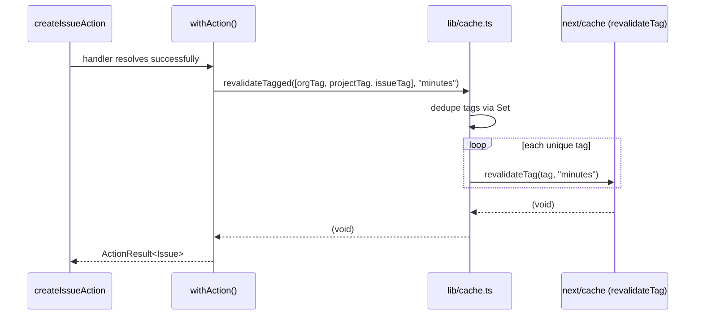

## Purpose

`src/lib/cache.ts` is a small file with an outsized job: it is the one place Next.js
16's changed `revalidateTag()` signature is spelled out, so the forty-plus Server
Action call sites across src/actions/ never import `next/cache` themselves. This
document covers the cache tag vocabulary, the `cacheLife` profile system, and how
`withAction()` ties the two together at the seam between a write and the pages that
should reflect it.

## Constraints

- No file outside `src/lib/cache.ts` imports `revalidateTag` from `next/cache`
  directly. Every Server Action that needs to invalidate a cache tag calls
  `revalidateTagged()`.
- `revalidateTag()` in Next 16 requires a `cacheLife` profile name as its second
  argument — omitting it, or passing an arbitrary string that is not a registered
  profile, is the kind of silent breakage `cache.ts`'s own docstring calls "exactly
  the kind of API change that rots when it is spelled out at forty call sites."
- Cache tags are chosen by the action author at the call site (`data-flow.md`
  DES-023) — there is no automatic dependency tracking from a database write to
  every page that read the affected row.
- `revalidateTagged()` de-duplicates its input tag list via `new Set()` before
  calling `revalidateTag()` per tag, so a caller assembling a tag list from several
  conditionals does not need to worry about accidental repeats.

## DES-070 — The cache tag vocabulary: `orgTag`, `projectTag`, `issueTag`

- **Satisfies:** REQ-052
- **Decided in:** ADR-019
- **Code:** `src/lib/cache.ts`

Three tag constructors, each a template string over a branded id:
`orgTag(orgId)` → `` `org:${orgId}` ``, `projectTag(projectId)` →
`` `project:${projectId}` ``, `issueTag(issueId)` → `` `issue:${issueId}` ``. The
vocabulary is deliberately small — three entity kinds, not one tag per queryable
field — which means a Server Component that wants fine-grained cache behavior (say,
a page that only cares about an issue's status, not its comments) still tags at the
whole-issue granularity, trading some avoidable revalidation for a vocabulary a
reviewer can hold in their head. There is no `commentTag()` or `memberTag()`;
mutations to those entities revalidate the parent `issueTag()` or `orgTag()` instead
— visible directly in `create-comment.ts`'s and `delete-comment.ts`'s
`revalidateTagged([issueTag(...)], ...)` calls.

## DES-071 — `revalidateTagged()` and the required `cacheLife` profile

- **Satisfies:** REQ-052
- **Decided in:** ADR-019
- **Code:** `src/lib/cache.ts`

`revalidateTagged(tags, profile = CACHE_PROFILES.minutes)` is the sole wrapper around
`revalidateTag`: it iterates the de-duplicated tag set, skips an empty-string tag
(a defensive check against a caller accidentally spreading an unset id into the
list), and calls `revalidateTag(tag, profile)` per tag — with the profile argument
Next 16 requires and every one of `cache.ts`'s callers would otherwise have to
remember individually.

The sequence shows the profile argument flowing from the action's declared
`cacheProfile` option, through `withAction()`, into every `revalidateTag()` call for
that mutation — one profile per action call, not one profile per tag, which is a
simplification worth noting: a mutation that touches both an org-level tag and an
issue-level tag cannot currently ask for a different staleness budget for each.

## DES-072 — `CACHE_PROFILES`: three named staleness budgets

- **Satisfies:** REQ-052
- **Code:** `src/lib/cache.ts`

`CACHE_PROFILES` is `Readonly<Record<"seconds" | "minutes" | "hours", string>>`,
mapping each key to its own name — `seconds` → `"seconds"`, `minutes` → `"minutes"`,
`hours` → `"hours"` — which reads as a no-op mapping until you notice its purpose is
purely to give call sites a named constant (`CACHE_PROFILES.minutes`) instead of a
bare string literal (`"minutes"`), so a typo in a profile name is a TypeScript
property-access error rather than a silently-ignored string Next's cache-life system
would fall back on. The three profile names themselves are assumed, not declared, to
correspond to `cacheLife` profiles configured elsewhere in the Next.js configuration
— this file is the *consumer* of that configuration's names, not their source.

## DES-073 — `withAction()`'s `revalidate` and `cacheProfile` options

- **Satisfies:** REQ-052, REQ-053
- **Code:** `src/actions/_lib/with-action.ts`

`ActionOptions.revalidate` is the static tag list a given action always invalidates
on success; `ActionOptions.cacheProfile` overrides the default
`CACHE_PROFILES.minutes` for that action. In practice the tag list at each call site
is built dynamically inside the handler (`orgTag(input.orgId)`,
`projectTag(project.id)`, and so on, computed from ids only known after the mutation
ran) and passed through the `revalidate` option rather than being a literal array in
`ActionOptions` — `create-issue.ts` revalidates three tags at once
(`orgTag`, `projectTag`, `issueTag`) because a new issue changes what the
organization overview, the project board and the issue's own detail page would all
show.

## DES-074 — Staleness budget per profile, by example

- **Satisfies:** REQ-052

Reading across the real call sites gives the de facto policy, since there is no
single table declaring it: `seconds` is used for anything conversational and
frequently re-read — comment creation, comment deletion and issue assignment all
revalidate under `CACHE_PROFILES.seconds`, because a stale comment thread or a stale
assignee is the kind of staleness a user notices within the same session. `minutes`
is the default for most other mutations — organization settings, project
create/update/archive/restore, flag toggles, member invites — content that changes
less often and where a short window of staleness is an acceptable trade for fewer
cache misses. `hours` is reserved for content that is genuinely slow-moving: label
create/delete and billing plan changes both revalidate under `CACHE_PROFILES.hours`,
on the reasoning that labels are configured rarely and a plan change's UI
consequences (updated quota meters) are not urgent to the second.

## DES-075 — Tag composition: a mutation can invalidate more than one entity's cache

- **Satisfies:** REQ-052
- **Code:** `src/actions/projects/archive-project.ts`, `src/actions/projects/restore-project.ts`

`archive-project.ts` and `restore-project.ts` both revalidate `[orgTag(...),
projectTag(...)]` together, not just the project's own tag — archiving a project
changes what the organization-level project list shows (REQ-046: "archived projects
are hidden from default listings"), so the org tag has to be included even though
the mutation's primary subject is the project. This is the clearest illustration of
DES-023's point that tag selection is a manual judgment call at each action's author:
nothing computes "which pages would show stale data" automatically from the shape of
the write itself, so a reviewer checking a new mutation's `revalidate` list has to
reason about every page that reads the affected data, the same way the author had to.

## DES-076 — The client-side flag snapshot is a cache-adjacent, not cache-tagged, concern

- **Satisfies:** REQ-194
- **Code:** `src/lib/feature-flags.ts`, `src/config/nav.ts`

`snapshotFlags()` is serialized once per dashboard layout render into the client
`OrgProvider` (`src/app/(dashboard)/[orgSlug]/_components/org-provider.tsx`) so
`useFeatureFlag()` on the client answers without a round trip — REQ-194: "the client
receives a flag snapshot, not the registry." This is not tagged or revalidated
through `cache.ts` at all; it is simply recomputed on every layout render, because
`isEnabled()` is cheap (a synchronous strategy evaluation, no database read beyond
the org and actor already loaded for the request) and a stale flag snapshot would be
a correctness bug (a user seeing a feature that was just toggled off), not merely a
freshness inconvenience, so this one piece of "cached" client state deliberately
opts out of the tag-based staleness budget the rest of this document describes.

## DES-077 — `withAction()`'s revalidation is best-effort, not transactional

- **Satisfies:** REQ-052, REQ-053
- **Code:** `src/actions/_lib/with-action.ts`

`revalidateTagged()` runs after the handler has already returned successfully and
after the database write is already committed — there is no rollback path if
revalidation itself were to throw (in practice it does not, since `revalidateTag()`
only touches Next's in-memory cache metadata, not the database), but the ordering is
worth stating plainly: the write is the durable fact, the cache tag invalidation is a
best-effort signal to the framework about what to refetch next, and the two are never
part of one atomic operation. A page that was mid-render against a cached value at
the exact moment `revalidateTagged()` ran may still serve that stale value for the
current request; the guarantee is only that the *next* request for a tagged page
sees fresh data, not that every in-flight request does.

`update-comment.ts` revalidates a literal string tag, `"comments"`, rather than
`issueTag(comment.issueId)` the way `create-comment.ts` and `delete-comment.ts` both
do — this is an inconsistency worth flagging rather than a documented alternate
pattern: nothing in the codebase reads a `Next.js` cache entry tagged with the plain
string `"comments"`, since every comment-thread read in the app is a Server
Component render scoped to one issue and tagged (if at all) with that issue's tag.
The practical effect is that editing a comment likely under-invalidates: a comment
edit's cache-tag call does not match the tag an issue detail page would have been
revalidated under by a sibling comment creation, so a stale comment body can persist
past the `seconds` profile's intended freshness.

## Why tags are entity-shaped rather than query-shaped

An alternative design DES-070 could have taken — tagging by the specific query shape
a page uses, e.g. `issues:status=open:project=<id>` — was deliberately avoided in
favor of the coarser three-entity vocabulary. The reasoning shows up indirectly in
how few distinct tags any single mutation ever needs: `create-issue.ts` invalidates
exactly three tags regardless of how many different filtered views of the issue list
exist across the product (the board, the cross-project "my issues" page, a labeled
subset, a search result). A query-shaped tag vocabulary would need every one of those
views to be individually tagged and individually invalidated by every mutation that
could affect any of them, which multiplies the surface area DES-075's "which pages
does this affect" judgment call has to reason about. The trade-off is the one
described in DES-075 and DES-077: some over-invalidation (a filtered view refetches
even when the specific filter it cares about did not change) in exchange for a
tag vocabulary small enough that an engineer new to the codebase can learn all of it
in one read of `cache.ts`.

## How this interacts with Server Component caching more broadly

Next 16's Data Cache and the `cacheLife`/`revalidateTag` system this document covers
sit alongside, not instead of, ordinary React Server Component behavior — a
Server Component with no explicit caching directive still re-executes on every
request by default; `revalidateTagged()` matters specifically for the subset of
reads that opted into the tagged cache via `"use cache"` or an equivalent directive
upstream of the read. The corpus does not document every individual page's caching
directive here — that level of per-page detail belongs to the pages themselves — but
the tag vocabulary and profile system in `cache.ts` is the shared mechanism any page
that does opt in must use, which is why this file describes the mechanism rather than
enumerating which of the roughly seventy page components currently use it.

## Choosing a profile: a worked comparison

Placing three real call sites side by side makes the profile-selection judgment call
concrete. `assign-issue.ts` revalidates `[issueTag(issue.id)]` under
`CACHE_PROFILES.seconds` — an assignment is the kind of change a teammate watching
the issue detail page expects to see reflected within moments, so the tightest
staleness budget applies even though only one tag is touched. `create-project.ts`
revalidates `[orgTag(input.orgId), projectTag(project.id)]` (a new project changes
both the org-level project list and gets its own detail page) under
`CACHE_PROFILES.minutes` — a new project is a rarer event than an issue assignment,
and a minute of staleness on "does this new project show up in the list yet" is an
acceptable trade for not re-rendering the org dashboard on every trivial mutation
touching that tag. `change-plan.ts` revalidates `[orgTag(input.orgId)]` under
`CACHE_PROFILES.hours` — a plan change is rare, its UI consequences (quota meters,
gated features) are not urgent to the second, and choosing the loosest budget here
reduces cache churn for a tag (`orgTag`) that a great many other mutations also
revalidate under tighter profiles, so an hour-scale profile on this one mutation does
not meaningfully change how fresh `orgTag` reads are in practice, since something
else touching that same tag under `seconds` or `minutes` is far more likely to have
run more recently anyway.

## Known rough edges

- The `update-comment.ts` tag mismatch documented in DES-077 above is the most
  concrete example, but the broader pattern — tag selection is manual per action,
  with no shared source of truth for "which tags does entity X's detail page read" —
  means this class of bug (a new or edited action picking the wrong tag, or no tag)
  is only caught by a human noticing stale UI in testing, not by any automated check.
- `CACHE_PROFILES`'s three keys mapping to identically-named string values means a
  typo made directly in a raw string literal (bypassing the constant) would compile
  and run without a visible error until a QA pass or a user report caught the
  staleness — the safety `CACHE_PROFILES` provides only holds for call sites that
  actually use the constant rather than a hand-typed string, which is exactly the gap
  `update-comment.ts`'s tag (not profile, but the same class of literal-string risk)
  falls into.
- There is no mechanism to invalidate a tag from outside a Server Action — a
  background job that changes state relevant to a cached page (`cleanup-archived-job`
  removing search documents, `trial-expiry-job` changing a plan) does not call
  `revalidateTagged()` at all, relying instead on the request-time page load's own
  natural cache expiry under whatever profile it was tagged with, which means a job's
  effects can be visibly stale on a cached page for up to that profile's window even
  though the underlying data already changed.
- The three-tier profile system (`seconds`/`minutes`/`hours`) has no explicit numeric
  duration documented alongside it in this codebase — the actual `cacheLife`
  durations each name maps to are configured in the Next.js project configuration
  rather than in `cache.ts`, so a reader of this file learns the relative ordering
  and the intended use case per tier, but not the literal number of seconds, minutes
  or hours each profile actually holds a cached value for without also reading that
  configuration.
