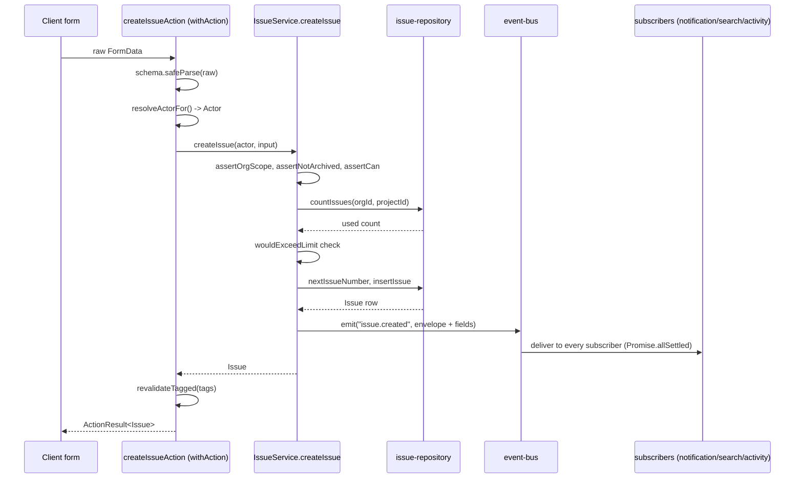

## Purpose

This document walks the two directions data moves through Taskflow: the write path
from a form submission down to a database row and back out as a revalidated cache
tag, and the read path from a Server Component render up through the cache. Where
`module-map.md` names the layers, this document traces one concrete request through
all of them so the layer boundaries have a lived example rather than only an
abstract rule.

## Constraints

- Every mutation is a Server Action wrapped in `withAction()`
  (`src/actions/_lib/with-action.ts`) except the five layering exceptions catalogued
  in `module-map.md` DES-017, one of which — `update-profile.ts` — is itself still a
  Server Action, just one that skips the service layer, not one that skips
  `withAction()`.
- A Server Action never imports `next/cache` directly; it names cache tags in its
  `withAction()` call and lets `revalidateTagged()` do the actual invalidation
  (`caching-and-revalidation.md`).
- A service function never returns a raw thrown error to its caller without it being
  one of the six domain error classes `toAppError()` (`src/lib/errors.ts`) knows how
  to translate, or a `ZodError` from schema validation upstream of the service call.
- Domain events are the only sanctioned way one write triggers work outside its own
  service — a service must never import and call a sibling service to "also do the
  notification part."

## DES-020 — The canonical write path: action → service → repository → db → event

- **Satisfies:** REQ-053, REQ-065, REQ-066, REQ-067
- **Decided in:** ADR-013
- **Code:** src/actions/issues/, `src/server/services/issue-service.ts`, `src/server/repositories/issue-repository.ts`

Take `createIssue` as the concrete instance. A Server Action in src/actions/issues/
parses the raw `FormData`-derived object with a Zod schema from `src/schemas/issue.ts`,
resolves the actor, and calls `issueService.createIssue(actor, input)`. Inside the
service (`src/server/services/issue-service.ts`), four gates run in a fixed order
before any row is written: `assertOrgScope(actor, input.orgId)` (tenant scope, see
`tenant-isolation.md`), a `requireFound()` lookup of the parent project followed by
`assertNotArchived()`, `assertCan(actor, "issue:create", projectResource(project))`
(authorization, see `permission-model.md`), and finally a quota check —
`wouldExceedLimit(org.plan, "issuesPerProject", used)` — that throws a plain `Error`
rather than a domain error class if the per-project issue quota (REQ-064) would be
exceeded. Only after all four gates pass does `issueRepo.nextIssueNumber()` allocate
the per-project issue number (REQ-061) and `issueRepo.insertIssue()` write the row.
The very last step is `emit("issue.created", {...})`, which is what makes
notifications, search indexing and activity logging happen without `IssueService`
knowing any of those three services exist.

The sequence makes explicit something easy to miss reading the service file alone:
`emit()` is awaited inside the service (see DES-024 below and `event-bus.md`
DES-052), so every subscriber has run — or thrown and been isolated — before
`createIssue` returns to the action, and therefore before `withAction()` revalidates
any cache tag. A cache tag never fires ahead of the event fan-out it depends on.

## DES-021 — `withAction()`'s four responsibilities, in the order it performs them

- **Satisfies:** REQ-053
- **Code:** `src/actions/_lib/with-action.ts`

`withAction(schema, handler, options)` returns the function a form actually calls,
and performs, in order: (1) `schema.safeParse(raw)` — a failure short-circuits
straight to a `validation_failed` `ActionResult` without ever resolving an actor;
(2) actor resolution via `resolveActorFor()`, which reads `orgSlug` or `orgId` off
the *parsed* input when `options.requireOrg !== false` and falls back to the
session's active organization otherwise (this is the `requireOrg: false` path
`update-profile.ts` uses, since a profile update names no organization); (3) the
handler call itself, wrapped in a `try`/`catch`; (4) on success, `revalidateTagged()`
against `options.revalidate` under `options.cacheProfile ?? CACHE_PROFILES.minutes`.
Every branch — success or thrown error — passes through `stamp()`, which adds a
`submittedAt` ISO timestamp `useActionState` uses to distinguish two results that
otherwise look identical to React (DES-025 covers the error branch specifically).

## DES-022 — The canonical read path in a Server Component

- **Satisfies:** REQ-077, REQ-078
- **Code:** `src/app/(dashboard)/[orgSlug]/projects/[projectSlug]/issues/page.tsx`, `src/server/services/issue-service.ts`

Reads do not go through `withAction()` — there is no equivalent read wrapper,
because a Server Component render already has the actor available from the layout
above it (`src/app/(dashboard)/[orgSlug]/layout.tsx` resolves the `Actor` once per
request and the page below it reuses that resolution rather than re-deriving it).
A typical list page — `.../issues/page.tsx` — parses `await searchParams` with a
Zod schema (REQ-077's filter-by-status/assignee/label requirement), calls
`issueService.listIssues(actor, filterInput)`, and renders the returned `Page<Issue>`
directly; the service still runs `assertCan(actor, "issue:read", ...)` internally, so
a read path is not actually "unauthenticated" just because it skips the action
wrapper — it is unwrapped, not unchecked.

## DES-023 — Cache tags and revalidation sit at the seam between write and read paths

- **Satisfies:** REQ-052, REQ-077
- **Decided in:** ADR-019
- **Code:** `src/lib/cache.ts`

The write path's last action-layer step is `revalidateTagged(tags, profile)`; the
read path's Server Component render is where Next's Data Cache, tagged with the same
strings, is consulted. `createIssueAction` revalidates `projectTag(projectId)` (the
issue list and board for that project) and, because a new issue changes usage
counters, potentially a tag scoped to the organization's billing summary. The full
tag vocabulary and per-action tag lists live in `caching-and-revalidation.md`; this
document only establishes that the tag is chosen at the action layer, not inferred
automatically — there is no dependency tracker walking from a database write back to
every page that read that row.

## DES-024 — Domain events are the write path's only sanctioned fan-out mechanism

- **Satisfies:** REQ-053, REQ-065, REQ-111, REQ-220
- **Decided in:** ADR-005
- **Code:** `src/lib/event-bus.ts`, `src/server/services/event-registry.ts`

Every service that changes tenant-visible state ends its mutation with an `emit()`
call built from `_support.ts`'s `actorEnvelope()`/`envelope()` helpers. The full
event catalogue, subscriber wiring and delivery guarantees are `event-bus.md`'s
subject; the data-flow-relevant fact is that this is the *only* branch point in the
write path — a service that wants a side effect in another domain (log it, notify
someone, index it, deliver a webhook) emits an event and trusts a subscriber
elsewhere to react, rather than importing that other domain's service function
directly. `activity-service.ts` alone subscribes to essentially the whole event
catalogue, which is why REQ-220 ("every domain event is recorded as an activity
row") is achievable without every other service knowing activity logging exists.

## DES-025 — Error translation: one thrown class, one `ErrorCode`, one HTTP status

- **Satisfies:** REQ-138
- **Code:** `src/lib/errors.ts`

When a service throws, `withAction()`'s `catch` block hands the error to
`toActionResult()`, which calls `toAppError()`. That function pattern-matches on six
domain error classes plus `ZodError` and produces an `AppErrorShape` carrying an
`ErrorCode` (`unauthorized` / `forbidden` / `not_found` / `validation_failed` /
`conflict` / `rate_limited` / `plan_limit_exceeded` / `tenant_scope_violation` /
`internal_error`) and, for the four richer cases, a `meta` object a form or toast can
read without string-matching a message — `PermissionDeniedError` surfaces `action`,
`resourceKind` and `reason` straight from the `PermissionDecision` computed in
`permission-model.md`. Anything that is not one of those recognized classes falls
through to `internal_error` with the raw `Error.message`, which is why services are
expected to throw the specific domain class (or the ad hoc quota `Error` noted in
DES-020, which is a known gap — see Known rough edges below) rather than a bare
string.

## DES-026 — The layering exceptions inside the data flow specifically

- **Satisfies:** REQ-072
- **Decided in:** ADR-013

`module-map.md` DES-017 lists all five exceptions structurally; here is what each one
means for the write/read path specifically. Four of the five are read paths that
short-circuit straight from a page component to a repository, skipping both the
service layer's `assertCan()` call and any event emission — which is safe precisely
because nothing is written. The fifth, `src/actions/profile/update-profile.ts`, *is*
a write: it is still a Server Action behind `withAction()`, so schema validation and
actor resolution both still happen, but the mutation itself
(`updateUser(input.userId, patch)`) skips `assertCan()` in favor of an inline
`input.userId !== actor.userId` check, and it does not `emit()` anything, because
there is no profile-update event in `TaskflowEventMap`. A reviewer extending this
action to, say, let an admin edit someone else's profile would need to notice both
gaps — the missing permission check and the missing event — rather than assuming the
existing shape already covers that case.

## DES-027 — Route Handler flows that never touch a Server Action

- **Satisfies:** REQ-160, REQ-079
- **Code:** src/app/api/webhooks/, src/app/api/export/

Two Route Handler flows are worth tracing separately because they do not fit the
action/service shape at all. The inbound webhook receiver under
src/app/api/webhooks/ reads a signed payload from an external caller — there is no
`Actor`, because the caller is not a logged-in Taskflow user; authentication is the
payload signature, verified against the endpoint's stored secret the same way
`signPayload()` (`src/server/services/webhook-service.ts`) produces one on the
outbound side. The CSV export route under src/app/api/export/ calls
`activityService.exportActivity()` or the issue equivalent directly, sets response
headers via `csvResponseHeaders()` (`src/lib/csv.ts`), and streams a `text/csv` body
— there is no `ActionResult` envelope here because the client is a browser download,
not `useActionState`.

## The `stamp()` step and `useActionState`

Every branch through `withAction()` — success or failure — passes through `stamp()`
before returning, which appends `submittedAt: new Date().toISOString()` to the
`ActionResult`. This exists for one specific reason: React's `useActionState` hook,
which every mutating form in `src/app/(dashboard)/**` uses to bind a Server Action to
form state, identifies a "new" result by reference equality of the state object it
receives back, not by its content. Two consecutive submissions of an identical form
value (a user double-clicking "Save" on an unchanged field, say) would otherwise
produce two `ActionResult` objects that are structurally identical and could be
mistaken by naive form-state logic for "nothing happened" — `stamp()`'s timestamp
guarantees the two results always differ by at least that field, so the client
component reliably re-renders (clearing a pending spinner, re-focusing an error
field) on every submission, not just ones whose payload changed.

## Reading a filter query end to end

`listIssues(actor, input: IssueFilterInput)` is worth tracing once as the read-path
counterpart to DES-020's write-path trace, because REQ-077 and REQ-078 both land in
this one function. The Server Component parses `await searchParams` with a schema
that clamps `limit` to `MAX_PAGE_SIZE` (100) and defaults to `DEFAULT_PAGE_SIZE` (25)
if unset, decodes an opaque cursor via `base-repository.ts`'s `decodeCursor()` if one
is present, and passes the whole filter object — status, assignee, label ids, cursor,
limit — into `issueService.listIssues()`. The service checks `assertCan(actor,
"issue:read", ...)` once, scoped to the project rather than per-issue (checking
`issue:read` per row in a 100-row page would be needlessly expensive for a
`viewer`-minimum action every member and above already passes), then delegates the
actual filtering and keyset pagination to `issueRepo.listIssues()`, which composes
`orgPredicate()`, the status/assignee/label predicates, and `livePredicate()` (REQ-071:
issues are archived, not deleted, by default, so a plain listing excludes archived
rows unless `includeArchived` is explicitly set). The returned `Page<Issue>` carries
its own `nextCursor`, encoded the same way the input cursor was decoded, so the next
request round-trips it back without either side needing to understand its internal
shape — `encodeCursor`/`decodeCursor` are the only two functions in the codebase that
do.

## What a failed validation looks like before an actor is even resolved

It is worth tracing the failure branch of DES-021's step (1) specifically, because it
is the one path through `withAction()` that never touches the database or the
session at all. `schema.safeParse(raw)` failing means `parsed.success` is `false`;
`withAction()` immediately calls `toActionResult(parsed.error)` — a `ZodError` — and
returns, having never called `resolveActorFor()`. This ordering is a deliberate
resource-usage decision, not just a code-organization one: a malformed or malicious
payload (a bot submitting garbage to a public form endpoint, say) is rejected before
Taskflow spends a database round trip resolving who submitted it, which keeps a flood
of invalid submissions cheap to reject rather than expensive. The trade-off is that a
validation failure never appears with actor context in `fieldErrorsFromZod()`'s
output — there is no "which user submitted this bad payload" available at the point
the error is constructed, only after the fact via whatever access-log or reverse-proxy
logging sits in front of the Next.js process, which this corpus does not document
since it lives outside the application layer entirely.

## Known rough edges

- The per-project issue quota check in `createIssue` throws a plain `Error`, not one
  of the domain error classes `toAppError()` recognizes by type — it falls through to
  `internal_error` (HTTP 500) rather than `plan_limit_exceeded` (HTTP 402), which
  contradicts REQ-138's requirement that a quota breach "produces
  `plan_limit_exceeded`, not a crash." `billing-service.ts`'s `assertWithinLimit()`
  is the correctly-typed version of this check and other call sites use it; this one
  path in `issue-service.ts` is inconsistent with the pattern the rest of the
  codebase follows.
- There is no request-scoped cache or dataloader batching reads within one render —
  `getIssue()`, `getThread()` and `listActivityForSubject()` on an issue detail page
  are three independent repository round trips with no shared request context to
  deduplicate them if two components on the same page happened to want the same row.
- Cache tag selection at the action layer (DES-023) is manual per action file; a
  developer adding a new field to an existing mutation must remember to check whether
  the existing `revalidate` list still covers every page that reads that field, since
  nothing computes the tag list from the actual repository write.
- The four read-path layering exceptions (DES-026) mean a page's data-fetching code
  is not uniform across the app: most pages call one service function and get back an
  already-authorized, already-shaped result, while these four call a repository
  function directly and would need their own inline authorization check if the
  requirement ever changed from "any member may see this" to something narrower —
  today none of the four need such a check, but that absence is a property of the
  current requirements, not a structural guarantee the data flow enforces.
