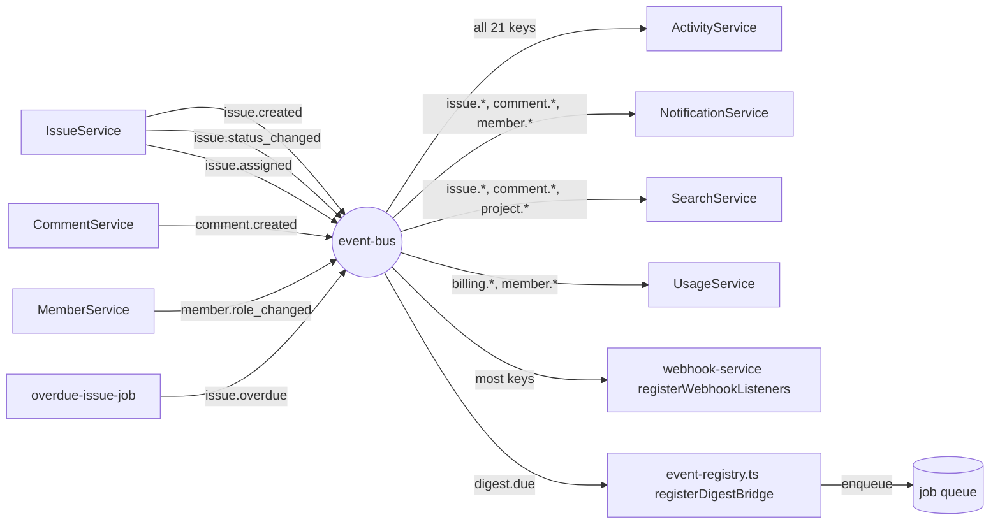

## Purpose

`src/lib/event-bus.ts` is the in-process, typed publish/subscribe mechanism that
decouples `IssueService`, `CommentService`, `MemberService`, `ProjectService`,
`OrganizationService` and `BillingService` from `ActivityService`,
`NotificationService`, `SearchService` and the webhook dispatcher. This document
covers the bus mechanics — `emit`, `subscribe`, error isolation, the 21-key event
catalogue — and how `event-registry.ts` wires every subscriber at process start.
`data-flow.md` DES-024 places this bus inside the larger write path; this document is
the bus's own internals.

## Constraints

- The bus is in-process and non-durable (ADR-005): an event that is emitted while no
  process is running, or that fails after every subscriber has thrown, leaves no
  trace beyond whatever the error sinks logged. There is no outbox table and no
  message broker behind this bus — see `background-jobs.md` for the job queue, which
  is a separate, equally in-process mechanism the bus feeds into for exactly one
  event (`digest.due`).
- `emit()` resolves only after every subscriber has settled (`Promise.allSettled`),
  never rejects itself, and reports individual handler failures to registered error
  sinks instead. A throwing subscriber never fails the write that triggered the
  event, and never prevents a sibling subscriber from running.
- Every event type is a key of `TaskflowEventMap` (`src/types/event.ts`). Adding an
  event means adding a key there — there is no untyped `emit("something", {...})`
  path.
- Subscribers are registered exactly once per process, from `event-registry.ts`,
  called from `src/instrumentation.ts`. A service must never call `subscribe()` from
  module top-level scope outside its own `register*Listeners()` function, because
  that would run on import rather than on the deliberate `registerEventHandlers()`
  call — the one documented exception is `notification-service.ts`, noted in DES-055.

## DES-050 — `emit()` / `subscribe()` as the typed in-process bus

- **Satisfies:** REQ-053, REQ-065, REQ-066, REQ-067
- **Decided in:** ADR-005
- **Code:** `src/lib/event-bus.ts`

`subscribe<K>(type, handler)` adds a handler to a `Set` keyed by event type in a
module-scope `Map<TaskflowEventType, HandlerSet>` and returns an `Unsubscribe`
closure that removes it — every subscriber in the codebase keeps that closure and
calls it as part of its own teardown path (see `event-registry.ts`'s
`unregisterEventHandlers()`, which fans out to every service's returned
`Unsubscribe`). `emit<K>(type, payload)` looks up the handler set for that type,
and — if it is empty or absent — returns immediately without doing anything, which
is a deliberate cheap path: emitting an event nobody has subscribed to yet (during
early development of a new event, say) is a no-op, not an error.

## DES-051 — `TaskflowEventMap`: 21 keys, one shared envelope

- **Satisfies:** REQ-053, REQ-065, REQ-111, REQ-220
- **Code:** `src/types/event.ts`

Every payload extends `EventEnvelope` (`orgId`, `actorId: UserId | null`,
`occurredAt: IsoTimestamp`), stamped by `_support.ts`'s `envelope()`/`actorEnvelope()`
helpers rather than assembled inline at each `emit()` call site — this is what
guarantees `ActivityService`'s universal subscriber (DES-055) can always read
`payload.orgId` and `payload.occurredAt` regardless of which of the 21 event types it
is handling. The 21 keys group into eight domains: project (`project.created`,
`project.archived`, `project.restored`), issue (`issue.created`, `issue.updated`,
`issue.status_changed`, `issue.assigned`, `issue.archived`, `issue.overdue`), comment
(`comment.created`, `comment.deleted`), member (`member.invited`, `member.joined`,
`member.role_changed`, `member.removed`), billing (`billing.plan_changed`,
`billing.limit_exceeded`), flags (`flag.toggled`), digest (`digest.due`), search
(`search.reindex_requested`) and webhook (`webhook.delivery_requested`). Two payloads
are worth calling out for what they deliberately omit: `issue.updated` carries only
`changedFields: readonly string[]`, not the before/after values themselves (REQ-068:
"only the changed fields are reported"), and `issue.assigned` carries both
`previousAssigneeId` and `assigneeId` specifically so a notification subscriber can
distinguish "newly assigned" from "reassigned away from someone" without a second
lookup (REQ-067).

The fan-out is asymmetric by design: `ActivityService` subscribes to essentially
everything (REQ-220), while `SearchService` only cares about the three subject kinds
it indexes, and `UsageService` only cares about events that move a usage counter.
Nothing in the bus itself enforces this asymmetry — it falls entirely out of what
each service's `register*Listeners()` function chooses to `subscribe()` to.

## DES-052 — Handler isolation via `Promise.allSettled`

- **Satisfies:** REQ-228
- **Code:** `src/lib/event-bus.ts`

`emit()` maps every handler in the set to an awaited call, collects them with
`Promise.allSettled`, and iterates the results afterward, reporting each `rejected`
result to `reportHandlerError()` — it never `throw`s from `emit()` itself for a
handler failure. This is what makes REQ-228 ("activity capture must not fail the
originating write") true structurally rather than by convention: even if
`ActivityService`'s subscriber throws on inserting an audit row, `IssueService`'s
`createIssue()` call to `emit()` still resolves normally, because the promise it
awaited was `emit()`'s own promise, not any individual handler's. The cost of this
isolation is that a systematically broken subscriber (a bad migration that makes
every `activity` insert fail, say) fails silently from the perspective of the
mutation that triggered it — nothing about a successful `issue.created` response
tells the caller that the activity row never got written.

## DES-053 — `subscribeOnce` and the `Unsubscribe` contract

- **Satisfies:** REQ-053
- **Code:** `src/lib/event-bus.ts`

`subscribeOnce(type, handler)` wraps `subscribe()` with a handler that calls its own
returned `off()` before running the real handler — a self-detaching listener for the
rare case something needs to react to exactly one occurrence of an event type rather
than every occurrence. No service in the current codebase uses this yet (all seven
`register*Listeners()` functions use plain `subscribe()`), but it exists because a
correct one-shot listener is easy to get wrong by hand (detaching *after* the handler
runs risks a race if the handler itself throws before reaching the detach call — this
implementation detaches first, precisely to avoid that ordering bug).

## DES-054 — `emitAndForget` for call sites that must not await delivery

- **Satisfies:** REQ-053
- **Code:** `src/lib/event-bus.ts`

`emitAndForget(type, payload)` calls `emit()` without awaiting it, chaining a
`.catch()` that still reports failures to the error sinks — the return type is
`void`, not `Promise<void>`. No path in the current write flow (DES-020) uses this;
every service `await`s its `emit()` calls, which is what guarantees the ordering
`data-flow.md`'s sequence diagram relies on (every subscriber has run before
`withAction()` revalidates a cache tag). `emitAndForget` exists as an escape hatch
for a future call site — a hot loop that cannot afford to wait on a potentially slow
subscriber chain — but using it changes the ordering guarantee DES-020 depends on,
so a reviewer should treat a new `emitAndForget()` call site as a deliberate,
documented trade-off rather than a drop-in replacement for `emit()`.

## DES-055 — `event-registry.ts`: the one module that knows the full listener set

- **Satisfies:** REQ-053, REQ-111
- **Code:** `src/server/services/event-registry.ts`

`registerEventHandlers()` is idempotent (`detach !== null` guard) and calls five
things: `registerActivityListeners()`, `registerSearchListeners()`,
`registerUsageListeners()`, `registerWebhookListeners()`, and its own
`registerDigestBridge()` (DES-056). A sixth piece of wiring is present only as a
side effect: the file's own header comment documents that importing
`event-registry.ts` also imports `notification-service.ts`, which attaches its
fan-out hub on module load rather than through a `register*Listeners()` export —
"that hub has no `register*` entry point of its own." This is the one place in the
event-bus design that deviates from the "subscribe only inside a
`register*Listeners()` function" constraint stated above, and it is called out
explicitly in the source rather than left for a reader to discover by tracing
imports.

## DES-056 — The digest bridge: turning `digest.due` into a queued job

- **Satisfies:** REQ-119, REQ-123
- **Code:** `src/server/services/event-registry.ts`

`registerDigestBridge()` subscribes to `digest.due` and calls `enqueue()`
(`src/server/jobs/queue.ts`) with a `digest-email` job keyed
`digest:${orgId}:${recipientId}` — this is deliberately *not* inside
`DigestService` itself, per the file's comment: "keeping it here rather than inside
`DigestService` stops the service layer from depending on the job layer." It is the
one place an event handler's entire job is to bridge into the background-jobs
subsystem covered in `background-jobs.md`, and it is why REQ-123 ("digest sends emit
`digest.due` before rendering") is phrased as an event rather than a direct function
call — the event is the seam between "something decided a digest window closed" and
"something else renders and sends the email."

## DES-057 — Known coupling: `auth-service.ts` cannot emit auth events

- **Satisfies:** REQ-220
- **Code:** `src/server/services/auth-service.ts`

`auth-service.ts`'s own header comment states the gap directly: it "must call `emit`
but cannot, because `TaskflowEventMap` has no auth events." Login, registration,
logout and password reset therefore produce no domain event, which means
`ActivityService`'s universal subscriber never sees them and REQ-220's "every domain
event is recorded as an activity row" has a silent carve-out for the entire
authentication surface — there is no activity-log entry for "user X logged in" or
"user X reset their password," not because activity logging chose to exclude them,
but because there is no event to subscribe to in the first place.

## DES-058 — Delivery guarantees: at-most-once, in-memory, no ordering across types

- **Satisfies:** REQ-053
- **Decided in:** ADR-005

The bus makes no durability promise: an event emitted while the process is between
restarts, or during the brief window between `instrumentation.ts` starting and
`registerEventHandlers()` completing, is simply not delivered — there is no queue
buffering emits ahead of subscriber registration, unlike the job queue in
`background-jobs.md`, which does persist pending work across a `tick()`. Within one
process, delivery order across handlers of the *same* event type follows `Set`
insertion order (the order `register*Listeners()` calls ran in), but there is no
ordering guarantee across *different* event types even when they originate from the
same mutation — `issue.created` and any subsequent event from the same request are
each independent `emit()` calls, awaited in the sequence the service code happens to
call them, not coordinated by the bus.

## Why the bus is typed at all

`EventHandler<K>` is generic over one specific event key, not the whole
`TaskflowEventType` union, which is what lets `subscribe("issue.assigned", handler)`
give `handler` a parameter typed as exactly `TaskflowEventMap["issue.assigned"]` —
`assigneeId: UserId`, `previousAssigneeId: UserId | null`, and the shared envelope
fields — with no cast anywhere in the subscriber body. This matters more than it
might first appear for a corpus this size: `TaskflowEventMap` has 21 keys and eight
subscribing services, meaning roughly a hundred and fifty individual `(event, field)`
pairs a subscriber might read. Without the generic constraint, a typo in a payload
field name inside a handler (`payload.assignee` instead of `payload.assigneeId`,
say) would only surface at runtime, as `undefined` silently flowing into a
notification's recipient list. With it, the same typo is a compile error the moment
the handler is written, caught before the corpus's test suite even runs — the type
system substitutes for what would otherwise have to be a much larger set of
hand-written payload-shape tests per subscriber.

## The relationship between `emit()` and the write transaction

Because Taskflow's database access is not wrapped in an explicit transaction spanning
the repository write and the subsequent `emit()` call (`better-sqlite3` transactions
are used within a single repository function where needed, but a service's "insert
the row, then emit" sequence is two separate calls, not one atomic unit), there is a
narrow window where the row exists in the database but the event has not yet been
delivered, and — because `emit()` is awaited before the service function returns —
also a window where the row exists and every subscriber has already run, but the
`ActionResult` has not yet reached the client. In the failure case that actually
matters here (the process crashes between the insert and the `emit()` call
completing), the row survives — SQLite committed it — but no subscriber ever saw the
event, meaning no activity row, no notification, and no search index entry are
created for a row that otherwise exists. This is the event-bus equivalent of the
webhook and job queue's own lack of durability (`background-jobs.md` DES-069) and
stems from the same root cause: a single-process design with no write-ahead log
covering anything but the SQLite file itself.

## Comparing the bus to the job queue it feeds

It is easy to conflate the event bus with the job queue covered in
`background-jobs.md`, since `registerDigestBridge()` is the seam where one becomes
the other, but the two mechanisms have different delivery semantics worth stating
side by side. The event bus delivers synchronously, within the same `emit()` call, to
every currently-registered subscriber, and makes no attempt to persist an event that
arrives before a subscriber exists or after every subscriber has been detached — its
unit of durability is exactly zero. The job queue, by contrast, holds enqueued work
in its `pending` array across scheduler ticks, retries a failing job with backoff up
to `MAX_ATTEMPTS`, and is durable across an arbitrary number of `tick()` calls within
one process lifetime, even if that durability does not survive a process restart. A
service choosing between "emit an event" and "enqueue a job" for a given piece of
reactive work is really choosing between "this must happen synchronously, as part of
this request, isolated from the caller's success" and "this can happen on its own
schedule, with retries, independent of the request that triggered it" — notifications
and search indexing are event subscribers because REQ-111's fan-out is expected to be
visible essentially immediately, while webhook delivery is a job specifically because
REQ-156's retry-with-backoff requirement needs the durability and scheduling the
queue provides and the bus does not.

## Known rough edges

- No durability: a process crash between `emit()` starting and a subscriber's
  database write completing loses that side effect permanently, with only whatever
  the error sinks logged (nothing durable — `reportHandlerError()`'s sinks are
  in-memory registrations too) as a trace.
- `auth-service.ts`'s missing events (DES-057) mean any future audit or compliance
  requirement around login history would need either a new event catalogue entry (a
  breaking-ish change to `TaskflowEventMap`) or a separate, event-bus-independent
  logging path inside `auth-service.ts` itself.
- `notification-service.ts` attaching its fan-out on import rather than through
  `register*Listeners()` (DES-055) means the module has an implicit registration
  order dependency on being imported before `registerEventHandlers()` is called a
  second time — currently safe because `event-registry.ts` imports it directly, but
  fragile if that import were ever refactored into a lazy or conditional path.
