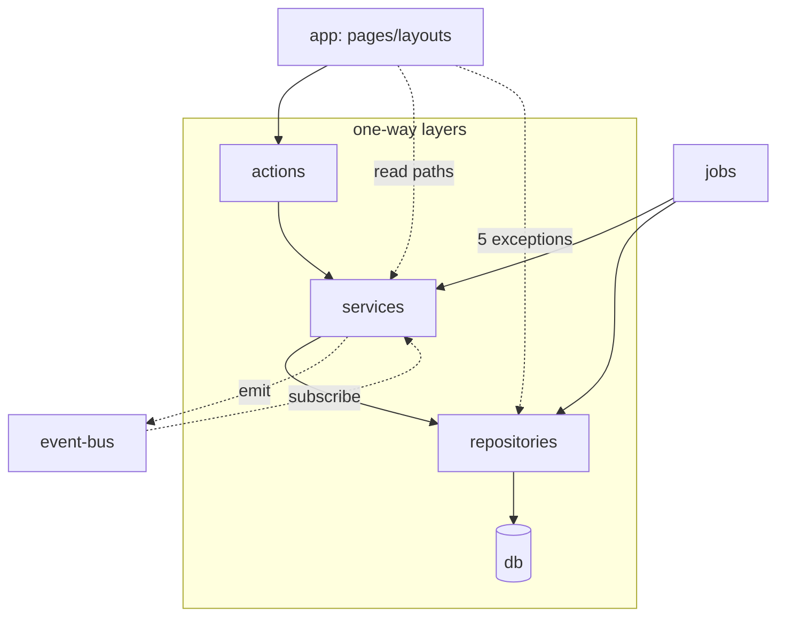

## Purpose

`architecture-overview.md` describes the four-layer shape at a conceptual level; this
document is the concrete map from that shape onto src/'s actual directories, plus
the import-direction rule that keeps the shape from eroding one convenient shortcut
at a time. If you are deciding which directory a new file belongs in, or reviewing a
pull request that adds an import you're unsure about, this is the reference to check
against.

## Constraints

- Every directory below has exactly one job. A file that seems to need two jobs
  (e.g. "validate this input and also send an email") is a sign the work belongs in
  two files across two layers, not one file that reaches across layers.
- Import direction is one-way: `actions → services → repositories → db`, plus
  `lib` and `config` and `types` as dependencies anyone may import. No repository
  imports a service; no service imports an action; no `lib` module imports from
  `server/`.
- Barrels (`src/server/services/index.ts`, `src/server/repositories/index.ts`) exist
  so `actions/**` imports from one module per layer rather than reaching into
  individual service files — but the barrel does not change the direction rule.
- The five layering exceptions listed in DES-017 below are the only sanctioned
  violations of the direction rule. Anything else that skips a layer is a bug, not a
  precedent.

## DES-010 — Top-level src/ directories and their responsibility

- **Satisfies:** REQ-010
- **Code:** src/actions/, src/app/, src/components/, src/config/, src/emails/, src/hooks/, src/lib/, src/schemas/, src/server/, src/types/

| directory | responsibility | may import from |
|---|---|---|
| src/types/ | Branded ids, discriminated unions, the shapes every other layer agrees on | nothing project-local |
| src/config/ | Declarative, mostly-static tables: plan limits, feature flags, nav, constants, env | `types` |
| src/schemas/ | Zod schemas shared by client forms and Server Actions (ADR-009) | `types` |
| src/lib/ | Cross-cutting primitives with zero domain knowledge: `can()`, `assertOrgScope()`, the event bus, the cache helpers, session cookie access | `types`, `config` |
| src/server/db/ | Drizzle schema, migrations, the single database connection, dev seed | `lib`, `types` |
| src/server/repositories/ | Persistence, `org_id` filtering, cursor pagination | `server/db`, `lib` (tenant/soft-delete helpers), `types` |
| src/server/services/ | Business rules, `can()` calls, event emission | `server/repositories`, `lib`, `config`, `schemas`, `types` |
| src/server/jobs/ | Scheduled and event-triggered background work | `server/services`, `server/repositories`, `lib`, `config` |
| src/actions/ | Server Action entry points: one file per mutation, wrapped in `withAction()` | `server/services` (via the barrel), `lib`, `schemas` |
| src/app/ | Routes: pages, layouts, Route Handlers | `actions`, `server/services` (read paths), `components`, `lib` |
| src/components/ | React components, `domain/` (business-aware) and `ui/` (generic) | `lib`, `hooks`, `types` — never `server/` directly |
| src/hooks/ | Client-side React hooks | `lib`, `types` |
| src/emails/ | React-email templates rendered by `email-service.ts` | `types` |

## DES-011 — The action layer is a thin validation-and-dispatch shim, on purpose

- **Satisfies:** REQ-010, REQ-053
- **Code:** `src/actions/_lib/with-action.ts`, src/actions/issues/, src/actions/comments/

src/actions/ has one file per mutation (`create-comment.ts`, `update-profile.ts`,
and so on), grouped into subdirectories that mirror the domain (`issues/`,
`comments/`, `billing/`, `members/`, `organizations/`, `projects/`, `labels/`,
`notifications/`, `flags/`, `webhooks/`, `search/`, `auth/`, `profile/`). Every file
in this directory is small: parse with a Zod schema from src/schemas/, call exactly
one service function, name the cache tags to revalidate. `withAction()`
(`src/actions/_lib/with-action.ts`) does the actual work of resolving the actor and
translating thrown errors, so an action file is close to declarative — see
`data-flow.md` DES-021 for the full contract. The discipline this enforces: business
logic never lives in src/actions/, because an action file has no test coverage of
its own beyond "does it call the right service with the right shape" — the service
function is what's actually tested.

## DES-012 — The service layer owns business rules and authorization

- **Satisfies:** REQ-020, REQ-021, REQ-053
- **Decided in:** ADR-013
- **Code:** `src/server/services/issue-service.ts`, `src/server/services/_support.ts`

`src/server/services/*.ts` is where `assertCan()` is called, where quota checks
against `PlanLimits` happen, where a state transition is validated (e.g. issue status
must be a member of the closed vocabulary before `changeIssueStatus` writes it), and
where domain events are constructed and `emit()`ted. `src/server/services/_support.ts`
holds the two adapter jobs every service needs and none should reimplement: building
a `PermissionResource` from a loaded row (`issueResource`, `commentResource`,
`projectResource`, and so on) and stamping an `EventEnvelope`
(`envelope`/`actorEnvelope`). `requireFound()` in the same file is the standard way a
service turns a `null` repository read into a `NotFoundError` — every service in the
21-file src/server/services/ directory uses it rather than writing its own null
check.

## DES-013 — The repository layer owns tenancy filtering and persistence, nothing else

- **Satisfies:** REQ-010, REQ-011
- **Decided in:** ADR-013
- **Code:** `src/server/repositories/base-repository.ts`, `src/server/repositories/issue-repository.ts`

Every repository function takes `orgId` as an early parameter (usually first) and
filters every query by it. `base-repository.ts` provides the shared machinery —
`orgPredicate()`, `livePredicate()` (which itself calls `shouldFilterArchived()` from
`src/lib/soft-delete.ts`), and cursor encode/decode for keyset pagination (ADR-008).
A repository function never calls `can()` and never receives an `Actor` — only an
`orgId`, because "is this row in scope for the org" and "may this actor act on it"
are different questions answered by different layers, and conflating them is exactly
what `tenant.ts`'s own docstring calls out as a review failure. `issue-repository.ts`
is the widest repository in the app (16 exported functions) because issues are
queried more ways than any other entity — by id, by number within a project, by
board column, by overdue status, and so on — but every one of those functions still
starts from `orgId`.

## DES-014 — `config/` is the single source of every numeric and declarative truth

- **Satisfies:** REQ-132, REQ-185
- **Decided in:** ADR-010, ADR-012
- **Code:** `src/config/plan-limits.ts`, `src/config/feature-flags.ts`, `src/config/constants.ts`, `src/config/nav.ts`, `src/config/env.ts`, `src/config/site.ts`

Six files, six different declarative truths, each owned in exactly one place so nine
different call sites cannot each pick a slightly different number: `plan-limits.ts`
(`PLAN_LIMITS`, `UNLIMITED = Number.POSITIVE_INFINITY`), `feature-flags.ts`
(`FEATURE_FLAG_DEFINITIONS`, ten flag keys with a `strategy` of `plan`, `role`,
`percentage` or `on`), `constants.ts` (`DEFAULT_PAGE_SIZE = 25`, `MAX_PAGE_SIZE =
100`, `COMMENT_EDIT_WINDOW_MINUTES = 15`, `WEBHOOK_MAX_ATTEMPTS = 5`,
`DIGEST_MAX_ENTRIES = 50`, `OVERDUE_LOOKAHEAD_HOURS = 24`), `nav.ts` (`SIDEBAR_NAV`
and `SETTINGS_NAV`, each item optionally naming the `PermissionAction` and
`FeatureFlagKey` that gate it), `env.ts` (the only reader of `process.env`), and
`site.ts` (marketing metadata). `config/` may only import from `types/` — nothing in
this directory reads a database row or calls a service, which is what keeps it safe
to import from the client bundle (the pricing grid at
`src/app/(marketing)/_components/pricing-grid.tsx` reads `PLAN_LIMITS` directly).

## DES-015 — `lib/` holds cross-cutting primitives that know nothing about the domain

- **Satisfies:** REQ-010, REQ-020
- **Code:** `src/lib/permissions.ts`, `src/lib/tenant.ts`, `src/lib/event-bus.ts`, `src/lib/cache.ts`, `src/lib/soft-delete.ts`, `src/lib/rate-limit.ts`

24 files. The distinguishing test for "does this belong in `lib/`": would the
function still make sense in a product that was not Taskflow? `can()` takes a generic
`PermissionAction`/`PermissionResource` pair, not "may this user edit this issue" —
the issue-specific meaning is supplied by the caller in `_support.ts`. `event-bus.ts`
is a generic typed pub/sub with no idea what `issue.created` means. `soft-delete.ts`
knows about an `archived_at` column shape, not about issues or projects specifically.
The one partial exception is `mentions.ts`, which is comment-shaped (`@handle`
parsing) but still domain-agnostic enough — it does not know what a comment *is*,
only how to find `@word` tokens outside code spans — to live here rather than in
`comment-service.ts`.

## DES-016 — Import direction is enforced by convention and review, not tooling

- **Satisfies:** REQ-010
- **Decided in:** ADR-013

There is no lint rule in this corpus that mechanically forbids a repository from
importing a service — the boundary is enforced by code review and by the fact that
importing "up" the stack usually produces a circular import that TypeScript's module
resolution catches first. The one place this bites in practice is
`src/server/jobs/queue.ts`, whose `runHandler()` dispatches to each job module with a
*dynamic* `import()` rather than a static one specifically to avoid a cycle: every
job module imports `queue.ts` to enqueue follow-up work (see
`background-jobs.md`), so a static import the other way would close the loop.

The dotted line from `app` straight to `repositories` is DES-017's five exceptions,
drawn as a diagram edge rather than left implicit — a reader scanning this picture
should see that shortcut exists rather than infer a cleaner architecture than the one
actually shipped.

## DES-017 — The five deliberate layering exceptions, file by file

- **Satisfies:** REQ-010, REQ-072
- **Decided in:** ADR-013

Restated here with the specific import each one takes, because `module-map.md` is
the file a reviewer checks when deciding whether a new import is allowed:

1. `src/actions/profile/update-profile.ts` imports `updateUser` from
   `@/server/repositories/user-repository` directly — no `ProfileService` exists.
2. `src/app/(dashboard)/[orgSlug]/profile/page.tsx` imports `findUserById` from the
   same repository, for the same reason.
3. `src/app/(dashboard)/[orgSlug]/settings/members/invitations/page.tsx` imports
   `listPendingInvitations` from `@/server/repositories/invitation-repository`
   directly, because `InvitationService` has no listing function.
4. `src/app/(dashboard)/[orgSlug]/settings/notifications/page.tsx` imports
   `listPreferences` from `@/server/repositories/notification-preference-repository`
   directly, same shape as #3.
5. `src/app/(dashboard)/[orgSlug]/projects/[projectSlug]/issues/[issueNumber]/page.tsx`
   imports `findIssueByNumber` from `@/server/repositories/issue-repository` directly,
   to resolve the URL's issue number to a row before any service call is possible.

None of the five perform a write — all five are read paths, which limits the blast
radius of skipping `assertCan()`: a Server Component can still choose not to render
data it fetched, whereas a bypassed write has no equivalent safety net. That said, #1
is the one write-adjacent case in the list (it calls a repository *update*, not a
read), and it is the reason `data-flow.md` DES-026 treats it separately from the
other four.

## The barrels: `src/server/services/index.ts` and `src/server/repositories/index.ts`

Both layers export a barrel file whose only job is re-exporting every public
function from its sibling files. `src/actions/**` imports exclusively from the
services barrel — an action file never imports `@/server/services/issue-service`
directly, always `@/server/services` — which means an action file's import block
reveals which services it depends on without revealing which specific file inside
src/server/services/ implements them, a small indirection that has let the team
split or merge individual service files (the notification and digest concerns were
briefly one file before REQ-119's digest requirements grew large enough to warrant
`digest-service.ts` as its own module) without touching a single action file's
imports. src/server/repositories has the equivalent barrel, but it is consumed
only by `src/server/services/*.ts` — the repository barrel is never imported from
src/actions/ or src/app/, which is a second, implicit enforcement of the layering
rule: even where a direct repository import is technically possible for a Server
Component (as the five exceptions demonstrate it is), those five exceptions each
import their specific repository file directly rather than through the barrel,
because pulling in the whole barrel from a page component would make the layering
violation more visible in the import list than the current one-off imports are.

## src/schemas/: the shared validation layer

`src/schemas/*.ts` holds the Zod schemas both client forms and Server Actions parse
against (ADR-009) — `updateProfileSchema`, `createCommentSchema`,
`loginSchema`, `registerSchema`, and so on, one file roughly per domain, mirroring
the src/actions/ subdirectory structure. A schema file imports only from
src/types/ (for the branded id types a `z.string()` refinement checks against) and
occasionally from `src/config/constants.ts` for a numeric bound — a page-size schema
clamping `limit` to `MAX_PAGE_SIZE`, for instance. Sharing the schema between the
client-rendered form (which uses it for inline validation feedback before submission)
and the server-side `withAction()` call (which uses the identical schema for the
authoritative `safeParse()`) is what makes REQ-053's validation guarantee hold
without a client and server copy of the same rule silently drifting apart — a client
form that trusts its own copy of a validation rule while the server enforces a
different one is a bug class this sharing eliminates by construction, not by
convention.

## src/components/domain/ vs src/components/ui/

The component directory splits the same way `lib/` splits from `server/services/`:
src/components/ui/ holds generic, product-agnostic building blocks (buttons,
dialogs, form fields, the src/components/ui/_lib/ helpers backing them) that would
be equally at home in a different product, while src/components/domain/ holds
components that know what an issue, a comment, a member or a webhook endpoint is —
src/components/domain/issue/, `.../comment/`, `.../member/`, `.../board/`,
`.../billing/`, `.../flags/`, `.../notification/`, `.../permission/`, `.../project/`,
`.../search/`, `.../nav/`, `.../activity/`. A domain component may import `can()` and
`isEnabled()` directly to decide what to render — `permission-gate.tsx` under
src/components/domain/permission/ exists specifically to wrap that check as a
reusable conditional-render component — but neither directory imports from
src/server/; a component receives the data and the permission decision it needs as
already-resolved props from the Server Component that rendered it, never by reaching
into a repository or service itself. This is the client/server boundary from
`architecture-overview.md` DES-003 restated at the component level: a domain
component can be marked `"use client"` and still reason about permissions, because
`can()` and `isEnabled()` are pure functions living in `lib/`, but it can never reach
past that into a database row.

## Known rough edges

- Nothing prevents a sixth exception from being added the same way the first five
  were — by a future engineer noticing "there's no service function for this yet"
  and reaching for the repository instead of adding the ten-line service function.
  The fix is social (code review), not structural.
- The service barrel (`src/server/services/index.ts`) re-exports every service's
  public functions, which means a large refactor of one service's function names
  ripples through the barrel's export list even for actions that only use a
  different service — a minor but real source of unrelated diff noise in PRs.
- src/config/ importing only from `types/` is a convention, not an enforced
  invariant; `plan-limits.ts` importing `billing.ts` types and `feature-flags.ts`
  importing `feature-flag.ts` types both hold today, but nothing stops a future edit
  from reaching into `server/` for "just one lookup."
- The repository barrel not being consumed outside src/server/services/ is also a
  convention rather than an enforced boundary — nothing in the build would fail if a
  sixth layering exception imported the barrel wholesale instead of one repository
  file directly, and doing so would make future review harder, since a wildcard-style
  import obscures exactly which repository functions a page actually calls.
