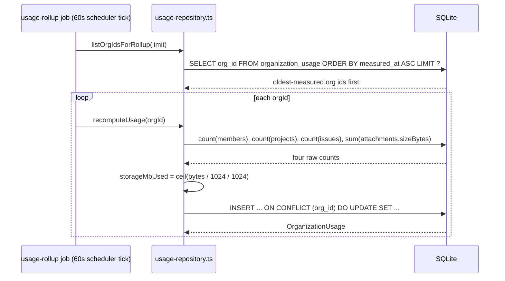

## Purpose

This document covers `src/server/repositories/subscription-repository.ts`,
`invoice-repository.ts` and `usage-repository.ts`. Between them they answer three related
but distinct questions for any organization: what plan is it on and when does the current
billing period end (`subscriptions`); what has it been billed historically
(`invoices`); and how much of its plan quota is it currently consuming
(`organization_usage`). The usage table is the one every plan-limit check in the action
layer reads before allowing a create — `createIssueAction`, `createProjectAction`,
`inviteMemberAction`, `createWebhookAction` all resolve an `OrganizationSummary` that
bundles `subscription` and `usage` together, and the numeric comparison against
`getPlanLimits()` (ADR-010's single-table plan catalogue) happens in the action or service
layer, never inside these repositories.

## Public surface

| function | signature | tables touched | pagination | notes |
|---|---|---|---|---|
| `findSubscription` | `(orgId) => Subscription \| null` | `subscriptions` | none | one row expected per org |
| `insertSubscription` | `(orgId, plan, interval) => Subscription` | `subscriptions` | none | starts a 14-day trial |
| `updateSubscriptionPlan` | `(orgId, plan, interval) => Subscription` | `subscriptions` | none | ends the trial, sets `status: "active"` |
| `updateSeatCount` | `(orgId, seats) => Subscription` | `subscriptions` | none | |
| `cancelSubscription` | `(orgId, cancelAt \| null) => Subscription` | `subscriptions` | none | `null` reactivates |
| `listTrialsEndingBefore` | `(before) => Subscription[]` | `subscriptions` | none | cross-tenant, feeds `trial-expiry` job |
| `listInvoices` | `(orgId) => Invoice[]` | `invoices` | none, ordered by `periodStart desc` | |
| `insertInvoice` | `(orgId, invoice) => Invoice` | `invoices` | none | |
| `findInvoice` | `(orgId, invoiceId) => Invoice \| null` | `invoices` | none | |
| `getUsage` | `(orgId) => OrganizationUsage` | `organization_usage` | none | materializes a zeroed row on first read |
| `recomputeUsage` | `(orgId) => OrganizationUsage` | `members`, `projects`, `issues`, `attachments`, `organization_usage` | none | full recount, feeds the rollup job |
| `incrementUsage` | `(orgId, patch) => OrganizationUsage` | `organization_usage` | none | cheap delta on the write path |
| `listOrgIdsForRollup` | `(limit) => OrgId[]` | `organization_usage` | none, ordered by `measuredAt` ascending | oldest-first work queue |

### DES-206 — New organizations start on a trial subscription, never directly on an active plan

- **Satisfies:** REQ-130, REQ-142
- **Decided in:** ADR-010, ADR-016
- **Code:** `src/server/repositories/subscription-repository.ts` — `insertSubscription`, `TRIAL_DAYS`

`insertSubscription` computes `currentPeriodEnd` as `now + TRIAL_DAYS * MS_PER_DAY`, with
`TRIAL_DAYS = 14` fixed as a module constant, and sets `status` conditionally: `"active"`
if the chosen plan is `"free"`, `"trialing"` for anything else. There is no code path in
this repository — or, as far as this document's audit of the action layer in
`action-members-billing-and-flags.md` confirms, anywhere else — that inserts a subscription
row directly with `status: "active"` for a paid plan. A brand-new organization on the
`starter` plan therefore always passes through a 14-day trial window first, during which
`listTrialsEndingBefore` (consulted by the `trial-expiry` scheduled job, cadence 360
minutes per `CADENCE_MINUTES`) is what eventually notices the trial has lapsed and triggers
the fallback to `free` described in REQ-142. The `free` plan never enters a trial state at
all — since it costs nothing, there is nothing to trial.

### DES-207 — A plan change is an unconditional exit from trialing, never a re-entry

- **Satisfies:** REQ-140, REQ-142
- **Decided in:** ADR-016
- **Code:** `src/server/repositories/subscription-repository.ts` — `updateSubscriptionPlan`

`updateSubscriptionPlan` always writes `status: "active"`, regardless of what plan is being
switched to or what the previous status was. The source comment states the reasoning:
"a plan change ends the trial: the org has made a deliberate choice." This means an
organization mid-trial on `growth` that downgrades to `starter` before the trial would have
ended does not re-enter a fresh trial on `starter` — it becomes an active `starter`
subscription immediately, forfeiting whatever trial time remained. There is no function in
this repository that can move a subscription from `active` back to `trialing`; the state
machine only flows `trialing → active` (via a deliberate plan change) or `trialing → active`
on the `free` plan (via `listTrialsEndingBefore`'s consumer). `cancelSubscription` is the
only function that introduces the `canceled` status, and it does so orthogonally to the
trial/active distinction — a canceled subscription still records whichever plan it was on
when canceled.

### DES-208 — Usage counters are lazily materialized, not assumed to exist

- **Satisfies:** REQ-132, REQ-144
- **Decided in:** ADR-010
- **Code:** `src/server/repositories/usage-repository.ts` — `getUsage`

`getUsage` selects the `organization_usage` row for the org; if none exists, it inserts a
zeroed row (every counter defaulting to its column default, `measuredAt` set to now) and
returns that instead of throwing or returning null. The source comment makes the intent
explicit: "reads the cached counters, materialising a zeroed row the first time an org is
asked about. A limit check must never fail because the rollup has not run." Because every
quota-gated action (`createIssueAction`, `createProjectAction`, and the rest) resolves an
`OrganizationSummary` that calls `getUsage` as part of its assembly, a newly created
organization whose `usage-rollup` job has not yet run its first 15-minute cycle
(`CADENCE_MINUTES.usage-rollup = 15`) must still be able to create its first project — a
`getUsage` that threw `NotFoundError` on a missing row would make every brand-new
organization's first mutation fail until the rollup happened to run, which is precisely
the failure mode this lazy-materialization design avoids.

### DES-209 — `recomputeUsage` recounts from source tables and never trusts the cached row

- **Satisfies:** REQ-144
- **Decided in:** ADR-010, ADR-016
- **Code:** `src/server/repositories/usage-repository.ts` — `recomputeUsage`

`recomputeUsage` issues four independent counting queries — active, non-archived members;
non-archived projects; non-archived issues; and a `sum(sizeBytes)` over attachments,
converted to megabytes with `Math.ceil` — all scoped to the organization, and none of them
reference the existing `organization_usage` row at all. The result is written with
`insert(...).onConflictDoUpdate({ target: organizationUsage.orgId, set: next })`, replacing
the cached counters wholesale rather than adjusting them. This is the function the
`usage-rollup` scheduled job calls on every org once every 15 minutes, and it is also the
correctness backstop for `incrementUsage`'s cheaper delta path (DES-210): if a delta ever
drifts from reality — a bug in an increment call, or a bulk operation that changed usage
without going through the normal create path — the next rollup cycle self-heals it, because
`recomputeUsage` derives its numbers from the same tables the quotas are ultimately
protecting, not from anything this repository has previously written.

### DES-210 — `incrementUsage` is a cheap delta so a quota check right after a create sees fresh numbers

- **Satisfies:** REQ-134, REQ-135
- **Decided in:** ADR-010
- **Code:** `src/server/repositories/usage-repository.ts` — `incrementUsage`

The source comment frames the trade-off directly: "cheap delta applied on the write path so
a quota check right after a create sees the new number without waiting for the rollup."
`incrementUsage` reads the current cached row via `getUsage` (materializing it if absent,
per DES-208), then writes `current.X + (patch.X ?? 0)` for each of `seatsUsed`,
`projectsUsed`, `issuesUsed`, `storageMbUsed`. A caller creating a project would call this
with `{ projectsUsed: 1 }` immediately after `insertProject` succeeds, so that a second
project-creation request arriving moments later — before the next `usage-rollup` tick —
still sees an accurate count against the `projects` quota rather than reading a stale
number that would let it slip past a limit `recomputeUsage` would otherwise have already
caught fifteen minutes later. This function and `recomputeUsage` deliberately overlap in
what they update; the write-path increment is optimistic and fast, the scheduled recompute
is authoritative and slow, and the corpus accepts the two occasionally disagreeing for a
few minutes as the cost of not paying a full four-query recount on every single create.

### DES-211 — `listTrialsEndingBefore` is cross-tenant by necessity and feeds a scheduled sweep

- **Satisfies:** REQ-142
- **Decided in:** ADR-016
- **Code:** `src/server/repositories/subscription-repository.ts` — `listTrialsEndingBefore`

This is the one function in the three files that does not accept an `orgId` at all — it
filters by `status = "trialing"`, `currentPeriodEnd <= before`, and `plan != "free"` across
every organization in the system, and returns the matching rows. The source comment notes
it explicitly: "feeds the trial-expiry job; cross-tenant by design, it sweeps every org."
This mirrors the same shape `webhook-repository.ts`'s `claimPendingDeliveries` uses (DES-215,
`repository-search-webhook-session.md`) — a background job, not a per-request handler, is
the only caller, and the job's whole purpose is to act across every tenant in one pass
rather than being invoked once per organization. The `plan != "free"` filter exists because
free-plan subscriptions are inserted directly as `"active"` (DES-206) and never enter the
`"trialing"` status in the first place, so the clause is defensive rather than load-bearing
in the corpus's current data, but it documents the invariant the function's caller relies
on regardless.

## Why usage is split across two write paths instead of one

A reader coming from the issue or project repositories, where a single soft-delete
convention (`archivePatch`/`restorePatch`/`shouldFilterArchived`) governs every write, might
reasonably ask why `usage-repository.ts` needs both `incrementUsage` and `recomputeUsage`
rather than picking one strategy and using it everywhere. The answer is a latency-versus-
correctness trade that does not have a single right answer at every call site. A create
action needs its quota check to reflect the mutation it just made, immediately, so the very
next request in the same organization is judged against accurate numbers — that rules out
waiting for the next `usage-rollup` tick (up to 15 minutes away) and argues for
`incrementUsage`'s cheap, synchronous delta. But deltas accumulate drift over time: a bulk
operation that changes several rows without threading through the normal single-row create
path (a project archive cascading into many issues, for instance, via `archiveIssuesForProject`
documented in `repository-issue-and-comment.md`, DES-185) does not call `incrementUsage` at
all, since project archival does not change `issuesUsed` in the usage table's accounting
model — only issue counts among *live, non-archived* rows matter to `recomputeUsage`'s own
query, and a cascade of many issues moving from live to archived in one statement is exactly
the kind of change `incrementUsage`'s single-caller-per-mutation model does not track. This
is precisely why `recomputeUsage` exists as a periodic, from-scratch reconciliation rather
than being deprecated in favor of `incrementUsage` everywhere — the two functions are not
redundant, they cover different failure modes of the same underlying cache.

## Invariants

- `subscriptions.status` only ever transitions `trialing → active` (never the reverse)
  except through `cancelSubscription`, which can set `canceled` from either state.
- `getUsage` never returns null and never throws for a missing row; it always materializes
  one.
- `recomputeUsage`'s four counting queries never reference the cached
  `organization_usage` row they are about to overwrite.
- `listTrialsEndingBefore` is the only function in this document's scope that omits an
  `orgId` filter, and it is called exclusively from the scheduled `trial-expiry` job, never
  from a Server Action.
- `insertInvoice` and `findInvoice` are always `orgId`-scoped; there is no cross-tenant
  invoice listing anywhere in the repository layer.

## Test coverage

`tests/services/billing-service.test.ts` exercises `subscription-repository.ts` and
`usage-repository.ts` through `changePlan`, `cancelSubscription` and `updateSeats`, covering
the downgrade-refusal behavior that reads usage before a plan switch. `tests/server/plan-limits.test.ts`
and `tests/config/plan-limits.test.ts` cover the `getPlanLimits`/`wouldExceedLimit`
contract these repositories' consumers rely on, though the limit table itself lives in
`src/config/plan-limits.ts`, outside this repository layer. `tests/contract/plan-limits.test.ts`
asserts the plan ladder's invariants (ordering, `UNLIMITED` representation) at the contract
level. `tests/server/jobs.test.ts` covers the scheduler that drives `usage-rollup` and
`trial-expiry` against these repositories' `listOrgIdsForRollup` and
`listTrialsEndingBefore`. There is no dedicated tests/repositories/subscription-repository.test.ts,
`invoice-repository.test.ts` or `usage-repository.test.ts` — invoice generation in
particular is covered only through the billing service tests, not at the repository layer
directly.

## Data flow: the usage-rollup job reconciling drift between two organizations

Because `listOrgIdsForRollup` orders by `measuredAt` ascending, an organization whose
`incrementUsage` deltas (DES-210) have drifted from reality the longest is always the next
one reconciled — the job is effectively a priority queue keyed by staleness rather than a
round-robin over every org id in an arbitrary order.
