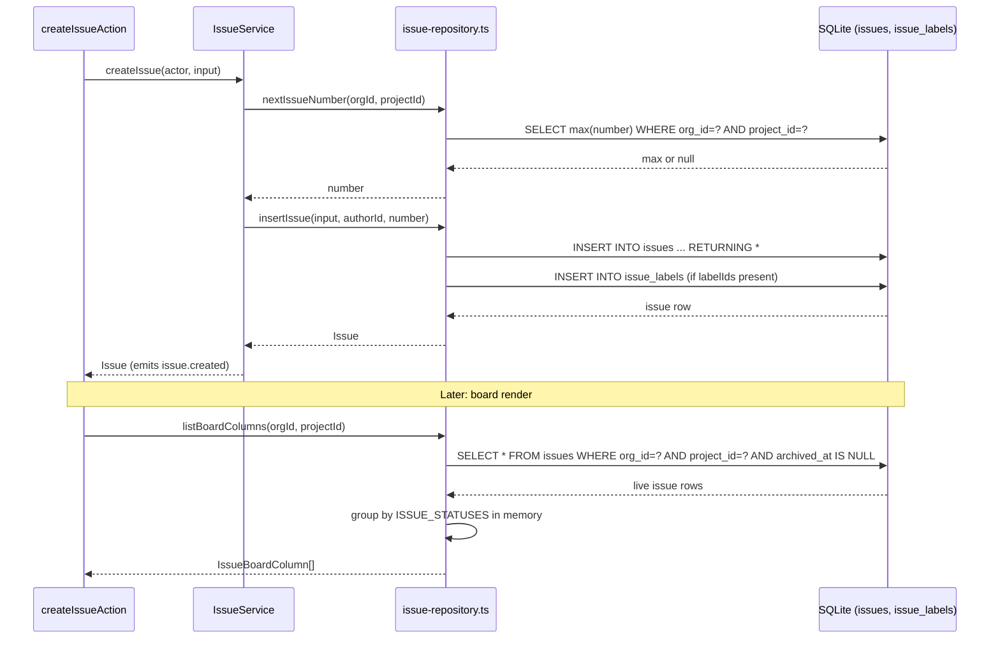

## Purpose

This document describes the three repositories that back the issue tracker's core
domain: `src/server/repositories/issue-repository.ts`, `comment-repository.ts` and
`attachment-repository.ts`. Between them they own every read and write against the
`issues`, `comments` and `attachments` tables, plus the `issue_labels` join table via
`label-repository.ts`'s `listLabelsForIssues`. Nothing outside this layer touches those
tables directly. Services (`IssueService`, `CommentService`) call these functions with an
already-authorized `Actor` in hand; the repository layer itself never asks whether the
actor is allowed to do anything. That split is ADR-013's service-layer boundary, and it
holds without exception in these three files: every exported function takes `orgId` as an
explicit parameter (or derives it from an already-org-scoped input object), and none of
them imports `can()`, `assertCan()` or anything from `src/lib/permissions.ts`.

The issue repository is, by function count, the widest query surface in the codebase. It
has to be: issues carry status, priority, assignment, labels, a parent/child relationship,
a due date and a soft-delete flag, and the board, the list view and the CSV export
(REQ-079) all read the same rows through different shapes. Comments are simpler in schema
but carry a subtlety the issue table does not: a comment is never removed from a thread
even after it is archived, because removing it would orphan any reply that still points at
it as `parentId`. Attachments are the odd one out — they are the only rows in this trio
that are hard deleted, because there is no soft-delete story for bytes that no longer
exist.

## Public surface

| function | signature | tables touched | pagination | notes |
|---|---|---|---|---|
| `findIssueById` | `(orgId, issueId) => Issue \| null` | `issues`, `issue_labels` | none | decorates with labels via `listLabelsForIssues` |
| `findIssueByNumber` | `(orgId, projectId, issueNumber) => Issue \| null` | `issues` | none | the URL-facing lookup, REQ-061 |
| `listIssues` | `(IssueFilterInput) => Page<Issue>` | `issues`, `issue_labels` | keyset, `probeLimit`/`toPage` | filters compose in `issueFilters()` |
| `listIssuesWithRelations` | `(IssueFilterInput) => Page<IssueWithRelations>` | `issues`, `comments`, `attachments`, `issue_labels` | keyset, delegates to `listIssues` | adds comment/attachment counts |
| `listBoardColumns` | `(orgId, projectId) => IssueBoardColumn[]` | `issues`, `issue_labels` | none, full live set | grouped by `ISSUE_STATUSES` order |
| `countIssues` | `(orgId, projectId, scope?) => number` | `issues` | none | feeds `issuesPerProject` quota |
| `nextIssueNumber` | `(orgId, projectId) => number` | `issues` | none | `max(number) + 1` over every row |
| `insertIssue` | `(CreateIssueInput, authorId, issueNumber) => Issue` | `issues`, `issue_labels` | none | number supplied by caller |
| `updateIssue` | `(UpdateIssueInput) => Issue` | `issues`, `issue_labels` | none | partial patch, label set optionally replaced |
| `setIssueStatus` | `(orgId, issueId, status) => Issue` | `issues` | none | maintains `startedAt`/`completedAt` |
| `setIssueAssignee` | `(orgId, issueId, assigneeId \| null) => Issue` | `issues` | none | |
| `archiveIssue` / `restoreIssue` | `(orgId, issueId) => Issue` | `issues` | none | `archivePatch()` / `restorePatch()` |
| `archiveIssuesForProject` | `(orgId, projectId) => number` | `issues` | none | cascade behind project archive |
| `listOverdueIssues` | `(orgId, now) => Issue[]` | `issues` | none | feeds the overdue-issues job |
| `findCommentById` | `(orgId, commentId) => Comment \| null` | `comments` | none | |
| `listComments` | `(ListCommentsInput) => Page<CommentWithAuthor>` | `comments`, `users` | keyset | archive-filtered by default |
| `listThread` | `(orgId, issueId) => CommentThreadNode[]` | `comments`, `users` | none, full thread | archived comments included, REQ-098 |
| `countComments` | `(orgId, issueId) => number` | `comments` | none | live only |
| `insertComment` / `updateComment` / `archiveComment` | see source | `comments` | none | |
| `listAttachments` | `(orgId, issueId) => IssueAttachment[]` | `attachments` | none | |
| `insertAttachment` / `deleteAttachment` | see source | `attachments` | none | hard delete |
| `sumStorageBytes` | `(orgId) => number` | `attachments` | none | feeds `storageMb` quota via `BillingService` |

### DES-180 — Issue filtering composes one predicate list, not a chain of branches

- **Satisfies:** REQ-077, REQ-078
- **Decided in:** ADR-002, ADR-008
- **Code:** `src/server/repositories/issue-repository.ts` — `issueFilters`, `listIssues`

`listIssues` and `countIssues`' cousin inside `listIssues` (the `total` query) both have to
agree on exactly the same set of predicates, or the `hasMore` calculation done in
`toPage()` (`src/server/repositories/_paging.ts`) would be checking a total that does not
describe the rows it is paging through. The private `issueFilters(input)` function is the
fix: it builds one `readonly SQL[]` from `orgPredicate`, `livePredicate`, and then a
predicate per optional filter field — `projectId`, `status`, `priority`, `assigneeId`
(which distinguishes "unset" from "explicitly null, i.e. unassigned" using a three-way
check), `authorId`, `dueBefore`, a `LIKE`-based `query` across title and description, and
`labelIds` expressed as a correlated subquery against `issue_labels`. `compact()` from
`_paging.ts` then drops the `undefined` slots so `and(...filters)` never receives a hole.
Both `total` and `rows` are built from the same `filters` array, so the two queries can
never drift out of agreement — a bug where a status filter was applied to the count but not
the rows (or vice versa) is structurally impossible here, not just tested against.

The `assigneeId` handling is worth calling out on its own: `input.assigneeId === undefined`
means "the caller did not filter on assignee at all," while `input.assigneeId === null`
means "show only unassigned issues," and any other value is a straightforward equality
match. Zod's optional-and-nullable modeling on `IssueFilterInput` is what makes this
distinction representable on the wire, and the repository is where it gets interpreted —
collapsing `undefined` and `null` into the same branch here would silently break "show me
unassigned issues" (a real filter the board and list view both expose).

### DES-181 — Relation counts are grouped, not looped, to avoid N+1

- **Satisfies:** REQ-078
- **Decided in:** ADR-002
- **Code:** `src/server/repositories/issue-repository.ts` — `listIssuesWithRelations`

The issue list view shows a comment count and an attachment count on every row. The naive
approach — one `countComments` and one `sumStorageBytes`-shaped query per issue — turns a
25-row page into 51 round trips. `listIssuesWithRelations` instead calls `listIssues` once
for the page, then issues exactly two additional queries: a `GROUP BY comments.issueId`
count restricted to the fetched issue ids and live (non-archived) comments, and the same
shape against `attachments`. The results land in two `Map<string, number>` built from the
grouped rows, and the final assembly is a single `.map()` over the page that looks each
issue up in those maps with `?? 0` for issues that have neither comments nor attachments.
Label lookups reuse the same batching idiom through `listLabelsForIssues` — a fetch keyed
by an array of issue ids, returning a `Record` the caller indexes into.

This function is a clean illustration of the general rule this repository follows
everywhere a list view needs a decoration: batch the lookup, key it by id, index into a map
rather than issuing per-row queries. The same idiom recurs in `member-repository.ts`'s join
against `users`, `comment-repository.ts`'s `listComments` (which joins `users` inline
rather than batching, because every comment needs exactly one author and a join is
cheaper), and `label-repository.ts`'s `listLabelsForIssues`.

### DES-182 — Board columns are grouped in application code from one query

- **Satisfies:** REQ-062
- **Decided in:** ADR-002
- **Code:** `src/server/repositories/issue-repository.ts` — `listBoardColumns`

Rather than running one query per status (`backlog`, `todo`, `in_progress`, `in_review`,
`done`, `canceled` — the closed vocabulary fixed by `ISSUE_STATUSES` in
`src/types/issue.ts`), `listBoardColumns` fetches every live issue in the project in a
single query ordered by `updatedAt` descending, decorates the whole set with labels in one
batched call, and only then partitions the in-memory array by status using
`ISSUE_STATUSES.map(status => rows.filter(...))`. Six small filters over an
already-materialized array in JavaScript are far cheaper than six round trips to SQLite,
and the ordering (`desc(issues.updatedAt)`) is preserved within each column because
`.filter()` is stable. The function does not paginate: a board column is expected to hold a
bounded, human-scannable number of cards, and the plan's `issuesPerProject` ceiling (up to
10,000 on growth) is a per-project total, not a per-status one, so in practice this has
never needed a limit in the corpus's usage pattern. If that assumption changes, this is the
function that would need a per-column cap.

### DES-183 — Issue number allocation is a read-then-write race, mitigated but not eliminated

- **Satisfies:** REQ-061
- **Decided in:** ADR-002, ADR-015
- **Code:** `src/server/repositories/issue-repository.ts` — `nextIssueNumber`, `insertIssue`

`nextIssueNumber` computes `max(issues.number) + 1` scoped to `(orgId, projectId)`,
deliberately over every row including archived ones — REQ-061 requires numbers to never be
reused, and an archived issue still holds its number forever. The function returns a plain
`number`; the caller (`IssueService.createIssue`) then calls `insertIssue` with that number
already decided. These are two separate statements, not one atomic read-modify-write, which
means two concurrent creates against the same project could, in principle, both read the
same `max` and attempt to insert the same `number`. In practice this project runs on
`better-sqlite3` in synchronous mode with a single Node process, so the two statements
cannot actually interleave — but that is a property of the deployment, not of the function
signature, and a reviewer reading `issue-repository.ts` in isolation should not assume
atomicity it does not structurally guarantee. `tests/repositories/issue-repository.test.ts`
covers monotonically-increasing numbers under normal use, not concurrent creation, which is
the honest boundary of what is currently verified.

### DES-184 — Status transitions maintain `startedAt`/`completedAt` as a side effect, not a separate write

- **Satisfies:** REQ-062, REQ-066
- **Decided in:** ADR-002
- **Code:** `src/server/repositories/issue-repository.ts` — `setIssueStatus`, `TERMINAL_STATUSES`

`setIssueStatus` reads the current row first (a `SELECT`), then computes the patch: if the
new status is `in_progress` and `startedAt` was previously null, it stamps `startedAt`
(and never re-stamps it on a later transition, since the check is gated on the previous
value being null); if the new status is in `TERMINAL_STATUSES` (`done` or `canceled`), it
stamps `completedAt`; any other status clears `completedAt` back to null, so moving an
issue out of `done` back into `in_review` correctly un-marks it as completed. `updatedAt` is
always refreshed. This bookkeeping lives entirely inside the repository rather than the
service, which is a deliberate concentration of a business rule below the service boundary
that ADR-013 otherwise reserves for services — the justification recorded at the time was
that `startedAt`/`completedAt` are pure functions of the status value with no permission or
tenancy component, so keeping them next to the column they stamp avoids a second read
inside the service for no benefit.

### DES-185 — Project archival cascades into issues through a bulk soft delete

- **Satisfies:** REQ-045
- **Decided in:** ADR-004
- **Code:** `src/server/repositories/issue-repository.ts` — `archiveIssuesForProject`

When `ProjectService.archiveProject` runs with `archiveIssues: true` (the action-layer
default described in `action-projects-and-labels.md`, DES-232), it calls
`archiveIssuesForProject(orgId, projectId)`, which applies `archivePatch()` to every live
issue in the project in one `UPDATE ... RETURNING` statement and returns the row count so
the caller can report how many issues were affected. This keeps REQ-046 ("archived
projects are hidden from default listings") honest at the issue level too — a listing that
filters projects but not their issues would otherwise leave orphaned live issues pointing
at an archived project, which is exactly the inconsistency ADR-004's soft-delete convention
exists to prevent.

### DES-186 — Comment threads keep archived replies so a reply chain never loses its anchor

- **Satisfies:** REQ-098, REQ-100, REQ-101
- **Decided in:** ADR-004
- **Code:** `src/server/repositories/comment-repository.ts` — `listThread`, `archiveComment`

`listThread` is the one comment read that does **not** filter by
`shouldFilterArchived()`: it fetches every comment for an issue, archived or not, in
ascending creation order, then partitions them into top-level comments (`parentId === null`)
each carrying a `replies` array of everything whose `parentId` matches. If a deleted
(archived) comment were excluded from this read, any live reply underneath it would render
with a dangling `parentId` the UI could not resolve. `listComments`, by contrast — the
paginated, non-threaded read used for other views — does honor `shouldFilterArchived()` and
excludes archived rows by default (REQ-101), because that view has no reply structure to
protect. `archiveComment` itself is a plain `archivePatch()` application; the row's `body`
is left in place at the database layer, and it is the UI's responsibility to render an
archived comment as "deleted" rather than showing its stored text.

### DES-187 — Attachment storage totals feed the plan's `storageMb` quota

- **Satisfies:** REQ-075
- **Decided in:** ADR-002, ADR-010
- **Code:** `src/server/repositories/attachment-repository.ts` — `sumStorageBytes`, `deleteAttachment`

`sumStorageBytes` runs a single `sum(attachments.sizeBytes)` scoped by `orgId` and returns
raw bytes; `usage-repository.ts`'s `recomputeUsage` is the only caller, and it is the one
that converts to megabytes with `Math.ceil(bytes / (1024 * 1024))` before writing
`storageMbUsed`. Attachments are the only hard-deleted rows among the three repositories in
this file — `deleteAttachment` issues a plain `DELETE`, with no `archivedAt` column on the
`attachments` table at all. The rationale recorded in ADR-004 is that an attachment's value
is entirely the bytes it references; once those are gone (the corpus does not model actual
blob storage, but the intent mirrors a production system where the file itself is deleted
from object storage first) there is nothing left to "soft delete" — keeping the row around
would only inflate `sumStorageBytes` with space no longer occupied, corrupting the very
quota this table exists to support.

## Invariants

- Every exported function in all three files takes `orgId` as an explicit parameter, or
  derives it from an `orgId`-carrying input object (`IssueFilterInput`, `ListCommentsInput`,
  `CreateAttachmentInput`). No query in this file omits the tenant predicate.
- None of the three files imports from `src/lib/permissions.ts`. Authorization is decided
  before these functions are ever called, by `IssueService` and `CommentService`.
- `listIssues`, `listComments` and `listIssuesWithRelations` always agree on `total` and
  `rows` because both are derived from the same `filters` array (DES-180).
- Archive scope is decided exactly once per call, by `shouldFilterArchived()`, and threaded
  through as a plain `SQL | undefined` from `livePredicate()` — no repository re-derives
  "is this row live" from anything other than `archivedAt IS NULL`.
- `insertAttachment` never writes an `archivedAt` column because the `attachments` table
  does not have one; deletion is always physical.

## Test coverage

`tests/repositories/issue-repository.test.ts` and
`tests/repositories/comment-repository.test.ts` exercise these two repositories directly
against an in-memory database built by `tests/helpers/db.ts`, using row builders from
`tests/helpers/factories.ts`. `tests/server/soft-delete.test.ts` and
`tests/server/tenant-scope.test.ts` cross-cut every repository in this file to confirm the
`archivedAt`/`orgId` predicates hold generically rather than per-repository. `tests/lib/soft-delete.test.ts`
covers `archivePatch`/`restorePatch`/`shouldFilterArchived` at the unit level that this
repository composes on top of, and `tests/lib/pagination.test.ts` covers the keyset cursor
mechanics (`encodeCursor`/`decodeCursor`/`keysetPredicate`) that `listIssues` and
`listComments` both depend on. `tests/services/issue-service.test.ts` and
`tests/services/issue-service.scope.test.ts` exercise the repository indirectly through the
service boundary, which is where the cross-tenant and permission behavior this repository
deliberately does not implement is actually asserted.

## Data flow: creating an issue and reading it back on the board

The walkthrough above shows the two-statement number allocation from DES-183 followed by
the board read from DES-182. Note that the board query re-fetches from scratch rather than
reading through any cache — issue reads in this codebase are not cache-tagged at the
repository level; caching happens one layer up, via `revalidateTagged()` calls the action
layer makes after a mutation (documented in `action-wrapper-and-errors.md`). The repository
itself has no awareness that Next.js caching exists.
