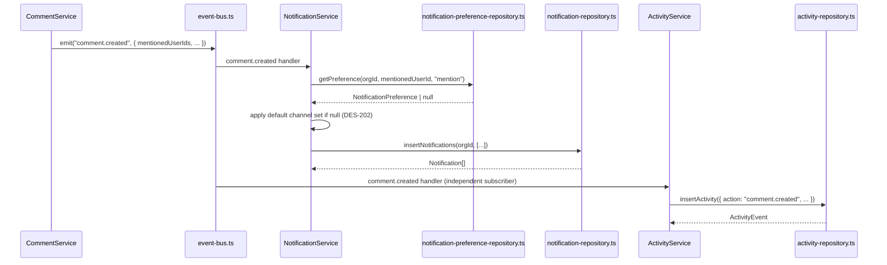

## Purpose

This document covers `src/server/repositories/notification-repository.ts`,
`notification-preference-repository.ts` and `activity-repository.ts`. The first two back
the in-app notification inbox and the per-user delivery matrix consulted before every
fan-out; the third backs the append-only audit log that every domain event turns into a
row (REQ-220, ADR-022). All three are fed exclusively by event-bus subscribers —
`NotificationService` and `ActivityService` — rather than by any Server Action calling them
directly. No action file in src/actions/ imports from `activity-repository.ts` at all;
the audit trail is a side effect of the event bus, not a first-class write any caller
performs on purpose.

The notification and activity data models share one structural property worth naming: both
are almost entirely insert-and-read, with very narrow, well-defined update paths
(`markRead`/`markAllRead` for notifications; nothing at all for activity, which is
immutable per REQ-221). This is the opposite shape from the issue and project repositories,
where update is the dominant operation.

## Public surface

| function | signature | tables touched | pagination | notes |
|---|---|---|---|---|
| `listNotifications` | `(ListNotificationsInput) => Page<Notification>` | `notifications` | keyset | filters by `kind`, `unreadOnly` |
| `countUnread` | `(orgId, recipientId) => number` | `notifications` | none | bell badge |
| `insertNotification` | `(orgId, input) => Notification` | `notifications` | none | delegates to `insertNotifications` |
| `insertNotifications` | `(orgId, inputs[]) => Notification[]` | `notifications` | none | bulk fan-out insert |
| `markRead` | `(orgId, notificationId, at) => Notification` | `notifications` | none | |
| `markAllRead` | `(orgId, recipientId, at) => number` | `notifications` | none | returns rows touched |
| `listUnreadSince` | `(orgId, recipientId, since) => Notification[]` | `notifications` | none | digest window read |
| `listPreferences` | `(orgId, userId) => NotificationPreference[]` | `notification_preferences` | none | |
| `getPreference` | `(orgId, userId, kind) => NotificationPreference \| null` | `notification_preferences` | none | `null` means "no row," not "off" |
| `upsertPreference` | `(input) => NotificationPreference` | `notification_preferences` | none | `onConflictDoUpdate` on the composite key |
| `listDigestSubscribers` | `(orgId) => UserId[]` | `notification_preferences` | none | `selectDistinct` on `digestOnly = true` |
| `insertActivity` | `(event) => ActivityEvent` | `activity_events` | none | the only write path |
| `listActivity` | `(ActivityFilterInput) => Page<ActivityEvent>` | `activity_events` | keyset | filters by action, actor, project, subject, time range |
| `listActivityForSubject` | `(orgId, subjectKind, subjectId) => ActivityEvent[]` | `activity_events` | none, full history | the per-issue/project "history" tab |
| `purgeActivityBefore` | `(orgId, before) => number` | `activity_events` | none | the only deletion path |

### DES-200 — Notification fan-out always inserts through the batch path

- **Satisfies:** REQ-111, REQ-113
- **Decided in:** ADR-005
- **Code:** `src/server/repositories/notification-repository.ts` — `insertNotification`, `insertNotifications`

`insertNotification` is not an independent code path — it calls `insertNotifications` with
a one-element array and unwraps the first (and only) result, throwing if the insert somehow
produced none. This means there is exactly one `INSERT` statement shape in the whole
repository for creating a notification row, regardless of whether the caller is notifying
one recipient (an assignment, REQ-113) or many (a mention that reaches several people, or a
project-wide broadcast). `insertNotifications` builds every value tuple in one pass —
sharing a single `stamp = toIsoTimestamp(new Date())` across the whole batch so every
notification in one fan-out carries an identical `createdAt` — and issues one `INSERT ...
RETURNING *` covering all of them. The empty-array short-circuit (`if (inputs.length === 0)
return []`) means a fan-out that resolves to zero eligible recipients (everyone muted the
event kind, say) never touches the database, which matters because `NotificationService`
computes the recipient list by first consulting `notification-preference-repository.ts` for
each candidate and can legitimately end up with nobody left.

### DES-201 — `countUnread` is a single indexed count, not a length of a fetched list

- **Satisfies:** REQ-117
- **Decided in:** ADR-005
- **Code:** `src/server/repositories/notification-repository.ts` — `countUnread`

The bell badge shown in the app shell needs to render on every page load without paying for
a full notification page fetch. `countUnread` runs `count()` filtered by `orgId`,
`recipientId` and `isNull(notifications.readAt)` — nothing else — and returns a bare
number. It is deliberately not implemented as `listNotifications({ unreadOnly: true }).total`,
even though that would return the same number, because going through `listNotifications`
would also fetch and page a row set the caller has no use for. REQ-117's "unread counts are
computed per organization" is satisfied by the `orgId` filter here being independent of
whatever organization is currently active in the caller's session — a user with unread
notifications in three organizations gets three independent counts, one per org, each from
its own call to this function.

### DES-202 — Preference absence means "use the default channel set," not "everything off"

- **Satisfies:** REQ-115
- **Decided in:** ADR-005
- **Code:** `src/server/repositories/notification-preference-repository.ts` — `getPreference`

`getPreference` returns `null` when no row exists for a given `(orgId, userId, kind)`
triple, and the source comment is explicit that this null has a specific meaning the
calling service must respect: "`null` means 'no explicit row' — the fan-out then falls back
to the default channel set rather than treating the absence as 'everything off'." A brand
new member has no rows in `notification_preferences` at all until they visit the
notification settings page and change something, at which point `upsertPreference` writes
their first row. If `NotificationService` interpreted `null` as "deliver nothing," every
new member would receive zero notifications until they proactively opted in — the opposite
of REQ-112's "a mention always notifies the mentioned user." The repository's contract is
narrow and correct: it reports what is stored, and it is the service's job to apply the
default when nothing is stored.

### DES-203 — Preference writes use a composite-key upsert, not read-then-branch

- **Satisfies:** REQ-115
- **Decided in:** ADR-002
- **Code:** `src/server/repositories/notification-preference-repository.ts` — `upsertPreference`

`upsertPreference` issues one statement: `insert(...).onConflictDoUpdate({ target: [orgId,
userId, kind], set: {...} })`. This is the one place among the repositories in this
document that relies on a database-level conflict target rather than the read-then-branch
idiom `project-member-repository.ts`'s `addProjectMember` uses (DES-193). The difference in
approach is deliberate rather than inconsistent: `addProjectMember` needed
`isProjectMember` to exist as its own reusable function regardless of the insert path,
while a notification preference has no equivalent standalone existence check any caller
needs — every consumer either wants the current row (`getPreference`/`listPreferences`) or
wants to set it (`upsertPreference`), never "does a row exist." The composite unique
constraint on `(orgId, userId, kind)` is what makes `onConflictDoUpdate`'s `target` array
well-defined; it mirrors the same three columns every read in this repository filters on.

### DES-204 — Activity rows are insert-only; the repository exposes no update function

- **Satisfies:** REQ-220, REQ-221
- **Decided in:** ADR-022
- **Code:** `src/server/repositories/activity-repository.ts`

There is no `updateActivity` export, and the file's own header comment states the intent
directly: "append-only audit log. Never updated, never deleted before the plan's retention
window." This is a structural enforcement of REQ-221 ("activity rows are immutable") rather
than a convention documented only in prose — a service that wanted to mutate a historical
activity row would have no function to call to do it, short of writing raw SQL that bypasses
this repository entirely, which nothing in the corpus does. `insertActivity` takes an
`Omit<ActivityEvent, "id">` and assigns the id itself via `newId()`, so the caller never
supplies an id that could collide with, or overwrite, an existing row. Every field on
`ActivityEvent` — `action`, `actorId`, `subjectKind`, `subjectId`, `projectId`, `summary`,
`metadata`, `occurredAt` — is set exactly once, at insert time, and read many times
thereafter.

### DES-205 — `purgeActivityBefore` is the only sanctioned deletion, driven by the plan's `retentionDays`

- **Satisfies:** REQ-227, REQ-231
- **Decided in:** ADR-010, ADR-022
- **Code:** `src/server/repositories/activity-repository.ts` — `purgeActivityBefore`

The source comment on this function reads: "the only sanctioned deletion path: the
retention sweep. `before` comes from the plan's `retentionDays`, never from a
user-supplied date." `purgeActivityBefore(orgId, before)` deletes every row with
`occurredAt < before` for the given org and returns the count removed. The caller —
`ActivityService`, invoked by the `cleanup-archived` scheduled job (`CADENCE_MINUTES.cleanup-archived
= 1440`, i.e. once a day) — computes `before` by subtracting the organization's plan
`retentionDays` from the current time (30 days on free, up to 2555 on enterprise), never
by accepting an arbitrary date from a request. This is what makes REQ-227 ("activity
retention follows the plan's retention window") a property the data layer actually
enforces rather than a UI-level suggestion: there is no code path in the corpus, action or
otherwise, that can delete a live activity row before its plan's window has elapsed,
because the one function capable of deleting activity rows takes its cutoff from a
plan-derived value, not from caller-supplied input.

## Why notifications and activity are documented together despite serving different audiences

Notifications and activity events look similar at a glance — both are rows generated in
response to the same domain events, both are read in a paginated feed, both carry an
`orgId` and reference an actor — but they serve genuinely different purposes and that
difference shapes their repositories. A notification is addressed to exactly one recipient
(`notifications.recipientId`) and exists to be acted on: read, marked read, eventually
forgotten. An activity event has no recipient at all — `activityEvents.actorId` records who
*did* something, not who should be told about it — and exists to be a durable record,
readable by anyone with `activity:read` permission (REQ-224, `member` rank), for as long as
the plan's retention window keeps it around. This is why `notifications` supports a bulk
mutation (`markAllRead`) that has no equivalent on `activity_events` at all: marking
something "read" only makes sense for a row addressed to a specific person, and there is no
analogous per-actor state an activity row could meaningfully carry. It is also why the two
repositories' delete stories differ so sharply — nothing in the corpus ever deletes a
notification row once created, while activity rows are deleted on a schedule via
`purgeActivityBefore` (DES-205) — because an old, read notification has no ongoing value to
anyone, while an old activity row is exactly the kind of historical record REQ-227's
retention window exists to bound rather than discard immediately.

## Invariants

- Every read and write in all three files is scoped by `orgId`; there is no unscoped
  exception in this trio (unlike `invitation-repository.ts`'s `findInvitationByTokenHash`,
  DES-198).
- `insertNotification` never bypasses `insertNotifications` — there is exactly one insert
  code path for notification rows.
- `getPreference` returning `null` is never treated by this repository as equivalent to a
  row with all channels disabled; that interpretation belongs one layer up.
- No function in `activity-repository.ts` updates an existing row's `action`, `actorId`,
  `subjectKind`, `subjectId`, `summary`, `metadata`, or `occurredAt` after insert.
- `purgeActivityBefore` is the only function capable of removing an `activity_events` row.

## Test coverage

`tests/services/notification-service.test.ts` exercises `notification-repository.ts` and
`notification-preference-repository.ts` indirectly through the fan-out logic that decides
who gets notified and on which channels. `tests/services/activity-service.test.ts` covers
`insertActivity`, `listActivity` and `listActivityForSubject` through the service that
subscribes to the event bus and turns events into rows. `tests/server/domain-events.test.ts`
verifies that the event kinds these two repositories are ultimately driven by
(`comment.created`, `member.joined`, `issue.assigned`, and the rest of the 21-key
`TaskflowEventMap`) are each observed by at least one subscriber, which is the structural
guarantee behind "notification fan-out is driven by domain events" (REQ-111). There is no
dedicated tests/repositories/notification-repository.test.ts or
`activity-repository.test.ts` in the corpus — these three repositories are exercised only
through their owning services, consistent with how thin their exported surface is relative
to `issue-repository.ts`.

## Data flow: a mention fans out to a notification and an activity row from one event

Both subscribers react to the same emitted event independently — `event-bus.ts` isolates
handler errors from one another (a documented property of ADR-005's in-process bus), so a
failure inside `NotificationService`'s handler does not prevent `ActivityService`'s handler
from writing the audit row, and vice versa. This independence is also why REQ-228 ("activity
capture must not fail the originating write") holds structurally: `insertActivity` runs in a
subscriber invoked *after* `CommentService.createComment` has already returned successfully
to its caller, not inside the same transaction as the comment insert.
