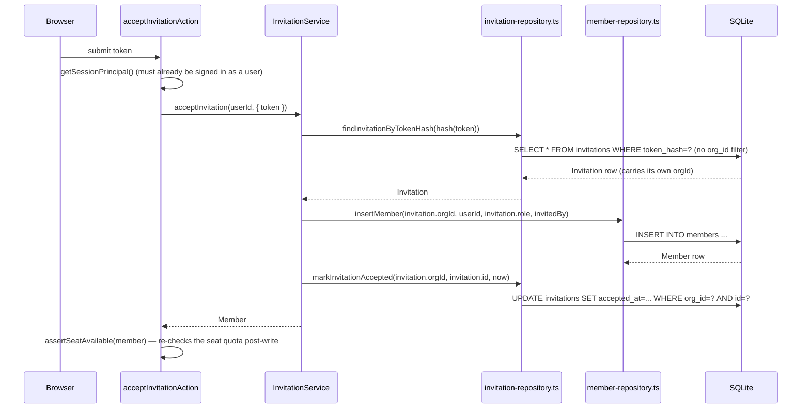

## Purpose

This document covers `src/server/repositories/organization-repository.ts`,
`member-repository.ts`, `invitation-repository.ts` and `user-repository.ts`. These four
files own the identity spine of the product: the `organizations`, `members`,
`invitations` and `users` tables. Three of the four are tenant-scoped in the usual way;
`user-repository.ts` is the deliberate exception described in ADR-006's own text and
reiterated here — users exist independently of any organization, because REQ-213 requires
a single person to hold memberships in several organizations at once, and there is exactly
one `users` row per person regardless of how many orgs they belong to.

`organization-repository.ts` is also where the platform's outermost tenant boundary gets
created and named: `insertOrg` is the only place a new `org_id` value that other tables
will reference comes into existence. `member-repository.ts` is the read path behind the
`ROLE_MATRIX` decisions made in `src/lib/permissions.ts` — every `Actor.role` a permission
check compares against was read out of a `members` row by this repository, upstream of
`can()`. `invitation-repository.ts` bridges the gap between "an email address has been
invited" and "that email address is now a member," which is the one place in the whole
data-access layer where a read has to succeed *before* a session exists.

## Public surface

| function | signature | tables touched | pagination | notes |
|---|---|---|---|---|
| `findOrgById` / `findOrgBySlug` | `(id \| slug) => Organization \| null` | `organizations` | none | slug lookup filters `archivedAt IS NULL` |
| `listOrgsForUser` | `(userId) => Organization[]` | `members`, `organizations` | none | inner-joined, both archive columns filtered |
| `insertOrg` | `(CreateOrganizationInput, ownerId) => Organization` | `organizations` | none | de-duplicates slug internally |
| `updateOrg` | `(orgId, UpdateOrganizationInput) => Organization` | `organizations` | none | merges `settings` over the stored value |
| `archiveOrg` | `(orgId) => Organization` | `organizations` | none | `archivePatch()` |
| `listTakenOrgSlugs` | `(prefix) => string[]` | `organizations` | none | unconditional on archive state |
| `findMember` | `(orgId, userId) => Member \| null` | `members` | none | the canonical actor-resolution read |
| `findMemberById` | `(orgId, memberId) => Member \| null` | `members` | none | |
| `listMembers` | `(ListMembersInput) => Page<MemberWithUser>` | `members`, `users` | keyset | joined, searchable by name/email |
| `countActiveMembers` | `(orgId) => number` | `members` | none | feeds `seats` quota |
| `insertMember` | `(orgId, userId, role, invitedBy) => Member` | `members` | none | |
| `updateMemberRole` | `(orgId, memberId, role) => Member` | `members` | none | |
| `archiveMember` | `(orgId, memberId) => Member` | `members` | none | archives and sets `status: "suspended"` |
| `touchLastSeen` | `(orgId, userId, at) => void` | `members` | none | |
| `insertInvitation` | `(orgId, CreateInvitationInput, invitedBy, tokenHash) => Invitation` | `invitations` | none | |
| `findInvitationByTokenHash` | `(tokenHash) => Invitation \| null` | `invitations` | none | the one unscoped read (DES-198) |
| `listPendingInvitations` | `(orgId) => Invitation[]` | `invitations` | none | |
| `markInvitationAccepted` / `revokeInvitation` | see source | `invitations` | none | |
| `countPendingInvitations` | `(orgId) => number` | `invitations` | none | held seats |
| `findUserById` / `findUserByEmail` | `(id \| email) => User \| null` | `users` | none | not tenant-scoped |
| `insertUser` | `(input) => User` | `users` | none | lower-cases email |
| `updateUser` | `(userId, UpdateProfileInput) => User` | `users` | none | called directly by `update-profile.ts` |
| `findUsersByIds` | `(userIds) => User[]` | `users` | none | batched, list-view decoration |
| `findPasswordHash` / `updatePasswordHash` | see source | `users` | none | not in the manifest; narrow accessors |

### DES-194 — Slug de-duplication for organizations lives in the repository to win the race, not just for symmetry with projects

- **Satisfies:** REQ-002
- **Decided in:** ADR-002
- **Code:** `src/server/repositories/organization-repository.ts` — `insertOrg`

The source comment on `insertOrg` is explicit about why this is not simply mirroring
`project-repository.ts`'s pattern for consistency: "the slug is de-duplicated here rather
than in the service so a race on the unique index still resolves to a usable slug." Two
concurrent registrations for "Acme" would, if de-duplication happened in
`OrganizationService` before calling `insertOrg`, both compute "acme" as the target slug
and both attempt to insert it — one would fail the unique constraint outright rather than
falling back to "acme-2". Putting the read-and-append inside the repository function that
also performs the insert narrows, though does not eliminate, that race window; a genuine
guarantee would require a database-level `INSERT ... ON CONFLICT` retry loop, which this
repository does not implement. The corpus accepts the narrowed-but-not-closed race as
adequate for a single-writer SQLite deployment, the same trade-off DES-183 documents for
issue number allocation.

### DES-195 — `listOrgsForUser` filters both sides of the join independently

- **Satisfies:** REQ-213, REQ-009
- **Decided in:** ADR-004, ADR-006
- **Code:** `src/server/repositories/organization-repository.ts` — `listOrgsForUser`

This function inner-joins `members` to `organizations` on `organizations.id =
members.orgId`, filtered by `eq(members.userId, userId)`, `isNull(members.archivedAt)` and
`isNull(organizations.archivedAt)`. Both archive columns must be checked independently: a
user who was removed from an organization that is still active must not see it in their
org switcher (REQ-009's "switching between organizations is explicit"), and a user with a
still-live membership in an organization that has since been deleted must not see that
organization either, even though their membership row itself was never touched by the
deletion. `archiveOrg` only stamps `organizations.archivedAt`; it does not cascade into
`members` rows the way `archiveIssuesForProject` cascades project archival into issues
(DES-185). Without the second `isNull` clause on `organizations.archivedAt`, a deleted
organization would remain visible in every one of its former members' org switchers
indefinitely.

### DES-196 — Live-member scope is fixed once, not threaded per call site

- **Satisfies:** REQ-031, REQ-033
- **Decided in:** ADR-004
- **Code:** `src/server/repositories/member-repository.ts` — `LIVE_MEMBERS`, `liveMemberPredicate`

Unlike `issue-repository.ts` and `project-repository.ts`, where archive scope is a
parameter threaded through from the caller's `ArchiveScope`, `member-repository.ts` fixes
its own scope as a module-level constant: `const LIVE_MEMBERS: { readonly includeArchived?:
boolean } = {}`, consumed by every read through a private `liveMemberPredicate()` helper.
No exported function in this file accepts an `includeArchived` flag — a removed member is
never surfaced by `findMember`, `listMembers`, or `countActiveMembers`, full stop. The
source comment frames this as intentional: "a removed member is archived, never deleted,
and no read ever surfaces one — the scope is fixed here rather than threaded through every
call site." This is a narrower, stricter contract than the issue and project repositories
offer, and it is defensible specifically because there is no UI surface in Taskflow that
needs to browse removed members the way an "archived projects" view browses archived
projects — REQ-033's "removing a member preserves their authored content" is about the
issues and comments they created remaining resolvable by author id, not about the member
row itself being independently reviewable.

### DES-197 — Removing a member is a soft delete that also demotes `status`

- **Satisfies:** REQ-033
- **Decided in:** ADR-004
- **Code:** `src/server/repositories/member-repository.ts` — `archiveMember`

`archiveMember` sets both `archivePatch()` (stamping `archivedAt` and `updatedAt`) and
`status: "suspended"` in the same `UPDATE`. The `status` column exists independently of
`archivedAt` because members also pass through `status` transitions unrelated to removal
(the `active` status set by `insertMember` at creation), and the two columns are kept in
sync here so that any code path reading `member.status` without also checking
`archivedAt` — a defensive-but-imperfect read — still sees a coherent picture. Removal
keeps the row rather than deleting it specifically so that `issues.authorId`,
`comments.authorId`, and `activity_events.actorId` foreign references continue to resolve
to a real `User` through `findUsersByIds`, satisfying REQ-033's requirement that authored
content survives removal.

### DES-198 — `findInvitationByTokenHash` is the one deliberately unscoped repository read

- **Satisfies:** REQ-028, REQ-029
- **Decided in:** ADR-004, ADR-006
- **Code:** `src/server/repositories/invitation-repository.ts` — `findInvitationByTokenHash`

Every other read in this file, and in the four repositories this document covers, filters
by `orgId`. `findInvitationByTokenHash` does not — it looks up by `eq(invitations.tokenHash,
tokenHash)` alone. The source comment explains the reasoning directly: "the accept flow runs
before a session exists, so this is the one read in the repository layer that is not
scoped by `orgId` — the token hash is the credential and carries the tenant with it." An
unauthenticated visitor clicking an invitation link has no `Actor`, hence no `orgId` to
scope the query by; the hashed token itself is what identifies which organization the
invitation belongs to, and `InvitationService.acceptInvitation` reads `invitation.orgId`
off the *result* of this call before doing anything org-scoped. This is the sole exception
to the "every repository read carries `orgId`" invariant stated in the common brief and
upheld everywhere else in this corpus — it is documented here, not silently present, and
the corpus's own commentary treats it as a considered exception rather than an oversight.

### DES-199 — The user repository is not tenant-scoped, and the password hash is narrowly gated

- **Satisfies:** REQ-200, REQ-201, REQ-213
- **Decided in:** ADR-006, ADR-015
- **Code:** `src/server/repositories/user-repository.ts` — entire file, `findPasswordHash`, `updatePasswordHash`

`user-repository.ts`'s own file comment states this plainly: "the only repository that is
NOT tenant scoped — users exist across organizations." None of its functions take `orgId`
at all; `findUserById`, `findUserByEmail`, `insertUser`, `updateUser` and `findUsersByIds`
operate purely against the global `users` table. This is a correct and necessary divergence
from every other repository's contract, not a violation of it — the `orgId` invariant
applies to tenant-scoped tables, and `users` structurally is not one (REQ-213 requires it
not to be). Two functions in this file are not in the manifest digest at all —
`findPasswordHash` and `updatePasswordHash` — and their own doc comments explain why: "the
password hash never travels on the `User` domain type — nothing outside `AuthService` may
see it — so login reads it through this narrow accessor." The `User` type returned by
`toUser()` in `_mappers.ts` has no `passwordHash` field; the only way to read or write that
column is through these two functions, which exist specifically so that
`src/server/services/auth-service.ts` never has to construct a raw SQL query of its own
to reach a column every other consumer of `User` must never see.

## Invariants

- `organizations`, `members` and `invitations` reads (with the single documented exception
  of `findInvitationByTokenHash`, DES-198) always filter by `orgId`.
- `users` reads and writes never filter by `orgId` — this is correct, not an omission
  (DES-199).
- A removed member is never returned by `findMember`, `listMembers`, or
  `countActiveMembers`; there is no parameter on any of these functions to opt back in
  (DES-196).
- `archiveMember` always sets `status: "suspended"` in the same write as `archivedAt`
  (DES-197) — no code path leaves those two fields disagreeing.
- No function in any of the four files imports from `src/lib/permissions.ts`.

## Test coverage

There is no dedicated tests/repositories/organization-repository.test.ts,
`member-repository.test.ts`, `invitation-repository.test.ts` or `user-repository.test.ts`
in the corpus; these four are exercised indirectly through
`tests/services/member-service.test.ts`, `tests/services/invitation-service.test.ts`,
`tests/services/billing-service.test.ts` (for seat counting via `countActiveMembers`), and
`tests/server/seed.test.ts`, which builds a full organization graph and checks the
resulting rows. `tests/server/tenant-scope.test.ts` asserts the `orgId`-filtering invariant
across the repository layer generically, and `tests/contract/slug.test.ts` covers slug
de-duplication behavior shared between organizations and projects. `tests/lib/hash.test.ts`
covers the token-hashing primitive `findInvitationByTokenHash` and `findSessionByTokenHash`
both depend on. `tests/schemas/member.schema.test.ts` covers the Zod schemas
(`inviteMemberSchema`, `updateProfileSchema`, and related) that gate the inputs these
repositories accept before a service ever calls them.

## Data flow: accepting an invitation with no session

The diagram highlights the ordering DES-198 makes possible: the org identity is not known
until after `findInvitationByTokenHash` resolves, and every subsequent repository call in
the flow becomes properly `orgId`-scoped only from that point forward. The seat-quota
re-check happening after the membership write, rather than before it, is a deliberate
choice documented in `action-members-billing-and-flags.md` (DES-244) — resolving an `Actor`
to read organization usage requires the membership to already exist.
