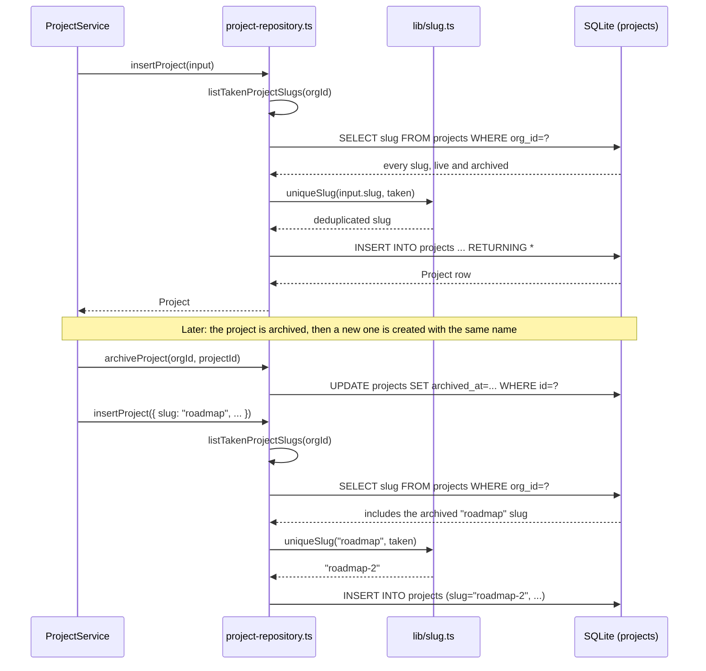

## Purpose

This document covers `src/server/repositories/project-repository.ts`,
`label-repository.ts` and `project-member-repository.ts`. Together they own the `projects`,
`labels`, `issue_labels` and `project_members` tables. Projects are the unit that issues,
the board and quotas hang off; labels are organization-wide rather than per-project
(REQ-013, REQ-074) and are shared across every project in the tenant; `project_members`
exists only to support `private`-visibility projects, where membership narrows who can see
the project at all rather than expressing a role.

As with the issue and comment repositories, every function here takes `orgId` explicitly
and none of the three files reference `src/lib/permissions.ts`. The one thing this trio
does that the issue repository does not is slug uniqueness: projects, like organizations,
resolve human-readable identity through a slug, and `project-repository.ts` is where
`uniqueSlug()` (`src/lib/slug.ts`) gets invoked against the set of slugs already taken in
the tenant.

## Public surface

| function | signature | tables touched | pagination | notes |
|---|---|---|---|---|
| `findProjectById` | `(orgId, projectId) => Project \| null` | `projects` | none | |
| `findProjectBySlug` | `(orgId, slug) => Project \| null` | `projects` | none | resolves `[projectSlug]` routes |
| `listProjects` | `(ListProjectsInput) => Page<Project>` | `projects` | keyset | archive scope normalized up front |
| `countProjects` | `(orgId, scope?) => number` | `projects` | none | feeds `projects` quota |
| `insertProject` | `(CreateProjectInput) => Project` | `projects` | none | de-duplicates slug internally |
| `updateProject` | `(UpdateProjectInput) => Project` | `projects` | none | partial patch |
| `archiveProject` / `restoreProject` | `(orgId, projectId) => Project` | `projects` | none | `archivePatch()` / `restorePatch()` |
| `listTakenProjectSlugs` | `(orgId) => string[]` | `projects` | none | includes archived rows |
| `getProjectStats` | `(orgId, projectId) => ProjectStats` | `projects`, `issues` | none | four counters, one shared scope predicate |
| `listLabels` | `(orgId) => IssueLabel[]` | `labels` | none, sorted by name | |
| `insertLabel` / `updateLabel` | see source | `labels` | none | |
| `deleteLabel` | `(orgId, labelId) => void` | `labels`, `issue_labels` | none | hard delete, cascades the join |
| `setIssueLabels` | `(orgId, issueId, labelIds) => void` | `issue_labels` | none | full replace, delete-then-insert |
| `listLabelsForIssues` | `(orgId, issueIds) => Record<string, IssueLabel[]>` | `issue_labels`, `labels` | none | batched, avoids N+1 |
| `listProjectMemberIds` | `(orgId, projectId) => UserId[]` | `project_members` | none | |
| `addProjectMember` | `(orgId, projectId, userId) => void` | `project_members` | none | idempotent |
| `removeProjectMember` | `(orgId, projectId, userId) => void` | `project_members` | none | |
| `isProjectMember` | `(orgId, projectId, userId) => boolean` | `project_members` | none | |

### DES-188 — Listing normalizes the archive scope before both the count and the rows query

- **Satisfies:** REQ-046, REQ-052
- **Decided in:** ADR-004, ADR-008
- **Code:** `src/server/repositories/project-repository.ts` — `listProjects`

`listProjects` starts by converting `ListProjectsInput`'s loose `includeArchived` boolean
into a fully-formed `ArchiveScope` object — `shouldFilterArchived(input) ? {} : {
includeArchived: true }` — before building the `filters` array. This is the same pattern
`issue-repository.ts`'s `listIssues` uses (DES-180) and it exists for the identical reason:
`total` and `rows` are computed from the same `filters` array, so a caller cannot end up
with a `total` that counts archived projects while `rows` excludes them, or vice versa. The
comment in the source file is explicit about this being a deliberate normalization step
rather than an accident of code order — an inline comment reads "the rows and the total
must agree on the archive scope, so normalise the filter's loose `includeArchived` into one
`ArchiveScope` up front." A `query` filter (`LIKE` against `projects.name`) and a `status`
filter round out the predicate set; there is no free-text search across `description`,
unlike the issue repository's title-and-description search.

### DES-189 — `getProjectStats` shares one predicate across four counters

- **Satisfies:** REQ-054
- **Decided in:** ADR-002
- **Code:** `src/server/repositories/project-repository.ts` — `getProjectStats`

The project card shown in list views needs open-issue count, closed-issue count, overdue
count and the timestamp of the most recent issue update. `getProjectStats` builds one
`scope` predicate — `orgId` match, `projectId` match, live-only via `livePredicate` — and
reuses it across four separate `SELECT` statements rather than re-deriving the condition
each time: a `count()` filtered further by `CLOSED_ISSUE_STATUSES` (from `src/types/issue.ts`)
for `closedIssues`, an unfiltered `count()` for `all`, a `count()` additionally filtered by
`dueAt < now` for `overdueIssues`, and a `max(updatedAt)` for `lastActivityAt`. `openIssues`
is then derived as `all - closedIssues` rather than issued as its own query, since "open"
is defined as "not closed" and computing it from the two counts already fetched avoids a
fifth round trip. This function runs once per project card render, so four small indexed
queries against a project-scoped subset of `issues` is the deliberate trade the team made
over a single more complex aggregate query — the four separate `SELECT`s are each easier to
reason about and to index than one query computing all four numbers via conditional
aggregation, and SQLite's per-query overhead on an in-process database is negligible enough
that this was never a measured bottleneck.

### DES-190 — Slug uniqueness scans include archived rows so a restore never collides

- **Satisfies:** REQ-041, REQ-047
- **Decided in:** ADR-004
- **Code:** `src/server/repositories/project-repository.ts` — `listTakenProjectSlugs`, `insertProject`

`listTakenProjectSlugs` returns every slug in the organization regardless of archive state
— it does not apply `livePredicate` at all. `insertProject` calls it, then hands the result
to `uniqueSlug(input.slug, taken)` (`src/lib/slug.ts`) to append a numeric suffix if the
requested slug collides. If archived projects were excluded from this scan, creating a new
project with the same name as a since-archived one would silently produce a duplicate
slug — and because `findProjectBySlug` is used to resolve `[projectSlug]` routes, two
projects sharing a slug is not a cosmetic problem, it is a routing ambiguity. The same
pattern appears in `organization-repository.ts`'s `listTakenOrgSlugs`, which similarly
scans without an archive filter (organizations do not use archived-row exclusion at read
time in the same way projects do, since `findOrgBySlug` already filters `archivedAt IS
NULL` for its own purposes, but the taken-slugs scan is unconditional there too). REQ-047's
"a project may be restored without losing its issues" only holds meaningfully if the slug
that made the project addressable in the first place is still guaranteed unique on restore
— this repository is where that guarantee is actually enforced.

### DES-191 — Label deletion cascades into the join table inside the same repository call

- **Satisfies:** REQ-074
- **Decided in:** ADR-002
- **Code:** `src/server/repositories/label-repository.ts` — `deleteLabel`

`deleteLabel` issues two statements in sequence: first a `DELETE FROM issue_labels WHERE
org_id = ? AND label_id = ?`, then `DELETE FROM labels WHERE org_id = ? AND id = ?`. Labels
carry no `archivedAt` column — like attachments, they are hard deleted, and unlike issues or
projects there is no "undo" story for a deleted label. Because a label can be attached to
an unbounded number of issues across the organization (labels are shared org-wide per
REQ-013), leaving the join rows behind after deleting the label row itself would leave
every affected issue's `labelIds` pointing at a nonexistent label — `listLabelsForIssues`'s
inner join against `labels` would simply drop those references rather than error, so the
symptom would be issues silently losing a label from their displayed set with no error
raised anywhere, which is a much harder bug to notice than a clean cascade.

### DES-192 — `listLabelsForIssues` is the batched read every list view relies on

- **Satisfies:** REQ-074, REQ-078
- **Decided in:** ADR-002
- **Code:** `src/server/repositories/label-repository.ts` — `listLabelsForIssues`

Given a set of issue ids, this function returns a single `Record<string, IssueLabel[]>`
keyed by issue id, built from one query that inner-joins `issue_labels` to `labels` and
filters with `inArray(issueLabels.issueId, [...issueIds])`. Every caller that needs to
decorate a page of issues with their labels — `listIssues`, `listIssuesWithRelations`,
`listBoardColumns`, `findIssueById`, `updateIssue` — goes through this one function rather
than looping and calling a per-issue label lookup. The empty-array short-circuit
(`if (issueIds.length === 0) return {}`) matters more than it looks: `listIssuesWithRelations`
calls this immediately after checking `if (ids.length === 0)` for its own early return, so
the two guards together mean an empty page of issues never reaches the database for labels
at all.

### DES-193 — Project membership writes are idempotent, not upserts with a conflict target

- **Satisfies:** REQ-050
- **Decided in:** ADR-002
- **Code:** `src/server/repositories/project-member-repository.ts` — `addProjectMember`

`addProjectMember` does not rely on a unique constraint and `onConflictDoNothing()`; it
calls `isProjectMember` first and returns early if the row already exists, only issuing the
`INSERT` when it does not. This is a slightly more expensive round trip than a database-level
upsert would be (two statements on the happy path where the row is new, one on the
already-a-member path), but it keeps the "is this a member" check reusable as its own
function (`isProjectMember` is called independently by `ProjectService` when deciding
visibility for `private` projects, per REQ-050) rather than folding that logic into a
conflict clause that only the insert path would exercise. `removeProjectMember` has no such
guard — removing a non-member is a no-op `DELETE` that matches zero rows and does not
error, which mirrors the idempotent-on-both-sides shape the whole trio favors for
membership state that a client might legitimately retry.

## Invariants

- Every function in all three files is explicitly `orgId`-scoped; `project_members` has no
  read or write that omits the tenant predicate, even though it is a pure join table.
- `listProjects`'s `total` and `rows` always agree on archive scope (DES-188), matching the
  invariant `issue-repository.ts` upholds for the same reason.
- Slug-taken scans (`listTakenProjectSlugs`) never filter by archive state (DES-190);
  narrowing that scan to live-only rows would be a regression, not a simplification.
- `deleteLabel` and `setIssueLabels` never leave `issue_labels` rows pointing at a `labels`
  id that no longer exists.
- None of these repositories import `can()`, `assertCan()`, or any symbol from
  `src/lib/permissions.ts` — visibility decisions for `private` projects are made by
  `ProjectService` using `isProjectMember` as an input, not by this layer.

## Test coverage

`tests/repositories/project-repository.test.ts` exercises `listProjects`, slug
de-duplication and `getProjectStats` against the in-memory database from
`tests/helpers/db.ts`. `tests/lib/slug.test.ts` covers `uniqueSlug()` and
`InvalidSlugError` at the unit level this repository depends on for both projects and
organizations. `tests/server/tenant-scope.test.ts` and `tests/server/soft-delete.test.ts`
assert the cross-cutting `orgId` and `archivedAt` invariants generically across every
repository in this file. `tests/services/project-service.test.ts` exercises project
archival cascades (DES-185, defined in `repository-issue-and-comment.md`, is the issue-side
half of the same cascade this file's `archiveProject` triggers) and quota enforcement
through the service boundary. There is no dedicated tests/repositories/label-repository.test.ts
or `project-member-repository.test.ts` in the corpus; label and project-membership behavior
is covered indirectly through `tests/services/project-service.test.ts` and the contract
tests in `tests/contract/slug.test.ts`.

## Data flow: creating a project, then restoring an archived one with the same name

The second half of the diagram is the concrete illustration of DES-190: because the
archived project's slug is still in the `taken` set, the new project is forced to
`roadmap-2` rather than silently colliding with the archived row's still-resolvable slug.
If the team ever restores the archived project instead of creating a new one, `restoreProject`
does not re-run any slug check at all — it only clears `archivedAt` — which is safe
precisely because the slug was never freed for reuse in the first place.
