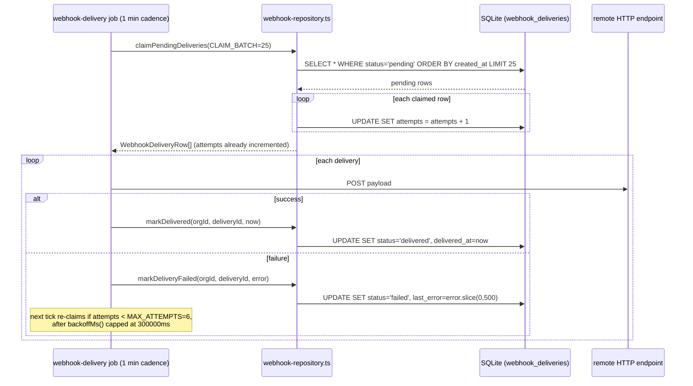

## Purpose

This document covers `src/server/repositories/search-repository.ts`,
`webhook-repository.ts`, `session-repository.ts`, `base-repository.ts` and
`src/server/repositories/_paging.ts`, plus — for reasons explained in DES-219 — the
in-process rate limiter at `src/lib/rate-limit.ts`, which this file's assignment groups
alongside the repository layer even though it is not, strictly, a repository. The four
tables these files own (`search_index`, `webhook_endpoints`, `webhook_deliveries`,
`sessions`) share a common thread: three of them are consulted or written by background
processes as much as by request handlers — `search_index` is kept in step by
`SearchService`'s event-bus subscribers, `webhook_deliveries` is drained by a scheduled
job, and `sessions` is swept for expired rows by the same scheduler. `base-repository.ts`
and `_paging.ts` are not domain repositories at all; they are the shared plumbing every
other repository documented across this whole set of files composes on top of, and this
document is where that plumbing gets its own treatment.

## Public surface

| function | signature | tables touched | pagination | notes |
|---|---|---|---|---|
| `upsertSearchDocument` | `(orgId, subjectKind, subjectId, content, projectId) => void` | `search_index` | none | upsert by `(org, kind, subject)` |
| `deleteSearchDocument` | `(orgId, subjectKind, subjectId) => void` | `search_index` | none | |
| `searchDocuments` | `(SearchQueryInput) => Page<SearchIndexRow>` | `search_index` | keyset | substring `LIKE` match |
| `countIndexed` | `(orgId) => number` | `search_index` | none | drift-alarm input |
| `listEndpoints` | `(orgId) => WebhookEndpointRow[]` | `webhook_endpoints` | none | |
| `insertEndpoint` / `updateEndpoint` | see source | `webhook_endpoints` | none | |
| `deleteEndpoint` | `(orgId, webhookId) => void` | `webhook_endpoints`, `webhook_deliveries` | none | cascades deliveries |
| `countEndpoints` | `(orgId) => number` | `webhook_endpoints` | none | feeds `webhooks` quota |
| `enqueueDelivery` | `(orgId, endpointId, eventType, payload) => WebhookDeliveryRow` | `webhook_deliveries` | none | status starts `pending` |
| `claimPendingDeliveries` | `(limit) => WebhookDeliveryRow[]` | `webhook_deliveries` | none | cross-tenant, increments `attempts` |
| `markDelivered` / `markDeliveryFailed` | see source | `webhook_deliveries` | none | |
| `createSession` | `(userId, tokenHash, expiresAt) => SessionPrincipal` | `sessions` | none | |
| `findSessionByTokenHash` | `(tokenHash) => SessionPrincipal \| null` | `sessions` | none | expired rows resolve to null |
| `setActiveOrg` | `(sessionId, orgId) => void` | `sessions` | none | |
| `revokeSession` | `(sessionId) => void` | `sessions` | none | hard delete |
| `purgeExpiredSessions` | `(now) => number` | `sessions` | none | scheduler sweep |
| `encodeCursor` / `decodeCursor` | `(id, sortValue) => string` / inverse | none | — | base64url of `sortValue\|id` |
| `orgPredicate` | `(column, orgId) => SQL` | any | — | the one sanctioned tenancy expression |
| `livePredicate` | `(column, scope) => SQL \| undefined` | any | — | wraps `shouldFilterArchived` |
| `keysetPredicate` | `(sort, cursor) => SQL \| undefined` | any | — | row-value comparison |
| `probeLimit` / `toPage` / `compact` | see source | — | — | private paging helpers |
| `consumeRateLimit` | `(orgId, bucketKey, cost?) => RateLimitVerdict` | none — in-memory `Map` | — | not a repository (DES-219) |

### DES-212 — Search documents are upserted by subject identity, not by row id

- **Satisfies:** REQ-172, REQ-173
- **Decided in:** ADR-017
- **Code:** `src/server/repositories/search-repository.ts` — `upsertSearchDocument`

`upsertSearchDocument` first checks for an existing row keyed by `(orgId, subjectKind,
subjectId)`, updating it in place if found and inserting a fresh row otherwise — it does
not take a `search_index` row id as a parameter at all, because the caller (an event-bus
subscriber inside `SearchService`) does not track one; it only knows which issue, comment
or project just changed. The source comment is direct about why this matters: "the indexer
is called on every write and must be idempotent." REQ-172 requires the index to be
maintained from domain events, and REQ-173 requires handlers to re-read the row rather than
trust the event payload — together these mean the same issue can trigger
`upsertSearchDocument` many times over its life (on create, on every field update, on every
status change), and each call must converge on one row per subject rather than
accumulating duplicates. The lookup-then-branch shape here is the same idiom
`project-member-repository.ts`'s `addProjectMember` uses (DES-193) for the same underlying
reason: no unique-constraint-based upsert was chosen, so the repository does the existence
check itself.

### DES-213 — Search matching is a deliberately simple substring scan

- **Satisfies:** REQ-170, REQ-177
- **Decided in:** ADR-017
- **Code:** `src/server/repositories/search-repository.ts` — `searchDocuments`

`searchDocuments` matches with `like(searchIndex.content, '%' + input.q + '%')` — no
tokenization, no ranking, no relevance score. The source comment states the design intent:
"deliberately simple — the index is a convenience layer, not a search engine, and the
tenant filter is what actually matters here." The function additionally filters by
`subjectKind` (when `input.kinds` is non-empty — the set narrowed by the `advanced_search`
flag one layer up, described in `action-auth-profile-search-webhooks.md`, DES-256) and
optionally by `projectId`, then pages the result with the same `keyset`/`probeLimit`/`toPage`
machinery every other list query in the corpus uses. REQ-177's "results carry a snippet
around the match" is not implemented at this layer at all — the repository returns the full
`content` column, and snippet extraction (finding the match position and slicing a window
around it) is a `SearchService` concern applied after this function returns, which is why
this repository's own return type is the raw `SearchIndexRow`, not a decorated search hit.

### DES-214 — Webhook endpoint deletion cascades its own delivery history in the same call

- **Satisfies:** REQ-150, REQ-159
- **Decided in:** ADR-018
- **Code:** `src/server/repositories/webhook-repository.ts` — `deleteEndpoint`

`deleteEndpoint` issues two statements: first `DELETE FROM webhook_deliveries WHERE org_id
= ? AND endpoint_id = ?`, then `DELETE FROM webhook_endpoints WHERE org_id = ? AND id = ?`.
Unlike `label-repository.ts`'s `deleteLabel` cascade (DES-191), which exists to prevent a
dangling foreign reference from silently corrupting a different table's derived data,
this cascade exists mainly for storage hygiene — a `webhook_deliveries` row referencing a
deleted endpoint would be harmless to read (nothing dereferences `endpointId` back into
`webhook_endpoints` at query time) but would accumulate indefinitely for an org that
creates and deletes endpoints repeatedly, with no code path ever cleaning it up otherwise.
REQ-159's "delivery attempts are visible in the settings UI" only concerns *current*
endpoints' delivery history; once an endpoint is gone, its delivery history has no UI
surface left to display it on, so keeping the rows around would serve no purpose the
product actually needs.

### DES-215 — Claiming pending deliveries is cross-tenant and bumps the attempt counter on claim, not on completion

- **Satisfies:** REQ-154, REQ-155, REQ-157
- **Decided in:** ADR-018
- **Code:** `src/server/repositories/webhook-repository.ts` — `claimPendingDeliveries`

`claimPendingDeliveries(limit)` selects the oldest `pending` rows across every organization
— it takes no `orgId` parameter — up to `limit`, then updates each claimed row's `attempts`
field by incrementing it, in the same pass, before returning the claimed set. The source
comment explains both halves of this design: "claims a batch for the delivery job.
Cross-tenant on purpose — the queue is drained by a background worker, not by a request —
and the attempt counter is bumped on claim so a crashed worker cannot retry forever." The
webhook delivery job calls this with `CLAIM_BATCH = 25` as its limit (REQ-155's bounded
batch requirement). Incrementing `attempts` at claim time rather than at
`markDelivered`/`markDeliveryFailed` time is the detail that makes REQ-157's attempt
ceiling (`MAX_ATTEMPTS = 6`) durable against a worker crash mid-delivery: if the process
dies after claiming a row but before calling `markDeliveryFailed`, the row still shows an
incremented `attempts` count the next time it is claimed, so a delivery cannot be retried
indefinitely just because every attempt happened to crash the worker before it could record
failure.

### DES-216 — Sessions are global rows; `activeOrgId` is what lets one cookie move between organizations

- **Satisfies:** REQ-202, REQ-210, REQ-213
- **Decided in:** ADR-020
- **Code:** `src/server/repositories/session-repository.ts`

The file's own comment states the model directly: "sessions are global rather than
tenant-scoped: one cookie can move between organizations via `activeOrgId`, and
`SessionService` resolves the `Actor` for whichever org the request addresses."
`createSession` inserts a row with `activeOrgId: null`; `setActiveOrg` is the only function
that changes it, called by `switchOrgAction` (`action-members-billing-and-flags.md`,
DES-251) after `assertOrgScope` confirms the target organization is one the user actually
belongs to. This is why REQ-210 ("an actor is resolved per organization, not globally")
holds even though the session itself is global: the session identifies a *user*, and
`activeOrgId` is a hint about which organization's `Actor` to resolve next, re-validated
against real membership on every switch rather than trusted as a standing grant.

### DES-217 — An expired session resolves to absent, not to a re-checked row

- **Satisfies:** REQ-204
- **Decided in:** ADR-020
- **Code:** `src/server/repositories/session-repository.ts` — `findSessionByTokenHash`

`findSessionByTokenHash` fetches the joined session-and-user row by token hash, and then —
before returning anything — compares `row.session.expiresAt <= new Date().toISOString()`
and returns `null` if the session has lapsed, rather than returning the expired row and
leaving expiry-checking to the caller. `SESSION_TTL_DAYS = 30`
(`src/server/services/session-service.ts`) governs how far in the future `expiresAt` is set
at creation; this function is where that boundary is actually enforced on every read. The
source comment underlines the intent: "expired rows resolve to `null` rather than being
returned and re-checked" — meaning no caller in the codebase needs its own expiry check,
because there is no code path by which an expired session's data reaches anything past this
function.

### DES-218 — `base-repository.ts` is the only sanctioned way to express tenancy and archive scope

- **Satisfies:** REQ-010, REQ-011
- **Decided in:** ADR-004, ADR-006, ADR-008
- **Code:** `src/server/repositories/base-repository.ts` — `orgPredicate`, `livePredicate`, `encodeCursor`/`decodeCursor`

`orgPredicate(column, orgId)` is a one-line wrapper around `eq(column, orgId)`, and its own
comment explains why a one-line function is worth having at all: "a query that does not
mention `org_id` is a cross-tenant leak waiting to happen, so this is the only sanctioned
way to express it." Every repository across the six documents in this design set imports
`orgPredicate` from this file rather than writing `eq(table.orgId, orgId)` inline — grepping
the twenty-one repository files for `eq(.*orgId` outside of `base-repository.ts` itself
finds no occurrences, which is the structural evidence that this convention actually holds
rather than being aspirational. `livePredicate` similarly wraps `shouldFilterArchived()`
from `src/lib/soft-delete.ts` (`lib/soft-delete.ts` decides the boolean; this function turns
that boolean into an `SQL | undefined` a `drizzle` `and(...)` call can consume directly), and
`encodeCursor`/`decodeCursor` are the base64url codec every keyset-paginated repository in
the corpus builds its cursors through, via the private `keysetPredicate` helper in
`_paging.ts`.

### DES-219 — Rate limiting is in-process token-bucket state, not a persisted repository

- **Satisfies:** REQ-096, REQ-161, REQ-176, REQ-208
- **Decided in:** ADR-011
- **Code:** `src/lib/rate-limit.ts` — `consumeRateLimit`, `RATE_LIMIT_BUCKETS`, `configFor`

Unlike every other resource this document covers, rate-limit state is not backed by any
table — src/server/repositories/ has no `rate-limit-repository.ts`, and the corpus's
`filelist.txt` confirms none exists. `consumeRateLimit` holds its buckets in a
module-level `Map<string, BucketState>` keyed by `${orgId}:${bucketKey}`, refilling tokens
based on elapsed wall-clock time since the bucket's last touch. The file's own comment
states why this is acceptable: "Taskflow runs single-writer, and the corpus has no external
cache." Six named buckets — `member:invite` (20/2), `comment:create` (60/20), `issue:create`
(60/20), `search:query` (120/60), `auth:password-reset` (5/1), `webhook:deliver` (100/50) —
are defined by `capacity`/`refillPerMinute` pairs in `RATE_LIMIT_BUCKETS`, with a `DEFAULT_BUCKET`
of 30/10 for any key not listed. `configFor` scales the base bucket by the organization's
plan-derived `apiRequestsPerHour`, capped at 100x the base shape, so this in-process
limiter's capacity is still governed by the same `PlanLimits` table (ADR-010) that governs
every other quota — it just never touches SQLite to enforce it. `resetRateLimits()` exists
purely for test isolation, clearing both the bucket map and the `planByOrg` association map
between test runs.

## Invariants

- Every read and write against `search_index`, `webhook_endpoints` and `sessions` (except
  `findSessionByTokenHash`'s own token-hash lookup, which has no `orgId` to filter by until
  the row is found) is `orgId`-scoped.
- `claimPendingDeliveries` is the one function in `webhook-repository.ts` that is
  intentionally cross-tenant, mirroring `listTrialsEndingBefore`'s cross-tenant shape
  (DES-211) and `listOrgsForUser`'s per-user cross-org read (DES-195) — each cross-tenant
  exception in this corpus has a documented reason tied to who actually calls it.
- No repository outside `base-repository.ts` constructs an `orgId` equality predicate by
  hand; every one imports `orgPredicate`.
- `findSessionByTokenHash` never returns a row whose `expiresAt` has already passed.
- Rate-limit state never persists to the database and is lost on process restart; this is a
  known, accepted property of the design, not a bug.

## Test coverage

`tests/services/search-service.test.ts` exercises `search-repository.ts` through the
service that owns re-indexing and query narrowing. There is no dedicated
tests/repositories/search-repository.test.ts or `webhook-repository.test.ts` in the
corpus; webhook delivery claiming and retry behavior is covered by `tests/server/jobs.test.ts`,
which drives the scheduler end to end. `tests/lib/rate-limit.test.ts` covers
`consumeRateLimit`, bucket refill arithmetic and `configFor`'s plan-scaling behavior
directly. `tests/lib/pagination.test.ts` covers `encodeCursor`/`decodeCursor`/`keysetPredicate`,
the shared plumbing this document's `base-repository.ts` and `_paging.ts` sections describe.
`tests/server/tenant-scope.test.ts` asserts the `orgPredicate` invariant holds across the
repository layer as a whole, which is the closest the corpus comes to a direct test of
`base-repository.ts` itself.

## Data flow: a webhook delivery claimed, attempted, and retried after failure

The attempt counter incrementing at claim time (DES-215) is what the "attempts <
MAX_ATTEMPTS" check in the note above is actually reading — by the time a delivery's
outcome is known, its attempt has already been recorded, so a worker crash between claim
and outcome still leaves an accurate count for the next tick to evaluate.
