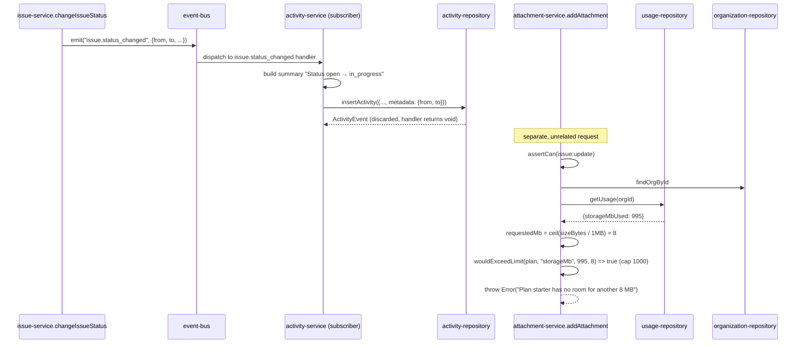

## Purpose

`src/server/services/activity-service.ts` is the audit-log writer and reader: it subscribes
to nine domain event types and turns each into an immutable activity row, and it exposes the
grouped feed and CSV/JSON export the activity page uses.
`src/server/services/attachment-service.ts` is a narrower service — attachment metadata plus
the storage-quota guard that keeps `storageMb` usage in sync with what has actually been
uploaded. They are grouped in one document because both are secondary, cross-cutting concerns
attached to an issue rather than first-class objects with their own lifecycle events.

What `activity-service.ts` deliberately does not own: deciding *whether* an action is
audit-worthy at the point of the action — that decision lives entirely in which events
`registerActivityListeners` subscribes to, not in the originating service. What
`attachment-service.ts` deliberately does not own: the actual file bytes or storage backend —
this service only tracks metadata rows and megabyte counts; nothing in this file performs an
upload.

## Public surface

| function | signature | permission action | events emitted | errors thrown |
|---|---|---|---|---|
| `record` | `(orgId: OrgId, action: ActivityAction, input: ActivityRecordInput) => Promise<ActivityEvent>` | none (internal) | none | none |
| `listActivity` | `(actor: Actor, input: ActivityFilterInput) => Promise<Page<ActivityEvent>>` | `activity:read` | none | `PermissionDeniedError` |
| `groupByDay` | `(events: readonly ActivityEvent[]) => readonly ActivityGroup[]` | none (pure) | none | none |
| `exportActivity` | `(actor: Actor, input: ExportActivityInput) => Promise<string>` | `activity:export` | none | `PermissionDeniedError`, plain `Error` (flag) |
| `registerActivityListeners` | `() => Unsubscribe` | none | none | none |
| `listAttachments` | `(actor: Actor, orgId: OrgId, issueId: IssueId) => Promise<readonly IssueAttachment[]>` | `issue:read` | none | `NotFoundError`, `PermissionDeniedError` |
| `addAttachment` | `(actor: Actor, input: CreateAttachmentInput) => Promise<IssueAttachment>` | `issue:update` | none | `NotFoundError`, `PermissionDeniedError`, plain `Error` (storage quota) |
| `removeAttachment` | `(actor: Actor, input: DeleteAttachmentInput) => Promise<void>` | `issue:update` | none | `NotFoundError`, `PermissionDeniedError` |

## Collaborators

- `src/server/repositories/activity-repository.ts` — `insertActivity`, `listActivity`.
- `src/server/repositories/attachment-repository.ts` — `listAttachments`,
  `insertAttachment`, `deleteAttachment`.
- `src/server/repositories/issue-repository.ts` — `findIssueById`, `listIssues`, the latter
  used only by `attachment-service.ts`'s `findAttachment` fallback.
- `src/server/repositories/organization-repository.ts` — `findOrgById`.
- `src/server/repositories/usage-repository.ts` — `getUsage`, `incrementUsage`.
- `src/lib/csv.ts` — `toCsv`.
- `src/lib/feature-flags.ts` — `isEnabled`.
- `src/lib/event-bus.ts` — `subscribe`.
- `src/server/services/_support.ts` — `activityResource`, `issueResource`, `requireFound`.

### DES-170 — record() takes no Actor because the writer is usually an event handler, not a request

- **Satisfies:** REQ-220, REQ-222, REQ-228
- **Decided in:** ADR-022
- **Code:** `src/server/services/activity-service.ts` — `record`

`record(orgId, action, input)` performs no authorization at all — the source comment states
directly: "deliberately takes no `Actor`: the writer is usually an event handler running
outside a request, and the row's `actorId` comes from the event payload rather than from an
authenticated principal." Every call site inside `registerActivityListeners` (DES-172)
extracts `actorId` from the event payload it received, which was itself stamped by the
originating service's `actorEnvelope`/`envelope` call at emit time (`_support.ts`) — so the
audit trail's notion of "who did this" is only as trustworthy as the emitting service's own
event envelope, not independently re-verified here. `organization-service.ts`'s
`updateOrganization` is the one caller outside `registerActivityListeners` that calls `record`
directly, by import, rather than through an event subscription (DES-151 in
`service-organization.md`), and it does pass a real `actor.userId` since it has an `Actor` in
scope at that call site. REQ-228's "activity capture must not fail the originating write" is
upheld structurally by `record`'s placement: every listener call happens *after* the emit that
triggered it, on the event bus's own dispatch, and `src/lib/event-bus.ts`'s documented handler
isolation means a failure inside one listener (including the activity listener) does not
propagate back to the code that called `emit` — the originating write has already committed by
the time any listener runs.

### DES-171 — listActivity and exportActivity both filter by a time range and a fixed page size, but only exportActivity is plan-gated

- **Satisfies:** REQ-223, REQ-224, REQ-225, REQ-230
- **Decided in:** ADR-012
- **Code:** `src/server/services/activity-service.ts` — `listActivity`, `exportActivity`

`listActivity` requires `activity:read` (minimum `member` per `ROLE_MATRIX`, satisfying
REQ-224) and delegates entirely to `activityRepo.listActivity(input)`, whose `input` carries
whatever subject/time filters the caller supplied (REQ-223's "queryable by subject") and
returns a full `Page<ActivityEvent>` with pagination handled by the repository. `exportActivity`
requires the stricter `activity:export` (minimum `admin`, REQ-225), then additionally checks
`isEnabled("csv_export", ...)` — but only `if (input.format === "csv")`; a `json`-format export
request is not subject to the flag check at all, since `csv_export` gates the CSV output
format specifically, not the export capability as a whole. The `json` branch calls
`JSON.stringify(page.items, null, 2)` directly; the `csv` branch calls `toCsv` from
`src/lib/csv.ts` against a fixed `EXPORT_COLUMNS` tuple (`occurredAt`, `action`, `actorId`,
`subjectKind`, `subjectId`, `summary`) — REQ-230's "CSV export escapes quotes and separators"
is `toCsv`'s responsibility, not this service's; `exportActivity` only decides which columns
and which rows go in. Both `format` branches call `activityRepo.listActivity` with a hardcoded
`limit: 100` — export is capped at the first 100 matching rows regardless of how many the
`since`/`until` window actually contains, with no pagination or "export everything" path in
this function; a caller needing a larger export would have to page through `listActivity`
directly and stitch results themselves, which the export UI does not currently do.

### DES-172 — groupByDay is a pure, in-memory reshape with no query behind it, and it sorts newest day first

- **Satisfies:** REQ-229
- **Decided in:** ADR-022
- **Code:** `src/server/services/activity-service.ts` — `groupByDay`

`groupByDay` takes an already-fetched `readonly ActivityEvent[]` and buckets each event by
`event.occurredAt.slice(0, 10)` — the ISO date portion of the timestamp, a plain string slice
rather than a timezone-aware date computation, meaning the grouping boundary is always UTC
midnight regardless of which organization's configured timezone (REQ-012) an event belongs to.
The resulting map is sorted `([a], [b]) => (a < b ? 1 : -1)`, a descending string comparison
that works correctly only because ISO date strings sort lexicographically the same as
chronologically — newest day first, matching REQ-229's "paginated by occurrence time" ordering
convention for the feed. Because `groupByDay` takes no `orgId` and performs no repository call,
it is exported specifically so it can be unit tested with hand-built `ActivityEvent` fixtures,
and so the UI layer can call it directly on an already-fetched page without a second round
trip — grouping is a presentation concern layered on top of `listActivity`'s flat page, not an
alternative query shape.

### DES-173 — Nine event types feed the audit log, each with its own hand-written summary string, and none of them retry on failure

- **Satisfies:** REQ-220, REQ-221, REQ-222
- **Decided in:** ADR-022
- **Code:** `src/server/services/activity-service.ts` — `registerActivityListeners`

`registerActivityListeners` subscribes to `project.created`, `project.archived`,
`issue.created`, `issue.status_changed`, `issue.assigned`, `comment.created`,
`member.invited`, `member.role_changed`, and `billing.plan_changed` — nine of
`TaskflowEventMap`'s 21 keys, a deliberate subset rather than "every event." Each handler
constructs its own `summary` string by hand from the payload (`"Created issue \"${payload
.title}\""`, `"Status ${payload.from} → ${payload.to}"`, `"Assigned to ${payload.assigneeId}"`,
and so on) — there is no shared summary-formatting helper across the nine handlers, so the
exact phrasing of an audit-log entry is fully owned by this one file and would need to be
edited here, in nine separate places, to change format consistently. `issue.status_changed`
and `issue.assigned` additionally attach a `metadata` object (`{ priority: ... }` for
creation, `{ from, to }` for status changes) carrying structured values the free-text
`summary` also encodes in prose — the redundancy is deliberate, since `metadata` is queryable
and typed while `summary` is display-only prose. REQ-221's "activity rows are immutable" is
upheld by omission: there is no `updateActivity` or `deleteActivity` function anywhere in
either the service or, so far as this service's imports reveal, the repository it calls — once
`insertActivity` writes a row, nothing in the service layer can change it. Every handler here
returns `record(...).then(() => undefined)`, discarding the inserted row's return value — the
event-bus subscriber contract expects `void`, not the `ActivityEvent` `record` itself resolves
to, so each handler explicitly throws that value away rather than returning it. Notably absent
from this list of nine: `comment.deleted`, `billing.limit_exceeded`, `flag.toggled`, and
`member.removed` all produce no activity row at all, despite being domain events other
listeners (search, notifications, usage) do react to — the audit trail's coverage is narrower
than the full event surface, a gap worth flagging for anyone relying on the activity feed as a
complete history rather than a curated subset of it.

### DES-174 — Attachment quota accounting rounds up to whole megabytes, and the delete path has to search for the attachment it wants to remove

- **Satisfies:** REQ-075
- **Decided in:** ADR-010
- **Code:** `src/server/services/attachment-service.ts` — `addAttachment`,
  `removeAttachment`, `findAttachment`, `BYTES_PER_MB`

`addAttachment` computes `requestedMb = Math.ceil(input.sizeBytes / BYTES_PER_MB)` — the
source comment states the reasoning plainly: "the quota is in megabytes and the upload is in
bytes... half a megabyte still costs one against the plan." This means a large number of
sub-megabyte attachments each individually round up, consuming more aggregate quota than their
true combined byte size would suggest; a plan boundary at exactly N megabytes could in
principle be reached earlier, in whole-megabyte increments, than the raw byte sum implies.
After `wouldExceedLimit(org.plan, "storageMb", usage.storageMbUsed, requestedMb)` passes, the
function inserts the attachment row and calls `usageRepo.incrementUsage(input.orgId, {
storageMbUsed: requestedMb })` directly — notably, `attachment-service.ts` does not emit any
domain event on either add or remove (there is no `attachment.added`/`attachment.removed` key
in `TaskflowEventMap`), so this quota adjustment is an isolated repository write with no
listener anywhere reacting to it, unlike `usage-service.ts`'s event-driven deltas for seats,
projects, and issues (DES-140 in `service-billing-and-usage.md`). `removeAttachment` gives the
megabytes back symmetrically (`-Math.ceil(attachment.sizeBytes / BYTES_PER_MB)`), but first has
to locate the attachment at all via the module-private `findAttachment` helper, which — because
`attachmentRepo` exposes no "find by id" query, only "list by issue" — pages through up to 100
of the org's issues (`issueRepo.listIssues({ limit: 100, includeArchived: true })`) calling
`attachmentRepo.listAttachments` per issue until a match turns up. This is a real, visible
performance concern flagged directly in the source comment: "the attachment repository only
reads by issue, because that is the only way the UI ever reaches one. A delete arrives with
just an id, so the org's issues are walked until the row turns up." For an organization with
more than 100 issues, a delete request for an attachment on an issue past that boundary would
fail to locate it and surface `NotFoundError`, even though the attachment genuinely exists —
worth flagging as a scaling gap that would need a dedicated repository lookup before it
becomes a practical problem for larger organizations.

## Sequence: an issue status change producing an audit row, and an attachment upload against a near-full storage quota

1. `issue-service.ts` publishes `issue.status_changed`; the activity listener is one of
   several subscribers dispatched, entirely independent of the attachment flow shown alongside
   it here for contrast.
2. The activity handler builds its summary string and calls `record`, which writes
   immediately with no further authorization — the write already happened upstream in
   `issue-service.ts`.
3. The handler discards `record`'s return value, satisfying the `void`-returning subscriber
   contract the event bus expects.
4. Separately, an attachment upload first authorizes against `issue:update`, then loads the
   org for its plan and the usage cache for current storage consumption.
5. The requested byte size is rounded up to whole megabytes before the quota comparison runs.
6. Here, adding 8 MB to an org already at 995 of a 1000 MB `starter` cap breaches the limit,
   and the function throws before any repository write — no attachment row, no usage
   increment, and no event of any kind, since this service does not participate in the event
   bus at all.

## Failure modes

| thrown error | resulting error code | caller behaviour |
|---|---|---|
| `NotFoundError` | `not_found` (404) | activity/attachment UI shows "not found"; for `removeAttachment` on an issue past the 100-issue scan boundary, this can fire even when the attachment genuinely exists (DES-174) |
| `PermissionDeniedError` | `forbidden` (403) | activity feed and export controls hidden below `member`/`admin` respectively; attachment controls hidden below `member` |
| `TenantScopeError` | `tenant_scope_violation` (403) | logged as a bug, session redirected |
| plain `Error` (csv_export flag in `exportActivity`) | falls through to `internal_error` (500) | export button shows an upgrade prompt keyed off message text |
| plain `Error` (storage quota in `addAttachment`) | falls through to `internal_error` (500) | upload UI shows the plan's storage cap from the thrown message; same untyped-error pattern flagged repeatedly across this design set |

## Test coverage

`tests/services/activity-service.test.ts` covers `record`, `groupByDay`'s sorting and
bucketing, `exportActivity`'s CSV/JSON branches and the `csv_export` flag gate, and the nine
event-listener summaries. There is no dedicated tests/services/attachment-service.test.ts in
the corpus's test directory — the storage-quota rounding behaviour and the 100-issue scan
limitation documented in DES-174 are currently verifiable only by reading
`attachment-service.ts` directly, not by pointing at a passing automated test for this
specific service.
