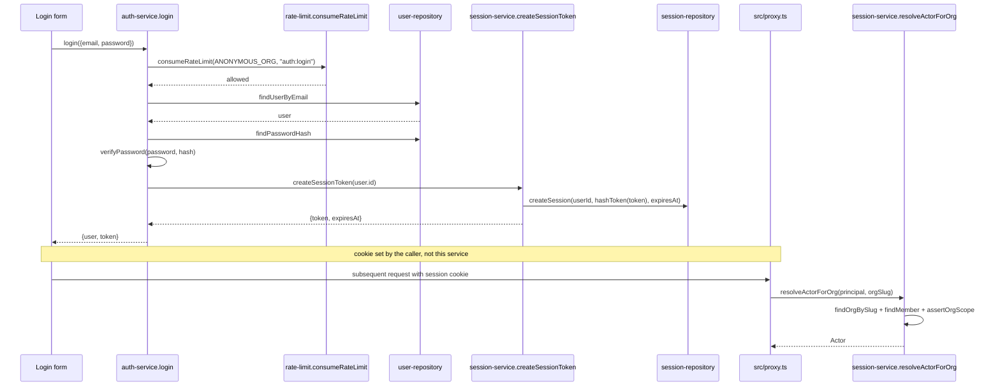

## Purpose

`src/server/services/auth-service.ts` owns credential registration, login, logout, and
password reset — no third-party identity provider is involved anywhere in this corpus.
`src/server/services/session-service.ts` owns the opaque session token lifecycle and the
bridge from a resolved session to a per-organization `Actor`. The two are sequential, not
peers: a successful `login` in `auth-service.ts` calls straight into
`session-service.ts`'s `createSessionToken` to mint the credential the browser actually keeps.

What neither service owns: reading or writing the session cookie itself — REQ-206's "only one
module reads or writes the session cookie" names `src/lib/session.ts`, a module neither
service imports; both work entirely in terms of a bare token string or a `SessionPrincipal`
value, leaving the browser boundary to the caller.

## Public surface

| function | signature | permission action | events emitted | errors thrown |
|---|---|---|---|---|
| `register` | `(input: RegisterInput) => Promise<{ user: User; org: Organization }>` | none | none (see DES-164) | plain `Error` (email taken) |
| `login` | `(input: LoginInput) => Promise<{ user: User; token: string }>` | none | none | plain `Error` (rate limit, bad credentials) |
| `logout` | `(sessionId: SessionId) => Promise<void>` | none | none | none |
| `requestPasswordReset` | `(input: PasswordResetRequestInput) => Promise<void>` | none | none | none (always resolves) |
| `confirmPasswordReset` | `(input: PasswordResetConfirmInput) => Promise<User>` | none | none | plain `Error` (rate limit, invalid token) |
| `createSessionToken` | `(userId: UserId) => Promise<{ token: string; expiresAt: IsoTimestamp }>` | none | none | none |
| `resolveSession` | `(token: string) => Promise<SessionPrincipal \| null>` | none | none | none |
| `resolveActorForOrg` | `(principal: SessionPrincipal, orgSlug: string) => Promise<Actor \| null>` | none (builds the Actor) | none | none |
| `switchActiveOrg` | `(principal: SessionPrincipal, input: SwitchOrgInput) => Promise<void>` | none | none | plain `Error` (not a member) |
| `destroySession` | `(token: string) => Promise<void>` | none | none | none |

## Collaborators

- `src/server/repositories/user-repository.ts` — `findUserByEmail`, `insertUser`,
  `findPasswordHash`, `updatePasswordHash`, `findUserById`.
- `src/server/repositories/_password-reset-repository.ts` — `issueResetToken`,
  `findLiveResetToken`, `consumeResetToken`.
- `src/server/repositories/session-repository.ts` — `createSession`,
  `findSessionByTokenHash`, `revokeSession`, `purgeExpiredSessions`.
- `src/server/repositories/member-repository.ts` — `findMember`, `touchLastSeen`.
- `src/server/repositories/organization-repository.ts` — `findOrgBySlug`,
  `listOrgsForUser`.
- `src/lib/hash.ts` — `hashPassword`, `verifyPassword`, `hashToken`, `randomToken`.
- `src/lib/rate-limit.ts` — `consumeRateLimit`.
- `src/lib/slug.ts` — `slugify`, used by `register` to derive the seeded org's slug.
- `src/server/services/organization-service.ts` — `createOrganization`, called directly by
  `register`.
- `src/server/services/email-service.ts` — `renderEmail`, `sendEmail`.
- `src/lib/tenant.ts` — `assertOrgScope`, called by `session-service.ts` only.

### DES-164 — auth-service declares it must call emit but cannot, because TaskflowEventMap has no authentication events

- **Satisfies:** REQ-200, REQ-209
- **Decided in:** ADR-005
- **Code:** `src/server/services/auth-service.ts` (module-level doc comment)

This is the one honest, explicit gap this design set is required to surface, and it is stated
in the source itself rather than inferred: the module doc comment reads "Must call (do not
reimplement): hashPassword, verifyPassword, consumeRateLimit, emit," immediately followed by a
second comment block: "`TaskflowEventMap` has no authentication event and the type is part of
the frozen contract, so the declared `emit` is not reachable from here." Reading the function
bodies confirms this literally — there is no `import { emit } from "@/lib/event-bus"` anywhere
in `auth-service.ts`, and no call to `emit` appears in `register`, `login`, `logout`,
`requestPasswordReset`, or `confirmPasswordReset`. The practical consequence: login attempts,
successful or failed, password resets, and logouts are entirely invisible to the event bus and
therefore to every listener built on top of it — `activity-service.ts`'s audit trail (DES-172
in `service-activity-and-attachment.md`) has no way to record "user X logged in" or "user X
reset their password" as an activity row, because there is no event to subscribe to for either.
The one authentication-adjacent action that *is* observable is registration's downstream
effect: `register` calls `createOrganization`, which does emit `member.joined` for the new
owner (DES-150 in `service-organization.md`) — so account creation is visible to the audit
trail only as a side effect of the organization it creates, never as an authentication event in
its own right. Anyone extending Taskflow's event map to add authentication events would need
an ADR, since the brief and the source comment both treat `TaskflowEventMap`'s closed 21-key
union as a frozen contract this service cannot unilaterally widen.

### DES-165 — Login charges the rate-limit bucket before checking the password, so both failure modes are throttled identically

- **Satisfies:** REQ-200, REQ-208
- **Decided in:** ADR-011
- **Code:** `src/server/services/auth-service.ts` — `login`, `LOGIN_BUCKET`,
  `ANONYMOUS_ORG`

`login` calls `consumeRateLimit(ANONYMOUS_ORG, LOGIN_BUCKET)` as its very first line, before
`userRepo.findUserByEmail` is even called — `ANONYMOUS_ORG` is a fixed sentinel org id (a
27-zero string cast to `OrgId`), used specifically because, per the source comment, "rate
limiting before a session exists has no tenant to charge against, so every unauthenticated
attempt is billed to this sentinel bucket." This means every login attempt against Taskflow,
regardless of which organization the email eventually resolves to, shares one global rate
limit bucket rather than a per-org one — a deliberate departure from every other rate-limited
action in the service layer (comment creation, search, invites), all of which key on the real
`orgId`. `LOGIN_BUCKET` (`"auth:login"`) is not among the buckets the brief's product facts
enumerate explicitly by name alongside their capacity/refill numbers — only `auth:password
-reset` (5 capacity / 1 refill per minute) is named — so `auth:login` falls back to the
default bucket configuration (30 capacity / 10 refill per minute) documented in
`src/lib/rate-limit.ts`. Once the token is consumed, `login` proceeds to look up the user and
verify the password, and both the "no such user" and "wrong password" cases throw the
identical message "Those credentials did not match" — an enumeration-resistance choice that
extends the anti-enumeration reasoning DES-167 documents for password reset to the login path
as well, since a distinguishable "no such user" error would let an attacker enumerate
registered emails one login attempt at a time.

### DES-166 — Registration is one call that creates a user, a workspace, and its owner membership, with no intermediate state

- **Satisfies:** REQ-209
- **Decided in:** ADR-006
- **Code:** `src/server/services/auth-service.ts` — `register`

`register` first checks `userRepo.findUserByEmail` and throws if an account already exists —
this is a plain uniqueness check, not itself an enumeration protection, since registration
necessarily reveals whether an email is taken (unlike login or reset, which do not need to).
It then inserts the user row with a hashed password, and immediately calls
`createOrganization(user.id, { name: \`${input.name}'s workspace\`, slug: slugify(input.name)
|| "workspace", plan: "free" })` — a synthesized workspace name and slug the user never
explicitly chose, always on the `free` plan regardless of anything in `RegisterInput`. The
`slugify(input.name) || "workspace"` fallback covers the case where a user's display name
contains no slug-safe characters at all (an all-emoji or all-symbol name, say), falling back
to the literal string `"workspace"` rather than producing an empty or invalid slug —
`organization-service.ts`'s own `uniqueSlug` call inside `createOrganization` then handles any
collision against existing org slugs. `register`'s final step renders and "sends" a `welcome`
template email via `email-service.ts`; per DES-132 in `service-digest-and-email.md`, this is a
structured log write, not a real delivery, but it happens synchronously as part of the
registration call, so a slow or failing render would delay the response the caller sees — the
function does not fire-and-forget this step.

### DES-167 — Password reset resolves identically whether or not the email is known, and stores only the token's hash

- **Satisfies:** REQ-200, REQ-201, REQ-208
- **Decided in:** ADR-020
- **Code:** `src/server/services/auth-service.ts` — `requestPasswordReset`,
  `confirmPasswordReset`, `RESET_TTL_MS`

`requestPasswordReset` consumes the `auth:password-reset` bucket (5/1, the one named bucket in
the brief's rate-limit table) and then, if `!verdict.allowed`, simply `return`s — no thrown
error, no distinguishable response between a throttled request and one that proceeds. If the
user is not found, the function also just `return`s, with the same void result as a successful
send. The source comment states the reasoning directly: "telling an anonymous caller which
emails have accounts is an enumeration oracle." Because both branches produce an identical
`Promise<void>` with no observable difference to the caller, a script probing this endpoint
cannot distinguish "no such account," "rate limited," and "reset email sent" from the response
alone — REQ-208's rate limiting is real, but it is deliberately invisible to the caller for
this specific endpoint, unlike `login`'s rate limit, which does throw a visible message
(DES-165). The reset token itself is generated with `randomToken(32)`, and only `hashToken
(token)` is passed to `resetTokenRepo.issueResetToken` — the raw token exists solely inside
the rendered email, matching the same hash-only-at-rest discipline `session-service.ts`
applies to session tokens (DES-168) and REQ-201's "passwords are stored only as hashes"
extends by the same logic to reset tokens even though REQ-201 itself is about passwords, not
reset tokens specifically. `RESET_TTL_MS` is one hour (`60 * 60 * 1000`).
`confirmPasswordReset` marks the token consumed via `resetTokenRepo.consumeResetToken` *before*
writing the new password hash — the source comment: "a replay of the same link cannot
overwrite a password the user has since changed again" — so a delayed second submission of the
same reset link, arriving after a first successful reset, fails at the consumed-token check
rather than silently reverting the password a second time.

### DES-168 — Session tokens are hashed at rest, and resolveSession never distinguishes an expired session from a nonexistent one

- **Satisfies:** REQ-202, REQ-203, REQ-204
- **Decided in:** ADR-020
- **Code:** `src/server/services/session-service.ts` — `createSessionToken`,
  `resolveSession`, `SESSION_TTL_DAYS`

`createSessionToken` generates a raw token via `randomToken(TOKEN_BYTES)` (32 bytes) and
stores only `hashToken(token)` via `sessionRepo.createSession` — the source comment: "only the
hash reaches the database, so a dump of the `sessions` table cannot be replayed as a login,"
mirroring the exact same pattern DES-167 documents for reset tokens. `SESSION_TTL_DAYS` is
`30`, matching the value the brief's product facts state and computed here as
`SESSION_TTL_DAYS * MS_PER_DAY` added to the current time for `expiresAt`. `resolveSession`
is a one-line passthrough to `sessionRepo.findSessionByTokenHash(hashToken(token))` — it
returns whatever the repository returns, `SessionPrincipal | null`, with no service-level logic
distinguishing "token never existed" from "token existed but its row has since expired or been
purged"; whether an expired-but-not-yet-purged row is still returned as a live principal is
entirely a property of `session-repository.ts`'s own query, not something this service layers
on top of. `resolveSession` performs no authorization of its own — it is the raw lookup
primitive `resolveActorForOrg` builds on.

### DES-169 — resolveActorForOrg re-asserts scope on an Actor it just built from the same org, and this redundancy is intentional

- **Satisfies:** REQ-210, REQ-211, REQ-212, REQ-213
- **Decided in:** ADR-013, ADR-007
- **Code:** `src/server/services/session-service.ts` — `resolveActorForOrg`,
  `switchActiveOrg`

`resolveActorForOrg(principal, orgSlug)` resolves the org by slug, loads the caller's
membership row in that specific org, returns `null` unless a row exists and `status ===
"active"` (the same active-only rule `member-service.ts`'s `resolveActor` applies, DES-145 in
`service-member-and-invitation.md` — the two functions duplicate this check rather than
sharing a helper), constructs the `Actor` inline, and then calls `assertOrgScope(actor, org
.id)` on an `Actor` it just built to reference that exact org id. The source comment
acknowledges the apparent redundancy directly: "the `assertOrgScope` call at the end looks
redundant — the actor was just built from that org — but it is the invariant this whole layer
exists to uphold, and it catches a mis-wired membership lookup immediately." In other words,
the assertion is not there to catch a malicious caller (there is none reachable at this layer)
but to catch a *bug* in this very function — if a future edit changed which `orgId` field
feeds the `Actor` construction, this assertion would fail loudly in development rather than
silently minting a cross-tenant `Actor`. Once the actor passes, `resolveActorForOrg` calls
`memberRepo.touchLastSeen`, updating presence as a side effect of every org-scoped page load,
not as a separate tracked action. `switchActiveOrg` performs a near-identical membership
re-check (REQ-009's explicit-switch requirement) but, notably, does not itself write the
session's active-org column — the source comment explains `SessionPrincipal` carries no
session id, so `sessionRepository.setActiveOrg` is called by the Server Action that still
holds the cookie, with this function owning only the authorization half of the switch.
`destroySession` similarly cannot target a specific session row directly for the same
structural reason (`SessionPrincipal` has no session id): it resolves the principal from the
token, then calls `sessionRepo.purgeExpiredSessions`, a sweep rather than a targeted delete —
REQ-207's "logout destroys the session server-side" is satisfied by this sweep clearing the
now-expired-or-flagged row rather than by an id-targeted deletion, a detail worth flagging
since it means logout's server-side cleanup is coupled to whatever `purgeExpiredSessions`
considers eligible for removal, not to the specific token that was presented.

## Sequence: login through to a resolved per-organization Actor

1. The login form submits credentials; the rate-limit bucket is consumed before the user
   lookup, so a brute-force script is throttled on every attempt, successful or not.
2. `verifyPassword` compares against the stored hash; a failure and a nonexistent user both
   produce the identical thrown message.
3. On success, `login` calls `session-service.ts`'s `createSessionToken`, which generates the
   raw token, hashes it for storage, and returns the raw token to the caller — the only place
   the raw value exists is this return value and whatever the caller does with it next.
4. `login` itself never touches a cookie; per REQ-206, only `src/lib/session.ts` is trusted to
   read or write it, so the Server Action that called `login` is responsible for setting it.
5. On a later request, `src/proxy.ts` (REQ-212's request hook, ADR-007) reads the cookie,
   resolves the principal, and calls `resolveActorForOrg` with the org slug from the URL.
6. `resolveActorForOrg` re-derives membership from scratch for that specific org and asserts
   scope on the `Actor` it just built, per DES-169, before any downstream service call can
   treat it as authorized.

## Failure modes

| thrown error | resulting error code | caller behaviour |
|---|---|---|
| plain `Error` (email taken in `register`) | falls through to `internal_error` (500) | signup form shows a generic "could not create account" message keyed off the thrown text |
| plain `Error` (rate limit / bad credentials in `login`) | falls through to `internal_error` (500) | login form shows one generic error for both cases, matching the enumeration-resistance intent even though the HTTP status itself does not distinguish rate limiting from bad credentials |
| plain `Error` (rate limit / invalid token in `confirmPasswordReset`) | falls through to `internal_error` (500) | reset form shows "that reset link is no longer valid" or a generic retry message |
| no throw at all (`requestPasswordReset` on unknown email or throttled request) | n/a — resolves successfully | UI always shows "if that email has an account, a reset link was sent," regardless of what actually happened server-side |
| `switchActiveOrg`'s plain `Error` (not a member) | falls through to `internal_error` (500) | org switcher only lists orgs the user already belongs to, so this mainly guards a stale client-side list |

All of the auth path's thrown errors are plain `Error` instances, none of the typed domain
error classes (`PermissionDeniedError`, `TenantScopeError`, and so on) — consistent with there
being no `Actor` yet for most of these calls to check permissions against in the first place,
so the untyped-error pattern flagged elsewhere in this design set (`service-issue.md` DES-101,
`service-billing-and-usage.md` DES-137) is, for this specific service, less an inconsistency
than a reflection of auth genuinely having no `PermissionResource` to build.

## Test coverage

`tests/schemas/auth.schema.test.ts` covers the Zod schemas (`RegisterInput`, `LoginInput`,
`PasswordResetRequestInput`, `PasswordResetConfirmInput`) these functions accept, not the
service functions' own logic. There is no dedicated tests/services/auth-service.test.ts or
tests/services/session-service.test.ts in the corpus's test directory — the rate-limit
ordering in DES-165, the enumeration-resistant behaviour in DES-167, the token-hashing
discipline in DES-168, and the redundant-but-intentional scope assertion in DES-169 are all
currently verifiable only by reading `auth-service.ts` and `session-service.ts` directly, not
by pointing at a passing automated test — a real gap worth flagging given how much of this
design set's discussion concerns security-sensitive behaviour (rate limiting, token hashing,
enumeration resistance) that has no dedicated regression coverage.
