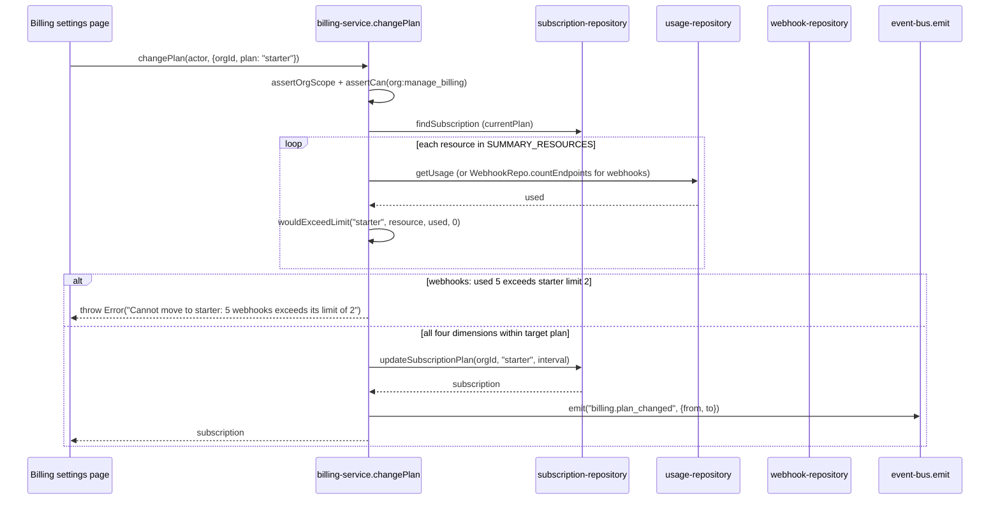

## Purpose

`src/server/services/billing-service.ts` is, per its own source comment, "the single reader
of `PLAN_LIMITS` on the server; every other layer asks this service" — in practice this means
`checkLimit`/`assertWithinLimit` are the canonical quota-evaluation functions, even though
`issue-service.ts`, `project-service.ts`, `invitation-service.ts`, `attachment-service.ts` and
`webhook-service.ts` each call `wouldExceedLimit` from `src/config/plan-limits.ts` directly
rather than through `billing-service.ts` — a distinction DES-135 covers explicitly.
`src/server/services/usage-service.ts` is the counter cache those quota checks read: it keeps
a denormalised `OrganizationUsage` row current via event-bus listeners and a periodic full
recount, so quota checks are a cheap read rather than a table scan.

What `billing-service.ts` deliberately does not own: quota *enforcement* at the point of
write — it computes and reports, but the actual "reject this create" decision at each write
path is made by that path's own service, most of which do not call into `billing-service.ts`
at all (DES-135). What `usage-service.ts` deliberately does not own: the quota comparison
itself, only the counters `checkLimit` and `wouldExceedLimit` compare against.

## Public surface

| function | signature | permission action | events emitted | errors thrown |
|---|---|---|---|---|
| `getBillingSummary` | `(actor: Actor, orgId: OrgId) => Promise<BillingSummary>` | `org:manage_billing` | none | `NotFoundError`, `PermissionDeniedError` |
| `checkLimit` | `(orgId: OrgId, resource: LimitedResource, requested?: number) => Promise<LimitCheck>` | none | none | none |
| `assertWithinLimit` | `(orgId: OrgId, resource: LimitedResource, requested?: number) => Promise<void>` | none | `billing.limit_exceeded` (on breach) | plain `Error` (breach) |
| `changePlan` | `(actor: Actor, input: ChangePlanInput) => Promise<Subscription>` | `org:manage_billing` | `billing.plan_changed` | `PermissionDeniedError`, plain `Error` (downgrade blocked) |
| `updateSeats` | `(actor: Actor, input: UpdateSeatsInput) => Promise<Subscription>` | `org:manage_billing` | none | `PermissionDeniedError`, plain `Error` (over plan max) |
| `cancelSubscription` | `(actor: Actor, input: CancelSubscriptionInput) => Promise<Subscription>` | `org:manage_billing` | none | `NotFoundError`, `PermissionDeniedError` |
| `listInvoices` | `(actor: Actor, orgId: OrgId) => Promise<readonly Invoice[]>` | `org:manage_billing` | none | `PermissionDeniedError` |
| `getUsage` | `(actor: Actor, orgId: OrgId) => Promise<OrganizationUsage>` | none (scope only) | none | `TenantScopeError` |
| `recomputeUsage` | `(orgId: OrgId) => Promise<OrganizationUsage>` | none (job-invoked) | `billing.limit_exceeded` (on threshold) | none |
| `registerUsageListeners` | `() => Unsubscribe` | none | none | none |

## Collaborators

- `src/server/repositories/subscription-repository.ts` — `findSubscription`,
  `updateSubscriptionPlan`, `updateSeatCount`, `cancelSubscription`, `insertSubscription`.
- `src/server/repositories/invoice-repository.ts` — `listInvoices`.
- `src/server/repositories/organization-repository.ts` — `findOrgById`.
- `src/server/repositories/usage-repository.ts` — `getUsage`, `recomputeUsage`,
  `incrementUsage`, `listOrgIdsForRollup`.
- `src/server/repositories/webhook-repository.ts` — `countEndpoints`, read by `usageFor` for
  the `webhooks` dimension only.
- `src/config/plan-limits.ts` — `getLimit`, `getPlanLimits`, `wouldExceedLimit`.
- `src/server/services/_support.ts` — `actorEnvelope`, `billingResource`, `requireFound`.

### DES-135 — billing-service is the canonical quota reader, but most write paths bypass it and call wouldExceedLimit directly

- **Satisfies:** REQ-132, REQ-138
- **Decided in:** ADR-010
- **Code:** `src/server/services/billing-service.ts` — `checkLimit`, `usageFor`;
  cross-referenced against `issue-service.ts`, `project-service.ts`,
  `invitation-service.ts`, `attachment-service.ts`, `webhook-service.ts`

This is the single most important architectural fact about billing in Taskflow, and it is
easy to miss from `billing-service.ts` alone: `checkLimit` and `assertWithinLimit` exist as
the intended single entry point (ADR-010's "declare every plan quota in one table," extended
in practice to "check it through one function"), but of the five write paths that gate
themselves against a plan quota — issue creation (`issuesPerProject`), project creation
(`projects`), invitation/seat checks (`seats`), attachment storage (`storageMb`), and webhook
endpoint creation (`webhooks`) — **none of them call `billing-service.ts`**. Each instead
imports `wouldExceedLimit` from `src/config/plan-limits.ts` directly and computes its own
`used` count from its own repository (`issueRepo.countIssues`, `projectRepo.countProjects`,
a hand-rolled active-member-plus-pending-invitation sum in `invitation-service.ts`,
`usageRepo.getUsage(...).storageMbUsed` in `attachment-service.ts`,
`webhookRepo.countEndpoints` in `webhook-service.ts`). `billing-service.ts`'s own `checkLimit`
is instead used by `getBillingSummary` (to render the billing page's meters) and by
`changePlan` (to validate a downgrade, DES-136) — a *read* and a *guard on plan changes*, not
a guard on ordinary resource creation. The practical consequence for anyone auditing quota
enforcement: `getLimit(plan, resource)` is the one function every path agrees on for what the
limit *is*, but "is a create within budget" is answered five different ways by five different
services, each with its own idea of what `used` means for that resource — worth flagging
because a future change to how a resource is counted (say, whether archived issues count
toward `issuesPerProject`) would have to be made in `issue-service.ts`, not in
`billing-service.ts`, despite the latter's doc comment claiming to be the single reader.

### DES-136 — Downgrades are checked against every summary resource before the plan row changes, using the target plan's limits

- **Satisfies:** REQ-141
- **Decided in:** ADR-010
- **Code:** `src/server/services/billing-service.ts` — `changePlan`, `SUMMARY_RESOURCES`

`changePlan` loops over `SUMMARY_RESOURCES` — the fixed tuple `["seats", "projects",
"storageMb", "webhooks"]`, notably *not* including `issuesPerProject` or
`apiRequestsPerHour` — and for each, reads current usage via `usageFor` and calls
`wouldExceedLimit(input.plan, resource, used, 0)`, the target plan's limit against current
usage with a zero-sized additional request (checking existing usage alone, not "usage plus
one more"). If any dimension would exceed the target plan, the function throws before calling
`subscriptionRepo.updateSubscriptionPlan` at all — REQ-141's "downgrades are refused while
usage exceeds the target plan" is enforced exactly here, and only here; nothing prevents an
org from being *created* over a plan's limits in the first place (a plan change to a lower
tier is the only place this check runs). The omission of `issuesPerProject` from
`SUMMARY_RESOURCES` means a downgrade is not blocked by per-project issue counts exceeding the
new plan's per-project cap — an org with a project holding 5,000 issues can freely downgrade
to `starter` (cap 1,000 issues per project) since issue count is not one of the four checked
dimensions, a gap worth flagging since it means the guarantee REQ-141 promises is narrower in
practice than "usage exceeds the target plan" reads, covering only seats, projects, storage
and webhooks.

### DES-137 — assertWithinLimit is the only quota function that emits an event, and it emits before throwing

- **Satisfies:** REQ-138, REQ-139
- **Decided in:** ADR-005
- **Code:** `src/server/services/billing-service.ts` — `assertWithinLimit`

`assertWithinLimit` calls `checkLimit` and, if `check.exceeded`, calls `emit
("billing.limit_exceeded", {...})` *before* throwing the plain `Error` that actually stops
the caller — the emit is not inside a catch block or a finally, it is a sequential statement
ahead of the `throw`. This ordering matters: the event fires unconditionally whenever this
function detects a breach, whether or not the caller that invoked `assertWithinLimit`
ultimately handles the thrown error gracefully, which is what lets
`activity-service.ts`'s `billing.plan_changed`/`billing.limit_exceeded` listeners (and any
future alerting) observe every breach even from call paths that swallow the exception
upstream. As DES-135 notes, `assertWithinLimit` itself is not actually called from the five
per-resource creation guards in the codebase today — it exists as the documented, correct
pattern (REQ-138's "produces `plan_limit_exceeded`, not a crash" is the shape this function is
built to satisfy) that the other five services do not currently follow, each instead throwing
their own untyped `Error` without emitting `billing.limit_exceeded` at all. This is the same
gap flagged from the issue-service side in `service-issue.md`'s DES-101 failure-mode table,
restated here from the billing side: `billing.limit_exceeded` in the frozen code is only
reliably emitted by `assertWithinLimit` (unused by creation paths) and by
`usage-service.ts`'s `recomputeUsage` threshold check (DES-138), not by the actual moment a
create request is rejected.

### DES-138 — recomputeUsage fires a warning event at ninety percent of quota, independent of any single write

- **Satisfies:** REQ-139, REQ-144
- **Decided in:** ADR-016
- **Code:** `src/server/services/usage-service.ts` — `recomputeUsage`, `WARN_THRESHOLD`

`recomputeUsage` calls `usageRepo.recomputeUsage(orgId)` — a full recount from source tables,
not an incremental read — and then separately checks `usage.seatsUsed >= limits.seats *
WARN_THRESHOLD` (0.9) and the equivalent for `projectsUsed`, emitting a
`billing.limit_exceeded` event for either dimension that crosses ninety percent, using the
plan's *full* limit as `check.limit` in the payload even though the org has not actually
exceeded it yet — the event name is shared between a genuine breach (DES-137) and this
approaching-threshold warning, which means a listener cannot distinguish "the org is at 91%
of seats" from "the org tried to add a seat and was rejected" purely from the event's shape;
both produce identically-typed `billing.limit_exceeded` payloads. `recomputeUsage` is called
both by `usage-rollup-job.ts` on its 15-minute cadence (REQ-144, "usage is rolled up on a
schedule for the billing screen," per the `CADENCE_MINUTES` table) and, per the source
comment, "by every event that could have moved a counter" — though inspection of
`registerUsageListeners` (DES-140) shows the listeners call the cheaper `incrementUsage`
directly, not `recomputeUsage`; the periodic rollup is what the comment means by "corrects any
drift they accumulate," reconciling the incremental deltas against a full recount only every
15 minutes, not on every event.

### DES-139 — getUsage is a cache read with no authorization beyond tenant scope, and it is what checkLimit ultimately reads

- **Satisfies:** REQ-132, REQ-133
- **Decided in:** ADR-010
- **Code:** `src/server/services/usage-service.ts` — `getUsage`;
  `src/server/services/billing-service.ts` — `usageFor`

`usage-service.ts`'s `getUsage` calls only `assertOrgScope` — no `assertCan` at all — before
returning `usageRepo.getUsage(orgId)` directly. This is narrower gating than
`billing-service.ts`'s `getBillingSummary`, which requires `org:manage_billing`; the usage
counters themselves are treated as visible to any member of the org (matching the usage meter
component's placement in the general settings area, not a billing-only page), while the
richer `BillingSummary` — subscription details, upcoming invoice total — is billing-restricted.
`billing-service.ts`'s own `usageFor` function does not call `usage-service.ts`'s `getUsage`
at all; it calls `usageRepo.getUsage(orgId)` directly, the same repository function, just
without going through the second service — the two services both read the same cached row
independently rather than one depending on the other, which is consistent with the layering
in ADR-013 (services depend on repositories, not on each other, except where a specific
composition like `organization-service.ts` calling `activity-service.ts`'s `record` is
deliberate).

### DES-140 — Usage listeners apply signed deltas per event, keeping the counter incremental rather than always recomputing

- **Satisfies:** REQ-133, REQ-134, REQ-135
- **Decided in:** ADR-016
- **Code:** `src/server/services/usage-service.ts` — `registerUsageListeners`

`registerUsageListeners` attaches six subscriptions, each applying a small signed delta via
`usageRepo.incrementUsage`: `issue.created` (+1 `issuesUsed`), `issue.archived` (-1
`issuesUsed`), `project.created` (+1 `projectsUsed`), `project.archived` (-1 `projectsUsed`
*and* `-payload.issuesArchived` on `issuesUsed` in the same call, reusing the cascade count
`project-service.ts`'s `archiveProject` put in the event payload — see `service-project.md`'s
DES-111), `member.joined` (+1 `seatsUsed`), and `member.removed` (-1 `seatsUsed`). Combining
the project and issue decrements into one `incrementUsage` call for `project.archived` avoids
a race between two separate writes to the same usage row landing out of order; every other
listener adjusts exactly one field. This incremental approach is what makes `checkLimit`
cheap on the hot path (REQ-134, REQ-135: "checked before project/issue creation") — reading a
cached counter rather than counting rows on every write — at the cost of the drift DES-138's
periodic rollup exists to correct; a bug in any one listener (a missed unsubscribe, a
duplicate delivery) accumulates invisibly until the next 15-minute recount catches it.

### DES-141 — Storage and API-request dimensions are asymmetric: one is tracked, the other is a stub

- **Satisfies:** REQ-136, REQ-137
- **Decided in:** ADR-010
- **Code:** `src/server/services/billing-service.ts` — `usageFor`

`usageFor`'s switch statement handles six `LimitedResource` cases. Four map to real
`usageRepo`-backed fields (`seatsUsed`, `projectsUsed`, `issuesUsed`, `storageMbUsed`);
`webhooks` calls `webhookRepo.countEndpoints(orgId)` directly rather than reading a cached
usage field at all, so webhook quota checks are always a live count, never subject to
`usage-service.ts`'s incremental-cache drift the other four dimensions can have; and
`apiRequestsPerHour` returns the literal `0` unconditionally — there is no repository backing
this dimension in the frozen codebase. This means `checkLimit(orgId, "apiRequestsPerHour",
...)` can never report `exceeded: true` no matter how much traffic an org sends, since `used`
is hard-coded to zero regardless of plan (REQ-137's `Number.POSITIVE_INFINITY` `UNLIMITED`
constant is not even reachable for this dimension — it would only matter if `used` could ever
approach a finite limit). This is an honest, visible gap: `PlanLimits.apiRequestsPerHour` is
declared and differs meaningfully across plans (100 on `free`, 100,000 on `enterprise`), but
nothing in the service layer enforces it — API request throttling in Taskflow, to the extent
it exists at all, would have to live in `src/lib/rate-limit.ts`'s buckets (whose capacity does
scale with `apiRequestsPerHour / 100`, capped at 100x, per the rate limiter's own
configuration) rather than in this quota check.

## Sequence: a plan downgrade blocked by current webhook usage

1. The billing page submits a target plan; `changePlan` authorizes with
   `org:manage_billing` before reading anything.
2. The current plan is read from the subscription row (not the denormalised
   `organizations.plan` column — `planFor`'s comment explains the subscription is the
   authority).
3. Each of the four `SUMMARY_RESOURCES` dimensions is checked against the *target* plan's
   limit using current usage, with `requested: 0` — this is a pure "does existing usage already
   exceed the new ceiling" check, not a check on any single new unit.
4. If webhook endpoint count (read live from `webhookRepo.countEndpoints`, not the usage
   cache) exceeds `starter`'s webhook limit, the loop throws immediately and no other
   dimension is checked past that point.
5. If every dimension passes, `subscriptionRepo.updateSubscriptionPlan` writes the new plan
   and interval.
6. `billing.plan_changed` is emitted carrying both `from` and `to`, which
   `activity-service.ts`'s listener renders as "Plan X → Y" and which
   `webhook-service.ts`'s `registerWebhookListeners` also subscribes to, fanning the change
   out to any org webhook endpoint subscribed to that event type.

## Failure modes

| thrown error | resulting error code | caller behaviour |
|---|---|---|
| `NotFoundError` | `not_found` (404) | billing page shows a load error; this should not occur in practice since every org has exactly one subscription per REQ-130 |
| `PermissionDeniedError` | `forbidden` (403) | billing settings are hidden from non-owners in the nav; direct navigation surfaces a 403 page |
| plain `Error` (breach in `assertWithinLimit`) | falls through to `internal_error` (500) despite `PermissionDeniedError`-style intent | same untyped-error gap as DES-101/135; `HTTP_STATUS_BY_CODE`'s `plan_limit_exceeded` (402) is never actually reached by this throw since it is a bare `Error`, not a class `errors.ts` recognizes |
| plain `Error` (downgrade blocked in `changePlan`) | falls through to `internal_error` (500) | billing UI shows a generic failure with the thrown message text, since the message itself names the offending resource and limit |
| plain `Error` (seat cap in `updateSeats`) | falls through to `internal_error` (500) | same pattern; UI relies on the message string |

## Test coverage

`tests/services/billing-service.test.ts` covers `checkLimit`, `assertWithinLimit`'s emit-then-
throw ordering, `changePlan`'s downgrade rejection across all four `SUMMARY_RESOURCES`, seat
updates, and cancellation. `tests/schemas/billing.schema.test.ts` covers the Zod schemas
`ChangePlanInput`/`UpdateSeatsInput`/`CancelSubscriptionInput` validate against, not the
service itself. `tests/components/usage-meter.test.tsx` exercises the client component that
renders `LimitCheck` results but does not call into `usage-service.ts` or `billing-service.ts`
directly — it is given fixture data. There is no dedicated `tests/services/usage-service
.test.ts`; `usage-service.ts`'s listener behaviour (DES-140) is exercised only indirectly
through whichever service tests trigger the events it subscribes to.
