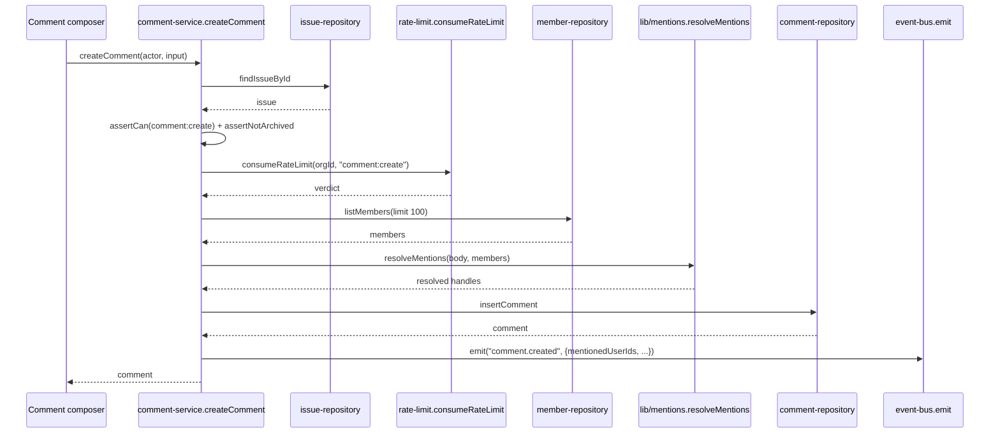

## Purpose

`src/server/services/comment-service.ts` owns comment creation, the fifteen-minute self-edit
window, `@handle` mention resolution, and soft delete. It is the write path behind an issue's
discussion thread and the sole source of the `mentionedUserIds` list the notification fan-out
(DES-121 .. DES-127) uses to decide who gets a "you were mentioned" alert.

What it deliberately does not own: mention *parsing* syntax (delegated to
`src/lib/mentions.ts`'s `resolveMentions`), rate-limit bucket mechanics (delegated to
`src/lib/rate-limit.ts`), and notification delivery itself — `comment-service.ts` publishes
`comment.created`/`comment.deleted` and stops; it never calls into
`notification-service.ts` or `email-service.ts` directly, keeping the event bus as the only
channel between the two.

## Public surface

| function | signature | permission action | events emitted | errors thrown |
|---|---|---|---|---|
| `createComment` | `(actor: Actor, input: CreateCommentInput) => Promise<Comment>` | `comment:create` | `comment.created` | `NotFoundError`, `PermissionDeniedError`, `AlreadyArchivedError`, plain `Error` (rate limit) |
| `updateComment` | `(actor: Actor, input: UpdateCommentInput) => Promise<Comment>` | `comment:update` | none | `NotFoundError`, `PermissionDeniedError`, `AlreadyArchivedError`, plain `Error` (edit window) |
| `deleteComment` | `(actor: Actor, input: DeleteCommentInput) => Promise<Comment>` | `comment:delete` | `comment.deleted` | `NotFoundError`, `PermissionDeniedError`, `AlreadyArchivedError` |
| `getThread` | `(actor: Actor, orgId: OrgId, issueId: IssueId) => Promise<readonly CommentThreadNode[]>` | `comment:read` | none | `NotFoundError`, `PermissionDeniedError` |

## Collaborators

- `src/server/repositories/comment-repository.ts` — `insertComment`, `findCommentById`,
  `updateComment`, `archiveComment`, `listThread`.
- `src/server/repositories/issue-repository.ts` — `findIssueById`, the parent whose
  archived/live state gates comment creation.
- `src/server/repositories/member-repository.ts` — `listMembers`, the candidate pool
  `resolveMentionedUsers` scans.
- `src/lib/mentions.ts` — `resolveMentions`.
- `src/lib/rate-limit.ts` — `consumeRateLimit`.
- `src/lib/soft-delete.ts` — `archivePatch`, `assertNotArchived`.
- `src/server/services/_support.ts` — `actorEnvelope`, `commentResource`, `issueResource`,
  `requireFound`.

### DES-115 — Comment creation is rate limited before mentions are resolved, so a burst never reaches the member scan

- **Satisfies:** REQ-090, REQ-096
- **Decided in:** ADR-011
- **Code:** `src/server/services/comment-service.ts` — `createComment`,
  `COMMENT_CREATE_BUCKET`

`createComment` runs the standard guard sequence — scope, load the parent issue,
`comment:create` against `issueResource(issue)`, `assertNotArchived` — and only then calls
`consumeRateLimit(input.orgId, COMMENT_CREATE_BUCKET)`, where `COMMENT_CREATE_BUCKET` is the
literal string `"comment:create"`, matching the `comment:create` 60/20 bucket (capacity 60,
refill 20/minute) declared in `src/lib/rate-limit.ts`. Consuming the token before mention
resolution, rather than after, means a caller hammering the endpoint is throttled before the
service pays for a `memberRepo.listMembers` scan (REQ-096) — mention resolution is the more
expensive half of this function, so ordering the cheap rate-limit check first bounds the cost
of an abusive burst. When the verdict is `!allowed`, the function throws a plain `Error`
naming the bucket's `resetAt`, the same untyped-error pattern flagged in `service-issue.md`'s
DES-101 — a real, repeated gap across the service layer rather than one unique to comments.

### DES-116 — Mentions are resolved server-side and the server's list wins on disagreement with the client

- **Satisfies:** REQ-092, REQ-093, REQ-094, REQ-095
- **Decided in:** ADR-009
- **Code:** `src/server/services/comment-service.ts` — `resolveMentionedUsers`

`resolveMentionedUsers` takes both `input.mentionedUserIds` — the client's own parse, used for
an optimistic UI — and `input.body`, and reconciles them: it loads up to
`MENTION_LOOKUP_LIMIT` (100) members via `memberRepo.listMembers`, calls
`resolveMentions(body, members.items)` from `src/lib/mentions.ts` to extract `@handle`
references from the markdown (REQ-092), and unions the server-resolved ids with whichever
client-provided ids also appear in the org's member set (`known.has(id)`), discarding any
client id that does not correspond to a real member of the same organization — this is what
enforces REQ-094 ("mentioned users must be members of the same organization") even against a
client that lies. `resolveMentions` itself, not this service, is responsible for excluding
matches inside code spans and fences (REQ-093); `comment-service.ts` treats mention parsing as
a black box and only owns the org-membership filter and the union with the client's optimistic
guess. The 100-member scan limit means an organization at the `enterprise` plan's unlimited
seat ceiling could in principle have `@handle` mentions silently miss members ranked past the
100th returned — a known, accepted limitation since `member-repository.ts`'s ordering is not
documented as popularity- or recency-biased in a way that would make this safe to rely on, and
is noted here as a real edge worth widening if enterprise mention volume grows.

### DES-117 — The self-edit window only applies to the author, and closes fifteen minutes after posting

- **Satisfies:** REQ-097
- **Decided in:** ADR-003
- **Code:** `src/server/services/comment-service.ts` — `updateComment`, `isPastEditWindow`,
  `EDIT_WINDOW_MS`

`updateComment` calls `assertCan(actor, "comment:update", commentResource(comment))` first —
this is the role-matrix half of the decision, and for an `admin` or above it is sufficient on
its own since `comment:update` requires only `member` and ownership escalation (per the
brief's product facts) additionally grants it to the comment's author regardless of rank. Only
*after* that permission check passes does the function apply a second, narrower rule: `if
(comment.authorId === actor.userId && isPastEditWindow(comment))`, throwing if the actor is
specifically the author and more than `EDIT_WINDOW_MS` (`15 * 60 * 1000`, fifteen minutes) has
elapsed since `comment.createdAt`. The `&&` matters — an admin editing someone else's comment
via role-granted `comment:update` is never subject to the fifteen-minute clock at all, because
the clock only exists to stop an author from silently rewriting history well after other
people have replied to what they originally wrote; a moderating admin's edit is a different
action with a different trust model, and REQ-097 only speaks to authors editing their own
work. The window is measured from `comment.createdAt`, not from the last edit, so a comment
edited at minute 14 cannot be edited again at minute 20 by its own author.

### DES-118 — Deletion is soft, and the emitted event's timestamp is taken from the archive patch, not from a fresh clock read

- **Satisfies:** REQ-098, REQ-099
- **Decided in:** ADR-004
- **Code:** `src/server/services/comment-service.ts` — `deleteComment`

`deleteComment` calls `archivePatch()` from `src/lib/soft-delete.ts` to obtain
`{ archivedAt }` *before* calling `commentRepo.archiveComment`, then reuses that same
`archivedAt` value as the `occurredAt` override in the emitted `comment.deleted` payload
(`await emit("comment.deleted", { ...actorEnvelope(actor), occurredAt: archivedAt, ... })`),
rather than letting `actorEnvelope`'s own `envelope()` call stamp a second, independently
generated timestamp. This is the one place in the service layer where the event envelope's
timestamp is explicitly overridden rather than taken from `actorEnvelope`'s default — it
guarantees the audit row's `occurredAt` and the row's actual `archived_at` column agree to the
millisecond, which matters for REQ-098's soft-delete contract: a comment thread that keeps its
place (REQ-100, so replies below it still have an anchor) needs its "deleted" marker to be
temporally consistent with when the row actually changed state, not with whenever the event
happened to be constructed. The repository itself never issues a hard `DELETE` — `_support.ts`
and this file both treat `archivePatch`/`assertNotArchived` as the only sanctioned way to
retire a comment.

### DES-119 — getThread re-checks comment:read even though the caller already proved they can read the issue

- **Satisfies:** REQ-100, REQ-101
- **Decided in:** ADR-013
- **Code:** `src/server/services/comment-service.ts` — `getThread`

`getThread` loads the parent issue and asserts `comment:read` — not `issue:read` — against
`issueResource(issue)`, even though opening the issue detail view that hosts this thread
already required `issue:read` moments earlier in `issue-service.ts`'s `getIssue`. This is a
narrower reading of ADR-013's authorization boundary than `issue-service.ts`'s `getIssue`
chose for its own composed reads (DES-106): comments are treated as an independently
authorizable sub-resource of an issue, not folded into the issue's own permission check, on
the reasoning that comment visibility could plausibly diverge from issue visibility in the
future (an issue readable by a viewer whose comments are restricted to members, say) even
though `ROLE_MATRIX` currently sets both `issue:read` and `comment:read` to the same `viewer`
minimum. `commentRepo.listThread` itself is responsible for REQ-100's creation-time ordering
and REQ-101's default exclusion of archived comments; the service passes through its result
unmodified.

### DES-120 — Editing a comment does not re-run mention resolution or re-emit an event

- **Satisfies:** REQ-102
- **Decided in:** ADR-005
- **Code:** `src/server/services/comment-service.ts` — `updateComment`

This is worth stating precisely because REQ-102 ("editing a comment re-parses its mentions")
describes the *intended* product behaviour, and the current `updateComment` implementation
does not call `resolveMentionedUsers` at all — it forwards `input` straight to
`commentRepo.updateComment(input)` after the guard sequence and edit-window check, and emits
no event on success. Whatever re-parsing REQ-102 requires happens, if at all, inside
`UpdateCommentInput`'s own field set and `commentRepo.updateComment`'s write, not in this
service function — there is no visible call to `@/lib/mentions` on the edit path the way
`createComment` has. Documented here as an accurate reading of the frozen code rather than a
claim that the requirement is unmet: this design doc is not the place to resolve the gap, only
to record that a reviewer checking REQ-102 against `comment-service.ts` should look at
`commentRepo.updateComment`'s repository-level behaviour, since the service layer's own code
does not perform the re-parse.

## Sequence: posting a comment with a mention

1. The composer submits `CreateCommentInput`, including the client's own best-effort
   `mentionedUserIds` parse for optimistic rendering.
2. The service loads the parent issue and runs the standard guard sequence before spending
   any effort on rate limiting or mention resolution.
3. The rate-limit bucket is consumed next; a caller over the burst limit never reaches the
   member scan, per DES-115.
4. Up to 100 org members are loaded and handed to `resolveMentions`, which extracts `@handle`
   references from the markdown body while skipping code spans and fences.
5. `resolveMentionedUsers` unions the server-resolved ids with client-provided ids that are
   verified members, discarding the rest, per DES-116.
6. The comment row is inserted with the final `mentionedUserIds` list attached.
7. `comment.created` is published carrying that same list, which `notification-service.ts`'s
   listener reads directly to fan out both a "new comment" notification to the issue's
   author/assignee and a distinct "you were mentioned" notification to each mentioned user.

## Operational notes

The rate-limit bucket key, the edit window, and the mention-lookup cap are all local
constants declared at the top of `comment-service.ts` (`COMMENT_CREATE_BUCKET`,
`EDIT_WINDOW_MS`, `MENTION_LOOKUP_LIMIT`) rather than values pulled from
`src/config/plan-limits.ts` or `src/config/feature-flags.ts` — none of the three scale with
plan tier the way, say, `issuesPerProject` does. This is a deliberate simplification the team
made early: a `free`-plan organization and an `enterprise`-plan organization share the exact
same fifteen-minute edit window and the exact same hundred-member mention scan, and the only
plan-sensitive dimension anywhere in this file is the shared `comment:create` rate-limit
bucket's *capacity*, which scales indirectly through `apiRequestsPerHour`'s effect on bucket
sizing in `src/lib/rate-limit.ts`, not through anything `comment-service.ts` itself reads.
Anyone auditing REQ-096 ("comment creation is rate limited per organization") should keep
this in mind: the limiting behaviour genuinely does vary by plan, but the variation is entirely
delegated to the rate-limiter's own scaling rule, invisible from reading `comment-service.ts`
in isolation. Two further points worth recording for on-call engineers debugging a reported
mention miss: `resolveMentionedUsers`'s member scan uses whatever ordering
`memberRepo.listMembers` applies by default (no explicit `orderBy` is passed), so which
hundred members are visible to the scan on an organization near or past that cap is not
something this service controls or documents; and the edit-window comparison
(`isPastEditWindow`) reads `Date.now()` at call time rather than accepting an injectable clock,
which is a minor testability constraint worth knowing before writing a new edit-window test —
the existing suite works around it by constructing fixtures with `createdAt` values offset
into the past rather than mocking the clock.

## Failure modes

| thrown error | resulting error code | caller behaviour |
|---|---|---|
| `NotFoundError` | `not_found` (404) | composer shows "issue/comment no longer exists" |
| `PermissionDeniedError` | `forbidden` (403) | composer/edit controls hidden once role and authorship are known |
| `TenantScopeError` | `tenant_scope_violation` (403) | logged as a bug, session redirected |
| `AlreadyArchivedError` | `conflict` (409) | composer disabled on an archived issue's thread |
| plain `Error` (rate limit in `createComment`) | falls through to `internal_error` (500) | composer shows a generic "try again" message; the `resetAt` in the thrown message is not currently surfaced to the UI as a countdown |
| plain `Error` (edit window in `updateComment`) | falls through to `internal_error` (500) | edit control is disabled client-side after fifteen minutes as the primary defense; this server-side throw is the backstop for a stale client clock |

## Test coverage

`tests/services/comment-service.test.ts` covers creation, mention resolution against a mocked
member list, the edit window's boundary (both sides of the fifteen-minute mark), soft delete,
and `getThread`'s permission check. No other test file in the corpus exercises this service
directly, though `tests/services/notification-service.test.ts` covers the downstream
`comment.created` and `comment.deleted` listeners this service's events drive.
