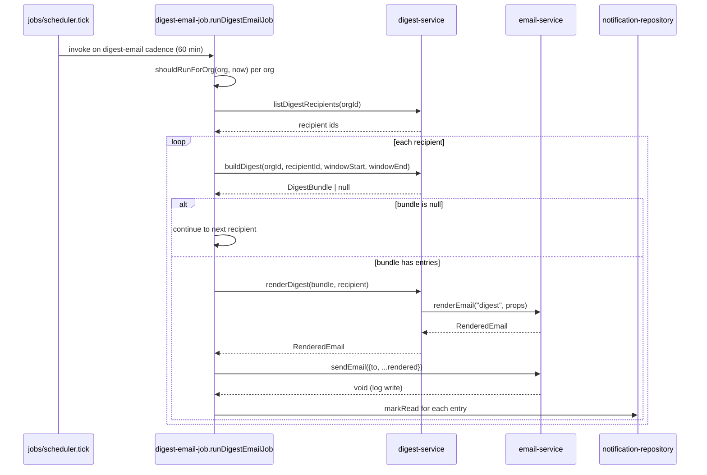

## Purpose

`src/server/services/digest-service.ts` and `src/server/services/email-service.ts` split the
"what to send" question from the "how to send it" one. `digest-service.ts` decides, per
organization and recipient, whether a digest bundle exists inside a time window and what it
contains; `email-service.ts` renders any of Taskflow's seven templates to HTML and plain text
and "sends" the result by writing it to the structured log — Taskflow has no outbound SMTP
transport in this corpus by design, so `sendEmail` never leaves the process.

What `digest-service.ts` deliberately does not own: the schedule that decides *when* a
recipient's digest hour has arrived (owned by `src/server/jobs/digest-email-job.ts`'s
`shouldRunForOrg`, run on the interval scheduler documented in ADR-016), and marking
notifications read once digested (also the job's responsibility, not this service's). What
`email-service.ts` deliberately does not own: template *selection* logic or business rules
about who should receive which template — it is a pure renderer plus a log-write, with no
knowledge of organizations, plans, or recipients beyond the props handed to it.

## Public surface

| function | signature | permission action | events emitted | errors thrown |
|---|---|---|---|---|
| `buildDigest` | `(orgId: OrgId, recipientId: UserId, windowStart: IsoTimestamp, windowEnd: IsoTimestamp) => Promise<DigestBundle \| null>` | none (job-invoked) | none | none |
| `listDigestRecipients` | `(orgId: OrgId) => Promise<readonly UserId[]>` | none | none | none |
| `renderDigest` | `(bundle: DigestBundle, recipient: User) => Promise<RenderedEmail>` | none | none | none |
| `sendEmail` | `(message: OutgoingEmail) => Promise<void>` | none | none | none |
| `renderEmail` | `(template: EmailTemplate, props: Readonly<Record<string, unknown>>) => Promise<RenderedEmail>` | none | none | none |

## Collaborators

- `src/server/repositories/notification-repository.ts` — `listUnreadSince` (digest source
  data).
- `src/server/repositories/notification-preference-repository.ts` —
  `listDigestSubscribers`.
- `src/server/repositories/organization-repository.ts` — `findOrgById`, source of plan for
  the flag check.
- `src/server/services/feature-flag-service.ts` — `buildFlagContext`, reused rather than
  constructing a `FlagContext` by hand.
- `src/config/constants.ts` — `DIGEST_MAX_ENTRIES` (value `50`).
- `src/lib/feature-flags.ts` — `isEnabled`.
- `src/lib/logger.ts` — `createLogger`, `email-service.ts`'s only dependency besides its own
  types.
- `src/server/jobs/digest-email-job.ts` — the sole caller of `buildDigest`,
  `listDigestRecipients` and `renderDigest`, outside this pair of files.

### DES-128 — buildDigest returns null rather than an empty bundle, and null means two different things

- **Satisfies:** REQ-119, REQ-120, REQ-122
- **Decided in:** ADR-016
- **Code:** `src/server/services/digest-service.ts` — `buildDigest`, `MIN_ENTRIES`

`buildDigest` returns `null` from two distinct early exits, and the function's own doc comment
is explicit that the caller is meant to treat both identically: "the caller treats `null` as
'send nothing.'" The first is a plan gate — `if (!isEnabled("digest_email",
buildFlagContext(null, org))) return null;` — reusing `feature-flag-service.ts`'s
`buildFlagContext` with a `null` actor, since digest building runs from a scheduled job with
no authenticated caller (REQ-120: digest is only available on plans that include it, `growth`
and above per the flag registry). The second is REQ-122's "an empty digest is not sent":
after collecting unread notifications inside the window and slicing to
`DIGEST_MAX_ENTRIES` (50, from `src/config/constants.ts`), the function checks `if
(entries.length < MIN_ENTRIES) return null;` where `MIN_ENTRIES` is `1` — a bundle with zero
entries after filtering is indistinguishable, from the caller's perspective, from an org whose
plan does not include digests at all. This collapsing of two different reasons into one `null`
is a deliberate simplification: `digest-email-job.ts`'s loop only needs to know whether to
proceed, not why it should not, and adding a discriminated result type would complicate the
job's `continue` logic for no behavioural benefit today.

### DES-129 — The digest window is bounded on both ends, and only notifications created inside it are included

- **Satisfies:** REQ-119, REQ-121
- **Decided in:** ADR-016
- **Code:** `src/server/services/digest-service.ts` — `buildDigest`

`buildDigest` takes `windowStart` and `windowEnd` as caller-supplied parameters rather than
computing them itself — `digest-email-job.ts` is the one that decides the window, typically
"now minus one day" to "now," per REQ-121's "bounded by the last successful send." Inside
`buildDigest`, `notificationRepo.listUnreadSince(orgId, recipientId, windowStart)` fetches
everything unread from `windowStart` forward — an open-ended query on the lower bound — and
the function then applies the upper bound itself in application code: `.filter((notification)
=> notification.createdAt <= windowEnd)`. This two-step shape (repository bounds the query on
one side, service bounds the result on the other) means `listUnreadSince` can be reused by a
caller that wants "everything unread since X" without an upper bound, while `buildDigest`'s
own contract stays a closed interval. Entries are mapped to the narrower `DigestEntry` shape
(`notificationId`, `kind`, `title`, `href`, `occurredAt`) before the `DIGEST_MAX_ENTRIES` slice
is applied, so the cap is a cap on what is *rendered*, not on what is queried — a recipient
with 200 unread notifications inside the window still gets exactly one digest email
summarizing the first 50 in creation order, with no indication in the payload that entries
were truncated.

### DES-130 — listDigestRecipients and notification preference digestOnly are the same underlying data, viewed twice

- **Satisfies:** REQ-119
- **Decided in:** ADR-012
- **Code:** `src/server/services/digest-service.ts` — `listDigestRecipients`

`listDigestRecipients` is a one-line passthrough to
`preferenceRepo.listDigestSubscribers(orgId)`. The source comment makes the coupling to
`notification-service.ts`'s `resolveChannels` explicit: "who gets a digest: everyone who set
at least one notification kind to `digestOnly`. Opting into the digest is what suppresses the
immediate emails, so the two lists are two views of the same preference." This means there is
no separate "digest subscription" concept in the data model — a user is a digest recipient
purely as a side effect of having set `digestOnly: true` on any `NotificationPreference` row,
the same field `resolveChannels` reads (DES-124 in `service-notification.md`) to decide
whether to suppress that same user's immediate email. A user who sets `digestOnly` on exactly
one notification kind and leaves every other kind on immediate email still appears in
`listDigestRecipients` and gets bundled digest entries for *every* unread notification kind
inside the window, not only the one they marked digest-only — `buildDigest` does not filter
`listUnreadSince`'s results by which kind was set to `digestOnly`, since the notification rows
it reads carry no back-reference to which preference produced them.

### DES-131 — renderDigest degrades gracefully when a bundle's first entry has no title, and never handles more than the headline itself

- **Satisfies:** REQ-119, REQ-124
- **Decided in:** ADR-016
- **Code:** `src/server/services/digest-service.ts` — `renderDigest`

`renderDigest` builds a props object for the `"digest"` template consisting of `orgId`,
`recipientName`, `entryCount`, `windowStart`, `windowEnd`, and `headline: bundle.entries[0]
?.title ?? ""` — only the *first* entry's title reaches the rendered email as a standalone
field; the remaining entries are represented only through `entryCount`, a number, not a list.
This means the digest email template itself does not enumerate every notification inside it —
whatever a recipient sees beyond "you have 12 updates, starting with X" is either produced by
the `react-email` template's own rendering of additional props not modeled here, or is simply
not part of the current digest's content, a limitation worth flagging to product since REQ-119
("digest email batches unread notifications into one message") could reasonably be read as
requiring all of them to be visible, not just a count and a headline. `renderDigest` never
calls `sendEmail` itself — it stops at `RenderedEmail`, keeping REQ-124's "rendering is
separated from delivery" true even for the one email template whose content this service, not
a Server Action, decides.

### DES-132 — sendEmail performs no network egress; delivery is a structured log write

- **Satisfies:** REQ-124
- **Decided in:** ADR-016
- **Code:** `src/server/services/email-service.ts` — `sendEmail`

`sendEmail`'s entire body is `logger.info("email.sent", { to: message.to, subject: message
.subject, bytes: message.html.length })` — no HTTP call, no SMTP client, no queue write. The
source comment states the reason directly: "Taskflow has no outbound mail transport by
design — the corpus must build and run offline." This is the accurate contract for anyone
reading `email-service.ts` cold: every call site that awaits `sendEmail` (registration
welcome mail in `auth-service.ts`, password reset in `auth-service.ts`, digest delivery in
`digest-email-job.ts`) is really awaiting a synchronous log write, not a real delivery
attempt, and there is no failure mode to handle beyond whatever the logger itself might throw.
Anyone wiring a real transport in a downstream deployment of this codebase would replace this
function's body without needing to touch any caller, since `OutgoingEmail`'s shape (`to`,
`subject`, `html`, `text`) is already a complete message.

### DES-133 — renderEmail derives plain text from HTML rather than writing both by hand, so the two can never drift

- **Satisfies:** REQ-124
- **Decided in:** ADR-016
- **Code:** `src/server/services/email-service.ts` — `renderEmail`, `toPlainText`,
  `renderBody`, `subjectFor`

`renderEmail` builds HTML first via `renderBody`, a small key/value table renderer that
iterates `Object.entries(props)` (filtering out `null`/`undefined` values) into `<tr>` rows
under an `<h1>` built from `SUBJECTS[template]`, then derives the plain-text version from that
same HTML string via `toPlainText`, a chain of four regex replacements that turns block-level
closing tags into newlines, strips remaining tags, collapses whitespace, and trims. This
one-directional derivation — HTML is the source of truth, text is a projection of it — is
what REQ-124's "rendering is separated from delivery" implicitly protects against a subtler
bug: a hand-maintained plain-text template would eventually drift from the HTML as templates
evolved, silently making the plain-text fallback stale for accessibility or plain-text mail
clients. `subjectFor` appends the organization name to the base subject line
(`${base} — ${orgName}`) whenever `props.orgName` is a string, which is why every rendered
subject in Taskflow's seven templates (`invite`, `digest`, `mention`, `invoice`, `welcome`,
`password-reset`, `overdue`) can carry the org's name without each caller formatting it by
hand — callers that omit `orgName` from their props simply get the bare subject.

### DES-134 — renderBody escapes every value, closing the one XSS surface this renderer has

- **Satisfies:** REQ-124
- **Decided in:** ADR-016
- **Code:** `src/server/services/email-service.ts` — `escapeHtml`, `renderBody`

Every key and value that reaches the rendered HTML table passes through `escapeHtml`, which
escapes `&`, `<`, `>`, and `"` (not `'`, notably — the table cells are not attribute values, so
single-quote escaping was judged unnecessary for this specific rendering context). Since
`renderEmail`'s `props` argument is typed as `Readonly<Record<string, unknown>>` — an open
bag any caller can populate, including from user-supplied data such as an issue title flowing
into a `mention` template — this escaping is the only thing standing between a crafted issue
title and a broken or malicious rendered email, given that the HTML is written to the log and,
in a deployment with a real transport swapped in for DES-132, would be sent as-is to a mail
client that renders HTML. `renderBody` does not attempt to render nested objects or arrays
specially; `String(value)` is called on anything that is not filtered out, so a caller passing
a non-primitive prop gets whatever `String()` produces (`"[object Object]"` for a plain
object), a silent-but-safe degradation rather than a thrown error.

## Sequence: the daily digest job producing one rendered email

1. The interval scheduler (ADR-016, cadence table: `digest-email` every 60 minutes) invokes
   `runDigestEmailJob(now)` once per tick.
2. The job filters organizations to those whose configured `digestHourUtc` matches the
   current UTC hour (`shouldRunForOrg`), so a job running every 60 minutes still sends exactly
   one digest per organization per day.
3. For each eligible org, `listDigestRecipients` returns everyone who has opted at least one
   notification kind into digest-only delivery.
4. `buildDigest` is called per recipient with a one-day window ending at `now`; a `null`
   result — plan-gated or genuinely empty — is skipped without further work.
5. A non-null bundle is rendered through `renderDigest`, which itself delegates to
   `email-service.ts`'s `renderEmail`.
6. `sendEmail` "delivers" the message by writing a structured log line; there is no network
   call to fail.
7. The job marks every digested notification's `notificationId` as read via
   `notificationRepo.markRead`, which is what keeps the next tick inside the same UTC hour
   from re-sending the same entries — the job, not `digest-service.ts`, owns this idempotence.

## Failure modes

| thrown error | resulting error code | caller behaviour |
|---|---|---|
| none from `buildDigest`/`listDigestRecipients`/`renderDigest` under normal operation | n/a | the job's own `try`/`catch` around each recipient increments `result.failed` and logs, per `digest-email-job.ts`'s structure; a single recipient's failure does not stop the loop |
| repository errors surfacing through `notificationRepo.listUnreadSince` or `preferenceRepo.listDigestSubscribers` | uncaught by this service, propagates to the job's try/catch | same per-recipient isolation as above |
| none from `sendEmail`/`renderEmail` under normal operation | n/a | `renderEmail` cannot fail on well-typed props; a non-serializable prop degrades to `String()` output rather than throwing (DES-134) |

## Test coverage

`tests/jobs/digest-email-job.test.ts` exercises `shouldRunForOrg`'s hour matching and the
job's end-to-end loop, which is the only test coverage that reaches `buildDigest`,
`listDigestRecipients`, and `renderDigest` indirectly — there is no dedicated
tests/services/digest-service.test.ts. `tests/emails/render.test.ts` covers
`email-service.ts`'s `renderEmail` and `sendEmail` directly, including the HTML-escaping
behaviour documented in DES-134 and the plain-text derivation in DES-133.
