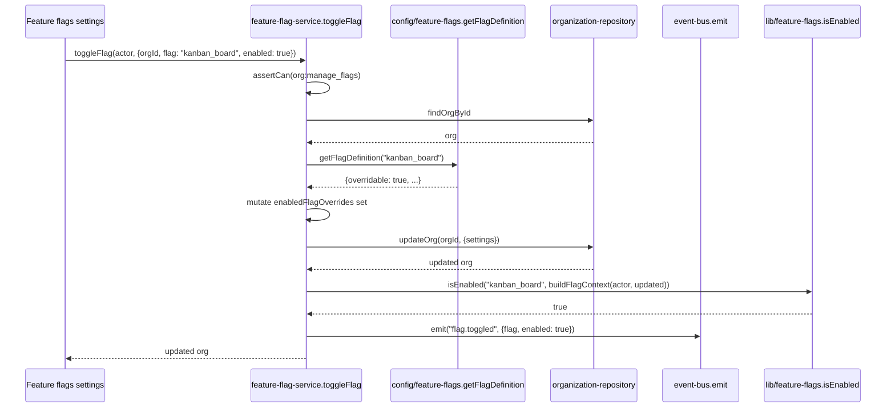

## Purpose

`src/server/services/feature-flag-service.ts` builds the `FlagContext` every `isEnabled()`
call in the corpus ultimately needs and owns the one write path — the org-level override
toggle — that can change a flag's evaluation outcome per organization.
`src/server/services/event-registry.ts` is process wiring: it has no business logic of its
own, only the single place that knows the complete set of event-bus listener groups and
attaches them once per process. `src/server/services/_support.ts` is not a service at all in
the sense the other twelve files are — it exports no `Actor`-taking, permission-checked
function — but it is the shared adapter layer every other service in this corpus imports from,
and documenting it here, alongside the two smallest services, keeps this thirteen-file set
complete without inflating any single larger file's scope.

What none of the three deliberately own: the flag *evaluation* algorithm itself (four
strategies — plan-gated, percentage rollout, role-gated, and the always-on
`command_palette` case — live in `src/lib/feature-flags.ts`'s `isEnabled`, which
`feature-flag-service.ts` calls but does not reimplement); the permission decision logic
(`src/lib/permissions.ts`'s `can()`); and the event bus's own dispatch and isolation semantics
(`src/lib/event-bus.ts`).

## Public surface

| function | signature | permission action | events emitted | errors thrown |
|---|---|---|---|---|
| `buildFlagContext` | `(actor: Actor \| null, org: Organization \| null) => FlagContext` | none (pure) | none | none |
| `getSnapshot` | `(actor: Actor, org: Organization) => FeatureFlagSnapshot` | none (pure) | none | none |
| `toggleFlag` | `(actor: Actor, input: ToggleFeatureFlagInput) => Promise<Organization>` | `org:manage_flags` | `flag.toggled` | `NotFoundError`, `PermissionDeniedError`, plain `Error` (not overridable) |
| `registerEventHandlers` | `() => void` | none | none | none |
| `unregisterEventHandlers` | `() => void` | none | none | none |
| `requireFound` | `<T>(value: T \| null \| undefined, entity: string, id: string) => T` | none (pure) | none | `NotFoundError` |
| `envelope` / `actorEnvelope` | `(orgId, actorId) => EventEnvelope` / `(actor: Actor) => EventEnvelope` | none (pure) | none | none |
| `changedFields` | `<T extends object>(before: T, after: T) => readonly string[]` | none (pure) | none | none |
| `orgResource`, `projectResource`, `issueResource`, `commentResource`, `memberResource`, `webhookResource`, `billingResource`, `activityResource`, `notificationResource` | each `(...) => PermissionResource` | none (pure) | none | none |

## Collaborators

- `src/lib/feature-flags.ts` — `isEnabled`, `snapshotFlags`.
- `src/config/feature-flags.ts` — `getFlagDefinition`, the registry `toggleFlag` consults for
  `overridable`.
- `src/server/repositories/organization-repository.ts` — `findOrgById`, `updateOrg`.
- `src/lib/event-bus.ts` — `subscribe`, `emit`.
- `src/lib/logger.ts` — `createLogger`, used only by `event-registry.ts`.
- `src/server/jobs/queue.ts` — `enqueue`, called by `event-registry.ts`'s digest bridge.
- `src/server/services/activity-service.ts`, `search-service.ts`, `usage-service.ts`,
  `webhook-service.ts` — the four `register*Listeners` functions `event-registry.ts` calls
  directly.
- `src/server/services/notification-service.ts` — imported for its side effect only
  (DES-125 in `service-notification.md`).
- `src/types/common.ts` — `toIsoTimestamp`, used by `_support.ts`'s `envelope`.

### DES-175 — buildFlagContext accepts two independently nullable inputs so an unauthenticated caller can still ask about a flag

- **Satisfies:** REQ-185, REQ-186, REQ-188, REQ-194
- **Decided in:** ADR-012
- **Code:** `src/server/services/feature-flag-service.ts` — `buildFlagContext`

`buildFlagContext(actor: Actor | null, org: Organization | null)` builds a `FlagContext` with
`orgId: org?.id ?? actor?.orgId ?? null`, `userId: actor?.userId ?? null`, `plan: org?.plan ??
"free"`, `role: actor?.role ?? null`, and `overrides: org?.settings.enabledFlagOverrides`. The
source comment names the reason both parameters are nullable: "marketing pages — no session,
no org — can still ask about a flag and get the free-plan answer." This is what makes
REQ-186's "flag evaluation goes through one function" meaningfully true even outside an
authenticated request — `isEnabled()` (in `src/lib/feature-flags.ts`, not this file) is the
one function, and `buildFlagContext` is the one way to construct its input, used identically
whether called from a fully-resolved dashboard request or from an anonymous marketing page
checking whether to advertise a flag-gated feature. `orgId`'s fallback chain — prefer `org.id`,
fall back to `actor.orgId`, fall back to `null` — matters specifically for the one caller that
supplies an `Actor` but no `Organization` object: `search-service.ts`'s `search` function and
`webhook-service.ts`'s `createWebhook`, both of which build a `FlagContext` inline rather than
calling `buildFlagContext` at all (worth noting as an inconsistency — not every flag-checking
call site in the corpus actually routes through this shared builder, despite it existing
precisely to be that single construction point).

### DES-176 — getSnapshot is what the client receives instead of the registry, closing off a class of flag-tampering the client could otherwise attempt

- **Satisfies:** REQ-194
- **Decided in:** ADR-012
- **Code:** `src/server/services/feature-flag-service.ts` — `getSnapshot`

`getSnapshot(actor, org)` is a one-line composition: `snapshotFlags(buildFlagContext(actor,
org))`, delegating entirely to `src/lib/feature-flags.ts`'s `snapshotFlags` for the actual
per-flag evaluation loop. Its significance is architectural rather than in its own logic: it
is what the dashboard layout hands to the client-side flag provider, and REQ-194's "the client
receives a flag snapshot, not the registry" is the reason this function exists as a distinct,
named export rather than the client simply importing `src/config/feature-flags.ts`'s registry
directly — the registry describes *how* every flag is evaluated (its strategy, its threshold,
whether it is overridable), which is server-side reasoning the client has no need to reproduce
and every reason not to be trusted with, since a client capable of re-evaluating percentage
rollouts or plan gates locally could also be tricked into evaluating them incorrectly. The
snapshot itself is a flat `{flagKey: boolean}`-shaped result (per `FeatureFlagSnapshot`'s
type), computed once server-side and serialized, so `useFeatureFlag()` on the client "cannot
disagree with the server," per the source comment — there is no client-side re-evaluation path
at all for any flag once the snapshot has been delivered for that request.

### DES-177 — toggleFlag checks overridability against the registry, not against role rank, and the emitted event re-evaluates rather than trusting the input

- **Satisfies:** REQ-190, REQ-191, REQ-192, REQ-193
- **Decided in:** ADR-012
- **Code:** `src/server/services/feature-flag-service.ts` — `toggleFlag`

`toggleFlag` checks `org:manage_flags` (minimum `admin`, REQ-192's "toggling a flag requires
admin") first, then loads the org, then calls `getFlagDefinition(input.flag)` from
`src/config/feature-flags.ts` and throws unless `definition.overridable` is true — this is a
property of the flag's own declaration in the registry, not of the caller's role; an `owner`
attempting to toggle `command_palette` (declared not-overridable per the brief's flag table)
fails exactly the same way an `admin` would, because REQ-190's "some flags are not
overridable" is enforced against the flag definition, with no role high enough to bypass it.
The function then mutates a `Set` built from `org.settings.enabledFlagOverrides`, adding or
removing `input.flag` per `input.enabled`, and writes it back via `orgRepo.updateOrg` —
REQ-191's "per-organization overrides live in organization settings" is literally this one
JSON-array-shaped column, with no separate overrides table. The emitted `flag.toggled` payload
computes its own `enabled` field as `isEnabled(input.flag, buildFlagContext(actor, updated))`
— a fresh evaluation against the *post-write* org state, not simply `input.enabled` echoed
back. This distinction matters because setting an override to `true` does not necessarily mean
the flag evaluates to `true` afterward: `isEnabled`'s own logic (outside this service) may
still weigh plan gating or other strategy-specific conditions the override alone cannot fully
determine for every flag shape, so the event's `enabled` field reflects what the flag actually
resolves to now, which is the value REQ-193's `FeatureDisabledError` path elsewhere in the
corpus would check against, not merely what the admin requested.

### DES-178 — event-registry is idempotent by a single module-level flag, and its own doc comment states exactly why that matters

- **Satisfies:** REQ-111 (cross-referenced), general process wiring
- **Decided in:** ADR-005
- **Code:** `src/server/services/event-registry.ts` — `registerEventHandlers`,
  `unregisterEventHandlers`, the `detach` module variable

`registerEventHandlers` guards its entire body with `if (detach !== null) return;` — a single
module-level `Unsubscribe | null` variable that is non-null exactly between a call to
`registerEventHandlers` and a subsequent call to `unregisterEventHandlers`. The function's own
doc comment states the reason this matters: "`instrumentation.ts` runs per server process, but
a hot reload in dev can call it again and must not double-deliver every event." Without this
guard, a dev-server hot reload re-executing `instrumentation.ts` would attach a second copy of
every listener this module wires — meaning, concretely, two audit rows per event, two search
re-index calls, two usage counter increments, and two webhook deliveries per subscribed event,
all silently duplicated. The function calls exactly five things in sequence:
`registerActivityListeners()`, `registerSearchListeners()`, `registerUsageListeners()`,
`registerWebhookListeners()`, and its own private `registerDigestBridge()` (DES-179) — the
notification fan-out is conspicuously absent from this list, since it is wired via the
side-effect import documented as DES-125 in `service-notification.md`, not through this
function at all. `unregisterEventHandlers` calls the composed `detach` function (which calls
every individual `Unsubscribe` returned by the five registrations) and resets the module
variable to `null`, which is what makes a *second* `registerEventHandlers` call after an
explicit unregister legitimate rather than a no-op — the guard only blocks a redundant
register while already registered, not a genuine re-register after teardown.

### DES-179 — The digest-to-job bridge is the one piece of wiring that belongs to no single service, kept here specifically to avoid a layering violation

- **Satisfies:** REQ-123
- **Decided in:** ADR-005, ADR-016
- **Code:** `src/server/services/event-registry.ts` — `registerDigestBridge`

`registerDigestBridge` subscribes to `digest.due` and, on receipt, calls `enqueue` from
`src/server/jobs/queue.ts` with a job id of the form `` `digest:${payload.orgId}:${payload
.recipientId}` ``, kind `"digest-email"`, and a payload carrying `orgId`, `recipientId`, and
`windowStart`. The source comment explains why this small piece of logic lives in
`event-registry.ts` rather than in `digest-service.ts`, which would otherwise seem like the
more natural home: "keeping it here rather than inside `DigestService` stops the service layer
from depending on the job layer" — `digest-service.ts` is a pure business-logic module with no
import of `src/server/jobs/queue.ts` anywhere in it, and adding one purely to bridge a single
event would introduce a dependency direction (service layer importing job-queue
infrastructure) the codebase otherwise avoids. Cross-referencing `service-digest-and-email
.md`'s DES-128 through DES-134: `digest-service.ts`'s own functions never call `emit` at all,
which means this bridge's subscription to `digest.due` currently has no producer anywhere in
the thirteen files this design set covers — `digest-email-job.ts` (outside this document's
scope) invokes `buildDigest` directly, on the scheduler's own cadence, not by reacting to a
`digest.due` event this bridge would catch. The bridge is correctly wired and would work the
moment something emits `digest.due`, but as read against the current call graph in these
thirteen service files, that event is declared in `TaskflowEventMap` and subscribed to here,
without a matching `emit` call anywhere in the service layer to trigger it — an honest,
narrow companion observation to the auth-service gap documented as DES-164 in
`service-auth-and-session.md`, though less severe since this bridge's absence of a producer
does not block any user-facing flow, only means the job-id-per-recipient queuing path this
function represents currently goes unused in favor of the scheduler-driven path.

## Sequence: toggling an org-level flag override end to end

1. An admin submits a toggle request; the permission and org-load steps run before the
   registry is even consulted.
2. `getFlagDefinition` is checked before any mutation — a non-overridable flag never reaches
   the settings write.
3. The override set is mutated in memory and written back as a single settings column update.
4. `isEnabled` is called again, against the post-write org, to determine what the flag
   actually resolves to now — not simply echoing the caller's requested `enabled` value.
5. `flag.toggled` carries that freshly evaluated result, which `activity-service.ts` does not
   currently subscribe to (DES-173's nine-event list omits `flag.toggled`) but which
   `event-registry.ts`'s wiring makes available to any future listener that does.

## Failure modes

| thrown error | resulting error code | caller behaviour |
|---|---|---|
| `NotFoundError` | `not_found` (404) | settings page shows a load error |
| `PermissionDeniedError` | `forbidden` (403) | flag toggle controls hidden below `admin` |
| plain `Error` (not overridable in `toggleFlag`) | falls through to `internal_error` (500) | UI disables the toggle entirely for non-overridable flags rather than relying on this throw as the primary defense; matches REQ-193's `FeatureDisabledError` intent without this specific throw actually using that class |
| `NotFoundError` (from `_support.ts`'s `requireFound`, used across every other service) | `not_found` (404) | consistent behaviour wherever any service calls it, since it is one shared implementation |

## Test coverage

`tests/lib/feature-flags.test.ts` covers the four evaluation strategies inside
`src/lib/feature-flags.ts` itself, not `feature-flag-service.ts`'s own thin wrappers — there
is no dedicated tests/services/feature-flag-service.test.ts and no dedicated test file for
`event-registry.ts` or `_support.ts` in the corpus's test directory. The idempotence guard
documented in DES-178 and the digest-bridge gap in DES-179 are both currently verifiable only
by reading `event-registry.ts` directly. `_support.ts`'s helper functions are exercised
transitively through every other service's own test suite, since each imports and calls them,
but none of the thirteen files' test suites assert on `_support.ts`'s functions in isolation.
