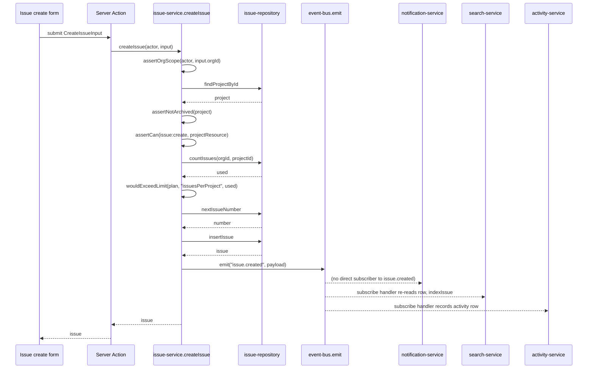

## Purpose

`src/server/services/issue-service.ts` owns everything that turns a create/update/status
request into a row in the `issues` table plus the events every reactive concern in Taskflow
hangs off: notifications (DES-121 .. DES-127), search indexing (DES-154 .. DES-158), the
audit log (DES-170 .. DES-174), webhook fan-out (DES-159 .. DES-163) and the usage counters
(DES-135 .. DES-141). It is the largest service in the layer by function count because an
issue is the object almost everything else in the product reacts to.

What it deliberately does not own: numbering scheme storage (delegated to
`src/server/repositories/issue-repository.ts`'s `nextIssueNumber`), label assignment (owned
by `src/server/services/label-service.ts`), attachment quota accounting (owned by
`src/server/services/attachment-service.ts`), and comment threading (owned by
`src/server/services/comment-service.ts`). Board rendering order is explicitly
presentation-only — DES-104 covers why `moveIssue` does not persist a position column.

Every exported function follows the same shape and it is worth stating once instead of
per-function: `assertOrgScope` first, then a `requireFound` load of the row (or its parent,
for `createIssue`), then `assertCan` against a `PermissionResource` built by one of the
`_support.ts` helpers, then `assertNotArchived` where archiving matters, then the write, then
`emit`. DES-100 names this order explicitly because two tests
(`tests/services/issue-service.test.ts`, `tests/services/issue-service.scope.test.ts`) assert
on it directly by checking which error surfaces when two guards would both fail.

## Public surface

| function | signature | permission action | events emitted | errors thrown |
|---|---|---|---|---|
| `createIssue` | `(actor: Actor, input: CreateIssueInput) => Promise<Issue>` | `issue:create` | `issue.created` | `NotFoundError`, `PermissionDeniedError`, `AlreadyArchivedError`, plain `Error` (quota) |
| `updateIssue` | `(actor: Actor, input: UpdateIssueInput) => Promise<Issue>` | `issue:update` | `issue.updated` | `NotFoundError`, `PermissionDeniedError`, `AlreadyArchivedError` |
| `changeIssueStatus` | `(actor: Actor, input: ChangeIssueStatusInput) => Promise<Issue>` | `issue:update` | `issue.status_changed` | `NotFoundError`, `PermissionDeniedError`, `AlreadyArchivedError` |
| `assignIssue` | `(actor: Actor, input: AssignIssueInput) => Promise<Issue>` | `issue:assign` | `issue.assigned` or `issue.updated` | `NotFoundError`, `PermissionDeniedError`, `AlreadyArchivedError` |
| `archiveIssue` | `(actor: Actor, orgId: OrgId, issueId: IssueId) => Promise<Issue>` | `issue:archive` | `issue.archived` | `NotFoundError`, `PermissionDeniedError`, `AlreadyArchivedError` |
| `moveIssue` | `(actor: Actor, input: MoveIssueInput) => Promise<Issue>` | `issue:update` (delegated) | `issue.status_changed` | same as `changeIssueStatus` |
| `getIssue` | `(actor: Actor, orgId: OrgId, issueId: IssueId) => Promise<IssueWithRelations>` | `issue:read` | none | `NotFoundError`, `PermissionDeniedError` |
| `listIssues` | `(actor: Actor, input: IssueFilterInput) => Promise<Page<Issue>>` | `issue:read` | none | `PermissionDeniedError` |
| `getBoard` | `(actor: Actor, orgId: OrgId, projectId: ProjectId) => Promise<readonly IssueBoardColumn[]>` | `issue:read` | none | `NotFoundError`, `PermissionDeniedError` |

## Collaborators

- `src/server/repositories/issue-repository.ts` — `countIssues`, `nextIssueNumber`,
  `insertIssue`, `findIssueById`, `updateIssue`, `setIssueStatus`, `setIssueAssignee`,
  `archiveIssue`, `listIssues`, `listBoardColumns`.
- `src/server/repositories/project-repository.ts` — `findProjectById`, used to load the
  parent for `createIssue` and `getBoard`.
- `src/server/repositories/organization-repository.ts` — `findOrgById`, the source of the
  plan used in the quota check.
- `src/server/repositories/label-repository.ts` — `listLabelsForIssues`, called from
  `getIssue` to hydrate `IssueWithRelations`.
- `src/server/repositories/comment-repository.ts` and
  `src/server/repositories/attachment-repository.ts` — counts folded into `getIssue`'s
  response.
- `src/config/plan-limits.ts` — `wouldExceedLimit`, the quota gate in `createIssue`.
- `src/lib/permissions.ts` — `assertCan`; `src/lib/tenant.ts` — `assertOrgScope`;
  `src/lib/soft-delete.ts` — `assertNotArchived`; `src/lib/event-bus.ts` — `emit`.
- `src/server/services/_support.ts` — `actorEnvelope`, `issueResource`, `orgResource`,
  `projectResource`, `requireFound`, all reused verbatim rather than reimplemented per
  function, per ADR-003 and ADR-013.

### DES-100 — Every mutating method runs guards in the same fixed order

- **Satisfies:** REQ-011, REQ-021, REQ-071
- **Decided in:** ADR-003, ADR-013
- **Code:** `src/server/services/issue-service.ts` — `createIssue`, `updateIssue`,
  `changeIssueStatus`, `assignIssue`, `archiveIssue`

Every mutating function in this file runs `assertOrgScope(actor, input.orgId)` before it
touches a repository, then loads the row with `requireFound`, then calls `assertCan` with a
resource built from the *loaded* row rather than from the caller's input, then (where the
entity supports archiving) calls `assertNotArchived`. The order is not incidental: tenant
scope is the cheapest check and fails closed before any row from another organization is
even read, matching the cross-tenant guard's priority in the `can()` decision order described
in ADR-003. Building the `PermissionResource` from the *stored* row rather than trusting the
request body is what makes ownership escalation (`issue:update`, `issue:archive`) correct —
`issueResource(before)` carries the real `authorId` and `assigneeId`, which is what lets
`can()` grant `granted_by_ownership` to an author editing their own issue even at `viewer`
rank, per REQ-072. Reversing the archived check and the permission check would leak whether
an issue exists to a caller who cannot read it at all; reversing scope and everything else
would let a cross-tenant `issueId` reach a repository call. The consistency across all five
mutating functions is deliberate enough that `tests/services/issue-service.scope.test.ts`
runs the same table of cases against every one of them.

### DES-101 — Issue creation gates on four things before a number is allocated

- **Satisfies:** REQ-060, REQ-061, REQ-064, REQ-065
- **Decided in:** ADR-003, ADR-010
- **Code:** `src/server/services/issue-service.ts` — `createIssue`

`createIssue` checks, strictly in order: tenant scope, that the parent project exists and is
not archived (`assertNotArchived("Project", ...)`), the `issue:create` permission evaluated
against that project (not the org — REQ-060 makes a project the sole scope of issue
existence), and finally the per-project issue quota via `wouldExceedLimit(org.plan,
"issuesPerProject", used)`, where `used` comes from `issueRepo.countIssues`. Only after all
four gates pass does the function call `issueRepo.nextIssueNumber(input.orgId,
input.projectId)`, which is the per-project counter behind REQ-061's "allocated per project
and never reused" guarantee — the repository never reuses a number even if the issue that
held it is later archived, because the counter is monotonic and stored independently of the
`issues` table's row count. Ordering the quota check after the permission check, rather than
before, means a caller who cannot create issues at all gets a `PermissionDeniedError` rather
than a confusing quota message; ordering it before allocation means a rejected request never
consumes a number, which would otherwise create visible gaps in the sequence a customer might
reasonably ask support about. The created issue is returned with `issue.created` published
carrying `assigneeId` and `priority` in the payload — REQ-065 is satisfied by this single
`emit` call, and every listener (notification fan-out, activity log, search index, usage
counters, webhook bridge) reads the same event rather than re-querying the row.

### DES-102 — updateIssue reports exactly the fields the caller changed

- **Satisfies:** REQ-068
- **Decided in:** ADR-005
- **Code:** `src/server/services/issue-service.ts` — `updateIssue`

`updateIssue` computes `changedFields` as `Object.keys(input).filter((key) => key !== "orgId"
&& key !== "issueId")` — every remaining key in the validated `UpdateIssueInput` is reported,
which is a coarser signal than "fields that actually differ from the stored value" (that
finer computation exists as `changedFields()` in `_support.ts` and is used elsewhere, notably
by services that diff `before`/`after` pairs, but `issue-service.ts` does not call it here).
The practical effect for REQ-068 is that a caller who resubmits an unchanged field is still
reported as having changed it; this is a known simplification the team accepted because Zod
validation on `UpdateIssueInput` already makes every field optional, so most callers only
submit fields they intend to change, and the alternative (loading the pre-image and diffing)
would double a already-common write path's repository round-trips for a case the UI does not
produce. The emitted `issue.updated` payload never carries the new values themselves, only
the list of changed field names — listeners that need the value re-read the row, which is the
same "trust the row, not the payload" discipline DES-158 documents for the search indexer.

### DES-103 — Status transitions are validated against the closed status union and are idempotent no-ops when unchanged

- **Satisfies:** REQ-062, REQ-066
- **Decided in:** ADR-003, ADR-009
- **Code:** `src/server/services/issue-service.ts` — `changeIssueStatus`

The status a caller may set is constrained at the schema boundary: `ChangeIssueStatusInput`
is a Zod schema (ADR-009's shared-schema pattern) whose `status` field is the same closed
union `issueRepo.setIssueStatus` accepts, so `changeIssueStatus` itself performs no further
validation of the value — REQ-062's "closed vocabulary" is enforced once, at the type
boundary, not re-checked in the service. What the service does own is the transition: after
the standard guard sequence (DES-100), it compares `before.status === input.status` and
returns the unchanged row immediately if so, without writing to the repository and without
emitting `issue.status_changed`. This makes the endpoint safe to call from an optimistic UI
that might redundantly resubmit the current status (REQ-062, ADR-021's optimistic-update
pattern) without generating a spurious event that would otherwise show up twice in the
activity feed and trigger a webhook delivery for a transition that never happened. When the
status genuinely changes, the emitted payload carries both `from` and `before.status` and
`to: after.status`, which is what lets `src/server/services/activity-service.ts`'s
`registerActivityListeners` render "Status open → in_progress" without a second read. Status
changes use the same `issue:update` permission as any other field edit — there is no
dedicated `issue:transition` action in `ROLE_MATRIX` — which means the role matrix cannot
express "may reassign but not re-open," a limitation the team accepted rather than growing
the permission surface for a distinction the product has never asked for.

### DES-104 — Board drag-and-drop is a status change plus a touch, not a persisted order

- **Satisfies:** REQ-066, REQ-077
- **Decided in:** ADR-021
- **Code:** `src/server/services/issue-service.ts` — `moveIssue`, `getBoard`

`moveIssue` is a thin wrapper: it takes a `MoveIssueInput` (`orgId`, `issueId`, `toStatus`)
and calls `changeIssueStatus(actor, { orgId, issueId, status: input.toStatus })` directly,
inheriting every guard and event from DES-103 rather than duplicating them. The code comment
in the source is explicit about why there is no persisted card index: "the index is
presentation-only — the board renders by `updated_at`." That means two clients dragging cards
in the same column concurrently do not fight over an integer position column; the board's
sort order is a side effect of `changeIssueStatus`'s write, which always touches `updated_at`.
The trade-off is that a user who drags a card to a different position *within* the same
status column, without changing status, produces no repository write and no visible reorder
after a refresh — the UI only persists cross-column moves. `getBoard` is a pure read: it loads
the project, asserts `issue:read` against it, and defers entirely to
`issueRepo.listBoardColumns`, which does the status-bucketing server-side so the client never
computes columns from a flat issue list.

### DES-105 — Assignment is a separate permission from update, and un-assigning degrades to issue.updated

- **Satisfies:** REQ-067
- **Decided in:** ADR-003, ADR-005
- **Code:** `src/server/services/issue-service.ts` — `assignIssue`

`assignIssue` checks `issue:assign`, a permission distinct from `issue:update` in
`ROLE_MATRIX` (both require `member` minimum, but they are separate matrix entries so a
future role split does not have to touch this call site). The reason assignment has its own
permission at all, per the source comment, is that a member may need to reassign work they do
not otherwise own — reassigning a stuck issue away from an absent teammate is a common
workflow that should not require `issue:update` rights over content the reassigner did not
author. The function branches on `input.assigneeId === null`: unassigning publishes
`issue.updated` with `changedFields: ["assigneeId"]` rather than `issue.assigned`, because
`issue.assigned`'s payload contract requires a non-null `assigneeId` — `TaskflowEventMap`
types the field as `UserId`, not `UserId | null`, so a null assignment literally cannot be
represented in that event shape. Assigning to a real user publishes `issue.assigned` carrying
both `previousAssigneeId: before.assigneeId` and the new `assigneeId`, which is what lets
`notification-service.ts`'s `issue.assigned` handler notify only the new assignee (DES-122)
without a second lookup, and what lets the activity log render "Assigned to X" without
needing the prior value.

### DES-106 — getIssue composes three repositories into one read model, and never authorizes the composed pieces separately

- **Satisfies:** REQ-074, REQ-075, REQ-077
- **Decided in:** ADR-013
- **Code:** `src/server/services/issue-service.ts` — `getIssue`

`getIssue` authorizes once, against `issue:read` on the loaded issue, and then freely composes
three additional repository reads without further permission checks: `labelRepo
.listLabelsForIssues` (REQ-074, org-shared labels), `commentRepo.countComments`, and
`attachmentRepo.listAttachments(...).length` (REQ-075, storage-quota-tracked attachments).
This is a deliberate reading of ADR-013's "services own authorization, repositories own
tenancy" boundary: once a caller has proven they may read the issue, its label assignments,
comment count, and attachment count are treated as part of the same resource rather than as
independently protected sub-resources, because none of them can be read meaningfully on their
own — a label list without knowing which issue it decorates, or a comment count without the
issue it counts, has no product surface. This is narrower than `comment-service.ts`'s
`getThread`, which re-checks `comment:read` even though it also starts from a loaded issue —
the two services made different calls about whether the sub-resource has its own reachable
endpoint (comments do, via `/issues/:id/comments`; label and attachment *counts* on the issue
detail view do not).

### DES-107 — listIssues authorizes at the organization, not per project, because visibility narrows later

- **Satisfies:** REQ-050, REQ-077, REQ-078
- **Decided in:** ADR-008
- **Code:** `src/server/services/issue-service.ts` — `listIssues`

`listIssues` asserts `issue:read` against `orgResource(input.orgId)` rather than against any
individual project, with an explicit comment marking the trade-off: "a cross-project list is
an org-wide read; per-project visibility is enforced when the caller opens an individual
issue." That means a viewer with org-wide `issue:read` can see issue titles and statuses from
a project whose visibility is `private` in the same paginated list, and only hits a
permission wall if they try to open one. The team accepted this because private projects
(REQ-050) gate discovery, not existence — the alternative, filtering the list per-project
before pagination, would require joining project visibility into every keyset page (ADR-008)
and would make `IssueFilterInput`'s cursor semantics depend on membership state that can
change between pages. `listIssues` otherwise does no work of its own: filtering by status,
assignee and label is delegated entirely to `issueRepo.listIssues(input)`, which implements
REQ-077's filter surface and REQ-078's keyset pagination.

## Sequence: creating an issue and its downstream fan-out

1. The UI submits a validated `CreateIssueInput` to a Server Action, which forwards it
   unchanged to `createIssue(actor, input)`.
2. The service asserts tenant scope first, then loads the parent project and confirms it is
   not archived before checking `issue:create` against it — a caller who cannot even see the
   project never learns whether the quota has room.
3. `issueRepo.countIssues` returns the current count for the quota comparison; `createIssue`
   never inserts the row before this check succeeds.
4. `issueRepo.nextIssueNumber` is only called once every prior gate has passed, so a rejected
   request leaves no gap in the per-project numbering sequence.
5. `issueRepo.insertIssue` writes the row and returns the persisted `Issue`, including its
   generated id and number.
6. `emit("issue.created", ...)` publishes the event synchronously to every subscriber
   registered through `event-registry.ts`; note that, unlike `issue.assigned`, no
   notification handler subscribes to `issue.created` directly — issue creation notifies
   nobody by design, since there is no assignee or mentioned user yet.
7. The search listener (DES-158) re-reads the issue by id rather than trusting the payload
   and calls `indexIssue`; the activity listener (DES-172) writes an audit row from the
   payload directly, since activity intentionally trusts event payloads for its summary text.
8. Control returns to the Server Action once `emit` resolves — Taskflow's event bus is
   in-process and awaited, so a slow subscriber delays the response; this is the accepted
   trade-off ADR-005 documents in exchange for never losing an event to a queue outage.

## Failure modes

| thrown error | resulting error code | caller behaviour |
|---|---|---|
| `NotFoundError` (from `requireFound`) | `not_found` (404) | UI shows "issue/project not found"; Server Action surfaces a toast, no retry |
| `PermissionDeniedError` (from `assertCan`) | `forbidden` (403) | Server Action returns a form error; UI hides the action that produced it once role is known |
| `TenantScopeError` (from `assertOrgScope`) | `tenant_scope_violation` (403) | Treated as a programming error client-side; logged, session redirected to org switcher |
| `AlreadyArchivedError` (from `assertNotArchived`) | `conflict` (409) | UI prompts to restore the project/issue before retrying the write |
| plain `Error` (quota message in `createIssue`) | falls through to `internal_error` (500) unless mapped upstream | UI shows a generic failure; this is a known gap — quota breaches in `issue-service.ts` are not raised as a typed `plan_limit_exceeded` the way `billing-service.ts`'s `assertWithinLimit` does, so the client cannot distinguish a quota breach from a genuine server fault by error code alone |

The quota-error inconsistency in the last row is real and worth flagging in review: unlike
`project-service.ts`'s `createProject` (same pattern) and `billing-service.ts`'s
`assertWithinLimit` (which emits `billing.limit_exceeded` and is designed to map to
`plan_limit_exceeded`), `createIssue` throws a bare `Error` with a human-readable message
rather than a typed domain error. `src/lib/errors.ts`'s `HTTP_STATUS_BY_CODE` has no entry a
bare `Error` maps to other than the `internal_error` default, so a caller cannot render a
"upgrade your plan" call to action from the error alone today; the UI currently pattern
matches on the message string, which is fragile and flagged as a follow-up in the DES-135
billing design.

## Test coverage

`tests/services/issue-service.test.ts` exercises the full public surface: creation quota
enforcement, status transition idempotence, assignment branching (assign vs. unassign),
archive-then-mutate rejections, and the `getIssue`/`listIssues`/`getBoard` read paths.
`tests/services/issue-service.scope.test.ts` is a narrower, dedicated suite that runs every
mutating function against the same table of cross-tenant and under-permissioned actors,
confirming the guard order documented in DES-100 fails on tenant scope before it fails on
permission, and on permission before it reveals archived state. No other test file in the
corpus exercises this service directly, though `tests/jobs/digest-email-job.test.ts` and
`tests/services/notification-service.test.ts` cover downstream consumers of the events this
service emits.
