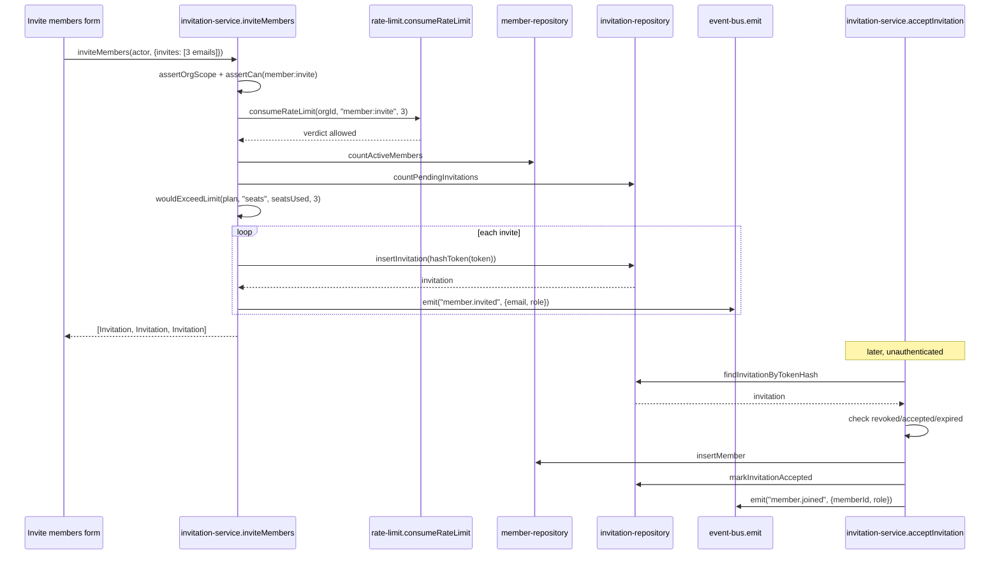

## Purpose

`src/server/services/member-service.ts` owns role changes, member removal, and the "last
owner" invariant that runs orthogonal to the permission matrix. `src/server/services/
invitation-service.ts` owns the invite-to-member pipeline: issuing invitations against the
seat quota and invite rate limit, and turning an accepted token into a member row. The two
are tightly coupled — invitation acceptance calls `memberRepo.insertMember` directly rather
than through `member-service.ts`, and `member-service.ts`'s `resolveActor` is the function
that turns any `(userId, orgId)` pair, however it got there, into the `Actor` every other
service requires.

What neither service owns: the permission decision itself (delegated entirely to
`src/lib/permissions.ts`'s `can()`/`assertCan()`), or notification of the affected member
(both services emit events; `notification-service.ts` decides who gets told what).

## Public surface

| function | signature | permission action | events emitted | errors thrown |
|---|---|---|---|---|
| `listMembers` | `(actor: Actor, input: ListMembersInput) => Promise<Page<MemberWithUser>>` | `member:read` | none | `PermissionDeniedError` |
| `updateMemberRole` | `(actor: Actor, input: UpdateMemberRoleInput) => Promise<Member>` | `member:update_role` | `member.role_changed` | `NotFoundError`, `PermissionDeniedError`, plain `Error` (rank/last-owner) |
| `removeMember` | `(actor: Actor, input: RemoveMemberInput) => Promise<Member>` | `member:remove` | `member.removed` | `NotFoundError`, `PermissionDeniedError`, plain `Error` (last-owner) |
| `resolveActor` | `(userId: UserId, orgId: OrgId) => Promise<Actor \| null>` | none | none | none |
| `assertLastOwnerRetained` | `(orgId: OrgId, memberId: MemberId, nextRole: Role) => Promise<void>` | none | none | plain `Error` |
| `inviteMember` | `(actor: Actor, input: InviteMemberInput) => Promise<Invitation>` | `member:invite` (via `inviteMembers`) | `member.invited` | plain `Error` (no invitation created) |
| `inviteMembers` | `(actor: Actor, input: InviteMembersInput) => Promise<readonly Invitation[]>` | `member:invite` | `member.invited` (per invite) | `NotFoundError`, `PermissionDeniedError`, plain `Error` (rate limit, seat quota) |
| `acceptInvitation` | `(userId: UserId, input: AcceptInvitationTokenInput) => Promise<Member>` | none (token-authenticated) | `member.joined` | `NotFoundError`, plain `Error` (revoked/accepted/expired) |
| `revokeInvitation` | `(actor: Actor, invitationId: InvitationId) => Promise<Invitation>` | `member:invite` | none | `PermissionDeniedError` |
| `resendInvitation` | `(actor: Actor, invitationId: InvitationId) => Promise<Invitation>` | `member:invite` | `member.invited` (via `inviteMember`) | `NotFoundError`, `PermissionDeniedError` |

## Collaborators

- `src/server/repositories/member-repository.ts` — `listMembers`, `findMemberById`,
  `findMember`, `updateMemberRole`, `archiveMember`, `countActiveMembers`, `insertMember`,
  `touchLastSeen`.
- `src/server/repositories/invitation-repository.ts` — `insertInvitation`,
  `findInvitationByTokenHash`, `markInvitationAccepted`, `revokeInvitation`,
  `listPendingInvitations`, `countPendingInvitations`.
- `src/server/repositories/organization-repository.ts` — `findOrgById`.
- `src/lib/hash.ts` — `hashToken`, `randomToken`, used only by `invitation-service.ts`.
- `src/lib/rate-limit.ts` — `consumeRateLimit`, the `member:invite` bucket.
- `src/config/plan-limits.ts` — `getPlanLimits`, `wouldExceedLimit`.
- `src/types/member.ts` — `hasRoleAtLeast`, the rank comparison `member-service.ts` uses
  directly rather than through `can()`.
- `src/server/services/_support.ts` — `actorEnvelope`, `envelope`, `memberResource`,
  `orgResource`, `requireFound`.

### DES-142 — Role changes are checked twice: once by can(), once by a rank comparison the matrix cannot express

- **Satisfies:** REQ-020, REQ-021, REQ-034
- **Decided in:** ADR-003
- **Code:** `src/server/services/member-service.ts` — `updateMemberRole`

`updateMemberRole` calls `assertCan(actor, "member:update_role", memberResource(member))`
first — the role-matrix check, minimum role `admin` per `ROLE_MATRIX` — and then, separately,
`if (!hasRoleAtLeast(actor.role, input.role)) throw ...`, a second rule the permission matrix
has no way to express: "nobody may grant a role above their own." `hasRoleAtLeast` is imported
directly from `src/types/member.ts` rather than routed through `can()`, because this is not a
resource-scoped decision `PermissionResource` was built to carry — it compares two `Role`
values against `ROLE_RANK`, independent of which member is being changed. The consequence is
that an `admin` (rank below `owner`) can pass the `member:update_role` gate for any member row
in the org, but is still stopped from setting anyone's role to `owner`, since `admin` does not
outrank `owner`. Only after both checks pass does `assertLastOwnerRetained` run (DES-144),
which is the third and final gate before the write. `member.role_changed`'s payload carries
both `from: member.role` (the pre-image, captured before the write) and `to: updated.role`,
satisfying REQ-034's "audited with before and after values" directly from the event, without
the activity listener needing a second read.

### DES-143 — Member removal is a soft delete subject to the same ownership invariant as a demotion

- **Satisfies:** REQ-031, REQ-033
- **Decided in:** ADR-004
- **Code:** `src/server/services/member-service.ts` — `removeMember`

`removeMember` calls `assertLastOwnerRetained(input.orgId, input.memberId, "member")` —
passing the literal role `"member"`, not the removed member's actual prior role — which is
the mechanism that reuses one invariant function for two different actions (DES-144 covers
`assertLastOwnerRetained`'s internal logic). Passing `"member"` specifically (rather than,
say, a sentinel `"none"`) works because `assertLastOwnerRetained`'s only branch of interest is
`if (nextRole === "owner") return;` — any non-owner value, including `"member"`, takes the
same code path of checking whether the org would be left without an owner. `removeMember`
calls `memberRepo.archiveMember`, a soft delete consistent with ADR-004's project-wide
soft-delete policy, and the emitted `member.removed` payload deliberately does not attempt to
reassign or null out content the removed member authored — REQ-033's "removing a member
preserves their authored content" is satisfied by omission: no code path in this service
touches `issues.author_id`, `comments.author_id`, or any other foreign key referencing the
removed member's user id, so authored rows continue to display the departed member's identity
exactly as before removal, which is the deliberate, minimal way this guarantee is upheld.

### DES-144 — assertLastOwnerRetained scans up to one hundred owners and treats a demotion and a removal identically

- **Satisfies:** REQ-006, REQ-031
- **Decided in:** ADR-003
- **Code:** `src/server/services/member-service.ts` — `assertLastOwnerRetained`,
  `OWNER_SCAN_LIMIT`

`assertLastOwnerRetained` short-circuits immediately (`return`, no error) in two cases: when
`nextRole === "owner"` (promoting to owner can never violate the invariant), and when the
member being changed is not currently an owner at all (`member.role !== "owner"` — demoting a
non-owner cannot reduce the owner count). Only when the target member *is* currently an owner
and the change would move them *away* from owner does the function do real work: it calls
`memberRepo.listMembers({ orgId, role: "owner", limit: OWNER_SCAN_LIMIT, cursor: null })`,
where `OWNER_SCAN_LIMIT` is `100`, filters out the member being changed from that page, and
throws if the remaining count is zero. This is a page-bounded check, not an exact count — an
organization with more than 100 owner-ranked members (implausible in practice, since owner
promotion itself is gated by this same function, but not structurally impossible if seeded
directly) could have `assertLastOwnerRetained` see only the first 100 and reach an incorrect
conclusion if the 101st-and-beyond owners were the only ones remaining; this is an accepted
edge case given how rare multi-owner-at-scale organizations are expected to be. Both
`updateMemberRole` and `removeMember` call this exact function — REQ-006's "an organization
always has exactly one owner of record" is really "at least one," enforced identically for
demotion and removal, which is why the source comment frames removal as "a demotion to 'no
role at all.'"

### DES-145 — resolveActor is the sole place an Actor is minted from stored membership state, and it treats non-active status as absence

- **Satisfies:** REQ-210, REQ-213
- **Decided in:** ADR-013, ADR-020
- **Code:** `src/server/services/member-service.ts` — `resolveActor`

`resolveActor(userId, orgId)` calls `memberRepo.findMember(orgId, userId)` and returns `null`
unless a row exists *and* `member.status === "active"` — a member row in any other status
(the schema implies at least a removed/archived state, though this function does not
enumerate the alternatives, it simply requires the one value that counts) is treated exactly
as if no membership existed at all, never distinguished in the return type. This single
function is what `session-service.ts`'s `resolveActorForOrg` builds on (it constructs the
`Actor` inline rather than calling `resolveActor` directly, duplicating the `status ===
"active"` check — a small, accepted redundancy between the two call sites rather than a
shared helper) and what any job needing to act as a specific member on a specific org would
call. REQ-210's "an actor is resolved per organization, not globally" is the reason this
function takes both `userId` and `orgId` rather than just a user id — there is no such thing
as a global `Actor` anywhere in the type system, only ever one scoped to a specific
organization, consistent with REQ-213 allowing one user to belong to several organizations
with independent roles in each.

### DES-146 — Invite issuance checks the seat quota once for the whole batch, using pending invitations as provisional seats

- **Satisfies:** REQ-028, REQ-032
- **Decided in:** ADR-010, ADR-011
- **Code:** `src/server/services/invitation-service.ts` — `inviteMembers`

`inviteMembers` computes `seatsUsed` as `(await memberRepo.countActiveMembers(orgId)) +
(await invitationRepo.countPendingInvitations(orgId))` — active members plus outstanding
pending invitations, not just active members — before calling `wouldExceedLimit(org.plan,
"seats", seatsUsed, input.invites.length)` with the *batch size* as the requested count. This
means a seat is provisionally reserved the moment an invite is sent, before it is ever
accepted, which is what makes REQ-032's "seat count is checked against the plan before an
invite is sent" true even for a burst of pending invitations nobody has answered yet — without
counting pending invitations, an org could send far more invites than it has seats simply
because none had been accepted yet. The check runs for the whole batch at once, and the
source comment is explicit about why: "inviting five people into a plan with three free seats
must fail as a batch rather than half-succeeding" — there is no partial-success path in this
function; either every invite in the input list is issued, or none are, which is a stronger
guarantee than a per-invite loop with individual try/catch would provide.

### DES-147 — The invite rate limit is charged by batch size, and acceptance is the one function in the corpus with no Actor at all

- **Satisfies:** REQ-029
- **Decided in:** ADR-011, ADR-020
- **Code:** `src/server/services/invitation-service.ts` — `inviteMembers`,
  `acceptInvitation`, `INVITE_BUCKET`

`inviteMembers` calls `consumeRateLimit(input.orgId, INVITE_BUCKET, input.invites.length)` —
the third argument, `cost`, is the batch size rather than a flat `1`, matching the `member
:invite` bucket's 20-capacity/2-per-minute-refill configuration in `src/lib/rate-limit.ts`; a
single call inviting ten people costs ten tokens from the same bucket a single-person invite
would cost one from, so a burst of individually-small invite calls and one large batch call
are charged identically per invitation. `acceptInvitation`, by contrast, takes a bare `userId`
and an `AcceptInvitationTokenInput` — no `Actor` parameter, and correspondingly no
`assertOrgScope`/`assertCan` call anywhere in its body, the source comment stating plainly:
"accepting runs unauthenticated: the token is the credential, so there is no `Actor` to scope
against and every check has to come off the stored row." The function instead runs three
sequential state checks against the loaded invitation — `revokedAt !== null`, `acceptedAt !==
null`, `expiresAt <= now` — each with its own distinct thrown message, before inserting the
member row and marking the invitation accepted. REQ-029's "single-use and time-limited" is the
combination of the second and third checks; the first (`revokedAt`) is what makes
`resendInvitation`'s revoke-then-reissue pattern (DES-148) safe — a revoked token cannot be
accepted even if its expiry has not yet passed.

### DES-148 — resendInvitation revokes and reissues rather than mutating the existing row, and silently downgrades an owner-role resend

- **Satisfies:** REQ-028, REQ-029
- **Decided in:** ADR-004
- **Code:** `src/server/services/invitation-service.ts` — `resendInvitation`

`resendInvitation` looks up the target invitation from `listPendingInvitations` (not a direct
by-id fetch — there is no `findInvitationById` used here, only a filter over the pending list,
so a resend targeting an already-accepted or already-revoked invitation id correctly resolves
to `NotFoundError` via `requireFound` rather than reissuing a dead invitation), then calls
`invitationRepo.revokeInvitation` on the old row before calling `inviteMember` (singular) to
mint a completely new one. The source comment explains the "why not mutate" choice: "the
audit trail keeps both, and the old link stops working immediately" — revoking first, rather
than after minting the replacement, closes the old token's window with no overlap where both
links would work simultaneously. One detail worth flagging: the role passed to the new
invitation is `previous.role === "owner" ? "admin" : previous.role` — a resend of an
owner-targeted invitation silently downgrades the new invitation to `admin` rather than
preserving `owner`, an intentional guard against re-issuing ownership invitations by accident
through the resend path, though it does mean a legitimate owner-transfer-via-invite flow
cannot use `resendInvitation` and must go through `inviteMember` fresh instead.

## Sequence: inviting a batch, one acceptance, and the seat/rate-limit gates

1. The invite form submits a batch; `inviteMembers` authorizes once for the whole batch
   against `member:invite`.
2. The rate limit is consumed for the full batch size in one call, not once per invite.
3. Seat headroom is computed from active members plus already-pending invitations, checked
   against the batch size as a single quota request.
4. Each invite in the batch mints its own token, hashes it before storage, and inserts its own
   invitation row, emitting one `member.invited` event per invite — a batch of three produces
   three separate events, not one batched event.
5. When a recipient later visits their invite link, `acceptInvitation` runs entirely off the
   token hash with no `Actor` — three sequential state checks gate whether the token is still
   usable.
6. A successful acceptance inserts the member row and emits `member.joined`, which
   `usage-service.ts`'s listener (DES-140) increments `seatsUsed` for — the seat that was
   provisionally reserved at invite time becomes a real, counted seat only here.

## Failure modes

| thrown error | resulting error code | caller behaviour |
|---|---|---|
| `NotFoundError` | `not_found` (404) | members page shows "member/invitation not found"; accept flow shows "invalid invitation link" |
| `PermissionDeniedError` | `forbidden` (403) | invite/role controls hidden below `admin` in the members UI |
| `TenantScopeError` | `tenant_scope_violation` (403) | logged as a bug, session redirected |
| plain `Error` (rank comparison in `updateMemberRole`) | falls through to `internal_error` (500) | UI disables role options above the actor's own rank in the dropdown as the primary defense |
| plain `Error` (last-owner in `updateMemberRole`/`removeMember`) | falls through to `internal_error` (500) | UI disables demote/remove on the sole owner row once membership counts are known |
| plain `Error` (seat quota, rate limit in `inviteMembers`) | falls through to `internal_error` (500) | invite form shows the thrown message text; no typed distinction between a quota breach and a rate-limit breach reaches the client |
| plain `Error` (revoked/accepted/expired in `acceptInvitation`) | falls through to `internal_error` (500) | accept page renders the specific message, since each of the three states has distinct, human-readable wording |

## Test coverage

`tests/services/member-service.test.ts` covers role-change rank checks, the last-owner
invariant across both demotion and removal, and `resolveActor`'s active-status filter.
`tests/services/invitation-service.test.ts` covers batch seat-quota enforcement, the invite
rate limit, token acceptance across all three failure states, revocation, and resend's
owner-to-admin downgrade. No other test file in the corpus exercises either service directly.
