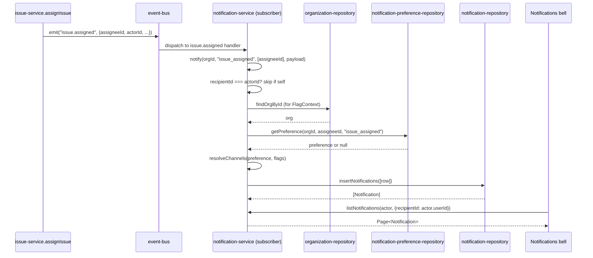

## Purpose

`src/server/services/notification-service.ts` is the fan-out hub: it turns one domain event
into zero or more per-recipient rows, each with the channel set that recipient's preferences
allow, and it owns the read-side API (list, mark read, preferences) the notifications bell
uses. It is the single place `NotificationChannel` selection logic lives — `digest-service.ts`
consumes the rows this service writes but does not decide who gets which channel.

What it deliberately does not own: digest batching (DES-128 .. DES-134, `digest-service.ts`
reads unread rows this service wrote), email rendering or delivery
(`email-service.ts`), and the domain events themselves — this service only subscribes, it
never emits a domain event of its own; `notify()` writes rows and returns them, nothing more.

## Public surface

| function | signature | permission action | events emitted | errors thrown |
|---|---|---|---|---|
| `notify` | `(orgId: OrgId, kind: NotificationKind, recipients: readonly UserId[], payload: NotificationPayload) => Promise<readonly Notification[]>` | none (internal, event-driven) | none | none directly (repository errors propagate) |
| `listNotifications` | `(actor: Actor, input: ListNotificationsInput) => Promise<Page<Notification>>` | `notification:read` | none | `PermissionDeniedError` |
| `markRead` | `(actor: Actor, input: MarkNotificationReadInput) => Promise<Notification>` | `notification:manage` | none | `PermissionDeniedError`, `NotFoundError` |
| `markAllRead` | `(actor: Actor, orgId: OrgId) => Promise<number>` | `notification:manage` | none | `PermissionDeniedError` |
| `updatePreference` | `(actor: Actor, input: UpdateNotificationPreferenceInput) => Promise<NotificationPreference>` | `notification:manage` | none | `PermissionDeniedError` |
| `resolveChannels` | `(preference: NotificationPreference \| null, flags: FlagContext) => readonly NotificationChannel[]` | none (pure function) | none | none |

## Collaborators

- `src/server/repositories/notification-repository.ts` — `insertNotifications`,
  `listNotifications`, `markRead`, `markAllRead`.
- `src/server/repositories/notification-preference-repository.ts` — `getPreference`,
  `upsertPreference`.
- `src/server/repositories/organization-repository.ts` — `findOrgById`, source of the plan
  used to build a `FlagContext` for `resolveChannels`.
- `src/server/repositories/issue-repository.ts` — `findIssueById`, used by the
  `comment.created` listener to derive watchers.
- `src/lib/event-bus.ts` — `subscribe`.
- `src/lib/feature-flags.ts` — `isEnabled`.
- `src/server/services/_support.ts` — `notificationResource`, `requireFound`.

### DES-121 — notify() takes no Actor and is never called by a Server Action directly

- **Satisfies:** REQ-110, REQ-111
- **Decided in:** ADR-005, ADR-013
- **Code:** `src/server/services/notification-service.ts` — `notify`

`notify` is the only function in this file with no `Actor` parameter and no `assertCan`/
`assertOrgScope` call anywhere in its body. That is deliberate: every call site is an
event-bus subscriber running in response to a domain event (`issue.assigned`, `comment
.created`, `issue.overdue`, `member.joined`), not a user-initiated request — there is no actor
to authorize against, because the "actor" of a notification fan-out is the system reacting to
something that already happened and was already authorized when the original event was
published. REQ-111's "fan-out is driven by domain events" is architecturally enforced by this
absence: the only path into `notify` in the frozen code is `registerFanOut`'s five
`subscribe` calls, all attached at module load (DES-125), so a caller cannot invoke
notification fan-out except by causing one of those five events to fire through its owning
service's normal, authorized write path.

### DES-122 — notify() filters self-notification and per-recipient channel preference in the same loop, before any row is written

- **Satisfies:** REQ-112, REQ-113, REQ-114, REQ-115
- **Decided in:** ADR-005
- **Code:** `src/server/services/notification-service.ts` — `notify`

`notify` iterates `new Set(recipients)` — deduplicating in case an event names the same
recipient twice — and inside the loop applies two independent filters before ever building a
row. First, `if (recipientId === payload.actorId) continue;` enforces REQ-114 ("actors are not
notified about their own actions") unconditionally, ahead of any preference lookup; an actor
who somehow set a preference that would have allowed self-notification is still skipped,
because the check runs before `preferenceRepo.getPreference` is even called. Second, for every
remaining recipient, `resolveChannels(preference, flags)` (DES-124) is called and, if it
returns an empty channel list, the recipient is skipped with `continue` and no row is written
for them at all — a recipient who has muted every channel for that notification kind produces
no artifact, not a suppressed-but-persisted row, which is why `listNotifications` can never
surface a "notification" the recipient had fully muted. The `flags` context used for every
recipient in the loop is built once, from the org, before the loop starts — it does not vary
per recipient except through `resolveChannels`'s own read of `preference`, since plan-gated
flags like `digest_email` are org-wide, not per-user.

### DES-123 — An empty recipient list or a recipient set that resolves to zero eligible rows both short-circuit cheaply

- **Satisfies:** REQ-110
- **Decided in:** ADR-005
- **Code:** `src/server/services/notification-service.ts` — `notify`

`notify` returns `[]` immediately if `recipients.length === 0`, before loading the org or
building a `FlagContext` — the `member.joined` listener, for instance, always calls `notify`
with exactly one recipient (the org owner), but the early return protects every call site
uniformly against an event whose recipient derivation (such as `comment.created`'s watcher
list, DES-126) legitimately produces an empty array, e.g. a comment on an issue with no author
resolvable and no assignee. This keeps the function's cost proportional to the recipient
count for the common case and avoids an unconditional `orgRepo.findOrgById` round trip on
every no-op invocation.

### DES-124 — resolveChannels is a pure function, and email requires two independent conditions to hold

- **Satisfies:** REQ-115, REQ-119, REQ-120
- **Decided in:** ADR-012
- **Code:** `src/server/services/notification-service.ts` — `resolveChannels`,
  `DEFAULT_CHANNELS`

`resolveChannels(preference, flags)` takes no repository dependency and performs no I/O — it
is exported specifically so it can be unit tested against constructed `NotificationPreference`
and `FlagContext` values without a database, and `digest-service.ts` never calls it directly
(digest eligibility is a separate question, DES-128). When `preference` is `null` — a
recipient who has never touched their settings — the function returns `DEFAULT_CHANNELS`,
the literal tuple `["in_app", "email"]`, which is why every new member starts opted into both
channels rather than opted out. When a preference exists, `in_app` is included whenever
`preference.inApp` is true, independent of everything else. The `email` channel is more
guarded: `preference.email && (!preference.digestOnly || isEnabled("digest_email", flags))`.
Read plainly, this says email is allowed when the recipient wants email at all, *and* either
they have not restricted themselves to digest-only delivery, or they have but the org's plan
includes `digest_email` (REQ-120, gated at `growth` and above per the feature-flag registry).
The practical consequence: a recipient who sets `digestOnly: true` on a `free`-plan
organization gets *no* immediate email and, because that org's plan does not include the
digest either, effectively no email channel at all until the org upgrades — `resolveChannels`
does not fall back to immediate email in that case, since `digestOnly` is treated as the
recipient's explicit preference, not a hint to override when the feature they asked for is
unavailable.

### DES-125 — The fan-out is wired at module import time, not through event-registry, and importing this module is what turns it on

- **Satisfies:** REQ-111
- **Decided in:** ADR-005
- **Code:** `src/server/services/notification-service.ts` — `registerFanOut`,
  `registered` module flag; `src/server/services/event-registry.ts` — the
  `import "./notification-service"` side-effect import

Unlike `activity-service.ts`, `search-service.ts`, `usage-service.ts`, and
`webhook-service.ts`, which each export a `register*Listeners(): Unsubscribe` function called
explicitly from `event-registry.ts`'s `registerEventHandlers`, `notification-service.ts` has
no such export. Instead, `registerFanOut()` is a module-private function called unconditionally
at the bottom of the file (`registerFanOut();`, the last line), guarded by a `registered`
boolean so a second import — from a test file or a hot module reload — does not double-attach
the five subscriptions. `event-registry.ts` triggers this by importing the module purely for
its side effect (`import "./notification-service";`, with an inline comment: "that hub has no
`register*` entry point of its own"), which means the fan-out has no `Unsubscribe` handle
`event-registry.ts` can call to detach it — `unregisterEventHandlers()` cannot turn off
notification fan-out the way it can turn off search indexing or activity logging. This is a
structural inconsistency worth flagging to anyone extending the event registry: adding a
`registerNotificationListeners` export and removing the side-effect import would bring this
service in line with the other four, at the cost of a small refactor to the module-load-order
assumption tests currently rely on.

### DES-126 — Watcher derivation for comment notifications re-reads the issue rather than trusting the event

- **Satisfies:** REQ-112, REQ-113
- **Decided in:** ADR-013
- **Code:** `src/server/services/notification-service.ts` — `registerFanOut`'s
  `comment.created` handler

The `comment.created` subscriber calls `issueRepo.findIssueById(payload.orgId,
payload.issueId)` to derive the watcher list (`[issue.authorId, ...(issue.assigneeId ?
[issue.assigneeId] : [])]`) rather than deriving watchers from anything carried in the
`comment.created` payload itself, which does not include author or assignee at all. This
mirrors the "handlers re-read the row rather than trusting the payload" discipline REQ-173
states for the search indexer (DES-158), applied here to notification fan-out: by the time
this handler runs, the issue's author and current assignee are read live, so a reassignment
that happened between comment posting and handler execution (both synchronous on the same
event-bus dispatch in practice, but the pattern generalizes) is reflected correctly. Two
separate `notify` calls happen in this one handler — one to `watchers` under
`"comment_created"`, and, only `if (payload.mentionedUserIds.length > 0)`, a second to
`payload.mentionedUserIds` under `"comment_mention"` — because REQ-112 requires every mention
to notify regardless of watcher status, and a mentioned user who is neither author nor
assignee still needs their own row with its own `NotificationKind` so preferences can be tuned
per kind independently (a user might want mentions but not general comment activity).

### DES-127 — updatePreference and markAllRead both authorize against the caller's own userId, never an arbitrary target

- **Satisfies:** REQ-116, REQ-117, REQ-118
- **Decided in:** ADR-003
- **Code:** `src/server/services/notification-service.ts` — `markRead`, `markAllRead`,
  `updatePreference`

All three of these functions build their `PermissionResource` from `actor.userId` — never
from a caller-supplied recipient id — via `notificationResource(input.orgId, actor.userId)`
(or `orgId, actor.userId` directly for `markAllRead`). `listNotifications`, by contrast, does
take `input.recipientId` from the request and checks `notification:manage`/`notification:read`
against it. This split enforces REQ-118 ("recipients may manage only their own
notifications") structurally for the three write paths: even though `notification:manage`'s
minimum role is `viewer` in `ROLE_MATRIX` — meaning role rank alone would not stop a viewer
from attempting to manage someone else's notifications — the service never gives the caller
the opportunity to name a different target for a write, closing the gap the permission matrix
alone leaves open. `markAllRead` returns the repository's row count directly (REQ-116, "mark
read individually or in bulk"), and `listNotifications`' pagination and unread-count
computation (REQ-117) are both delegated entirely to `notificationRepo.listNotifications`.

## Sequence: an assignment notification reaching a recipient's inbox

1. `issue-service.ts`'s `assignIssue` publishes `issue.assigned` once the assignment write
   succeeds; the assignee, not the assigner, is the payload's `assigneeId`.
2. The event bus dispatches synchronously to every subscriber, including the `issue.assigned`
   handler `registerFanOut` attached at module load.
3. That handler calls `notify` with a single-element recipient array — assignment always
   notifies exactly the new assignee, never a broader watcher set.
4. Inside `notify`, the self-notification guard is checked first; a user who reassigns an
   issue to themselves is filtered here and no row is ever built.
5. The org is loaded once to build the shared `FlagContext` the loop reuses per recipient.
6. The recipient's stored preference for the `issue_assigned` kind is read; absent one,
   `DEFAULT_CHANNELS` applies.
7. `resolveChannels` decides the channel set; if it is non-empty, exactly one row is written
   via `notificationRepo.insertNotifications`.
8. When the recipient later opens the notifications bell, `listNotifications` reads that row
   back, scoped to `input.recipientId` and authorized against the caller's own id (DES-127).

## Failure modes

| thrown error | resulting error code | caller behaviour |
|---|---|---|
| `PermissionDeniedError` | `forbidden` (403) | notification-management UI never lets a viewer target another user's rows, so this mostly guards direct API misuse |
| `NotFoundError` (from `markRead`'s repository call on an unknown id) | `not_found` (404) | bell UI treats this as already-handled and refreshes the list |
| `TenantScopeError` | `tenant_scope_violation` (403) | logged as a bug, session redirected |
| repository errors inside `notify`'s event-driven path | uncaught by this service; propagates to the event bus's per-handler isolation | per `src/lib/event-bus.ts`'s documented behaviour, one subscriber's error does not stop other subscribers of the same event from running, so a notification-fan-out failure does not block the activity log or search index from also reacting to the same event |

## Test coverage

`tests/services/notification-service.test.ts` covers `notify`'s self-notification filter,
`resolveChannels` across the preference/flag matrix (including the `digestOnly`-without-
`digest_email`-plan case documented in DES-124), and the read/write API's authorization
against `actor.userId`. No other test file in the corpus exercises this service directly,
though `tests/jobs/digest-email-job.test.ts` covers the downstream consumer of the unread
rows this service's `notify` writes.
