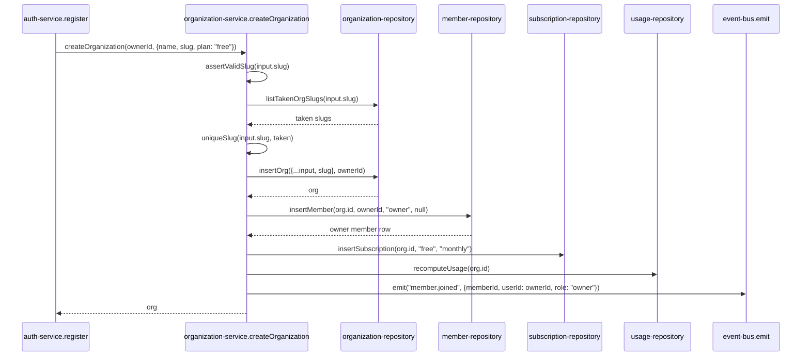

## Purpose

`src/server/services/organization-service.ts` owns organization creation, settings updates,
and deletion — the top-level tenant boundary REQ-001 describes. It is the one service that
seeds two other tables in a single call: creating an organization also creates the owner's
membership row and a subscription, because, per its own source comment, "a Taskflow account
with no organization cannot do anything."

What it deliberately does not own: the seat/plan quota arithmetic itself (delegated to
`src/config/plan-limits.ts` and `billing-service.ts`), member management beyond the initial
owner (delegated to `member-service.ts`), and project seeding — REQ-014's "organization
onboarding seeds a first project" is not implemented anywhere in this file; `createOrganization`
creates only the org, the owner membership, and the subscription, with no call into
`project-service.ts`, a gap DES-149 covers.

## Public surface

| function | signature | permission action | events emitted | errors thrown |
|---|---|---|---|---|
| `createOrganization` | `(ownerId: UserId, input: CreateOrganizationInput) => Promise<Organization>` | none (no `Actor` yet) | `member.joined` | `InvalidSlugError` |
| `updateOrganization` | `(actor: Actor, input: UpdateOrganizationInput) => Promise<Organization>` | `org:update` | none (activity record instead) | `NotFoundError`, `PermissionDeniedError` |
| `deleteOrganization` | `(actor: Actor, input: DeleteOrganizationInput) => Promise<Organization>` | `org:delete` | none | `NotFoundError`, `PermissionDeniedError`, plain `Error` (slug mismatch) |
| `getOrganizationSummary` | `(actor: Actor, orgId: OrgId) => Promise<OrganizationSummary>` | `org:read` | none | `NotFoundError`, `PermissionDeniedError` |
| `listOrganizationsForUser` | `(userId: UserId) => Promise<readonly Organization[]>` | none | none | none |
| `resolveOrgBySlug` | `(slug: string) => Promise<Organization \| null>` | none | none | none |

## Collaborators

- `src/server/repositories/organization-repository.ts` — `listTakenOrgSlugs`, `insertOrg`,
  `updateOrg`, `findOrgById`, `findOrgBySlug`, `archiveOrg`, `listOrgsForUser`.
- `src/server/repositories/member-repository.ts` — `insertMember`, `countActiveMembers`.
- `src/server/repositories/subscription-repository.ts` — `insertSubscription`.
- `src/server/repositories/project-repository.ts` — `countProjects`, read only by
  `getOrganizationSummary`.
- `src/server/repositories/usage-repository.ts` — `recomputeUsage`, `getUsage`.
- `src/lib/slug.ts` — `assertValidSlug`, `uniqueSlug`.
- `src/server/services/activity-service.ts` — `record`, called directly rather than through
  the event bus (DES-151).
- `src/server/services/_support.ts` — `envelope`, `orgResource`, `requireFound`.

### DES-149 — createOrganization takes no Actor and seeds a membership and subscription, but not a project

- **Satisfies:** REQ-001, REQ-003, REQ-014
- **Decided in:** ADR-006, ADR-013
- **Code:** `src/server/services/organization-service.ts` — `createOrganization`

`createOrganization(ownerId: UserId, input: CreateOrganizationInput)` is, alongside
`invitation-service.ts`'s `acceptInvitation`, one of only two functions in the service layer
that take no `Actor` — the source comment states why: "there is no membership to build one
from yet." The function validates the slug (`assertValidSlug`), deduplicates it against
`orgRepo.listTakenOrgSlugs`, inserts the organization row, then sequentially inserts the
owner's membership (`memberRepo.insertMember(org.id, ownerId, "owner", null)`, satisfying
REQ-003's "creating an organization makes the creator its owner" directly, with no
intermediate state where the org exists without an owner), inserts a subscription on the
plan named in `input.plan`, and calls `usageRepo.recomputeUsage(org.id)` to seed the usage
cache from zero rather than leaving it uninitialized. What it does *not* do, despite REQ-014
describing "organization onboarding seeds a first project" as a requirement, is call
`project-service.ts`'s `createProject` anywhere in this sequence — there is no project
creation in `createOrganization`'s body. Anyone verifying REQ-014 against this service should
look instead at the caller: `auth-service.ts`'s `register` calls `createOrganization` and then
immediately renders a welcome email, also with no project-seeding call visible in that path.
This is recorded here as an accurate reading of the frozen code, not a claim about where a
seeded project might be created elsewhere in the corpus outside the service layer covered by
this document.

### DES-150 — Org creation emits member.joined, never an organization.created event, because the event map has no such key

- **Satisfies:** REQ-003, REQ-006
- **Decided in:** ADR-005
- **Code:** `src/server/services/organization-service.ts` — `createOrganization`

The only `emit` call inside `createOrganization` publishes `member.joined` — for the newly
inserted owner membership, using `envelope(org.id, ownerId)` rather than `actorEnvelope`
(there is no `Actor` to build one from, matching DES-149). There is no `organization.created`
key in the 21-entry `TaskflowEventMap`, and this service does not attempt to work around that
absence the way `updateOrganization` does (DES-151) — organization creation is simply
unobservable to the event bus beyond the `member.joined` side effect, which means
`activity-service.ts`'s registered listeners never write an audit row for "organization
created" itself, only for the owner joining it. Anything downstream that reacts to
`member.joined` (the notification fan-out's `member.joined` handler in
`notification-service.ts`, `usage-service.ts`'s `seatsUsed` increment) fires exactly the same
way for a brand-new organization's founding member as it would for the hundredth member
joining a long-lived org — there is no special-casing of "this is the org's very first
member" anywhere the event reaches.

### DES-151 — updateOrganization records to the audit log directly rather than through emit, because there is no matching event key either

- **Satisfies:** REQ-004
- **Decided in:** ADR-005, ADR-022
- **Code:** `src/server/services/organization-service.ts` — `updateOrganization`

Unlike `createOrganization`'s silent gap (DES-150), `updateOrganization` does not simply skip
audit visibility for its writes — it calls `activity-service.ts`'s `record` function directly,
by import, rather than emitting an event and relying on `activity-service.ts`'s own listener
registration to catch it. The source comment explains the choice explicitly: "settings changes
are audited directly: the event bus has no `organization.updated` key, and inventing one would
widen the contract." This is the one place in the thirteen files covered by this document
where a service reaches directly into another service's exported function rather than going
through the event bus — a narrow, deliberate exception to the otherwise-consistent "services
communicate through events" pattern ADR-005 and ADR-022 establish, chosen specifically because
growing `TaskflowEventMap` (a frozen, closed union per the brief) was judged a bigger change
than one direct cross-service call. The `record` call passes `subjectKind: "organization"`
and a synthesized `summary` string (`"${updated.name} settings updated"`) built from the
post-write row, with no `from`/`to` values captured the way `member.role_changed`'s payload
does — REQ-034's before/after audit pattern established for role changes does not extend to
organization settings edits, which only record that a change occurred, not what changed.

### DES-152 — Deletion requires the caller to retype the org's own slug as a typed confirmation, and it is a soft delete

- **Satisfies:** REQ-007
- **Decided in:** ADR-004
- **Code:** `src/server/services/organization-service.ts` — `deleteOrganization`

`deleteOrganization` checks `org:delete` (minimum role `owner` per `ROLE_MATRIX`, directly
satisfying REQ-007's "deletion is restricted to the owner" at the permission-matrix level
before any application logic runs), then compares `org.slug !== input.confirmSlug` and throws
if they differ — the source comment names the UX pattern by analogy: "the same shape GitHub
uses: the caller has to retype the slug." This confirmation is checked *after* the permission
gate, so a non-owner attempting deletion gets `PermissionDeniedError` regardless of what
confirmation text they supply, never a misleading "wrong slug" message that would imply they
were close to succeeding. The actual deletion is `orgRepo.archiveOrg(input.orgId)` — a soft
delete consistent with ADR-004's project-wide policy, meaning a "deleted" organization's row
persists with an `archived_at` timestamp rather than being physically removed, though this
service exposes no `restoreOrganization` counterpart the way `project-service.ts` exposes
`restoreProject` — once archived through this path, an organization has no documented service-
layer path back to active status in this codebase.

### DES-153 — getOrganizationSummary and listOrganizationsForUser have deliberately different authorization shapes

- **Satisfies:** REQ-008, REQ-009
- **Decided in:** ADR-013
- **Code:** `src/server/services/organization-service.ts` — `getOrganizationSummary`,
  `listOrganizationsForUser`, `resolveOrgBySlug`

`getOrganizationSummary` takes a full `Actor` and asserts `org:read` before composing usage,
active member count, and project count into `OrganizationSummary` — REQ-008's "usage against
plan quotas" is answered here by three parallel repository reads (`usageRepo.getUsage`,
`memberRepo.countActiveMembers`, `projectRepo.countProjects`), not by delegating to
`billing-service.ts`'s `getBillingSummary`, which has its own, stricter `org:manage_billing`
gate — the dashboard header uses the cheaper, viewer-accessible summary, while the billing page
uses the richer, owner-only one. `listOrganizationsForUser`, by contrast, takes only a bare
`userId` with no `Actor` and no permission check at all: this is the org switcher's data
source, and REQ-009's "switching between organizations is explicit, never implicit" is
supported precisely by this function's shape — it lists every organization the user is a
*member* of (per `orgRepo.listOrgsForUser`'s join against membership rows) without requiring
an already-resolved `Actor` scoped to any one of them, since the whole point of the call is
to let the user choose which org to become an `Actor` in next, before any org-scoped
permission would even be meaningful. `resolveOrgBySlug` is a similarly unauthorized, bare
lookup used by `session-service.ts`'s `resolveActorForOrg` and `src/proxy.ts`'s request hook
(REQ-212, rejecting requests for unknown organizations) to translate a URL segment into an org
row before any `Actor` exists to check.

## Sequence: organization creation and its immediate seeding

1. `auth-service.ts`'s `register` calls `createOrganization` with the newly created user as
   `ownerId`, immediately after inserting the user row, before any session exists.
2. Slug validation runs first and throws `InvalidSlugError` before any repository write, so a
   malformed slug never reaches `listTakenOrgSlugs`.
3. The final slug is deduplicated against every existing org's taken slugs, mirroring
   `project-service.ts`'s `suggestProjectSlug` pattern at the organization level.
4. The organization row is inserted first, since the owner membership and subscription both
   reference its generated id.
5. The owner's membership row is inserted with role `"owner"` and no inviter (`null`), since
   there was no invitation for the founding member.
6. A subscription is inserted on the plan named in `input.plan` — `register` always passes
   `"free"`, though `createOrganization` itself accepts any valid `PlanId`, since "create
   another workspace" flows for an existing user could plausibly pass a different value.
7. `usageRepo.recomputeUsage` seeds the usage cache at zero rather than leaving it absent,
   which matters because `billing-service.ts`'s `usageFor` and `checkLimit` assume a usage row
   always exists for a given org.
8. `member.joined` is the only event this whole sequence emits; it triggers the notification
   fan-out, the usage-service seat increment, and the activity log's member-joined record, but
   nothing observes "an organization was created" as a distinct fact.

## Operational notes

`organization-service.ts` is the only file among the thirteen this design set covers whose
create path takes no `Actor` at all *and* whose primary consumer is a different service
(`auth-service.ts`) rather than a Server Action calling it directly on behalf of an
already-authenticated user — the "create another workspace" flow for an existing, already
logged-in user is the other legitimate caller, and it is worth noting that this second call
path is not separately gated by anything in this file either; any authenticated user who can
reach the appropriate Server Action can call `createOrganization` again with themselves as
`ownerId`, since the function has no concept of "this user already has too many
organizations" — REQ-213's "a user may belong to several organizations" is, from this
service's perspective, unlimited. A second point worth recording for anyone debugging a
missing audit entry: because `createOrganization` emits only `member.joined` and
`updateOrganization` calls `activity-service.ts`'s `record` directly (DES-150, DES-151), the
two mutating paths in this file that are not `deleteOrganization` produce audit-log rows
through two structurally different mechanisms — one through the event bus, one through a
direct function call — and a future refactor consolidating them would need to preserve both
behaviours (deferred fan-out for `member.joined`'s other listeners, and synchronous recording
for the settings-change summary) rather than assuming the two paths are interchangeable.
`deleteOrganization` itself, notably, calls neither `emit` nor `record` — an organization
deletion produces no activity-log row and no domain event at all, a gap symmetric to the one
DES-150 already flags for creation, but arguably more notable given how consequential a
deletion is compared to a routine settings edit.

## Failure modes

| thrown error | resulting error code | caller behaviour |
|---|---|---|
| `InvalidSlugError` | `validation_failed` (422) — mapped via `HTTP_STATUS_BY_CODE` | signup/create-org form shows a slug-format validation error inline |
| `NotFoundError` | `not_found` (404) | settings page shows a load error; should not occur for an org the caller is already scoped into |
| `PermissionDeniedError` | `forbidden` (403) | delete/update controls hidden below `owner`/`admin` respectively in the settings UI |
| `TenantScopeError` | `tenant_scope_violation` (403) | logged as a bug, session redirected |
| plain `Error` (slug mismatch in `deleteOrganization`) | falls through to `internal_error` (500) | delete confirmation dialog shows an inline "slugs do not match" message client-side as the primary defense; this server throw is the backstop |

## Test coverage

There is no dedicated tests/services/organization-service.test.ts in the corpus's test
directory. Coverage for this service's behaviour is indirect: `tests/schemas/auth.schema
.test.ts` covers the input schemas shared with `auth-service.ts`'s `register` path, which is
this service's primary caller, but does not exercise `organization-service.ts`'s own logic
(the seeding order, the last-owner-adjacent guarantees, the slug-confirmation deletion flow)
directly. This is a real gap: DES-149 through DES-153 each describe behaviour — the missing
project-seeding call, the direct `activity-service.ts` call bypassing the event bus, the
typed-confirmation deletion — that a reviewer would currently have to verify by reading the
source rather than by pointing at a passing test.
