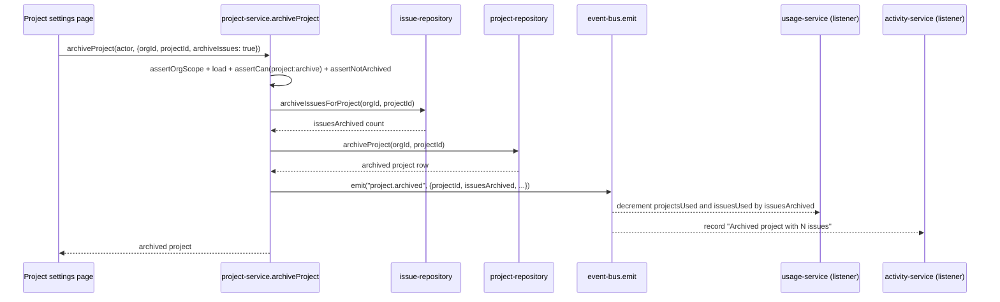

## Purpose

`src/server/services/project-service.ts` owns the project lifecycle: creation against the
plan's project quota, settings updates, archive/restore, and the read paths the project list
and detail pages use. It shares the guard-ordering discipline documented as DES-100 in
`service-issue.md` — tenant scope, then load, then `assertCan` against the loaded row, then
`assertNotArchived` — and this file does not repeat that derivation, only notes where project
lifecycle diverges from it.

What it deliberately does not own: issue numbering or issue quota (owned by
`src/server/services/issue-service.ts`, which is the reader of `issuesPerProject`), label
definitions (owned by `src/server/services/label-service.ts`), and project-level notification
routing (owned by `src/server/services/notification-service.ts`, which reads project
membership to narrow fan-out per REQ-051). Slug generation logic itself lives in
`src/lib/slug.ts`; this service only decides *when* to call it.

## Public surface

| function | signature | permission action | events emitted | errors thrown |
|---|---|---|---|---|
| `createProject` | `(actor: Actor, input: CreateProjectInput) => Promise<Project>` | `project:create` | `project.created` | `PermissionDeniedError`, `NotFoundError`, plain `Error` (quota) |
| `updateProject` | `(actor: Actor, input: UpdateProjectInput) => Promise<Project>` | `project:update` | none | `NotFoundError`, `PermissionDeniedError`, `AlreadyArchivedError` |
| `archiveProject` | `(actor: Actor, input: ArchiveProjectInput) => Promise<Project>` | `project:archive` | `project.archived` | `NotFoundError`, `PermissionDeniedError`, `AlreadyArchivedError` |
| `restoreProject` | `(actor: Actor, orgId: OrgId, projectId: ProjectId) => Promise<Project>` | `project:archive` | `project.restored` | `NotFoundError`, `PermissionDeniedError` |
| `getProject` | `(actor: Actor, orgId: OrgId, slug: string) => Promise<ProjectWithStats>` | `project:read` | none | `NotFoundError`, `PermissionDeniedError` |
| `listProjects` | `(actor: Actor, input: ListProjectsInput) => Promise<Page<ProjectWithStats>>` | `project:read` | none | `PermissionDeniedError` |
| `suggestProjectSlug` | `(orgId: OrgId, name: string) => Promise<string>` | none (no `Actor`) | none | none |

## Collaborators

- `src/server/repositories/project-repository.ts` — `countProjects`, `insertProject`,
  `findProjectById`, `findProjectBySlug`, `updateProject`, `archiveProject`,
  `restoreProject`, `getProjectStats`, `listProjects`, `listTakenProjectSlugs`.
- `src/server/repositories/issue-repository.ts` — `archiveIssuesForProject`, the cascade
  DES-111 covers.
- `src/server/repositories/organization-repository.ts` — `findOrgById`, source of the plan.
- `src/lib/slug.ts` — `projectKeyFromName`, `uniqueSlug`.
- `src/config/plan-limits.ts` — `wouldExceedLimit`.
- `src/server/services/_support.ts` — `actorEnvelope`, `orgResource`, `projectResource`,
  `requireFound`.

### DES-108 — Project creation derives its key from the name unless one is supplied, and the key is never touched again

- **Satisfies:** REQ-041, REQ-042, REQ-043
- **Decided in:** ADR-010
- **Code:** `src/server/services/project-service.ts` — `createProject`,
  `suggestProjectSlug`

`createProject` runs `assertOrgScope`, then `assertCan(actor, "project:create",
orgResource(input.orgId))` against the *organization*, not a not-yet-existing project — this
is the one creation path in the service layer whose permission target is the org, since there
is no row yet to build a `PermissionResource` from. After loading the org, it counts existing
projects and calls `wouldExceedLimit(org.plan, "projects", used)` (REQ-043) before any write.
The slug is computed by `suggestProjectSlug`, a small exported helper that calls
`projectRepo.listTakenProjectSlugs` and `uniqueSlug(name, taken)` from `src/lib/slug.ts`; it
is exported specifically so the create form can preview the slug live as the user types the
project name, and `createProject` calls the same function so the preview and the persisted
value can never disagree — REQ-041's uniqueness guarantee is enforced by one code path used
twice, not duplicated. The project key — the `TF` in `TF-12` — is `input.key ||
projectKeyFromName(input.name)`: an explicit key from the caller wins, otherwise
`projectKeyFromName` derives one. REQ-042 states the key is immutable, and this immutability
is structural rather than a runtime check: `UpdateProjectInput`'s Zod schema (ADR-009) simply
has no `key` field, so there is no code path in `updateProject` capable of writing one.

### DES-109 — updateProject performs no diffing and emits no event

- **Satisfies:** REQ-054
- **Decided in:** ADR-005
- **Code:** `src/server/services/project-service.ts` — `updateProject`

`updateProject` is the shortest mutating function in the file: after the standard guard
sequence (scope, load, `project:update`, `assertNotArchived`), it forwards the input directly
to `projectRepo.updateProject(input)` and returns the result — no `emit` call at all. This is
a real asymmetry with `issue-service.ts`'s `updateIssue`, which does publish `issue.updated`.
The reason is that `TaskflowEventMap` has no `project.updated` key (the 21-key event map lists
`project.created`, `project.archived`, and `project.restored` only), and, per the brief's
"known deliberate layering exceptions," inventing one would widen a frozen contract. In
practice this means project settings edits (REQ-054's per-project defaults — default
assignee, default label set, and similar) are silent to the activity feed, the search index,
and webhook subscribers; only project creation and archive/restore state changes are
observable events. Anyone extending this service should treat adding `project.updated` as an
`ADR`-level decision, not a quiet addition, because the notification and webhook fan-outs
would both need matching subscribers before the event became useful.

### DES-110 — Restoring a project does not restore its issues

- **Satisfies:** REQ-047
- **Decided in:** ADR-004
- **Code:** `src/server/services/project-service.ts` — `restoreProject`

`restoreProject` reuses the `project:archive` permission (there is no separate
`project:restore` action in `ROLE_MATRIX`) and, notably, does not call `assertNotArchived`
before restoring — restoring an already-live project is treated as a harmless no-op rather
than a conflict, unlike every other mutating function in this file. The source comment states
the invariant plainly: "restore does not un-archive the issues: they are restored
individually." This is the mirror image of DES-111's archive cascade and is intentionally
asymmetric — cascading archive is safe because it only ever adds `archived_at` timestamps,
while a cascading restore would have to guess which of a project's issues were archived
*because of* the project archive versus independently archived beforehand, information the
current schema does not retain. `project.restored`'s payload is minimal (`projectId` only) for
the same reason: there is nothing else it could truthfully claim happened.

### DES-111 — Archiving a project optionally cascades to its open issues, and the cascade count travels in the event

- **Satisfies:** REQ-045, REQ-046, REQ-053
- **Decided in:** ADR-004
- **Code:** `src/server/services/project-service.ts` — `archiveProject`

`archiveProject` checks `input.archiveIssues` — a boolean the caller supplies, not a fixed
policy — and, if true, calls `issueRepo.archiveIssuesForProject(input.orgId,
input.projectId)` *before* archiving the project row itself, capturing the returned count as
`issuesArchived`. The project archive happens second, and the emitted `project.archived`
payload carries `issuesArchived` directly, which is what lets the activity listener render
"Archived project with N issues" (as seen in `activity-service.ts`'s handler for this event)
without a second query. Doing the issue cascade before the project archive, rather than after,
means a crash between the two steps leaves issues archived under a still-live project — a
recoverable, visible inconsistency — rather than the reverse, which would leave an archived
project silently still full of open issues that no listing surfaces (REQ-046, archived
projects hidden from default listings) but that a direct issue link would still open normally,
a worse and quieter inconsistency. `archiveProject` still requires `assertNotArchived` first,
so archiving an already-archived project is rejected rather than silently re-cascading.

### DES-112 — getProject composes stats from a second repository call, both scoped by the same permission check

- **Satisfies:** REQ-054
- **Decided in:** ADR-013
- **Code:** `src/server/services/project-service.ts` — `getProject`, `listProjects`

`getProject` resolves by slug (`findProjectBySlug`, matching REQ-041's uniqueness), asserts
`project:read` once against the loaded project, and only then calls `projectRepo
.getProjectStats(orgId, project.id)` to build `ProjectWithStats`. `listProjects` follows the
same pattern at page scope: it asserts `project:read` against the org once, then maps
`page.items` through `Promise.all(... getProjectStats ...)` per row — one permission check
for the whole page rather than per project, on the reasoning that `project:read`'s minimum
role (`viewer`) is not project-scoped in `ROLE_MATRIX` in the first place, so a per-row check
would always evaluate identically within one call. This n+1-shaped stats fetch (one query per
page item) is a known, accepted cost — project pages are rarely wider than a few dozen rows
per keyset page (ADR-008), and stats are cheap aggregate counts, not full row scans.

### DES-113 — Project visibility does not gate listProjects, only what a viewer can conclude from it

- **Satisfies:** REQ-050
- **Decided in:** ADR-013
- **Code:** `src/server/services/project-service.ts` — `listProjects`

Like `issue-service.ts`'s `listIssues` (DES-107), `listProjects` authorizes at the
organization rather than filtering each row by `project.visibility`. REQ-050 ties visibility
to the `public_projects` flag, but `project-service.ts` never calls `isEnabled` at all — the
visibility field is read and returned as part of `ProjectWithStats`, and it is up to the
client and the flag snapshot (DES-176, `feature-flag-service.ts`'s `getSnapshot`) to decide
what the UI does with a `private` project a viewer should not have been able to discover.
This is a narrower authorization surface than `issue-service.ts` chose for issue visibility,
and it is worth flagging: unlike issues, where opening one re-checks `issue:read` against the
specific row, `getProject`'s permission check is likewise per-row, so the actual data leak
surface is limited to the *list* view showing names and slugs of otherwise-private projects
to any org member — a gap the team has accepted as low severity since project names are not
considered sensitive within an organization.

### DES-114 — suggestProjectSlug takes no Actor and performs no authorization

- **Satisfies:** REQ-041
- **Decided in:** ADR-013
- **Code:** `src/server/services/project-service.ts` — `suggestProjectSlug`

`suggestProjectSlug` is the one exported function in this service with no `Actor` parameter
and no `assertCan`/`assertOrgScope` call at all. It exists purely as a live-typing preview
behind the create-project form, called on every keystroke, and the team judged that gating a
read of "which slugs are already taken in this org" behind a full permission check would add
latency to a UI convenience without protecting anything — slugs are not secret, and the
function performs no write. Any caller with a valid `orgId` can call it, including one who
could not actually create a project; the real gate is `createProject`'s `project:create`
check, which this function's result feeds into but does not bypass.

## Sequence: archiving a project with the issue cascade enabled

1. The settings page submits `archiveProject` with `archiveIssues: true` when the user
   confirms the cascading-archive checkbox; `false` skips step 2 entirely.
2. The standard guard sequence runs first — a caller without `project:archive`, or targeting
   an already-archived project, never reaches the cascade.
3. `issueRepo.archiveIssuesForProject` archives every open issue under the project in one
   repository call and returns how many rows it touched.
4. `projectRepo.archiveProject` writes `archived_at` on the project row itself, strictly
   after the issue cascade completes.
5. `emit("project.archived", ...)` carries `issuesArchived` in the payload so downstream
   listeners never have to recompute it.
6. `usage-service.ts`'s listener (DES-138) decrements both `projectsUsed` and `issuesUsed` by
   the cascade count in the same handler, keeping the plan-quota counters consistent with the
   cascade in one step rather than relying on two independent events.
7. `activity-service.ts`'s listener writes one audit row summarizing both the project archive
   and the issue count, without a second query back to the issues table.

## Operational notes

`project-service.ts` has no local constants of its own — every numeric limit it consults
(the project quota) is read live from `src/config/plan-limits.ts`'s `PLAN_LIMITS` table via
`wouldExceedLimit`, and every slug/key derivation is delegated to `src/lib/slug.ts`. This
makes the service unusually thin compared to `issue-service.ts` or `comment-service.ts`: there
is no rate limiting anywhere in this file, since project creation and archival are judged
infrequent enough, relative to comment or search volume, not to need burst protection of
their own. One consequence worth flagging for anyone extending this service: because
`updateProject` performs no diffing and emits no event (DES-109), a caller that wants to
observe project settings changes has no event-bus signal to subscribe to at all — the only
way to notice a project's default assignee or default label set changed is to poll
`getProject`/`listProjects` and diff the result client-side, which the current dashboard does
not do. Anyone reviewing REQ-054 against this service should read that requirement as
describing what settings exist, not as promising observability of changes to them. A second
detail worth recording: `listProjects`' n+1-shaped stats fetch (DES-112) means a page of
`ListProjectsInput.limit` projects issues that many additional `getProjectStats` calls, all
run through `Promise.all` rather than sequentially, so the wall-clock cost is roughly one
round trip's worth of latency regardless of page size, at the cost of one connection per row
held open concurrently — acceptable at the keyset page sizes ADR-008 assumes, but worth
re-evaluating if the default page size were ever increased substantially.

## Failure modes

| thrown error | resulting error code | caller behaviour |
|---|---|---|
| `NotFoundError` | `not_found` (404) | project settings page shows "not found", link back to project list |
| `PermissionDeniedError` | `forbidden` (403) | archive/restore controls are hidden client-side once role is known, so this mostly guards direct API calls |
| `TenantScopeError` | `tenant_scope_violation` (403) | logged as a bug, session redirected |
| `AlreadyArchivedError` | `conflict` (409) | archive button disabled once state loads; direct calls surface a 409 |
| plain `Error` (quota message in `createProject`) | falls through to `internal_error` (500) | same gap as DES-101/107 flag for `issue-service.ts`: the quota breach is not a typed domain error, so the client cannot distinguish it from a server fault without string matching |

## Test coverage

`tests/services/project-service.test.ts` covers creation quota enforcement, slug
suggestion/uniqueness, the archive cascade with `archiveIssues` both `true` and `false`,
restore behaviour, and the read paths. No other test file exercises this service directly.
`tests/components/usage-meter.test.tsx` indirectly depends on the usage counters this
service's `project.archived`/`project.created` events drive, but does not call into
`project-service.ts` itself.
