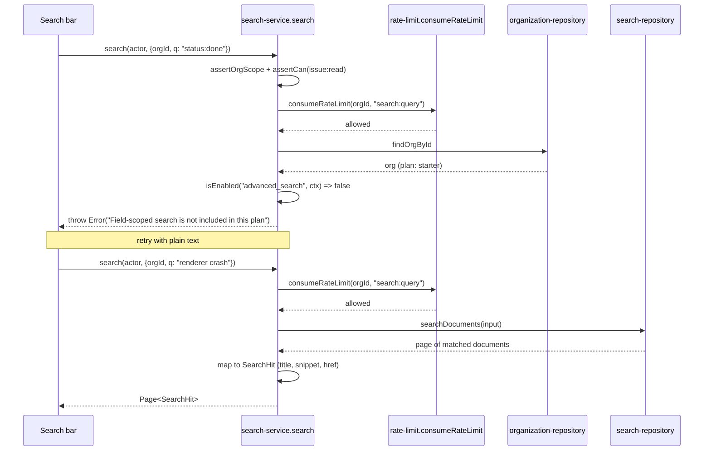

## Purpose

`src/server/services/search-service.ts` is both the query-time reader and the write-time
index maintainer for Taskflow's search — a single file owns both halves, unlike the split
between `notification-service.ts` and `digest-service.ts`. It keeps a denormalised search
index synchronously current from the same domain events every other reactive concern
subscribes to (ADR-017's "maintain the search index synchronously from events"), and it
answers `search()` queries by reading that index rather than querying issues, comments, and
projects directly.

What it deliberately does not own: the actual full-text matching algorithm — that lives in
`src/server/repositories/search-repository.ts`'s `searchDocuments`, which this service treats
as an opaque store; and syntax parsing for field-scoped queries beyond the presence check
(`input.q.includes(":")`) this service uses to decide whether to reject the query outright.

## Public surface

| function | signature | permission action | events emitted | errors thrown |
|---|---|---|---|---|
| `search` | `(actor: Actor, input: SearchQueryInput) => Promise<Page<SearchHit>>` | `issue:read` | none | `PermissionDeniedError`, plain `Error` (rate limit, advanced search) |
| `indexIssue` | `(orgId: OrgId, issue: Issue) => Promise<void>` | none (internal) | none | none |
| `indexComment` | `(orgId: OrgId, comment: Comment) => Promise<void>` | none (internal) | none | none |
| `indexProject` | `(orgId: OrgId, project: Project) => Promise<void>` | none (internal) | none | none |
| `removeFromIndex` | `(orgId: OrgId, subjectKind: SearchSubjectKind, subjectId: string) => Promise<void>` | none (internal) | none | none |
| `registerSearchListeners` | `() => Unsubscribe` | none | none | none |

## Collaborators

- `src/server/repositories/search-repository.ts` — `searchDocuments`,
  `upsertSearchDocument`, `deleteSearchDocument`.
- `src/server/repositories/issue-repository.ts`, `src/server/repositories/comment-repository
  .ts`, `src/server/repositories/project-repository.ts` — the re-read source of truth every
  listener consults before indexing (DES-158).
- `src/server/repositories/organization-repository.ts` — `findOrgById`, source of plan for
  the `advanced_search` flag check.
- `src/lib/rate-limit.ts` — `consumeRateLimit`, the `search:query` bucket.
- `src/lib/feature-flags.ts` — `isEnabled`.
- `src/lib/event-bus.ts` — `subscribe`.
- `src/server/services/_support.ts` — `orgResource`.

### DES-154 — search() authorizes at issue:read regardless of what subject kind matched, and gates field-scoped syntax on a plan flag

- **Satisfies:** REQ-170, REQ-175, REQ-181
- **Decided in:** ADR-011, ADR-012
- **Code:** `src/server/services/search-service.ts` — `search`

`search` asserts `issue:read` against `orgResource(input.orgId)` unconditionally — a single
permission check covering results across all three subject kinds (issue, comment, project),
even though REQ-181 phrases the requirement narrowly as "search requires read permission on
issues." There is no separate `comment:read`/`project:read` check for a query whose results
happen to include comments or projects; the team's reading is that a unified search box
returning a mixed result set cannot practically gate each row by a different permission
without either filtering rows post-query (defeating pagination totals) or running three
separate authorization checks for one query the user perceives as one action, so `issue:read`
was chosen as the single representative gate — consistent with the product fact that
`issue:read`, `comment:read`, and `project:read` all share the same `viewer` minimum in
`ROLE_MATRIX` today, making the distinction currently unobservable in practice even though the
code does not enforce it per-kind. After the permission and rate-limit checks, `search` builds
a `FlagContext` and calls `isEnabled("advanced_search", ...)`; if `input.q.includes(":")` and
advanced search is not enabled for the org's plan, the function throws before the repository
is ever queried — REQ-175's "field-scoped syntax requires advanced search" is enforced as an
outright rejection of the whole query, not a silent stripping of the colon syntax down to
plain text, which would otherwise return misleading results for a query the user believed was
field-scoped.

### DES-155 — Rate limiting runs before the flag check, so a throttled caller never learns whether their plan includes advanced search

- **Satisfies:** REQ-176
- **Decided in:** ADR-011
- **Code:** `src/server/services/search-service.ts` — `search`, `SEARCH_QUERY_BUCKET`

`search` calls `consumeRateLimit(input.orgId, SEARCH_QUERY_BUCKET)` — bucket key literal
`"search:query"`, matching the 120-capacity/60-per-minute-refill configuration in `src/lib/
rate-limit.ts` — immediately after the permission check and before the org is loaded for the
`advanced_search` flag evaluation. This ordering means a caller who has exhausted their
bucket is rejected with the rate-limit message regardless of whether their query would have
also failed the field-scoped-syntax check; the two error conditions are mutually exclusive in
practice because the rate-limit throw returns early, so a query never surfaces both reasons at
once. REQ-176's per-organization scoping is enforced by keying the bucket on `input.orgId`
rather than on the caller's `userId` — a burst from one heavy user inside an org can throttle
every other member's search in the same organization, which is the accepted trade-off of an
org-scoped bucket over a per-user one (consistent with every other rate-limited action in the
service layer, all of which key on `orgId`, not `userId`).

### DES-156 — Result composition happens after the repository call, deriving title and snippet from stored content rather than the original row

- **Satisfies:** REQ-177, REQ-178, REQ-179
- **Decided in:** ADR-017
- **Code:** `src/server/services/search-service.ts` — `search`, `snippetAround`, `hrefFor`,
  `SNIPPET_RADIUS`

Once `searchRepo.searchDocuments(input)` returns a page of matched rows, `search` maps each
into a `SearchHit` by deriving `title` from `row.content.split("\n")[0] ?? row.subjectId` —
the first line of whatever text was indexed, not a fresh read of the subject's actual title
field — and `snippet` from `snippetAround(row.content, input.q)`, which locates the
case-insensitive first occurrence of the query string and returns up to `SNIPPET_RADIUS` (60)
characters on either side, prefixed and suffixed with an ellipsis when truncated, or the first
120 characters of the content when the query string is not found in it at all (a fallback that
can happen when the underlying index's tokenization matches a query the literal substring
search inside `snippetAround` does not — the two are not the same matching algorithm).
`hrefFor` maps each of the three `SearchSubjectKind` values to a fixed URL template
(`/issues/:id`, `/comments/:id`, `/projects/:id`), which is what satisfies REQ-178's "results
link back to the subject" without a repository round trip per hit. REQ-179's cursor-based
pagination is entirely delegated to `searchRepo.searchDocuments`'s own `nextCursor`, passed
through unmodified in the returned `Page<SearchHit>`.

### DES-157 — Indexing functions are content-shape adapters, and they encode different subjectId-to-projectId conventions per kind

- **Satisfies:** REQ-170, REQ-172
- **Decided in:** ADR-017
- **Code:** `src/server/services/search-service.ts` — `indexIssue`, `indexComment`,
  `indexProject`

The three `index*` functions all call `searchRepo.upsertSearchDocument` with a subject kind,
subject id, a joined content string, and a fourth `projectId` argument — but they populate
that fourth argument inconsistently by design, not by oversight. `indexIssue` passes
`issue.projectId`, the issue's real parent. `indexComment` passes `null` — a comment's search
document carries no project scoping at all, since `Comment` in this schema is not directly
tied to a project the way an issue is. `indexProject` passes `project.id` — the project's own
id doubles as its own "project scope" for the purpose of this column, which is a slightly odd
but deliberate reuse: it lets any query that filters search results by project include the
project's own document alongside its issues, without a separate nullable "self" sentinel.
Content strings are built by joining the fields relevant to that kind with `"\n"` — title and
description for issues and projects, the raw body for comments — which is exactly what
`snippetAround` and the title-derivation in DES-156 operate on later at query time.

### DES-158 — Every write-time listener re-reads the row rather than trusting the event payload

- **Satisfies:** REQ-172, REQ-173, REQ-174, REQ-180
- **Decided in:** ADR-017
- **Code:** `src/server/services/search-service.ts` — `registerSearchListeners`

`registerSearchListeners` attaches eight subscriptions. Six of them — `issue.created`,
`issue.updated`, `comment.created`, `project.created`, and the two archive handlers — follow a
strict pattern for the non-removal cases: load the row fresh from its owning repository
(`issueRepo.findIssueById`, `commentRepo.findCommentById`, `projectRepo.findProjectById`)
using ids taken from the event payload, and only call the corresponding `index*` function `if`
that fresh read returned a non-null row. The source comment states the rationale directly, and
it is quoted verbatim in REQ-173: "handlers re-read the row rather than trusting the payload,"
which the search listeners implement to the letter — an `issue.updated` event's payload only
carries `changedFields`, no field values (per `service-issue.md`'s DES-102), so re-reading is
not optional here, it is the only way to obtain the current title and description to index at
all. The three archive/delete handlers (`issue.archived`, `comment.deleted`,
`project.archived`) instead call `removeFromIndex` directly from the payload's subject id, with
no re-read — there is nothing to re-read for a subject being removed, and REQ-174's "archiving
removes a subject from the index" is satisfied by this direct removal. The eighth subscription,
`search.reindex_requested`, is narrower than its name suggests: the handler contains an
explicit `if (payload.subjectKind !== "issue") return;` guard, meaning this event — REQ-180's
"a scheduled job can rebuild the index" — currently only re-indexes issues through this
listener; comment and project reindex requests of this kind are accepted by the type system
(`subjectKind` is typed broadly) but silently no-op inside this specific handler, a real,
narrower-than-documented behaviour worth flagging to anyone relying on `search-reindex-job.ts`
to rebuild comment or project search documents through this event path specifically.

## Sequence: a query rejected for unlicensed field-scoped syntax, and a successful plain query

1. A colon in the query string on a `starter`-plan org is checked only after the rate limit
   has already been consumed for that attempt — a rejected query still costs a token from the
   bucket, since the check happens after `consumeRateLimit`.
2. The org is loaded specifically to build the `FlagContext` `isEnabled("advanced_search",
   ...)` needs; this repository call would not otherwise be necessary for a plain-text query.
3. The advanced-search check fails for `starter` (gated at `enterprise` per the flag
   registry), so the function throws before `searchRepo.searchDocuments` is ever called.
4. A retried plain-text query consumes a second token from the same bucket and, having no
   colon, skips the flag check's rejection branch entirely.
5. `searchRepo.searchDocuments` performs the actual match against the denormalised index built
   by the write-time listeners (DES-158), not against the issues/comments/projects tables
   directly.
6. Each returned document row is mapped into a `SearchHit` using the title/snippet/href
   derivation in DES-156, and the page's cursor is passed through unmodified.

## Operational notes

Two constants govern this service's behaviour end to end: `SNIPPET_RADIUS` (60 characters,
controlling how much context surrounds a matched substring in a returned snippet) and
`SEARCH_QUERY_BUCKET` (the literal string `"search:query"`, the rate-limit bucket key). Both
are declared locally in `search-service.ts` rather than in src/config/, consistent with how
`comment-service.ts` and `project-service.ts` also keep their small, non-plan-scaled constants
local rather than centralized — a pattern worth recognizing across the service layer: only
values that genuinely vary by plan live in `src/config/plan-limits.ts` or
`src/config/feature-flags.ts`; everything else is a private constant next to the code that
uses it. Operators debugging a reported "search returns no results for a query I can see
matches for" complaint should check three things in order, matching the guard sequence
DES-154 and DES-155 describe: whether the query was rejected outright for unlicensed
field-scoped syntax (a colon in the query text on a sub-`enterprise` plan), whether the
org's `search:query` bucket was exhausted at the moment of the request, and only then whether
the underlying index itself is stale — the last of which points back to DES-158's listener
coverage, since a subject whose owning event was emitted before `registerSearchListeners` was
attached (a narrow window during process startup) would never have been indexed at all.

## Failure modes

| thrown error | resulting error code | caller behaviour |
|---|---|---|
| `PermissionDeniedError` | `forbidden` (403) | search bar hidden or disabled below `viewer`; unlikely in practice since most authenticated actors clear `viewer` |
| `TenantScopeError` | `tenant_scope_violation` (403) | logged as a bug, session redirected |
| plain `Error` (rate limit) | falls through to `internal_error` (500) | search UI shows a generic "try again" toast; no countdown surfaced from `verdict.resetAt` |
| plain `Error` (advanced search not included) | falls through to `internal_error` (500) | search UI is expected to show an upgrade prompt keyed off the message text, since there is no typed `FeatureDisabledError` thrown here the way `isEnabled`-gated writes elsewhere in the corpus use |

The last row is worth flagging explicitly: unlike `attachment-service.ts` and
`webhook-service.ts`, which also gate on plan-tied feature flags but likewise throw plain
errors, the brief's own product facts describe a dedicated `FeatureDisabledError` domain class
as part of the error taxonomy — `search-service.ts` does not use it for the
`advanced_search` rejection, another instance of the untyped-error pattern documented across
this design set (`service-issue.md` DES-101, `service-billing-and-usage.md` DES-137).

## Test coverage

`tests/services/search-service.test.ts` covers query authorization, the rate-limit gate, the
field-scoped-syntax rejection across plan tiers, and snippet/title derivation. It also
exercises `registerSearchListeners`' re-read-not-trust pattern by asserting that a stale event
payload does not produce a stale index entry. No other test file in the corpus exercises this
service directly; there is no dedicated test file for `src/server/jobs/search-reindex-job.ts`'s
own interaction with `search.reindex_requested`, so DES-158's narrowed `search.reindex_requested`
handler (issues only) is currently verified only through `tests/services/search-service.test.ts`,
not through a job-level test.
