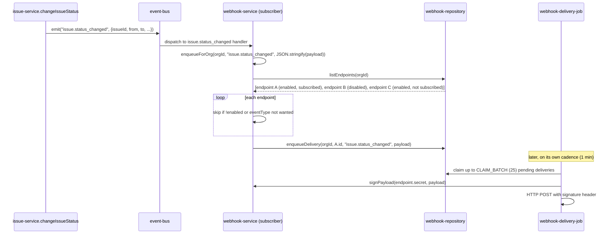

## Purpose

`src/server/services/webhook-service.ts` owns endpoint CRUD, payload signing, and the bridge
from five domain events into the delivery queue table. It stops at enqueueing a delivery row —
the actual HTTP send, retry backoff, and attempt-ceiling logic live in
`src/server/jobs/webhook-delivery-job.ts`, which this document references but does not
design; the service's job ends where REQ-154's "deliveries are queued, never sent inline with
a request" is satisfied.

What it deliberately does not own: the retry policy (`MAX_ATTEMPTS = 6`,
`backoffMs()`'s 1s/2s/4s.../300000ms-capped schedule, both stated in the brief as job-layer
constants), the claim-batch mechanics (`CLAIM_BATCH = 25`), or delivery attempt history
rendering — this service only writes the initial row via
`webhookRepo.enqueueDelivery`; everything after that belongs to the job.

## Public surface

| function | signature | permission action | events emitted | errors thrown |
|---|---|---|---|---|
| `listWebhooks` | `(actor: Actor, orgId: OrgId) => Promise<readonly WebhookEndpointRow[]>` | `webhook:manage` | none | `PermissionDeniedError` |
| `createWebhook` | `(actor: Actor, input: CreateWebhookInput) => Promise<WebhookEndpointRow>` | `webhook:manage` | none | `PermissionDeniedError`, `NotFoundError`, plain `Error` (flag, quota) |
| `updateWebhook` | `(actor: Actor, input: UpdateWebhookInput) => Promise<WebhookEndpointRow>` | `webhook:manage` | none | `PermissionDeniedError` |
| `deleteWebhook` | `(actor: Actor, input: DeleteWebhookInput) => Promise<void>` | `webhook:manage` | none | `PermissionDeniedError` |
| `signPayload` | `(secret: string, payload: string) => string` | none (pure) | none | none |
| `registerWebhookListeners` | `() => Unsubscribe` | none | none | none |

## Collaborators

- `src/server/repositories/webhook-repository.ts` — `listEndpoints`, `insertEndpoint`,
  `updateEndpoint`, `deleteEndpoint`, `countEndpoints`, `enqueueDelivery`.
- `src/server/repositories/organization-repository.ts` — `findOrgById`.
- `node:crypto` — `createHmac`, the only non-Taskflow dependency in this file.
- `src/lib/hash.ts` — `randomToken`, used to mint the endpoint secret.
- `src/config/plan-limits.ts` — `wouldExceedLimit`.
- `src/lib/feature-flags.ts` — `isEnabled`.
- `src/lib/event-bus.ts` — `subscribe`.
- `src/server/services/_support.ts` — `requireFound`, `webhookResource`.

### DES-159 — Endpoint creation is gated twice, and the secret is minted once and never regenerated

- **Satisfies:** REQ-150, REQ-152, REQ-153
- **Decided in:** ADR-018, ADR-012
- **Code:** `src/server/services/webhook-service.ts` — `createWebhook`, `SECRET_BYTES`

`createWebhook` checks `webhook:manage` (minimum `admin` per `ROLE_MATRIX`, satisfying
REQ-151), loads the org, then applies two independent gates before writing anything: first
`isEnabled("webhooks", flagContextFor(actor, org.plan, org.settings.enabledFlagOverrides))`
— the `webhooks` flag is declared not-overridable in the flag registry and gated at `growth`
and above, so REQ-152's "webhooks require a plan that includes them" cannot be satisfied by an
org-level override even for an admin who wants to turn it on early; second,
`wouldExceedLimit(org.plan, "webhooks", used)` against the plan's endpoint cap. Only after
both pass does `webhookRepo.insertEndpoint(input, randomToken(SECRET_BYTES))` run, where
`SECRET_BYTES` is `32` — the secret is generated inside this function call, at creation time
only, and the source comment states plainly: "rotating it means deleting the endpoint." There
is no `rotateWebhookSecret` function anywhere in this file; `updateWebhook` accepts changes to
an endpoint's URL, event subscriptions, and enabled state, but has no field for regenerating
the signing secret, which means REQ-153's "each endpoint holds a secret used to sign payloads"
is, in this codebase, a secret with a lifecycle exactly as long as the endpoint row itself.

### DES-160 — signPayload is a pure HMAC wrapper, and the exact byte sequence signed is the serialized JSON string, not the object

- **Satisfies:** REQ-153, REQ-160
- **Decided in:** ADR-018
- **Code:** `src/server/services/webhook-service.ts` — `signPayload`

`signPayload(secret, payload)` calls `createHmac("sha256", secret).update(payload,
"utf8").digest("hex")` — a single expression, no branching, no async work. The source comment
is precise about why byte-for-byte fidelity matters: "the receiving end recomputes this from
the same secret... so the payload string must be signed byte-for-byte as sent." Concretely,
this means whatever `enqueueForOrg` (DES-162) passes as `payload` — the result of
`JSON.stringify` on either the raw event payload or a repackaged `{eventType, payload}`
envelope depending on the source event — is exactly what must be signed and exactly what must
be transmitted; re-serializing the same logical object with different key ordering or
whitespace at delivery time would produce a signature the receiver's own recomputation could
not match, since JSON serialization is not guaranteed to be canonical across two independent
`JSON.stringify` calls on objects with different insertion orders. `signPayload` itself is not
called anywhere inside `webhook-service.ts` — it is exported for
`webhook-delivery-job.ts` to call at the moment of actual HTTP delivery, keeping the signing
operation adjacent to the send rather than baked into the enqueued row, so a secret rotation
(via delete-and-recreate, DES-159) affects only deliveries sent after the rotation, not
already-queued ones signed with the old secret at enqueue time — except that, notably, nothing
is signed at enqueue time at all; the row stores the plaintext payload and signing happens
lazily at send time using whatever secret is on the endpoint row *then*.

### DES-161 — Endpoint management authorizes the same webhook:manage action whether or not a specific endpoint id is targeted

- **Satisfies:** REQ-151
- **Decided in:** ADR-003
- **Code:** `src/server/services/webhook-service.ts` — `listWebhooks`, `createWebhook`,
  `updateWebhook`, `deleteWebhook`, `_support.ts`'s `webhookResource`

Every function in this file's CRUD surface calls `assertCan(actor, "webhook:manage",
webhookResource(orgId, webhookId))`, where `webhookResource` (defined in `_support.ts`, shared
across services) accepts a nullable `webhookId` — `listWebhooks` and `createWebhook` pass
`null` (there is no specific endpoint yet, or the check is org-scoped), while `updateWebhook`
and `deleteWebhook` pass the target endpoint's id. Since `ROLE_MATRIX` has exactly one entry
for `webhook:manage`, not a separate `webhook:read`/`webhook:create`/`webhook:delete` split,
the nullable `webhookId` in the resource carries no decision weight today — `can()` evaluates
`webhook:manage` identically regardless of which endpoint, if any, is named. The field exists
in the resource shape primarily for forward compatibility and for whatever
`PermissionResource`-level logging or auditing might someday want to know which specific
endpoint an action targeted, not because the current role matrix branches on it.

### DES-162 — enqueueForOrg fans one event out to every endpoint subscribed to that event type, filtering disabled endpoints first

- **Satisfies:** REQ-155, REQ-158, REQ-160, REQ-161
- **Decided in:** ADR-018
- **Code:** `src/server/services/webhook-service.ts` — `enqueueForOrg`,
  `registerWebhookListeners`

`enqueueForOrg(orgId, eventType, payload)` loads every endpoint for the org via
`webhookRepo.listEndpoints`, and for each: skips immediately `if (!endpoint.enabled)` —
REQ-158's "deliveries to a disabled endpoint fail fast" is implemented here as "never enqueued
in the first place," which is a stronger and cheaper guarantee than failing fast at delivery
time; parses `endpoint.eventTypes` (stored as a JSON string column, `JSON.parse` at read time)
into a `wanted` array and skips unless `wanted.includes(eventType)`, satisfying REQ-160's
"payloads carry the event type" indirectly by ensuring only subscribed types are ever queued
for a given endpoint; and only then calls `webhookRepo.enqueueDelivery(orgId, endpoint.id,
eventType, payload)`. `registerWebhookListeners` attaches five subscriptions calling
`enqueueForOrg` with different `eventType` strings and different payload shapes: four
(`issue.created`, `issue.status_changed`, `comment.created`, `billing.plan_changed`) pass
`JSON.stringify(payload)` — the raw event payload, unwrapped — while the fifth,
`webhook.delivery_requested`, passes `JSON.stringify(payload.payload)`, unwrapping one level
because that event's own payload shape already carries a nested `payload` field alongside its
own `eventType`, meant as a generic bridge for code elsewhere in the corpus that wants to
trigger a webhook delivery for an event type not in this hardcoded list of four. This means
the *set* of event types Taskflow's webhooks can actually deliver is not simply "every key in
`TaskflowEventMap`" — it is exactly these four hardcoded subscriptions plus whatever
`webhook.delivery_requested`-emitting code chooses to request, a narrower and more explicit
surface than the full 21-key event map might suggest, and REQ-161's per-organization rate
limiting of delivery itself (the `webhook:deliver` bucket, 100 capacity / 50 refill per
minute) is enforced in the delivery job, not in this enqueue path — `enqueueForOrg` performs
no rate-limit check of its own, so queue growth itself is unbounded by this service; only the
job's later drain is throttled.

### DES-163 — The delivery bridge has no register* symmetry with notification-service, and this is the opposite asymmetry from DES-125

- **Satisfies:** REQ-154, REQ-155
- **Decided in:** ADR-018, ADR-005
- **Code:** `src/server/services/webhook-service.ts` — `registerWebhookListeners`;
  `src/server/services/event-registry.ts`

`registerWebhookListeners` returns an `Unsubscribe` and is called explicitly from
`event-registry.ts`'s `registerEventHandlers`, alongside `registerActivityListeners`,
`registerSearchListeners`, and `registerUsageListeners` — this is the well-formed pattern
`notification-service.ts` deviates from (documented as DES-125 in `service-notification.md`,
where the fan-out is instead wired via a side-effect import with no `Unsubscribe` at all).
`webhook-service.ts` follows the intended shape correctly: `unregisterEventHandlers()` can
cleanly detach webhook enqueueing along with the other three groups, which matters for test
isolation (`tests/services/search-service.test.ts` and similar suites rely on being able to
tear down listener registration between cases) and for the "hot reload must not double-deliver"
guarantee `event-registry.ts`'s own doc comment names. REQ-154's "queued, never sent inline
with a request" is upheld structurally by this listener-based design: the only way a delivery
row is created is as a reaction to an already-committed domain event dispatched through the
bus, never as a direct synchronous call from inside a request-handling Server Action.

## Sequence: a status change fanning out to two subscribed webhook endpoints

1. `issue-service.ts`'s `changeIssueStatus` publishes `issue.status_changed` on a genuine
   transition (never on the no-op path DES-103 in `service-issue.md` describes).
2. `webhook-service.ts`'s subscriber for this event type calls `enqueueForOrg` with the full
   event payload serialized once.
3. Every endpoint configured for the org is loaded in one query; disabled endpoints and
   endpoints not subscribed to `issue.status_changed` are both filtered out in the same loop,
   before any delivery row is written for either.
4. Endpoint A, enabled and subscribed, gets exactly one `enqueueDelivery` call; endpoints B and
   C get none — B because it is disabled (REQ-158), C because it did not opt into this event
   type.
5. The webhook delivery job, running on its own one-minute cadence per `CADENCE_MINUTES`,
   claims a bounded batch of pending rows independently of when they were enqueued.
6. At send time, the job calls `webhook-service.ts`'s exported `signPayload` with the
   endpoint's current secret to compute the delivery's signature header, using the same
   payload string that was stored at enqueue time.

## Operational notes

`webhook-service.ts` stores an endpoint's subscribed event types as a JSON-serialized string
column (`endpoint.eventTypes`), parsed with a bare `JSON.parse(...) as string[]` cast inside
`enqueueForOrg` rather than through a Zod schema validation — this is a narrower trust
boundary than most of the rest of the service layer accepts, since `CreateWebhookInput` and
`UpdateWebhookInput` do validate the *shape* of what an admin submits at write time (ADR-009's
shared-schema pattern), but the read-time cast inside `enqueueForOrg` trusts that whatever was
written is still valid JSON representing a string array, with no runtime guard if the column
were ever corrupted by a direct database edit or a future migration bug. A second operational
detail worth recording: because the secret is generated once at creation and there is no
rotation endpoint (DES-159), an organization that suspects its webhook secret has leaked has
exactly one remediation path available through this service — delete the endpoint and recreate
it, which also resets its enabled event-type subscriptions to whatever the recreation request
specifies, rather than preserving them. Support engineers walking a customer through a secret
rotation should be aware this is a destructive-and-recreate operation, not an in-place secret
refresh, and that any deliveries queued against the old endpoint id before the delete become
orphaned rows the delivery job will fail to resolve against a still-existing endpoint once the
row is gone — `deleteWebhook`'s repository call does not appear to cascade-delete pending
deliveries for that endpoint from what this file's imports reveal, leaving that cleanup, if
any, to the repository layer or the job's own claim logic.

## Failure modes

| thrown error | resulting error code | caller behaviour |
|---|---|---|
| `PermissionDeniedError` | `forbidden` (403) | webhook settings hidden below `admin` |
| `NotFoundError` | `not_found` (404) | settings page shows "organization not found" for the rare case `createWebhook`'s org lookup fails |
| `TenantScopeError` | `tenant_scope_violation` (403) | logged as a bug, session redirected |
| plain `Error` (flag not enabled in `createWebhook`) | falls through to `internal_error` (500) | webhook settings page shows an upgrade prompt keyed off message text, same untyped-error pattern as `search-service.ts`'s advanced-search gate |
| plain `Error` (endpoint quota in `createWebhook`) | falls through to `internal_error` (500) | UI shows the plan's endpoint cap from the thrown message |

## Test coverage

There is no dedicated tests/services/webhook-service.test.ts visible in the corpus's test
directory listing. Coverage for this service is indirect only: the events it subscribes to are
exercised by `tests/services/issue-service.test.ts`, `tests/services/comment-service.test.ts`,
and `tests/services/billing-service.test.ts` for their respective emitting paths, but none of
those suites assert on `webhook-service.ts`'s own enqueue behaviour, endpoint quota
enforcement, or `signPayload`'s HMAC output directly — this is a real coverage gap worth
flagging alongside the untyped-error patterns noted above.
