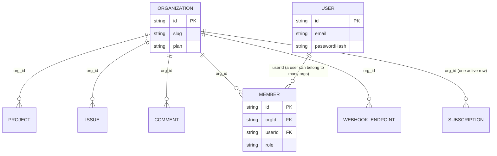

## Purpose

Taskflow is multi-tenant: every organization's data must be invisible to every other
organization's members, full stop, with no exception a bug can quietly create. This
document describes the mechanism — `org_id` as a literal column on every tenant
table, `assertOrgScope()` as the throwing guard, and actor resolution as the seam
between "there is an HTTP request with a cookie" and a value the rest of the system
can trust. `permission-model.md` is the companion document for the different
question of *what* an actor may do; this one is about *whose* data an actor can see
at all, which is checked first, per `permissions.ts`'s own decision order.

## Constraints

- Every tenant-scoped database table carries an `org_id` column (REQ-010), enforced
  at the schema level in `src/server/db/schema/_shared.ts`'s shared column fragment.
- Every repository function accepts `orgId` and filters by it before returning rows —
  this is `module-map.md` DES-013's rule, restated here specifically for its security
  consequence.
- Repositories never call `can()` and never receive an `Actor`. Tenancy and
  authorization are checked by different code, at different layers, so a bug in one
  never silently substitutes for the other.
- `assertOrgScope()` throws `TenantScopeError`, mapped to HTTP 403
  (`tenant_scope_violation`) by `toAppError()` — a cross-tenant attempt fails closed,
  never with a redirect or a silent empty result that could be mistaken for "you have
  no access" versus "this doesn't exist," per REQ-011.
- `src/server/repositories/user-repository.ts` is the one repository that is *not*
  org-scoped, documented explicitly in its own header comment — users exist across
  organizations, so there is no single `org_id` to filter by.

## DES-030 — `org_id` on every tenant table is the tenant boundary, full stop

- **Satisfies:** REQ-001, REQ-010
- **Decided in:** ADR-006
- **Code:** `src/server/db/schema/_shared.ts`, `src/server/db/schema/issues.ts`, `src/server/db/schema/projects.ts`

`_shared.ts` defines the reusable column set every tenant table composes, including
`org_id`, so a new table cannot be added without an engineer explicitly deciding
whether it is tenant-scoped or global (the latter being rare — only `users`,
`sessions` and password-reset tokens in `schema/users.ts` are global, mirroring
`user-repository.ts`'s special status). The design intentionally puts the tenant
boundary at the column level rather than, say, a separate database or schema per
organization (which ADR-006 considered and rejected for a SQLite-file-backed corpus
of this size) — the trade-off is that isolation is only as good as every query's
`WHERE org_id = ?` predicate, which is why `base-repository.ts`'s `orgPredicate()`
exists as the one place that predicate is constructed, rather than forty repository
functions each writing their own.



The diagram highlights the one relationship that is *not* tenant-scoped by design:
`USER` sits outside the `org_id` graph entirely, and `MEMBER` is the join row that
gives a user a role within one specific organization (REQ-213: a user may belong to
several organizations). Every other entity shown hangs directly off `ORGANIZATION`.

## DES-031 — `assertOrgScope()` and `TenantScopeError`

- **Satisfies:** REQ-011
- **Code:** `src/lib/tenant.ts`

`assertOrgScope(actor, orgId)` is a one-line equality check —
`actor.orgId !== orgId` throws `TenantScopeError(actor.orgId, orgId)` — but its
placement is what matters: every service function that receives an id from outside
the actor's own session (an `orgId` in a payload, a row's `orgId` after a repository
read) calls it before doing anything with that value. The docstring in `tenant.ts` is
explicit that a hand-written `if (row.orgId !== actor.orgId)` anywhere else in the
codebase is "a review failure" — the whole point of centralizing the check is that a
future refactor of `TenantScopeError`'s shape (adding a field, changing what gets
logged) only has to touch one file. `TenantScopeError` carries both
`expectedOrgId` and `actualOrgId`, which `toAppError()` surfaces in the response
`meta` so a client-side error boundary can log the mismatch for the SRE team
(`j.novak`'s team) without needing server log access.

## DES-032 — Actor resolution: `getActor`, `requireActorFor`, `tryGetActor`

- **Satisfies:** REQ-210, REQ-211, REQ-213
- **Code:** `src/lib/actor.ts`

`Actor` is the only thing `can()` and `assertOrgScope()` accept, and it is always
scoped to exactly one organization (REQ-210: "an actor is resolved per organization,
not globally") — a user who belongs to three organizations has three different
possible `Actor` values, never one that spans all three. Three functions produce one:
`getActor(orgSlug)` is the primary path, used by Server Actions dispatched from a
`[orgSlug]` route — it calls `getSessionPrincipal()` (throwing `UnauthorizedError` if
there is no session) then `resolveActorForOrg()` (throwing `NoMembershipError` if the
signed-in user has no membership in that org). `requireActorFor(orgId)` is the
`orgId`-keyed variant Route Handlers use when their payload carries the branded id
rather than a slug in the path — it translates `orgId` to a slug with one
`findOrgById()` lookup rather than widening `resolveActorForOrg()`'s signature, since
slug is the only handle the session layer knows, then calls `assertOrgScope()` as a
final check that the session's active org actually matches. `tryGetActor(orgSlug)` is
the non-throwing variant a layout uses to render a signed-out state instead of
crashing the render tree.

```mermaid
sequenceDiagram
    participant Layout as [orgSlug]/layout.tsx
    participant Actor as lib/actor.ts
    participant Session as lib/session.ts
    participant SessSvc as session-service.ts
    participant OrgRepo as organization-repository.ts

    Layout->>Actor: getActor(orgSlug)
    Actor->>Session: getSessionPrincipal()
    Session-->>Actor: SessionPrincipal | null
    alt no session
        Actor-->>Layout: throw UnauthorizedError
    else has session
        Actor->>SessSvc: resolveActorForOrg(principal, orgSlug)
        SessSvc->>OrgRepo: findOrgBySlug / membership lookup
        OrgRepo-->>SessSvc: Organization + Member
        alt no membership
            SessSvc-->>Actor: null
            Actor-->>Layout: throw NoMembershipError
        else member found
            SessSvc-->>Actor: Actor (role, orgId, userId, isPlatformStaff)
            Actor-->>Layout: Actor
        end
    end
```

The two throw branches map to different HTTP realities: `UnauthorizedError` (401) is
"you are not signed in at all," handled by `src/app/(dashboard)/layout.tsx` redirecting
to `/login` per REQ-211; `NoMembershipError` (403) is "you are signed in, but not a
member of *this* organization," which is a different failure the tenant-level
`error.tsx` boundary renders distinctly.

## DES-033 — The repository contract: filter by `orgId`, never call `can()`

- **Satisfies:** REQ-010, REQ-011
- **Decided in:** ADR-013
- **Code:** `src/server/repositories/base-repository.ts`

Restated from `module-map.md` with its security framing: a repository function is
*correct* if every row it could possibly return already belongs to the requested
`orgId`, and it is a bug — not a missing feature — if a repository function can be
called in a way that returns a row from another organization. This is why
`livePredicate()` and `orgPredicate()` are composed together in `base-repository.ts`
rather than left to each of the 21 repository files to reimplement: a single bug in
one shared predicate is far more visible in review and in tests than the same bug
duplicated with a typo in one of twenty call sites.

## DES-034 — Filtering helpers for the non-repository call sites

- **Satisfies:** REQ-011
- **Code:** `src/lib/tenant.ts`

Four smaller helpers round out `tenant.ts` for the cases `assertOrgScope()` alone
doesn't cover: `assertRowsInScope(actor, rows)` throws on the first row (if any) that
does not belong to the actor's org, used when a batch of rows was fetched by ids that
came from outside the current org context and need re-verification.
`isInOrgScope(actor, row)` is the non-throwing predicate for filtering rather than
failing a whole request over one bad row. `scopedOrNull(actor, row)` narrows a
nullable row to `null` if it belongs to a different org, useful in a Server Component
that would rather render "not found" than propagate an exception up through a whole
render tree. `withOrgScope(actor, filter)` spreads a caller-supplied filter object
and appends `orgId: actor.orgId`, specifically so a filter object built up across
several conditionals cannot forget to carry the org scope forward — the actor's
`orgId` is always applied last, overwriting anything a caller might have mistakenly
included in the spread.

## DES-035 — `user-repository.ts` is the one deliberately non-tenant-scoped repository

- **Satisfies:** REQ-213
- **Code:** `src/server/repositories/user-repository.ts`

Its own header comment says so explicitly: "the only repository that is NOT tenant
scoped — users exist across organizations." `findUserById`, `findUserByEmail`,
`insertUser`, `updateUser` and `findUsersByIds` take no `orgId` parameter at all.
This is safe only because nothing sensitive about a `User` row varies by
organization — email, name, password hash are the same regardless of which org is
asking — and every call site that reaches this repository has already established,
through some other path, that the caller has a legitimate reason to look up that
particular user id (a member row, a mention, an assignee). A future field added to
`User` that *should* vary per organization (a per-org display name override, say)
would need to move into the `members` table, not this repository, or it would leak
across the tenant boundary by construction.

## DES-036 — `proxy.ts`'s limited role: presence, not validity

- **Satisfies:** REQ-211, REQ-212
- **Decided in:** ADR-007
- **Code:** `src/proxy.ts`

`src/proxy.ts` checks only whether a session cookie is *present*, redirecting to
`/login` if not — it cannot check whether that cookie's value hashes to a live,
unexpired session, because a proxy running ahead of any request context has no
database access. The comment in the file is direct about this: "Real authorization
happens in the layouts and Server Actions via `can()`; a proxy cannot reach the
database." REQ-212 ("the request hook rejects requests for unknown organizations")
is *not* satisfied by the proxy at all — the proxy has no concept of an organization,
only of public versus non-public paths (`PUBLIC_PREFIXES`). That requirement is
actually satisfied one layer up, by `getActor()`/`requireActorFor()` throwing
`NoMembershipError` for an org slug or id the session has no membership in — the
proxy's job ends at "is there a session cookie," and everything past that is
`tenant-isolation`'s actor-resolution machinery, not the proxy.

## DES-037 — Failure modes: what happens when a scoping step is skipped

- **Satisfies:** REQ-011
- **Decided in:** ADR-006

Three concrete failure shapes, each with a different blast radius:

1. **A repository function is called with the wrong `orgId`.** This is the
   catastrophic case — the function will happily return another org's row, because
   the repository trusts its caller completely. The only defense is that every
   caller of a repository is a service that derived `orgId` from an already-verified
   `Actor` or from an id that passed `assertOrgScope()` first.
2. **A service skips `assertOrgScope()` on an id taken from user input** (a payload
   field, not the actor's own `orgId`). The row-level query might still filter by the
   *actor's* org correctly, so a cross-tenant read attempt returns an empty result or
   a `not_found` — safe, if quieter than REQ-011's "recorded" requirement would
   prefer, since no `TenantScopeError` was ever thrown to log.
3. **One of the five layering exceptions** (`module-map.md` DES-017) is copied as a
   template for a sixth read path without noticing the original four already
   inherited their org scope from a repository query that took `orgId` from the
   `tenant-context.ts` loader (`src/app/(dashboard)/[orgSlug]/_lib/tenant-context.ts`)
   — a naive copy that instead took an id from the page's own props without
   re-deriving it from the tenant context would reopen exactly the class of bug this
   whole design exists to prevent.

## Tenant isolation in the seed and test data

`src/server/db/seed.ts`'s deterministic development fixture seeds two organizations
on different plans specifically so tenant-isolation bugs are visible in local
development without needing to fabricate a second tenant by hand — a developer
testing an issue list who accidentally drops an `org_id` filter will see the other
seeded organization's issues bleed into the list immediately, rather than the bug
only surfacing once a second real customer signs up. The test corpus under
tests/ follows the same principle at a smaller scale: a repository test that
exercises `listIssues()` typically inserts rows into two different organizations in
its setup and asserts that a query scoped to one never returns a row from the other,
which is the most direct test of REQ-011 the corpus can express — cross-tenant access
attempts fail closed, verified by trying one and confirming it returns nothing.

## Why tenancy and permission are split across two files, not one

A reader encountering `assertOrgScope()` and `assertCan()` called back-to-back inside
nearly every service function (as `createIssue`'s trace in `data-flow.md` DES-020
shows) might reasonably ask why these are two functions rather than one combined
"is this actor allowed to touch this row" check. The answer is in what each one can
know independently: `assertOrgScope()` needs only two org ids and no notion of role,
resource kind, or ownership — it is a fact about *which organization a row belongs
to*, decidable before the row's business meaning is even loaded. `assertCan()` needs
the full `PermissionResource` shape, which in turn requires the row to already be
loaded and its owning fields (`authorId`, `assigneeId`, `leadId`, and so on) known.
Merging them into one function would force every call site to pay the cost of
constructing a full `PermissionResource` even for the tenant check alone, and would
make it impossible to answer "is this at least in the right tenant" — the check every
repository read already performs — without also deciding a role-based question that
belongs one layer up, in the service. Keeping them separate is what lets
`tenant-isolation.md` and `permission-model.md` exist as two independently reviewable
concerns with two independently testable code paths, per ADR-013's split of
"repositories own tenancy, services own authorization."

## Known rough edges

- Failure mode #2 above means a cross-tenant *read* attempt against a correctly
  org-filtered repository produces silence, not the "recorded" audit trail REQ-011
  asks for — only an explicit `assertOrgScope()` throw produces a `TenantScopeError`
  that reaches the error-translation layer and, from there, any logging a caller
  chooses to add. There is no repository-level alarm for "a query ran that, had it
  been mis-scoped, would have leaked a row" because the query was correctly scoped
  in the first place; the gap is upstream, in whether every id-bearing input gets
  explicitly checked before it reaches a repository.
- `scopedOrNull()` and `isInOrgScope()` make it easy to write code that silently
  drops a cross-tenant row rather than treating the attempt as noteworthy — which is
  the right UX (REQ-011 doesn't ask for a leaked error page) but means these two
  helpers are also the easiest way to accidentally suppress evidence of a genuine
  attack attempt if nothing upstream logs the mismatch before calling them.
- The five layering exceptions all derive their tenant scope from
  `tenant-context.ts`/`project-context.ts` loaders rather than from an `assertOrgScope()`
  call visible in the page file itself, which makes the scoping less obvious on a
  quick read than the service-layer pattern is.
