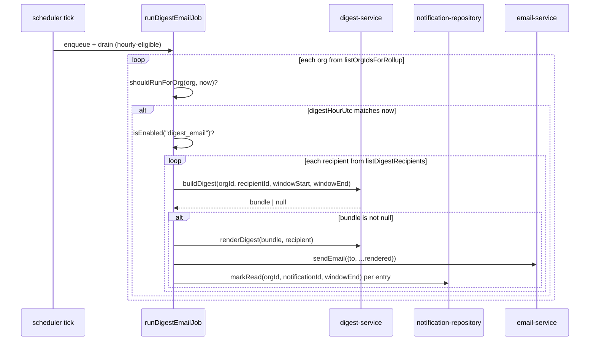

## When to use

Use this when a customer reports they did not receive a digest email, when digests are
arriving with the wrong content or more than once, or when the `digest-email` job's
processed count in its `JobResult` looks anomalous. This runbook is also the reference
whenever someone asks "when does the digest actually send" — the answer is org-specific
and not obvious from the UI.

## Preconditions

- The organization in question must be on a plan with the `digest_email` flag enabled
  (`growth` or above by default; see `src/config/feature-flags.ts`). If it is not, this
  is expected behavior, not a bug — see Diagnosis.
- You know the organization's `digestHourUtc` setting (stored on the `organizations`
  row, seeded per-org in `src/server/db/seed.ts` as `7 + orgIndex`).
- Access to logs scoped to `digest-email-job` (see `runbook-scheduler-and-queue.md` for
  how the scheduler drives this job).

## Normal operation

`runDigestEmailJob(now: Date)` in `src/server/jobs/digest-email-job.ts` is enqueued by
the scheduler once a minute (`webhook-delivery`'s cadence is 1; `digest-email`'s
`CADENCE_MINUTES` entry is 60, so in practice it is only *eligible* once an hour, but the
job body itself still runs a full per-org scan every time it executes). For every
organization returned by `usageRepo.listOrgIdsForRollup(ORG_BATCH)` (`ORG_BATCH = 50`),
the job:

1. Loads the `Organization` row and calls `shouldRunForOrg(org, now)`, which is `true`
   only when `org.archivedAt === null` and `now.getUTCHours() === org.settings.digestHourUtc`.
   This is why digests are effectively hourly-at-most per org: the job runs every tick,
   but the guard only lets one hour's worth of UTC through.
2. Confirms `isEnabled("digest_email", buildFlagContext(null, org))` — a plan-gated,
   overridable flag (`REQ-120`).
3. Computes a 24-hour window: `windowEnd = now`, `windowStart = now - MS_PER_DAY`.
4. For every recipient from `listDigestRecipients(orgId)`, calls
   `buildDigest(orgId, recipientId, windowStart, windowEnd)`.

`buildDigest` (`src/server/services/digest-service.ts`, `DES-128`) returns `null` when
there is nothing to send, and the job explicitly skips a `null` bundle — `REQ-122`, "an
empty digest is not sent," is enforced right here, not upstream. `DES-128` is explicit
that `null` carries two distinct meanings the digest job does not need to distinguish:
no unread notifications in the window, or the recipient's preferences resolve to no
email channel at all (`DES-124`).

If a bundle comes back, the job looks up the recipient's `User` row, renders the digest
with `renderDigest(bundle, recipient)`, and calls `sendEmail({ to: recipient.email,
...rendered })`. `sendEmail` in `src/server/services/email-service.ts` performs **no
network egress** — `DES-132` documents that delivery is a structured log write, which is
deliberate for a corpus that has to run fully offline. If you are debugging "why didn't
the customer get the email" in this codebase specifically, the answer is never an SMTP
provider outage; it is either the guard logic above, or a downstream mail relay that is
out of scope for this job (production deployments of Taskflow are expected to swap
`sendEmail`'s body for a real provider call without touching the job).

The most important correctness property of this job is what happens **after** a
successful send: for every entry in the bundle, the job calls
`notificationRepo.markRead(orgId, entry.notificationId, windowEnd)`. This is what
prevents the same digest window from being re-sent on a later run — the notifications
that were digested are marked read, so the next `buildDigest` call for that recipient
sees a smaller (or empty) unread set. If this write is skipped or fails silently, the
same notifications reappear in the next digest, which is exactly the failure mode in
`postmortem-2026-03-02-digest-storm.md`.



## Diagnosis

| symptom | check | command |
|---|---|---|
| No digest ever for an org | confirm `digest_email` flag resolves true for that org | inspect `getSnapshot` output or `isEnabled("digest_email", buildFlagContext(null, org))` in a one-off script |
| Digest arrives at the "wrong" time | check `organizations.digestHourUtc`, remember it is a UTC hour, not the org's local timezone display | query the row directly, or check `REQ-012` for how org timezone otherwise interacts with due-date windows (digest hour is stored as UTC regardless) |
| Same items appear in two consecutive digests | `markRead` calls failing after `sendEmail` succeeds | grep for `"digest failed"` around the relevant `recipientId`; the job's own try/catch wraps the whole per-recipient body including the `markRead` loop, so a failure there is logged and counted as `result.failed`, but the email has *already gone out* |
| Digest is empty when it should have content | `buildDigest`'s window bounds, or every notification already marked read by an earlier pass | check `DES-129` — the window is bounded on both ends; only notifications created inside `[windowStart, windowEnd]` are included, so anything older is never picked up by a digest, by design |
| An org on `free` or `starter` expects a digest | plan does not include `digest_email` | this is expected; `REQ-120` gates digest by plan |

## Procedures

### 1. Manually trigger a digest pass

See `runbook-scheduler-and-queue.md` procedure 2 for the general pattern; for this job
specifically:

```bash
pnpm exec tsx -e "
import('./src/server/jobs/digest-email-job.ts').then(async (m) => {
  const result = await m.runDigestEmailJob(new Date());
  console.log(JSON.stringify(result, null, 2));
});
"
```

Note that `now` matters here: `shouldRunForOrg` compares `now.getUTCHours()` against
`digestHourUtc`, so running this at an arbitrary time of day will silently skip every
org whose hour has not arrived. To force a specific org through regardless of hour, call
`buildDigest` and the render/send pair directly in a script rather than going through
`runDigestEmailJob`.

### 2. Confirm whether a specific recipient would get a digest right now

```bash
pnpm exec tsx -e "
import('./src/server/services/digest-service.ts').then(async (m) => {
  const bundle = await m.buildDigest('org_...', 'user_...', new Date(Date.now() - 86400000).toISOString(), new Date().toISOString());
  console.log(bundle);
});
"
```

A `null` result confirms `REQ-122` is doing its job — there is nothing to send, which is
correct behavior, not a bug to chase.

### 3. Re-check the org's digest hour and flag state without a database client

```bash
pnpm exec tsx -e "
import('./src/server/repositories/organization-repository.ts').then(async (m) => {
  const org = await m.findOrgById('org_...');
  console.log(org?.settings, org?.plan, org?.archivedAt);
});
"
```

### 4. Recovering from a stuck `markRead` failure

If logs show `"digest failed"` for a recipient whose email you can confirm was sent
(check `sendEmail`'s structured log line, scope `email-service` if instrumented, or the
job's own `"message"` fields), the notifications for that window are still unread and
will be re-included in the next run. This duplicates content but is safe — customers get
a repeat, not a loss. Do not attempt to hand-write a `markRead` call against arbitrary
notification ids from memory; re-run `buildDigest` for that recipient and window to get
the exact entry ids, then confirm in a script before writing anything.

### 5. Understand why timezone confusion is a recurring support ticket

`digestHourUtc` is stored and compared entirely in UTC (`now.getUTCHours()`), while
`REQ-012` documents that organization timezone otherwise drives due-date windows
elsewhere in the product. The digest job does **not** consult `organizations.timezone`
at all — a customer in `America/Sao_Paulo` who set their digest hour expecting "8am my
time" is actually setting 8am UTC, which is 5am or 6am local depending on daylight
saving. This is a real, standing product gap rather than a bug in this job specifically:
the fix, if one is ever prioritized, belongs in the settings UI that writes
`digestHourUtc` (converting the customer's stated local hour into UTC at write time), not
in `runDigestEmailJob` itself, which is correctly doing exactly what its stored input
tells it to do. When a ticket like this reaches on-call, the correct response is
"working as designed against a UTC-stored setting," with a pointer to file a product
issue against the settings form rather than a job bug.

### 6. Distinguish a plan downgrade from a flag override when digest silently stops

Two independent things gate `digest_email`: the plan ladder (`growth` and above) and any
org-level override recorded in `organizations.enabledFlagOverrides`
(`REQ-191`). A support engineer who only checks the plan can miss an override that
force-disabled the flag for one organization during an earlier incident and was never
reverted. Always check both:

```bash
pnpm exec tsx -e "
import('./src/server/services/feature-flag-service.ts').then(async (m) => {
  console.log(await m.getSnapshot(null, 'org_...'));
});
"
```

The returned snapshot reflects the same evaluation `runDigestEmailJob` performs
internally via `buildFlagContext` and `isEnabled`, so this is the fastest way to rule the
flag layer in or out without reading `feature-flags.ts`'s strategy logic line by line.

## Escalation

Route to `t.abara` for anything inside `digest-email-job.ts` or `digest-service.ts`
itself. Route to `k.ferreira` only if the underlying issue turns out to be
`notification-service.ts`'s fan-out not creating notifications in the first place — that
is a different failure mode (nothing to digest) than this job mis-sending. Page `j.novak`
if the scheduler itself is not ticking (see `runbook-scheduler-and-queue.md`).

## Related

- Code: `src/server/jobs/digest-email-job.ts`, `src/server/services/digest-service.ts`,
  `src/server/services/email-service.ts`,
  `src/server/repositories/notification-repository.ts`
- Ids: `DES-065`, `DES-128`, `DES-129`, `DES-130`, `DES-131`, `DES-132`, `REQ-119`,
  `REQ-120`, `REQ-121`, `REQ-122`, `REQ-123`, `ADR-016`
- See also: `postmortem-2026-03-02-digest-storm.md`,
  `notes-2026-03-04-digest-cadence-review.md`
