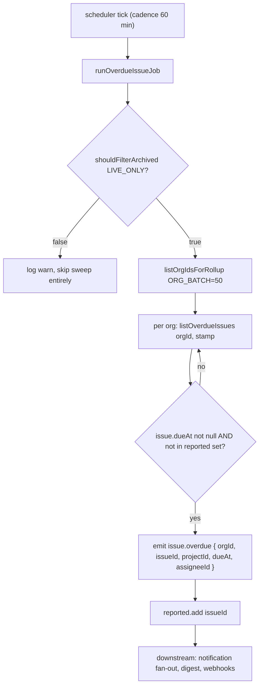

## When to use

Use this when customers report overdue-issue notifications are missing, arriving late,
duplicated, or arriving for issues that are not actually overdue. It is also the
reference for how the overdue sweep interacts with archiving and with the notification
and digest layers downstream of it.

## Preconditions

- Access to logs scoped to `overdue-issue-job`.
- Know whether the process you are investigating has been restarted recently — the
  job's "already announced" tracking is in-memory and does not survive a restart (see
  below), which is the single most important operational fact about this job.

## Normal operation

`runOverdueIssueJob(now: Date)` in `src/server/jobs/overdue-issue-job.ts` scans for
issues whose `dueAt` has passed and are still open, and emits one `issue.overdue` event
per issue found (`REQ-070`). The job deliberately owns no notification logic itself:
`DES-066` describes it as "announce, don't act" — whoever cares about an overdue issue
(in-app notifications via `notification-service.ts`'s fan-out, the digest, or a webhook
subscriber) reacts independently on the event bus (`DES-050`, `DES-051`). This job never
writes a `Notification` row directly.

Per scheduler tick eligibility (cadence 60 minutes, same table as `digest-email` — see
`runbook-scheduler-and-queue.md`), the job:

1. Confirms `shouldFilterArchived(LIVE_ONLY)` is true, where `LIVE_ONLY = {}` — this is a
   defensive assertion, not a real branch point in current code; it exists so a future
   change to `soft-delete.ts`'s default behavior cannot silently make archived issues
   "overdue" without this job noticing and refusing to run (`lib/soft-delete.ts`'s
   `shouldFilterArchived` is `true` whenever `scope.includeArchived !== true`, and
   `LIVE_ONLY` never sets that field).
2. Walks `usageRepo.listOrgIdsForRollup(ORG_BATCH)` (`ORG_BATCH = 50`, same page size the
   digest job uses).
3. For each org, calls `issueRepo.listOverdueIssues(orgId, stamp)` and, for every
   returned issue with a non-null `dueAt`, checks an in-process `Set<string>` named
   `reported` before emitting.

This `reported` set is the load-bearing piece of state in this job, and it is **entirely
in memory** — a module-level `Set` inside `overdue-issue-job.ts`, not a database column.
Its purpose is to stop the job from re-emitting `issue.overdue` for the same issue on
every hourly pass for as long as the issue remains open and past due; without it, an
issue that stays overdue for a week would generate seven identical events and,
downstream, seven identical notifications. The set is cleared only by
`resetOverdueTracking()`, which is exported explicitly as a test-only hook — calling it
against a live process would cause every currently-open overdue issue to be
re-announced on the very next sweep. **A process restart has the same effect**: the set
starts empty, so the first sweep after any deploy or crash re-announces every issue that
is still overdue at that moment. This is expected, not a bug, but it means "why did
everyone get a duplicate overdue notification this morning" often traces back to an
overnight deploy rather than a job defect.



The emitted event payload is `{ orgId, actorId: null, occurredAt: stamp, issueId,
projectId, dueAt, assigneeId }` — `actorId` is explicitly `null` because no human
triggered this, which is a pattern shared with other scheduled-job events like
`billing.plan_changed` from the trial-expiry job.

## Diagnosis

| symptom | check | command |
|---|---|---|
| No overdue notification for a clearly-overdue issue | confirm `dueAt` is actually set and in the past, and the issue is not archived | `findIssueById` in a script; archived issues are filtered by `listOverdueIssues`'s scope |
| Same overdue notification arrives repeatedly across restarts | expected per Normal operation — the `reported` set does not persist | confirm via deploy timeline whether the process restarted between sweeps |
| Sweep appears to skip entirely | `shouldFilterArchived(LIVE_ONLY)` returning false would log a warning and return early, though this should not happen with the current `lib/soft-delete.ts` implementation | `grep 'archive scope misconfigured'` in logs |
| Overdue count seems too low across all orgs | `ORG_BATCH = 50` caps orgs scanned per pass; a fleet larger than 50 orgs needs multiple ticks to cover everyone, since `listOrgIdsForRollup` orders by measurement recency | check `usageRepo.listOrgIdsForRollup` ordering and whether every org gets a turn within an hour |

## Procedures

### 1. Manually run one sweep

```bash
pnpm exec tsx -e "
import('./src/server/jobs/overdue-issue-job.ts').then(async (m) => {
  const result = await m.runOverdueIssueJob(new Date());
  console.log(JSON.stringify(result, null, 2));
});
"
```

### 2. Check whether a specific issue would be flagged overdue right now

```bash
pnpm exec tsx -e "
import('./src/server/repositories/issue-repository.ts').then(async (m) => {
  const overdue = await m.listOverdueIssues('org_...', new Date().toISOString());
  console.log(overdue.map(i => ({ id: i.id, dueAt: i.dueAt, status: i.status })));
});
"
```

### 3. Confirm the in-memory tracking set is the reason a duplicate happened

There is no exported way to inspect the `reported` set's contents from outside the
module (by design — it is private state, not an API). The reliable diagnostic is
correlating notification timestamps against the process's boot time, not inspecting the
set directly. If duplicates line up with a restart, close the investigation there rather
than searching for a code defect.

### 4. Cross-check against the digest and webhook layers

Because `DES-066` deliberately keeps this job's responsibility to "announce, don't act,"
an apparent overdue-notification bug frequently turns out to live one layer downstream.
If `issue.overdue` events are confirmed present in the logs (search for
`"message":"issue.overdue"`-shaped payloads, or instrument `subscribe("issue.overdue",
...)` temporarily in a script) but the customer still sees nothing, walk the fan-out in
this order before reopening this runbook:

1. Confirm `notification-service.ts`'s handler for `issue.overdue` actually ran —
   `DES-126` notes that watcher derivation for comment notifications re-reads the issue
   rather than trusting the event payload, and the overdue handler follows the same
   pattern; a stale read at that point (for example an assignee that changed between the
   sweep and the handler running) can silently produce zero recipients.
2. Confirm the recipient's notification preference for the `issue.overdue` event class
   has at least one channel enabled (`REQ-115`); a channel-off preference is
   indistinguishable from "notification-service never ran" unless you check the
   preference row directly.
3. Only after both of those check out does the trail lead to `runbook-digest-job.md`
   (if the customer expected the digest, not an in-app alert) or
   `runbook-webhook-retries.md` (if a webhook subscriber, not a human, is downstream).

### 5. Sizing `ORG_BATCH` for a growing fleet

`ORG_BATCH = 50` was set when the corpus's seeded fixture (`runbook-seeding-and-local-setup.md`)
had two organizations, and has not been revisited against a realistic multi-hundred-org
fleet. `usageRepo.listOrgIdsForRollup` orders by measurement recency, which means an org
that was recently rolled up sinks toward the back of the queue on the next call — over
many ticks this evens out, but during the first hour after a large batch import of new
organizations, some of them may not get an overdue sweep at all if the fleet exceeds
`ORG_BATCH` and the scheduler's hourly cadence does not give every org a turn before the
next hour's cadence window opens. This is a known scaling gap, not an active incident;
raising `ORG_BATCH` or moving to a per-org cadence key (mirroring what `webhook-delivery`
effectively achieves by running every minute) is a fair proposal for a design review
rather than something to patch under on-call pressure.

### 6. Why archiving an issue silently ends its overdue lifecycle

`REQ-071` establishes that issues are archived, not deleted, by default, and `DES-045`'s
`PermissionResource` model treats `issue:archive` as its own gated action. Once an issue
is archived, `listOverdueIssues` stops returning it on every subsequent sweep — the
repository's soft-delete scoping filters archived rows out of the live-only query the
overdue sweep runs — even if its `dueAt` is still in the past and its status was never
moved to `done`. This is deliberate: an archived issue is, by definition, no longer
something anyone is expected to act on, so continuing to chase it as "overdue" would be
noise. If a customer archives an issue specifically to silence overdue notifications
rather than to signal the work is finished, that is a workflow choice the product allows
but does not track separately — there is no "snoozed" state distinct from "archived" in
the current issue status union (`REQ-062`).

## Escalation

Route to `t.abara`. If the underlying complaint is actually about notification
preferences suppressing or over-delivering the resulting alert rather than the sweep
itself over- or under-emitting `issue.overdue`, that is a `notification-service.ts`
question — still routes to `t.abara`, but check `DES-121` through `DES-127` first before
assuming this job is at fault.

This distinction — archiving as a legitimate way to end an issue's overdue lifecycle
versus a genuine bug that suppresses a notification a customer should still receive —
comes up often enough in support tickets that it is worth restating plainly one more
time: if an issue is archived, the overdue sweep working exactly as designed is
indistinguishable, from the outside, from a bug that silently stopped tracking it. Always
check `archivedAt` before concluding the job itself is broken.

## Related

- Code: `src/server/jobs/overdue-issue-job.ts`, `src/lib/event-bus.ts`,
  `src/lib/soft-delete.ts`, `src/server/repositories/issue-repository.ts`
- Ids: `DES-050`, `DES-051`, `DES-052`, `DES-066`, `REQ-069`, `REQ-070`, `REQ-113`
- See also: `runbook-scheduler-and-queue.md`, `runbook-digest-job.md`
