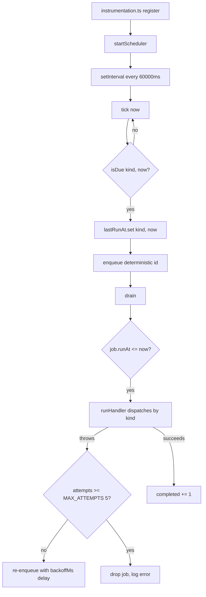

## When to use

Use this runbook whenever background work in Taskflow appears to be stalled, delayed, or
looping: a job kind that should run every hour has not run in three, the pending queue
depth is climbing instead of draining, or `pnpm start` logs show `scheduler tick failed`
repeatedly. It also covers the day-to-day question "how do I make a job run right now
without waiting for its cadence," which comes up constantly during incident response and
QA.

Taskflow has exactly one scheduler and one queue, both in-process (`ADR-016`,
`DES-060`, `DES-062`). There is no separate worker fleet, no Redis, no cron daemon.
Everything described here runs inside the same Next.js server process that serves HTTP
requests, which is convenient for a single-region deployment and is also exactly why a
stuck scheduler degrades the whole product rather than one subsystem.

## Preconditions

- You can reach a shell on the host running `pnpm start` (or `pnpm dev` in a local
  environment), or you have access to its structured logs.
- You know the organization or job kind you are investigating. Most on-call pages name
  a job kind (`digest-email`, `webhook-delivery`, etc.) — see `src/server/jobs/queue.ts`
  for the full `JobKind` union.
- For any procedure that touches the database directly, you have applied migrations
  with `pnpm db:migrate` against the same database file the server process uses.

## Normal operation

`src/instrumentation.ts` registers the event handlers and starts the scheduler
exactly once, the moment the Next.js server process boots, via the `register()` hook —
this is the only place `startScheduler()` is called in application code (`DES-006`). If
you restart the process, the scheduler restarts cold: `lastRunAt` is an in-memory
`Map<JobKind, number>` inside `src/server/jobs/scheduler.ts`, so every job kind is
considered "never run" and becomes eligible on the very first tick after boot.

The scheduler runs `tick()` every `TICK_INTERVAL_MS` = 60000 ms (one minute). Each tick:

1. Walks the seven `JobKind` values and calls `isDue(kind, now)` for each. A kind is due
   if it has never run, or if `now - lastRunAt[kind] >= CADENCE_MINUTES[kind] * 60_000`.
2. For every due kind, records `lastRunAt` immediately (before the job body runs — this
   matters for the "the job took two minutes and every tick re-enqueued it" failure mode
   described below) and calls `enqueue()` with a deterministic id
   (`` `${kind}:${Math.floor(now.getTime() / 60_000)}` ``).
3. Calls `drain()` once to actually run whatever is now pending.

The cadence table, straight from `scheduler.ts`:

| job kind | `CADENCE_MINUTES` | plain English |
|---|---|---|
| `digest-email` | 60 | checked every tick; only fires for orgs whose configured UTC hour has arrived |
| `overdue-issues` | 60 | hourly sweep |
| `webhook-delivery` | 1 | effectively every tick — see `runbook-webhook-retries.md` |
| `usage-rollup` | 15 | quarter-hourly quota recount |
| `search-reindex` | 1440 | once a day; this cadence entry almost never fires in practice, see below |
| `cleanup-archived` | 1440 | once a day |
| `trial-expiry` | 360 | every six hours |

`ADR-016` narrowed the cadence policy that `ADR-005` originally sketched (that ADR
assumed most jobs would run "hourly by default" without a per-kind table); the notes
from 2026-03-04 (`notes-2026-03-04-digest-cadence-review.md`) record why we moved to
explicit per-kind minutes instead.

One wrinkle worth internalizing: the scheduled `search-reindex` entry in
`CADENCE_MINUTES` is scaffolding. `runSearchReindexJob` takes a single `orgId` argument,
not "all organizations" — `queue.ts`'s `runHandler` reads `job.payload.orgId` and
silently returns if it is not a string. The scheduler's own `tick()` enqueues
`search-reindex` with an **empty** payload (`payload: {}`), so the scheduled entry is a
no-op by construction today. The only way `search-reindex` actually runs is a manual
enqueue with an explicit `orgId`, described under Procedures. This is a known gap, not a
bug you need to fix mid-incident — do not spend an on-call rotation chasing why the
scheduled reindex "never processes anything."



`queue.ts` is the other half. It holds a single module-scope array, `pending:
QueuedJob[]`, and four functions: `enqueue`, `drain`, `pendingCount`, `resetQueue`.
`enqueue` is idempotent on `id` — calling it twice with the same id is a silent no-op,
which is what makes the scheduler's `${kind}:${minute-bucket}` id scheme safe to call
every tick without double-enqueuing. `drain(limit = 25)` takes everything whose `runAt`
has passed, oldest first, and runs it through `runHandler`, which dynamically imports
the matching job module and calls its `run*Job` function. A job kind that throws is
re-enqueued with `runAt` pushed out by `backoffMs(attempts)` (1s, 2s, 4s, 8s, capped at
60000 ms) until `attempts` reaches `MAX_ATTEMPTS = 5`, at which point it is dropped with
an `error`-level log line and never retried again. `resetQueue()` exists only for tests
— never call it from application code or a script that touches a running process; it
empties `pending` unconditionally and any job that was queued and not yet drained is
gone.

## Diagnosis

| symptom | check | command |
|---|---|---|
| A job kind hasn't run in longer than its cadence | grep logs for the job's `createLogger` scope name (e.g. `digest-email-job`) | `grep '"scope":"digest-email-job"' <logfile> \| tail -20` |
| `scheduler tick failed` appearing repeatedly | scheduler's own `catch` in `startScheduler` logs `reason` | `grep 'scheduler tick failed' <logfile>` |
| Pending queue depth is growing | `pendingCount()` is not exposed over HTTP; instrument a one-off script | `pnpm exec tsx -e "import('./src/server/jobs/queue.ts').then(async q => console.log(q.pendingCount()))"` (adjust the import path to match the built output) |
| A job kind never ran since the process started | `lastRunAt` is in-memory, so a fresh `pnpm start` always treats every kind as due on the first eligible tick — confirm the process actually stayed up | `ps -ef \| grep next-server` or check the process supervisor's restart count |
| `search-reindex` never processes anything | expected — see Normal operation; the scheduled entry has no `orgId` payload | n/a, this is by design, not a fault |
| A job runs but keeps failing the same items forever | check `MAX_ATTEMPTS` and whether the job is dropped silently after five attempts | `grep 'job dropped after max attempts' <logfile>` |

## Procedures

### 1. Confirm the scheduler is actually running

```bash
grep '"message":"scheduler started"' <logfile>
```

If this line is missing since the last deploy, the process either failed
`instrumentation.ts`'s `register()` hook, or `NEXT_RUNTIME` was not `"nodejs"` (the edge
runtime short-circuits `register()` — see `DES-006`). Restart the process and confirm
the log line reappears.

### 2. Manually run one pass of a specific job kind

For jobs that take only a clock (`digest-email`, `overdue-issues`, `webhook-delivery`,
`usage-rollup`, `cleanup-archived`, `trial-expiry`), you can invoke the job function
directly from a one-off script rather than waiting for the scheduler:

```bash
pnpm exec tsx -e "
import('./src/server/jobs/webhook-delivery-job.ts').then(async (m) => {
  const result = await m.runWebhookDeliveryJob(new Date());
  console.log(JSON.stringify(result, null, 2));
});
"
```

This runs the job body exactly as the queue would, and prints the `JobResult` envelope
(`kind`, `processed`, `failed`, `durationMs`, `startedAt`) so you can confirm it made
progress without waiting for the next tick.

### 3. Force a `search-reindex` for one organization

Because the scheduled cadence entry never supplies an `orgId`, this is the only job kind
that requires a manual trigger in normal operation, not just during an incident:

```bash
pnpm exec tsx -e "
import('./src/server/jobs/search-reindex-job.ts').then(async (m) => {
  const result = await m.runSearchReindexJob('org_...');
  console.log(JSON.stringify(result, null, 2));
});
"
```

Run this after a bulk import, or whenever `runbook-overdue-sweep.md`'s or support's
diagnosis points at a stale search index for one tenant.

### 4. Drain a backlog by hand after a long outage

If the process was down for hours and you want deliveries to catch up faster than
`drain(25)` per minute allows, call `drain()` with an explicit higher limit in a
one-off script:

```bash
pnpm exec tsx -e "
import('./src/server/jobs/queue.ts').then(async (m) => {
  let total = 0, round;
  do { round = await m.drain(200); total += round; } while (round > 0);
  console.log('drained', total);
});
"
```

This is safe because `drain` only pulls jobs whose `runAt` has already passed and
processes them synchronously in-process — there is no separate consumer to race with as
long as only one server process is running against this database.

### 5. Never call `resetQueue()` against a live process

`resetQueue()` truncates `pending` unconditionally. It exists for test isolation. If you
see it referenced anywhere outside its own test suite, that is itself worth a code review comment
— running it against a process serving real traffic silently discards every job that has
been enqueued but not yet drained, with no log line and no way to recover the list.

## Escalation

- If the scheduler has stopped starting at all (no `"scheduler started"` log line after
  a clean restart), page `j.novak` — this is most often an `instrumentation.ts` import
  failure that also breaks event handler registration, and `DES-006` treats it as a
  boot-blocking condition, not something to work around at the job layer.
- If a specific job kind is consistently failing (not just backlogged), route to the
  owning engineer: `t.abara` for `digest-email`/`overdue-issues`, `k.ferreira` for
  `webhook-delivery`/`search-reindex`, `r.saito` for `usage-rollup`/`trial-expiry`,
  `d.okafor` for `cleanup-archived` or anything that looks like a cross-cutting
  `lib/` regression.
- Do not manually edit `lastRunAt` or the `pending` array in a running process — there is
  no supported interface for that. If a job kind needs to be paused (for example while a
  downstream dependency is degraded), the supported lever is a feature flag check inside
  the job itself, or stopping the process; there is no per-kind pause switch today.

## Related

- Code: `src/server/jobs/scheduler.ts`, `src/server/jobs/queue.ts`,
  `src/server/jobs/types.ts`, `src/instrumentation.ts`
- Ids: `DES-060`, `DES-062`, `DES-063`, `DES-069`, `ADR-016`, `REQ-070`, `REQ-144`
- See also: `runbook-digest-job.md`, `runbook-webhook-retries.md`,
  `runbook-overdue-sweep.md`
