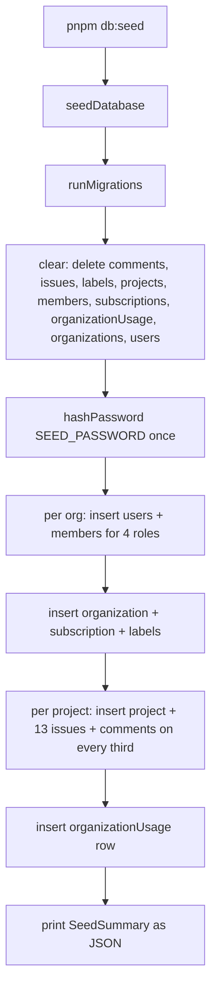

## When to use

Use this whenever you or a teammate cannot sign in to a fresh local environment, need a
reproducible fixture for manual QA or a screenshot, or are debugging a "works on my
machine" report that turns out to trace back to stale or half-migrated local state. This
is also the first place to look before filing a bug against auth if the report comes
from someone who just ran `pnpm db:seed` for the first time.

## Preconditions

- `pnpm install` has completed against the lockfile's pinned `pnpm@10.28.2`.
- You are not pointing at a shared or production database. `seedDatabase()` deletes
  every row it owns before reinserting (see Normal operation) — running it against
  anything other than a disposable local SQLite file is destructive.

## Normal operation

Taskflow's local database is a single SQLite file managed by Drizzle (`ADR-002`).
`pnpm db:migrate` runs `src/server/db/migrate.ts`; `pnpm db:seed` runs
`src/server/db/seed.ts` directly (its final lines guard `if
(process.argv[1]?.endsWith("seed.ts") === true)` so the module stays inert when
imported rather than executed — a test can import `seedDatabase` without triggering the
CLI side effect).

`seedDatabase()` is deterministic by construction: `idFactory(20_260_105)` seeds an id
generator with a fixed value, and every timestamp is derived from a fixed `EPOCH =
Date.UTC(2026, 0, 5, 9, 0, 0)` via the local `stamp(dayOffset)` helper, so two runs
against two different machines produce byte-identical rows except for one field
described below. The fixture builds two organizations:

| org | slug | plan | projects |
|---|---|---|---|
| Northwind Labs | `northwind` | `growth` | Platform (`PLAT`), Mobile App (`MOB`) |
| Acme Robotics | `acme` | `free` | Firmware (`FIRM`) |

Each organization gets one member per role — owner, admin, member, viewer — logging in
as `<role>@<slug>.test`, for example `owner@northwind.test` or `viewer@acme.test`. Every
project gets `ISSUES_PER_PROJECT = 13` issues cycling through all five statuses and five
priorities; every fourth issue is archived and every fifth is overdue, specifically so
that soft-delete filtering (`REQ-071`) and the overdue sweep
(`runbook-overdue-sweep.md`) both have real data to exercise locally without further
setup.

**The one non-reproducible field is the password.** `SEED_PASSWORD = "taskflow-dev"` is
the plaintext every seeded account shares, but the stored `passwordHash` column must
hold a value `verifyPassword` (`src/lib/hash.ts`) will accept — the `scrypt:<salt>:<key>`
shape produced by `hashPassword()`. The salt inside that hash is random per run, which is
the only field in the whole fixture that differs machine to machine — and that
randomness is deliberate: a fixed salt baked into a seed script is exactly the kind of
constant that gets copied wholesale into a real deployment by someone in a hurry.



## Known incident: broken seed password (2026, resolved)

During integration, an earlier version of `seed.ts` wrote a literal placeholder string
into the `passwordHash` column instead of calling `hashPassword(SEED_PASSWORD)`. Every
seeded account inserted rows that looked correct in every other column — email, role,
org membership — but `verifyPassword` rejects any hash that does not match the
`scrypt:<salt>:<key>` shape, so **no seeded user could log in, on any organization, with
any role.** The fixture looked complete in a database browser and failed silently at the
one place that mattered: the login form returned a generic invalid-credentials error
(`REQ-200`), which is indistinguishable at the UI layer from a genuinely wrong password,
so the first reports read as "auth is broken" rather than "the seed script is broken."

The fix, now in place in the file read above, calls `hashPassword(SEED_PASSWORD)` exactly
once per seed run and shares the resulting hash across every account the fixture
creates — see the comment directly above that call in `seed.ts`, which explains both why
sharing one hash across eight accounts is fine (it is a fixed dev password, not a
secret) and why the salt inside it is deliberately not pinned. If you ever see a future
diff touch this block and replace the `hashPassword` call with a literal string "to make
tests faster," reject it — that is the exact regression that caused this incident, and
the login rejection it produces gives no hint that the seed data, rather than the auth
code path, is the actual problem.

The practical lesson for anyone debugging local login failures: **first confirm you can
reproduce with a freshly reseeded database**, not an old one. If a fresh `pnpm db:migrate
&& pnpm db:seed` still cannot log in with `owner@northwind.test` /
`taskflow-dev`, that is a real regression worth escalating immediately, not a
local-environment quirk.

## Diagnosis

| symptom | check | command |
|---|---|---|
| Cannot log in with any seeded account | confirm the seed actually ran against the database the server is reading | `pnpm db:seed` output prints a `SeedSummary` JSON; compare its counts against what you expect |
| Login fails only for one specific account | that account may have been mutated by prior manual testing (role change, password reset) rather than the seed being at fault | re-run `pnpm db:seed` to reset it, understanding this deletes all local data |
| `pnpm db:seed` errors instead of completing | migrations are out of date | run `pnpm db:migrate` first — `seedDatabase()` calls `runMigrations` internally but a version mismatch in the schema file itself needs a fresh migration generation, not just an apply |
| Overdue/archived test data missing after seeding | confirm you are looking at issues numbered as multiples of 4 (archived) or 5 (overdue) within `ISSUES_PER_PROJECT = 13` per project | inspect `issues.number` alongside `archivedAt`/`dueAt` |

## Procedures

### 1. Fresh local environment from scratch

```bash
pnpm install
pnpm db:migrate
pnpm db:seed
```

Then sign in as `owner@northwind.test` (or `admin@northwind.test`,
`member@northwind.test`, `viewer@northwind.test`, and the same four on `acme.test`) with
password `taskflow-dev`.

### 2. Reset local state without touching migrations

```bash
pnpm db:seed
```

`seedDatabase()`'s `clear()` step empties every table it owns before reinserting, so this
is safe to run repeatedly and is the standard way to discard local scratch data between
manual test sessions.

### 3. Verify the corpus still builds and typechecks after touching seed-adjacent code

```bash
pnpm typecheck
pnpm lint
pnpm test
```

Run all three before proposing any change to `src/server/db/seed.ts`,
`src/server/db/migrate.ts`, or `src/lib/hash.ts` — the seed script is exercised by
`pnpm test` indirectly through any test that calls `seedDatabase()` as a fixture, and a
typecheck failure here tends to be the first signal of a schema drift between the Drizzle
table definitions and the values this file inserts.

### 4. Confirm a specific seeded account's hash is well-formed

```bash
pnpm exec tsx -e "
import('./src/server/repositories/user-repository.ts').then(async (m) => {
  const u = await m.findUserByEmail('owner@northwind.test');
  console.log(u?.passwordHash?.split(':')[0]); // expect 'scrypt'
});
"
```

### 5. Seeding a scenario the fixture does not cover

The fixture is intentionally narrow — two orgs, four roles, one issue mix — because it
has to stay deterministic and fast enough to run before every local test suite
invocation. If you need a scenario the fixture does not produce (a third organization, a
pending invitation, a webhook endpoint with a delivery backlog), do not modify
`seed.ts`'s `ORG_SPECS` casually: any change to the seeded shape ripples into every test
that asserts against specific counts or ids derived from it (`SeedSummary`'s
`organizations`/`users`/`projects`/`issues`/`comments` totals are asserted in several
places under the test suite). Prefer writing additional rows in a follow-up script that runs
after `seedDatabase()` rather than editing the shared fixture, unless the change is one
the whole team benefits from — in which case it goes through ordinary code review, and
whoever approves it should re-run `pnpm test` to catch any test that baked in the old
counts.

### 6. What `pnpm build` and `pnpm start` add on top of this

`pnpm db:seed` only prepares data; it does not start the server. For a full local
walkthrough that matches what a reviewer would see on a preview deploy:

```bash
pnpm db:migrate
pnpm db:seed
pnpm build
pnpm start
```

`pnpm build` runs `next build`, and `pnpm typecheck` (`next typegen && tsc --noEmit`) is
worth running immediately beforehand if you have touched any Server Component or Server
Action — Next.js 16's generated route types (`DES-005`) will surface a mismatched
`params`/`searchParams` Promise shape at typecheck time that `next build` alone might
still compile past in some configurations. Do not skip `pnpm typecheck` before treating a
build as green.

## Escalation

Route to `d.okafor` for anything under src/server/db/. If the failure is actually in
`src/lib/hash.ts`'s `hashPassword`/`verifyPassword` pair rather than the seed script
itself, that is still platform-team territory but worth flagging as higher severity —
that module is shared by real registration (`REQ-200`, `REQ-201`, `DES-166`), not just
the fixture.

## Related

- Code: `src/server/db/seed.ts`, `src/server/db/migrate.ts`, `src/lib/hash.ts`,
  `src/server/repositories/user-repository.ts`
- Ids: `REQ-200`, `REQ-201`, `REQ-209`, `DES-166`, `DES-199`, `ADR-002`, `ADR-020`
- See also: `index.md` on-call overview, `notes-2025-11-10-permission-matrix-review.md`
  (uses the same seeded roster for its access-control walkthrough)
