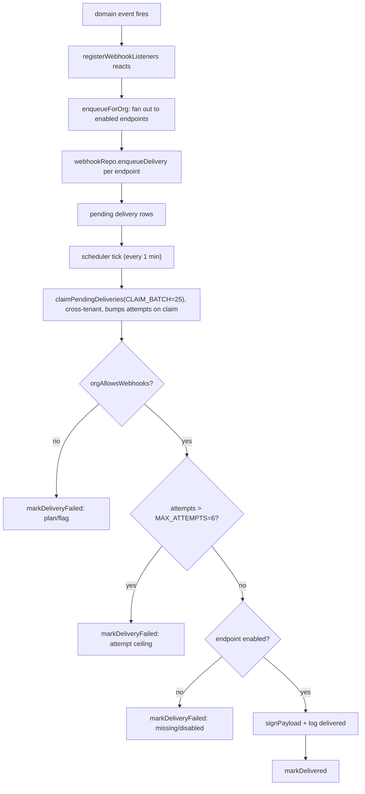

## When to use

Use this when webhook deliveries are backing up, an endpoint owner reports missing or
duplicate deliveries, or the queue depth for `webhook-delivery` keeps climbing even
though the job runs every tick. This is also the reference for "how many attempts before
we give up" and "what exactly do we sign," which webhook-consuming customers ask about
regularly.

## Preconditions

- The target organization's plan includes webhooks (`getPlanLimits(plan).webhooks > 0`;
  `free` and `starter` are 0). If it does not, missing deliveries are expected — see
  `REQ-152`.
- The `webhooks` feature flag resolves true for the org (`ADR-018`, `REQ-152`; it is
  plan-gated at `growth` and above and is **not** overridable, unlike most other flags —
  see `src/config/feature-flags.ts`).
- You know either the organization id or the webhook endpoint id you are investigating.

## Normal operation

Webhook delivery in Taskflow is queue-based end to end, never inline with the request
that caused it (`REQ-154`, `ADR-018`). `ADR-018` explicitly supersedes an idea floated in
`ADR-005` — sending the HTTP call synchronously from inside the event handler that
reacted to the domain event — because a slow or hanging receiver endpoint would then
stall whatever request path emitted the event. Instead:

1. A domain event fires (for example `issue.status_changed`).
2. `registerWebhookListeners()` in `src/server/services/webhook-service.ts` reacts and
   calls `enqueueForOrg`, which fans the event out to every **enabled** endpoint
   subscribed to that event type for the org, writing one row per endpoint via
   `webhookRepo.enqueueDelivery` (`DES-162`). Disabled endpoints are filtered before any
   row is written, not after.
3. The scheduler's `webhook-delivery` cadence is 1 minute — the tightest cadence of any
   job kind — so `runWebhookDeliveryJob` effectively runs on every scheduler tick.
4. Each pass calls `webhookRepo.claimPendingDeliveries(CLAIM_BATCH)` with
   `CLAIM_BATCH = 25` (`src/server/jobs/webhook-delivery-job.ts`). Claiming is
   cross-tenant by necessity (`DES-215`) — one claim query pulls the oldest 25 pending
   deliveries across every organization, not per-org, and bumps the attempt counter at
   **claim** time, not at completion. This means a delivery that is claimed and then the
   process crashes before finishing still shows an incremented `attempts` — that is
   intentional conservatism, not a bug: it biases toward giving up sooner rather than
   redelivering forever.

For each claimed delivery, the job runs three independent guards before attempting
anything, in this order:

1. `orgAllowsWebhooks(orgId)` — re-checks both `getPlanLimits(org.plan).webhooks > 0`
   **and** `isEnabled("webhooks", ...)` at delivery time, not just at enqueue time. A
   downgrade between enqueue and delivery fails the delivery with an explicit reason
   rather than silently attempting it.
2. `delivery.attempts > MAX_ATTEMPTS` (`MAX_ATTEMPTS = 6` in this file — note this is a
   **different constant** from the queue-level `MAX_ATTEMPTS = 5` in `queue.ts`; the
   queue's constant governs retrying the `webhook-delivery` job kind itself if its whole
   batch throws, while this one governs an individual delivery row inside a successful
   job run. Do not conflate the two when reading logs.) — deliveries past the ceiling are
   marked failed for good (`REQ-157`).
3. The endpoint must exist and be `enabled` — an endpoint deleted or disabled after the
   delivery was enqueued fails fast (`REQ-158`) rather than attempting.

A delivery that clears all three guards is "delivered" by computing
`signPayload(endpoint.secret, delivery.payload)` (`src/server/services/webhook-service.ts`)
and logging the attempt — there is no outbound HTTP call in this corpus, matching the
digest job's `sendEmail` (see `runbook-digest-job.md`). `signPayload` is a pure HMAC
wrapper (`DES-160`): the exact byte sequence signed is the serialized JSON string stored
on the delivery row, not the object re-serialized at send time, which is what makes the
signature reproducible for retries.



Backoff for a delivery that fails and is retried (as opposed to abandoned outright) is
computed by the exported `backoffMs(attempts)` in this same file: `1s, 2s, 4s, ...`
doubling, capped at `300_000` ms (five minutes), with `attempts <= 0` returning `0` so
the first retry is immediate. This is distinct from the queue-level backoff in
`queue.ts` (capped at 60 seconds) — again, two different backoff curves for two
different layers.

## Diagnosis

| symptom | check | command |
|---|---|---|
| Deliveries piling up for one org | is the org over its `webhooks` plan limit or has the flag been toggled off mid-flight | `orgAllowsWebhooks(orgId)` in a one-off script; also check `REQ-136` |
| Deliveries never leave "pending" | confirm the scheduler is actually ticking at all | `runbook-scheduler-and-queue.md` |
| One endpoint gets nothing while others work | endpoint may be disabled; `enqueueForOrg` filters disabled endpoints before writing rows, so nothing is even queued for it, and `claimPendingDeliveries` would show no rows for that endpoint | `listEndpoints(orgId)` and check `enabled` |
| Deliveries failing immediately with "endpoint is missing or disabled" | endpoint deleted or disabled after enqueue but before claim | check `deleteEndpoint`/`updateEndpoint` audit trail for the endpoint id |
| Backlog depth exceeds `CLAIM_BATCH` consistently | fan-out rate across all orgs exceeds 25/minute drain rate | see Procedures §3 for a temporary manual drain |
| Signature mismatch reported by a receiver | confirm the receiver is verifying against the stored `payload` string exactly, not a re-serialized object | `DES-160`; ask the integrator to log the raw signed bytes they receive |

## Procedures

### 1. Manually run one webhook-delivery pass

```bash
pnpm exec tsx -e "
import('./src/server/jobs/webhook-delivery-job.ts').then(async (m) => {
  const result = await m.runWebhookDeliveryJob(new Date());
  console.log(JSON.stringify(result, null, 2));
});
"
```

### 2. Inspect an organization's endpoints and their enabled state

```bash
pnpm exec tsx -e "
import('./src/server/repositories/webhook-repository.ts').then(async (m) => {
  console.log(await m.listEndpoints('org_...'));
});
"
```

### 3. Drain a large backlog faster than 25/minute

`claimPendingDeliveries` is cross-tenant and batch-sized at 25 by the job's own
`CLAIM_BATCH` constant. During a backlog spike (see
`postmortem-2026-04-17-webhook-backlog.md`), you can call the job function repeatedly in
a tight loop from a script rather than waiting for scheduler ticks, exactly like the
general queue-drain procedure in `runbook-scheduler-and-queue.md`:

```bash
pnpm exec tsx -e "
import('./src/server/jobs/webhook-delivery-job.ts').then(async (m) => {
  let total = { processed: 0, failed: 0 };
  for (let i = 0; i < 40; i++) {
    const r = await m.runWebhookDeliveryJob(new Date());
    total.processed += r.processed; total.failed += r.failed;
    if (r.processed + r.failed === 0) break;
  }
  console.log(total);
});
"
```

Note this raises effective throughput but does not raise `CLAIM_BATCH` itself — each
call still only claims 25 rows. If the backlog is structural rather than transient,
raising `CLAIM_BATCH` is a code change, not an ops action, and belongs to `k.ferreira`.

### 4. Confirm an abandoned delivery's final state

```bash
pnpm exec tsx -e "
import('./src/server/repositories/webhook-repository.ts').then(async (m) => {
  console.log(await m.listEndpoints('org_...'));
});
"
```

There is no direct "get delivery by id" export in `webhook-repository.ts` beyond the
claim/mark functions — abandoned deliveries are visible through the settings UI
(`REQ-159`) rather than a dedicated ops query. Point the customer at
`src/app/(dashboard)/[orgSlug]/settings/webhooks/page.tsx` and
`webhook-manager.tsx` rather than hand-rolling a database read.

### 5. Reconcile a customer's "I only got half my events" report

Because `enqueueForOrg` fans out per subscribed event type at the moment the domain
event fires, an endpoint created **after** an event already occurred never sees that
historical event — there is no backfill mechanism, and none is planned; `REQ-160`
guarantees the envelope shape of what does get delivered, not retroactive delivery.
Confirm the endpoint's `createdAt` against the event's `occurredAt` before treating a gap
as a delivery bug. Separately, an endpoint is only ever subscribed to the event types it
was configured with at creation or update time (`updateWebhook`) — a customer who added a
new event type to their integration but never updated the Taskflow-side subscription list
will see the same "missing" pattern with a perfectly healthy delivery pipeline.

### 6. Reading the two `MAX_ATTEMPTS` constants correctly in an incident

Because this runbook's Normal operation section calls out two different `MAX_ATTEMPTS`
values, it is worth restating the failure signatures side by side, since confusing them
during an incident wastes time:

| constant | file | governs | symptom when hit |
|---|---|---|---|
| `MAX_ATTEMPTS = 5` | `src/server/jobs/queue.ts` | retries of the `webhook-delivery` **job kind itself**, i.e. the whole batch call throwing | log line `"job dropped after max attempts"`, scope `job-queue` |
| `MAX_ATTEMPTS = 6` | `src/server/jobs/webhook-delivery-job.ts` | retries of one **delivery row** within an otherwise-successful job run | delivery marked failed with reason `"giving up after N attempts"`, via `markDeliveryFailed` |

A job-level failure (the first row) means the job's async body threw an uncaught
exception — a bug, almost certainly worth a code fix, not a data problem. A
delivery-level failure (the second row) is normal operation for a genuinely unreachable
or misconfigured receiver endpoint and does not by itself indicate a Taskflow-side
defect.

## Escalation

Route to `k.ferreira` for anything in `webhook-delivery-job.ts`, `webhook-service.ts`, or
`webhook-repository.ts`. If the root cause turns out to be event fan-out never enqueuing
deliveries in the first place (rather than deliveries stuck once queued), that is still
`k.ferreira`'s area (`registerWebhookListeners`), not the scheduler team's. Page
`j.novak` only if the scheduler itself is not ticking at all.

## Related

- Code: `src/server/jobs/webhook-delivery-job.ts`, `src/server/jobs/queue.ts`,
  `src/server/services/webhook-service.ts`, `src/server/repositories/webhook-repository.ts`
- Ids: `DES-064`, `DES-159`, `DES-160`, `DES-161`, `DES-162`, `DES-163`, `DES-215`,
  `REQ-150`, `REQ-152`, `REQ-153`, `REQ-154`, `REQ-155`, `REQ-156`, `REQ-157`, `REQ-158`,
  `ADR-018`
- See also: `postmortem-2026-04-17-webhook-backlog.md`,
  `notes-2026-07-13-webhook-secret-rotation.md`
